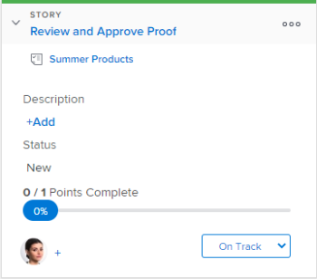

# Usar sinalizadores em histórias no quadro [!UICONTROL Kanban]

No quadro [!DNL Kanban], os sinalizadores fornecem uma indicação visual de quando uma história está pronta para ser movida para o próximo status. Isso permite que as equipes do [!UICONTROL Kanban] usem uma abordagem de &quot;pull&quot; em vez de uma abordagem de &quot;push&quot; ao mover histórias entre status.

**Exemplo:** considere o seguinte exemplo de uma equipe usando uma abordagem de “puxar”: Olivia, a designer gráfica da equipe, conclui seu trabalho e define o sinalizador de história como “[!UICONTROL Pronto para Puxar]”. Esta bandeira fornece uma indicação visual para Tony, o redator da equipe, de que a história está pronta para que ele passe para o próximo status. Tony então move a história para o próximo status quando ele está pronto para começar a trabalhar nela.

Considere o seguinte ao usar sinalizadores em matérias:

* Sinalizadores não são um status, mas sim uma indicação visual de que a história está pronta para ser movida para o próximo status por outro membro da equipe.
* Sinalizadores não aparecem em nenhum cartão de matéria que esteja na coluna [!UICONTROL Lista de pendências] ou na coluna [!UICONTROL Concluída] (ou em qualquer coluna em que o status da coluna seja igual a [!UICONTROL Concluída]).

  Para obter mais informações sobre status de matérias, consulte [Usar sinalizadores em matérias no quadro kanban](#updating-the-status-of-stories-and-subtasks)

## Requisitos de acesso

+++ Expanda para visualizar os requisitos de acesso da funcionalidade neste artigo.

<table style="table-layout:auto"> 
 <col> 
 </col> 
 <col> 
 </col> 
 <tbody> 
  <tr> 
   <td role="rowheader">Pacote do Adobe Workfront</td> 
   <td> 
Qualquer
 </td> 
  </tr> 
  <tr> 
   <td role="rowheader">Licença do Adobe Workfront</td> 
   <td> 
Padrão
 
   
Trabalho ou maior
 </td> 
  </tr>
 </tbody> 
</table>

Para obter mais detalhes sobre as informações contidas nesta tabela, consulte [Requisitos de acesso na documentação do Workfront](/help/quicksilver/administration-and-setup/add-users/access-levels-and-object-permissions/access-level-requirements-in-documentation.md).

+++

## Usar sinalizadores em histórias no quadro [!UICONTROL Kanban]

Para alterar um sinalizador em uma matéria:

{{step1-to-team}}

1. (Opcional) Clique no ícone **[!UICONTROL Alternar equipe]** ícone Kanban[!UICONTROL  no menu suspenso ou pesquise uma equipe na barra de pesquisa.]

1. Vá para o quadro de [!UICONTROL Kanban] onde você deseja alterar um sinalizador de uma história.
1. Expanda o bloco de matérias para exibir a bandeira.
O sinalizador é definido como **[!UICONTROL Na faixa]** para cada matéria por padrão.
   

1. Clique no sinalizador atual e selecione uma das seguintes opções de sinalizador:

   * **[!UICONTROL Na trilha]:** a história está no status apropriado e nenhuma ação precisa ser tomada neste momento.

     Este é o indicador padrão para cada story do quadro Kanban.
     

   * **[!UICONTROL Está Bloqueado]:** A matéria não pode prosseguir para o próximo status. Quando esse sinalizador é definido em uma matéria, a matéria não conta para o limite de WIP. (Para obter mais informações sobre limites WIP, consulte o artigo [Configurar Kanban](../../agile/get-started-with-agile-in-workfront/configure-kanban.md).)

     

   * **[!UICONTROL Pronto para Receber]:** A história está pronta para ser movida para o próximo status por outro membro da equipe.

     
