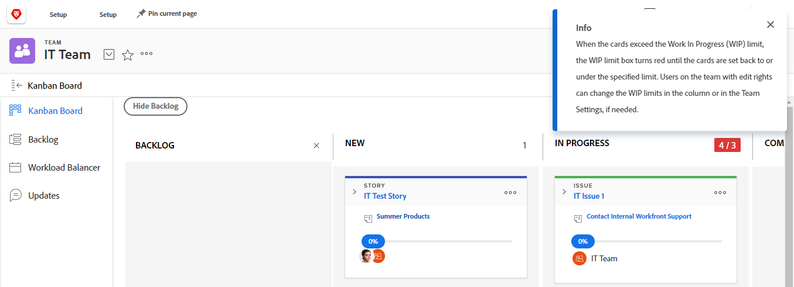

# Gerenciar o limite de [!UICONTROL trabalhos em andamento] (WIP) no quadro Kanban

Você pode configurar um limite de [!UICONTROL Trabalho em andamento] (WIP) para cada coluna no quadro [!UICONTROL Kanban], conforme descrito no artigo [Configurar Kanban](../../agile/get-started-with-agile-in-workfront/configure-kanban.md).

O limite de WIP é simplesmente um aviso visual e não impede que sua equipe tenha mais itens em cada coluna de status do que o limite definido.

## Requisitos de acesso

+++ Expanda para visualizar os requisitos de acesso para a funcionalidade neste artigo.

Você deve ter o seguinte acesso para executar as etapas deste artigo:

<table style="table-layout:auto"> 
 <col> 
 </col> 
 <col> 
 </col> 
 <tbody> 
  <tr> 
   <td role="rowheader">[!DNL Adobe Workfront] plano</td> 
   <td> 
Qualquer
 </td> 
  </tr> 
  <tr> 
   <td role="rowheader">[!DNL Adobe Workfront] licença</td> 
   <td> 
Novo: [!UICONTROL Padrão]
 
   ou
   
Atual: [!UICONTROL Trabalho] ou superior
 </td> 
  </tr>
 </tbody> 
</table>

Para obter mais detalhes sobre as informações nesta tabela, consulte [Requisitos de acesso na documentação do Workfront](/help/quicksilver/administration-and-setup/add-users/access-levels-and-object-permissions/access-level-requirements-in-documentation.md).

+++

## Exibir o limite de [!UICONTROL Trabalho em andamento] (WIP) no quadro [!UICONTROL Kanban]

Quando um limite WIP é configurado para sua equipe ágil, ele é exibido no canto superior direito de cada coluna no quadro Kanban (exceto para a coluna [!UICONTROL Concluído]).

Sempre que o limite for excedido para qualquer coluna no quadro [!UICONTROL Kanban], o limite será realçado em vermelho e uma mensagem será exibida.

## Atualize o limite de [!UICONTROL Trabalho em andamento] (WIP) do quadro [!UICONTROL Kanban]

Membros da equipe com direitos de [!UICONTROL Editar] podem atualizar o limite de WIP para cada coluna de status diretamente do quadro [!UICONTROL Kanban]. Como alternativa, você pode atualizar o limite WIP conforme descrito no artigo [Configurar Kanban](../../agile/get-started-with-agile-in-workfront/configure-kanban.md).

{{step1-to-team}}

1. (Opcional) Clique no ícone **[!UICONTROL Equipe do switch]**  e selecione uma nova equipe [!UICONTROL Kanban] no menu suspenso ou procure uma equipe na barra de pesquisa.

1. No quadro [!UICONTROL Kanban], localize o limite de WIP no canto superior direito de cada coluna no quadro Kanban.
1. Clique no limite de WIP que você deseja modificar e especifique um novo limite.
1. Pressione **[!UICONTROL Enter]**.
