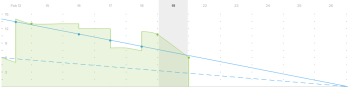

# Visão geral do gráfico de detalhamento ágil

O gráfico de detalhamento fornece uma representação visual de como as histórias estão progredindo pela iteração. A taxa de detalhamento real é medida em relação à taxa de detalhamento ideal para a linha do tempo de iteração.

O gráfico de detalhamento se ajusta com base no dia selecionado. O dia atual é o padrão. Quando um dia anterior é selecionado, todos os dados no gráfico suspenso e todos os valores na variável [!UICONTROL status de conclusão] seção acima do gráfico suspenso são recalculadas para representar os dados como estavam no final do dia selecionado. (Você pode selecionar dias passados ou o dia atual; não é possível selecionar dias no futuro.)

## Indicadores visuais

O gráfico de detalhamento contém os seguintes indicadores visuais:

<table style="table-layout:auto"> 
 <col> 
 <col> 
 <tbody> 
  <tr> 
   <td role="rowheader">  </td> 
   <td> 
Taxa de detalhamento ideal com base em quando a iteração começou.
 
Essa linha não será exibida se o escopo da iteração nunca mudar (horas ou pontos nunca forem adicionados ou removidos).
 
Essa linha é exibida como plana quando o trabalho é feito em um dia de folga. Para obter mais informações, consulte <a title="Usando o Gráfico de Burndown Ágil" href="#how-days-off-affect-the-burndown-chart" class="MCXref xref">Como os dias de folga afetam o gráfico de detalhamento</a>.
 </td> 
  </tr> 
  <tr> 
   <td role="rowheader">  </td> 
   <td> 
Taxa de detalhamento ideal com base em histórias ou tarefas atuais.
 
A taxa de detalhamento ideal atual (linha azul sólida) difere da taxa de detalhamento ideal original (linha azul pontilhada) quando horas ou pontos são adicionados ou removidos da iteração após o início da iteração.
 
Essa linha é exibida como plana quando o trabalho é feito em um dia de folga.
 
Para obter mais informações, consulte <a title="Usando o Gráfico de Burndown Ágil" href="#how-days-off-affect-the-burndown-chart" class="MCXref xref">Como os dias de folga afetam o gráfico de detalhamento</a>.
 </td> 
  </tr> 
  <tr> 
   <td role="rowheader">  </td> 
   <td> 
A taxa de detalhamento real é mostrada em vermelho quando a taxa de detalhamento é inferior ao ideal (mais pontos ou horas restantes por dia do que o cálculo de detalhamento ideal).
 
A seguinte fórmula é usada para calcular a taxa de detalhamento real:
 
[SUM(Valor de Ponto ou Hora do Trabalho em Andamento * Porcentagem Concluída) + Valor de Ponto ou Hora do Trabalho Concluído]
 </td> 
  </tr> 
  <tr> 
   <td role="rowheader">  </td> 
   <td> 
A taxa de detalhamento real é mostrada em verde quando a taxa de detalhamento é igual ou melhor que o ideal (igual ou menos pontos restantes por dia do que o cálculo de detalhamento ideal).
 
A seguinte fórmula é usada para calcular a taxa de detalhamento real:
 
[SUM(Valor de Ponto ou Hora do Trabalho em Andamento * Porcentagem Concluída) + Valor de Ponto ou Hora do Trabalho Concluído]
 </td> 
  </tr> 
  <tr> 
   <td role="rowheader">  </td> 
   <td> 
Alteração no escopo (horas ou pontos são adicionados ou removidos da iteração).
 
As alterações de escopo são sempre mostradas como uma linha vertical no meio do dia. Além disso, um ponto azul é exibido no meio de qualquer dia em que uma alteração de escopo tenha ocorrido.
 
O eixo vertical do gráfico de detalhamento mostra os pontos da história ou as horas.
 </td> 
  </tr> 
  <tr> 
   <td role="rowheader">  </td> 
   <td> 
Alteração no intervalo de datas (a duração da iteração é aumentada ou diminuída).
 
Um ponto azul é exibido no meio de qualquer dia em que a duração da iteração foi alterada.
 </td> 
  </tr> 
  <tr> 
   <td role="rowheader">  </td> 
   <td> 
Um ponto verde ou vermelho é exibido na taxa de detalhamento real sempre que o trabalho é queimado. (Quando a taxa real de detalhamento desse dia for vermelha, o ponto será vermelho; quando a taxa de detalhamento real no dia for verde, o ponto será verde.)
 
O trabalho é queimado quando qualquer um dos seguintes casos ocorrer:
 
    <ul> 
     <li> A [!UICONTROL Porcentagem concluída] é aumentada na história. A [!UICONTROL Porcentagem concluída] é aumentada quando: 
      <ul> 
       <li> 
Alterado manualmente
 </li> 
       <li> 
O número de pontos ou horas é atualizado na história
 </li> 
      </ul></li>  
     <li>O status da história é alterado para [!UICONTROL concluído]</li> 
    </ul> </td> 
  </tr> 
 </tbody> 
</table>

## Como os dias de folga afetam o gráfico de detalhamento {#how-days-off-affect-the-burndown-chart}

O agendamento padrão definido em [!DNL Workfront] afeta o gráfico de detalhamento, excluindo dias de folga (finais de semana e feriados) da análise. O gráfico de detalhamento usa o agendamento padrão para definir dias úteis (conforme descrito em  [Criar um agendamento](../../../administration-and-setup/set-up-workfront/configure-timesheets-schedules/create-schedules.md)).

As equipes ágil podem incorporar dias não úteis específicos da equipe definindo um agendamento alternativo (conforme descrito no artigo [Usar uma programação de equipe alternativa para gráficos de detalhamento](../../../agile/use-scrum-in-an-agile-team/burndown/use-alt--team-schedule-burndown-charts.md)). Essa programação alternativa é refletida no gráfico de detalhamento de qualquer iteração atribuída à equipe. O agendamento alternativo afeta apenas o gráfico de detalhamento.

Os dias de folga são refletidos no gráfico de detalhamento somente se:

* O trabalho foi conectado anteriormente em um dia de folga. (O dia em que o trabalho foi registrado é exibido.)

   Quando o trabalho é conectado em um dia de folga:

   * Qualquer trabalho registrado não é incluído ao calcular a interrupção ideal porque a equipe não está programada para fazer qualquer trabalho.
   * As linhas de detalhamento ideais (a linha azul sólida e a linha azul tracejada) são exibidas como planas no gráfico de detalhamento para qualquer dia em que o trabalho foi concluído ou no dia em que você estiver visualizando o gráfico de detalhamento (se você estiver visualizando em um dia de folga).
   * O trabalho registrado é incluído ao calcular outras estatísticas de detalhamento, como a conclusão estimada e os pontos médios ou horas por dia.

* Você está visualizando o gráfico de detalhamento em um dia de folga. (O dia que você está visualizando é mostrado no gráfico suspenso.)
* Você conclui o trabalho total restante para a iteração em um dia de folga.

   Quando um usuário conclui o trabalho total restante para a iteração em um dia de folga, a variável [!UICONTROL Conclusão estimada] exibe a data em que a iteração foi concluída.

   Ao planejar a iteração, se você definir a data final da iteração para um dia que não seja útil e a iteração estiver rastreando para ser concluída no tempo, a variável [!UICONTROL Conclusão estimada] é definida para o último dia útil antes da data de término da iteração que você definiu (porque o trabalho não está programado para ser queimado em dias que não sejam úteis).

   A data final para a iteração é especificada quando a iteração é planejada, conforme descrito no artigo [Criar uma iteração](../../../agile/use-scrum-in-an-agile-team/iterations/create-an-iteration.md).
