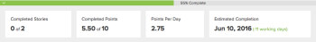

# Visão geral do status de conclusão da iteração

As informações de conclusão descritas neste artigo são exibidas acima do gráfico de burndown.

Porcentagem de conclusão em uma iteração:

Essas informações indicam o status de conclusão da iteração para o dia selecionado atualmente no gráfico de burndown. Por padrão, o status de conclusão é exibido com base na data do dia atual.

As seguintes informações estão disponíveis:

* **[!UICONTROL Porcentagem Concluída]:** Progresso geral da iteração

  O [!UICONTROL Percentual concluído] ajusta-se com base no percentual concluído de cada matéria ou tarefa na iteração, incluindo matérias ou tarefas que estão apenas parcialmente concluídas.

  A cor da barra de status [!UICONTROL Porcentagem Concluída] é exibida em vermelho ou verde para corresponder à cor da taxa de burndown real. É mostrado em vermelho quando a taxa de burndown é inferior ao ideal (mais pontos ou horas restantes por dia do que o cálculo de burndown ideal), e é mostrado em verde quando a taxa de burndown é igual ou melhor do que o ideal (igual ou menos pontos restantes por dia do que o cálculo de burndown ideal).

* **[!UICONTROL Histórias Concluídas]:** (Disponível apenas em iterações) O número de histórias marcadas como [!UICONTROL Concluídas]. Isso é mostrado em relação ao número total de matérias na iteração. Por exemplo, “3 de 6” indica que 3 das 6 matérias na iteração foram marcadas como [!UICONTROL Concluídas].
* **[!UICONTROL Pontos/Horas Concluídos]:** (Disponível somente em iterações) O número de pontos ou horas marcados como [!UICONTROL Concluídos]. Mostrado em relação ao número total de pontos ou horas na iteração. Por exemplo, &quot;5 de 11&quot; indica que 5 das 11 matérias na iteração foram marcadas como [!UICONTROL Concluídas]. Este número está diretamente relacionado ao cálculo da [!UICONTROL Porcentagem Concluída] e é atualizado ao mesmo tempo que a [!UICONTROL Porcentagem Concluída] é atualizada.

  Os pontos e as horas são associados às matérias. Quando uma matéria é marcada como [!UICONTROL Concluída], os pontos ou horas associados a essa matéria são marcados como Concluída.

  Por padrão, os pontos são usados. Você pode alterar isso modificando as configurações da sua equipe, conforme descrito em [Criar uma equipe ágil](../../../agile/get-started-with-agile-in-workfront/create-an-agile-team.md).

* **[!UICONTROL Pontos / Horas por dia]:** (Disponível apenas em iterações) O número médio de pontos ou horas marcados como [!UICONTROL Concluídos] todos os dias desde o início da iteração até o dia atual.

  Isso é calculado pelo total de pontos ou horas concluídas, dividido pelo número total de dias até o dia atual. (Os dias parciais são registrados como um dia inteiro.)

  Essas informações podem ser úteis ao planejar uma iteração futura.

* **[!UICONTROL Conclusão Estimada]:** A data estimada em que a iteração será concluída, com base na taxa atual em Pontos / Horas Por Dia (para iterações).

  Quando a data de [!UICONTROL Conclusão estimada] for posterior à data de término definida para a iteração, o número de dias úteis restantes será exibido entre parênteses ao lado da data de [!UICONTROL Conclusão estimada].

  Quando a [!UICONTROL Data de conclusão estimada] é anterior à data planejada de término da iteração, o número de dias úteis restantes é exibido em verde. (A data de término da iteração é especificada quando a iteração é planejada, conforme descrito em [Criar uma iteração](../../../agile/use-scrum-in-an-agile-team/iterations/create-an-iteration.md); a data de término do projeto é a [!UICONTROL Data de Término Planejada] ou será a data atual se a [!UICONTROL Data de Término Planejada] estiver no passado. A [!UICONTROL Data de conclusão planejada] para o projeto é calculada com base na duração das tarefas no projeto.) Ao planejar a iteração, se você definir a data final da iteração para um dia não útil e a iteração estiver rastreando para terminar no prazo, a Data de conclusão estimada será definida para o último dia útil anterior à data final da iteração definida (porque o trabalho não está programado para ser reduzido em dias não úteis).

  Por exemplo, “(+9 dias)” indica que a data de conclusão estimada é 9 dias úteis posterior à data de término planejada da iteração.

  Para obter mais informações, consulte [Visão geral do status de conclusão de iteração](#Understanding-How-Days-Off-Affect-the-Burndown-Chart).
