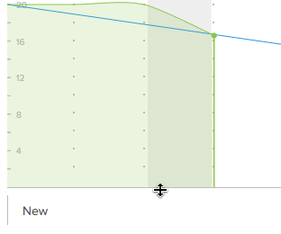

# Redimensionar e recolher o gráfico de burndown

Você pode redimensionar ou recolher o gráfico de burndown para ajustar quanto espaço ele ocupa no storyboard.

Quaisquer alterações feitas no tamanho ou na visibilidade do gráfico de burndown serão visíveis somente para você e serão redefinidas quando você limpar o cache do navegador.

## Requisitos de acesso

+++ Expanda para visualizar os requisitos de acesso para a funcionalidade neste artigo.

Você deve ter o seguinte acesso para executar as etapas deste artigo:

<table style="table-layout:auto"> 
 <col> 
 </col> 
 <col> 
 </col> 
 <tbody> 
  <tr> 
   <td role="rowheader">[!DNL Adobe Workfront] plano</td> 
   <td> 
Qualquer
 </td> 
  </tr> 
  <tr> 
   <td role="rowheader">[!DNL Adobe Workfront] licença</td> 
   <td> 
Novo: [!UICONTROL Light] ou superior
 
   ou
   
Atual: [!UICONTROL Review] ou posterior
 </td> 
  </tr>
 </tbody> 
</table>

Para obter mais detalhes sobre as informações nesta tabela, consulte [Requisitos de acesso na documentação do Workfront](/help/quicksilver/administration-and-setup/add-users/access-levels-and-object-permissions/access-level-requirements-in-documentation.md).

+++

## Redimensionar o gráfico de burndown

{{step1-to-team}}

1. (Opcional) Clique no ícone **[!UICONTROL Equipe do switch]**  e selecione uma nova equipe [!UICONTROL Scrum] no menu suspenso ou procure uma equipe na barra de pesquisa.

1. Vá para a iteração que contém o gráfico de burndown que deseja redimensionar.
1. Passe o mouse sobre a linha inferior do gráfico de burndown e arraste o gráfico até o tamanho desejado.
   

## Recolher o gráfico de burndown

{{step1-to-team}}

1. (Opcional) Clique no ícone **[!UICONTROL Equipe do switch]**  e selecione uma nova equipe [!UICONTROL Scrum] no menu suspenso ou procure uma equipe na barra de pesquisa.

1. Vá para a iteração que contém o gráfico de burndown que você deseja recolher.
1. Clique no ícone de seta à esquerda da barra de status [!UICONTROL Percentual concluído].
