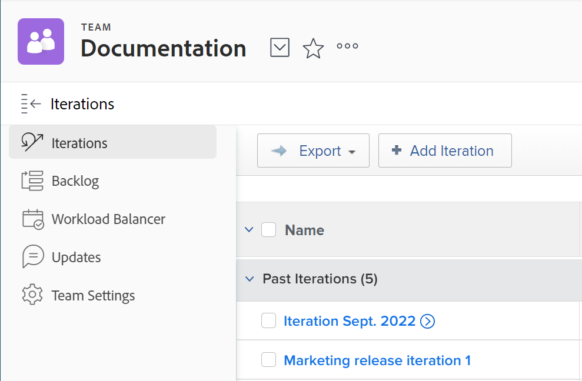

# Criar uma iteração

As iterações são um componente essencial para as equipes ágeis de Scrum no planejamento da capacidade de trabalho. [!DNL Adobe Workfront] O permite que as equipes ágeis do Scrum gerenciem seu trabalho criando várias iterações para acomodar as necessidades da equipe.

## Requisitos de acesso

Você deve ter o seguinte acesso para executar as etapas deste artigo:

<table style="table-layout:auto"> 
 <col> 
 </col> 
 <col> 
 </col> 
 <tbody> 
  <tr> 
   <td role="rowheader"><strong>[!DNL Adobe Workfront] plano*</strong></td> 
   <td> 
Qualquer
 </td> 
  </tr> 
  <tr> 
   <td role="rowheader"><strong>[!DNL Adobe Workfront] licença*</strong></td> 
   <td> 
[!UICONTROL Review] ou superior
 </td> 
  </tr> 
 </tbody> 
</table>

&#42;Para saber que tipo de plano ou licença você tem, entre em contato com o [!DNL Workfront] administrador.

## Adicionar uma iteração

Use o [!UICONTROL Adicionar iteração] recurso para criar rapidamente uma iteração e adicionar tarefas e problemas posteriormente.

1. Clique em **[!UICONTROL Menu principal]** ícone  no canto superior direito de [!DNL Adobe Workfront]e, em seguida, clique em **[!UICONTROL Equipes]**.

1. (Opcional) Clique no link **[!UICONTROL Trocar equipe]** ícone , selecione uma nova equipe do Scrum no menu suspenso ou procure uma equipe na barra de pesquisa.

1. No **[!UICONTROL Iterações]** clique em **[!UICONTROL Adicionar iteração]**.\
   

1. Especifique o seguinte:

   <table style="table-layout:auto"> 
    <col> 
    <col> 
    <tbody> 
     <tr> 
      <td role="rowheader"><strong>[!UICONTROL Nome da Iteração]</strong></td> 
      <td>Insira o nome da iteração.</td> 
     </tr> 
     <tr> 
      <td role="rowheader"><strong>[!UICONTROL Meta]</strong></td> 
      <td>Adicione metas à iteração.</td> 
     </tr> 
     <tr> 
      <td role="rowheader"><strong>[!UICONTROL Data de Início]</strong></td> 
      <td>Insira a data em que a iteração deve começar.</td> 
     </tr> 
     <tr> 
      <td role="rowheader"><strong>[!UICONTROL Data de Término]</strong></td> 
      <td>
Insira a data em que a iteração deve terminar. [!DNL Workfront] A recomenda definir uma data de término não superior a 4 semanas a partir da data de início.

Dica: certifique-se de escolher um dia útil como a data final. O gráfico de burndown usa apenas dias úteis em seus cálculos. Por padrão, o gráfico de burndown usa a programação padrão para definir dias úteis (conforme descrito em <a href="../../../administration-and-setup/set-up-workfront/configure-timesheets-schedules/create-schedules.md" class="MCXref xref">Criar um agendamento</a>). Ou, para incorporar dias não úteis específicos da equipe, as equipes ágeis podem optar por usar uma programação alternativa (conforme descrito em "Definindo uma Programação de Equipe Alternativa para Gráficos de Burndown" em <a href="../../../agile/get-started-with-agile-in-workfront/create-an-agile-team.md" class="MCXref xref">Criar uma equipe ágil</a>).
</td> 
     </tr> 
     <tr> 
      <td role="rowheader"><strong>[!UICONTROL Capacidade]</strong></td> 
      <td> Especifique a capacidade da iteração. Este é o número de pontos ou horas que sua equipe consegue completar na iteração. O número inserido deve ser igual ou maior que o número de pontos ou horas a partir da soma de todas as histórias na iteração. [!DNL Workfront] O preenche esse campo previamente com 50 caracteres por padrão. </td> 
     </tr> 
     <tr> 
      <td role="rowheader"><strong>[!UICONTROL Foco]</strong></td> 
      <td>Especificar a porcentagem de foco da equipe. Se todos os membros da equipe estiverem totalmente focados nessa iteração, o foco será 100%. [!DNL Workfront] O preenche esse campo previamente com 100% por padrão. </td> 
     </tr> 
    </tbody> 
   </table>

1. Clique em **[!UICONTROL Enviar]**. Agora que você criou uma iteração, é necessário adicionar histórias. Para obter mais informações, consulte [Adicionar histórias a uma iteração existente](../../../agile/use-scrum-in-an-agile-team/iterations/add-stories-to-existing-iteration.md).

## Planejar uma iteração no [!UICONTROL Backlog] guia

Use o [!UICONTROL Planejar iteração] recurso para criar uma iteração usando tarefas em seu backlog.

1. Clique em **[!UICONTROL Menu principal]** ícone  no canto superior direito de [!DNL Adobe Workfront]e, em seguida, clique em **[!UICONTROL Equipes]**.

1. (Opcional) Clique no link **[!UICONTROL Trocar equipe]** ícone , selecione uma nova equipe do Scrum no menu suspenso ou procure uma equipe na barra de pesquisa.

1. Selecionar **[!UICONTROL Backlog]** no painel esquerdo. Em seguida, clique em **[!UICONTROL Planejar iteração]**.

1. Especifique as seguintes informações:

   <table style="table-layout:auto"> 
    <col> 
    <col> 
    <tbody> 
     <tr> 
      <td role="rowheader"><strong>[!UICONTROL Nome da Iteração]</strong></td> 
      <td>Especifique um nome para a iteração.</td> 
     </tr> 
     <tr> 
      <td role="rowheader"><strong>[!UICONTROL Data de Início]</strong></td> 
      <td> Especifique a data em que a iteração deve começar.</td> 
     </tr> 
     <tr> 
      <td role="rowheader"><strong>[!UICONTROL Data de Término]</strong> </td> 
      <td>
Especifique a data em que a iteração deve terminar. [!DNL Workfront] A recomenda definir uma data de término não superior a 4 semanas a partir da data de início.

Dica: certifique-se de escolher um dia útil como a data final. O gráfico de burndown usa apenas dias úteis em seus cálculos. Por padrão, o gráfico de burndown usa a programação padrão para definir dias úteis (conforme descrito em <a href="../../../administration-and-setup/set-up-workfront/configure-timesheets-schedules/create-schedules.md" class="MCXref xref">Criar um agendamento</a>). Ou, para incorporar dias não úteis específicos da equipe, as equipes ágeis podem optar por usar uma programação alternativa (conforme descrito em <a href="../../../agile/use-scrum-in-an-agile-team/burndown/use-alt-team-schedule-burndown-charts.md" class="MCXref xref">Usar uma programação de equipe alternativa para gráficos de burndown</a>).
</td> 
     </tr> 
     <tr> 
      <td role="rowheader"><strong>[!UICONTROL Foco]</strong></td> 
      <td>Especificar a porcentagem de foco da equipe. Se todos os membros da equipe estiverem totalmente focados nessa iteração, o foco será 100%. [!DNL Workfront] O preenche esse campo com o valor médio das iterações anteriores da equipe. Se esta for a primeira iteração da sua equipe, o valor deste campo será 0 por padrão.</td> 
     </tr> 
     <tr> 
      <td role="rowheader"> <strong>[!UICONTROL Capacidade]</strong></td> 
      <td> Especifique a capacidade da iteração. Este é o número de pontos ou horas que sua equipe consegue completar na iteração. O número inserido deve ser igual ou maior que o número de pontos ou horas a partir da soma de todas as histórias na iteração. [!DNL Workfront] O preenche esse campo com o valor médio das iterações anteriores da equipe. Se esta for a primeira iteração da sua equipe, o valor deste campo será 0 por padrão.</td> 
     </tr> 
     <tr> 
      <td role="rowheader"> <strong>[!UICONTROL Meta]</strong></td> 
      <td> Especifique uma meta para a iteração. Este campo não é obrigatório.</td> 
     </tr> 
    </tbody> 
   </table>

1. (Opcional) Selecione matérias para adicioná-las à iteração agora, ou ignore esta etapa e adicione matérias a uma iteração posteriormente. As histórias no topo do backlog têm prioridade mais alta. As histórias são destacadas em verde quando se encaixam na capacidade; se não se encaixarem, elas são destacadas em vermelho.\
   É possível adicionar tarefas e problemas a uma única iteração:

   * **Para adicionar tarefas à iteração:** No **[!UICONTROL Backlog]** , verifique se **[!UICONTROL Histórias]** for selecionada (essa guia é selecionada por padrão ao visualizar o backlog). Selecione as matérias que deseja adicionar à iteração.\

     Ao adicionar tarefas a uma iteração, a data de início da tarefa é calculada conforme descrito em [[!UICONTROL Compreender] como as datas de início da tarefa são calculadas quando adicionadas a uma iteração](#understand-how-task-start-dates-are-calculated-when-added-to-an-iteration).

   * **Para adicionar problemas à iteração:** No **[!UICONTROL Backlog]** clique na guia **[!UICONTROL Problemas]** guia. Selecione os problemas que deseja adicionar à iteração.

1. Clique em **[!UICONTROL Salvar].**
A iteração é criada.

1. (Opcional) Para adicionar histórias a uma iteração existente, consulte [Adicionar histórias a uma iteração existente](../../../agile/use-scrum-in-an-agile-team/iterations/add-stories-to-existing-iteration.md).

## Entender como as datas de início da tarefa são calculadas quando adicionadas a uma iteração {#understand-how-task-start-dates-are-calculated-when-added-to-an-iteration}

Ao adicionar uma tarefa como uma história a uma iteração, a variável [!UICONTROL Deve Terminar na tarefa] é usada para cada matéria. Na maioria dos casos, a data de início planejada da tarefa é calculada com base na seguinte fórmula:

[!UICONTROL Data final da iteração] menos (-) [!UICONTROL Duração da tarefa] igual a (=) [!UICONTROL Data de Início Planejada da Tarefa]

A variável [!UICONTROL Data de Término do Projeto] é usada em vez de se a data de início do projeto for posterior à data de início da iteração e a data de término do projeto for posterior à data de término da iteração.

Você pode configurar equipes Scrum individuais para usar as datas do projeto por padrão, em vez das datas de iteração. Para obter informações, consulte a seção [Configurar como as datas são aplicadas ao adicionar itens de trabalho a uma iteração](../../../agile/get-started-with-agile-in-workfront/configure-scrum.md#configur5) no artigo [Configurar Scrum](../../../agile/get-started-with-agile-in-workfront/configure-scrum.md).
