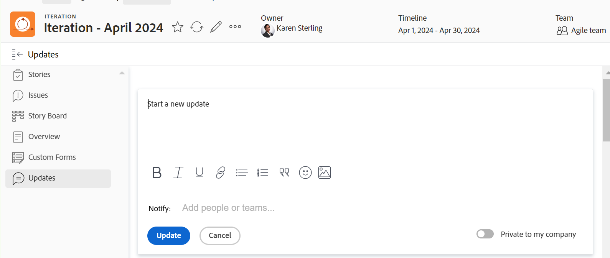

# Gerenciar comentários de iteração

Você pode adicionar atualizações a uma iteração ao trabalhar em um ambiente Scrum, para colaborar com outras pessoas no Adobe Workfront.

## Gerenciar atualizações em uma iteração

1. Vá para uma Equipe Ágil e clique em **Iterações** no painel esquerdo.
1. Clique no nome de uma iteração para abri-la.
1. Clique em **Atualizações** para abrir na seção no painel esquerdo.

   
1. Clique em **Iniciar uma nova atualização,** em seguida, digite a atualização.
1. (Opcional) Use as opções na barra de ferramentas de Rich Text para formatar o texto, adicionar emojis, links ou imagens à atualização e aprimorar o conteúdo. Para obter mais informações, consulte a seção &quot;Usar Rich Text em uma atualização do Workfront&quot; no artigo [Atualizar trabalho](/help/quicksilver/workfront-basics/updating-work-items-and-viewing-updates/update-work.md).
1. (Opcional) Atualize qualquer um dos itens a seguir ao adicionar uma atualização à iteração:

   <table style="table-layout:auto"> 
    <col> 
    <col> 
    <tbody> 
     <tr> 
      <td role="rowheader"><strong>Notificar</strong></td> 
      <td>Identifique os usuários que devem ser notificados sobre a atualização. 
Para obter informações sobre como incluir outras pessoas em uma atualização, consulte <a href="/help/quicksilver/workfront-basics/updating-work-items-and-viewing-updates/tag-others-on-updates.md">Marcar outros usuários em atualizações</a>.
</td> 
     </tr> 
     <tr> 
      <td role="rowheader"><strong>Privativo(s) de minha empresa</strong></td> 
      <td> 
Desabilite esta opção para impedir que usuários fora da sua empresa tenham acesso a esta atualização.
 
      
<b>Nota</b>

      
Essa opção é exibida somente quando o perfil de usuário do Workfront está associado a uma Empresa.

      
Esta opção não está disponível em todas as áreas nas quais você pode adicionar atualizações. Por exemplo, isso não está disponível em aplicativos de terceiros nos quais você pode adicionar atualizações do. 

      </td> 
     </tr> 
    </tbody> 
   </table>

1. Clique em **Atualizar** para adicionar a atualização à iteração.

   >[!NOTE]
   >
   >Uma pequena janela pop-up será exibida por sete segundos após clicar em **Atualizar**, permitindo clicar em **Desfazer comentário** e desfaça a atualização e retorne ao painel de edição antes que a atualização seja publicada. A atualização é publicada se você ignorar a janela pop-up desfazer, esperar que ela desapareça ou sair da página.
   >
   >Se o administrador do Workfront selecionar a configuração &quot;Nunca permitir que os usuários excluam comentários&quot; no seu nível de acesso, não será possível desfazer um comentário. Para obter mais informações, consulte [Criar e modificar níveis de acesso personalizados](/help/quicksilver/administration-and-setup/add-users/configure-and-grant-access/create-modify-access-levels.md).

1. Para responder a uma atualização, clique em **Responder**.

   Para obter mais informações, consulte [Responder a atualizações](/help/quicksilver/workfront-basics/updating-work-items-and-viewing-updates/reply-to-updates.md).

1. (Opcional) Para copiar o conteúdo de um comentário, clique no link **Mais** ícone  à direita de uma atualização, em seguida, clique em uma das seguintes opções:

   * **Copiar link da discussão**
   * **Copiar texto do corpo**
   * **Citar resposta**

   

   Para obter mais informações, consulte a seção [Copiar uma atualização](#copy-an-update) neste artigo.
1. (Opcional) Para excluir um comentário, clique no link **Mais** ícone  à direita de uma atualização, clique em **Excluir**.

## Copiar uma atualização

É possível copiar o conteúdo de uma atualização e reutilizá-lo das seguintes maneiras:

* [Copiar link da discussão](#copy-thread-link)
* [Copiar texto do corpo](#copy-body-text)
* [Citar resposta](#quote-reply)

### Copiar link da discussão

Essa opção copia o link completo da thread para a área de transferência, para que você possa compartilhar a thread com outros usuários.

1. Vá para o thread de atualização que deseja copiar.

1. Clique em **Mais** e clique em **Copiar link da discussão**.

1. Cole o link copiado na etapa anterior em um email ou outro aplicativo para compartilhá-lo com outras pessoas. O link compartilhado abre o comentário do qual você compartilhou o link.

### Copiar texto do corpo

Esta opção copia o texto de uma atualização específica para a área de transferência.

1. Vá para a atualização ou resposta que deseja copiar.
1. Clique em **Mais** e clique em **Copiar texto do corpo**.

### Citar resposta

A opção Citar resposta copia o comentário original para uma nova resposta como uma cotação em bloco.

1. Vá para a atualização ou resposta que deseja copiar.
1. Clique em **Mais** e clique em **Citar resposta**.

   Uma nova caixa de comentário é aberta e a resposta entre aspas é incluída no novo comentário e marcada como aspas de bloco.

1. Continue adicionando sua atualização e clique em **Responder** para adicionar o comentário.
