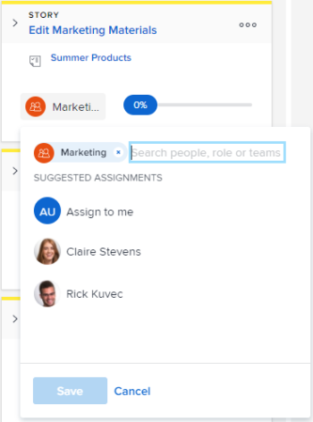

# Atribuir usuários a uma história no quadro [!UICONTROL Scrum]

## Requisitos de acesso

+++ Expanda para visualizar os requisitos de acesso da funcionalidade neste artigo.

Você deve ter o seguinte acesso para realizar as etapas descritas neste artigo:

<table style="table-layout:auto"> 
 <tbody> 
  <tr> 
   <td role="rowheader">[!DNL Adobe Workfront] plano</td> 
   <td> 
Qualquer
 </td> 
  </tr> 
  <tr> 
   <td role="rowheader">[!DNL Adobe Workfront] licença</td> 
   <td> 
Novo: [!UICONTROL Padrão]
 
   ou
   
Atual: [!UICONTROL Trabalho] ou superior
 </td> 
  </tr>
 </tbody> 
</table>

Para obter informações, consulte [Requisitos de acesso na documentação do Workfront](/help/quicksilver/administration-and-setup/add-users/access-levels-and-object-permissions/access-level-requirements-in-documentation.md).

+++

## Atribuir usuários a uma história no quadro [!UICONTROL Scrum]

{{step1-to-team}}

1. (Opcional) Clique no ícone **[!UICONTROL Equipe do switch]**  e selecione uma nova equipe [!UICONTROL Scrum] no menu suspenso ou procure uma equipe na barra de pesquisa.

1. Vá para a iteração Agile ou o projeto que contém o storyboard ao qual você deseja atribuir usuários. Para obter informações sobre como navegar para uma iteração, consulte [Exibir uma iteração](../../../agile/use-scrum-in-an-agile-team/iterations/view-iteration.md).
1. Vá para o bloco história no storyboard em que deseja adicionar um usuário.
1. Clique no avatar da equipe no bloco da história (ou em um avatar do usuário, se já houver um atribuído), comece digitando o nome do usuário que deseja atribuir à história e clique no nome quando ele for exibido. Você também pode escolher um usuário sugerido.

   >[!TIP]
   >
   >Você também pode atribuir uma função de trabalho a uma história. Você só pode atribuir usuários e funções ativos.

   
