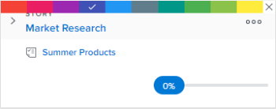

# Categorizar histórias por cor no quadro [!UICONTROL Scrum]

## Alterar a associação de cores padrão das matérias

A associação de cores padrão das histórias difere dependendo se o storyboard está localizado em uma iteração ou em um projeto:

* **[!UICONTROL Iteração]**: em uma iteração, os blocos de storyboard são codificados por cores de acordo com o projeto ao qual a história está associada. (Cada projeto recebe arbitrariamente uma cor no storyboard.) É possível alterar esse comportamento padrão para cada equipe Agile. As cores das histórias Agile em uma iteração podem ser vinculadas ao projeto (padrão), prioridade da história, proprietário ou formato livre. Para obter mais informações, consulte [Configurar como os indicadores de cor são usados para histórias no storyboard Agile](../../../agile/get-started-with-agile-in-workfront/configure-scrum.md#configur4) no artigo [Configurar Scrum](../../../agile/get-started-with-agile-in-workfront/configure-scrum.md).

* **[!UICONTROL Projeto]**: em um projeto, todas as subtarefas correspondem à cor da tarefa pai, de modo que as cores de todas as histórias em qualquer raia sejam as mesmas. As cores são atribuídas aleatoriamente às tarefas quando são criadas se a tarefa não tiver subtarefas ou não tiver uma tarefa pai. Você pode alterar esse comportamento padrão modificando a visualização Agile. As cores das matérias Agile em um projeto podem ser vinculadas à matéria principal (padrão), prioridade da matéria, proprietário ou formato livre. Para obter mais informações, consulte [Criar ou personalizar uma exibição [!UICONTROL Agile]](../../../reports-and-dashboards/reports/reporting-elements/views-overview.md#customizing-an-agile-view) na [Visão geral das exibições [!DNL Adobe Workfront]](../../../reports-and-dashboards/reports/reporting-elements/views-overview.md).

## Requisitos de acesso

+++ Expanda para visualizar os requisitos de acesso da funcionalidade neste artigo.

Você deve ter o seguinte acesso para realizar as etapas descritas neste artigo:

<table style="table-layout:auto"> 
 <tbody> 
  <tr> 
   <td role="rowheader">[!DNL Adobe Workfront] plano</td> 
   <td> 
Qualquer
 </td> 
  </tr> 
  <tr> 
   <td role="rowheader">[!DNL Adobe Workfront] licença</td> 
   <td> 
Novo: [!UICONTROL Padrão]
 
   ou
   
Atual: [!UICONTROL Trabalho] ou superior
 </td> 
  </tr>
 </tbody> 
</table>

Para obter informações, consulte [Requisitos de acesso na documentação do Workfront](/help/quicksilver/administration-and-setup/add-users/access-levels-and-object-permissions/access-level-requirements-in-documentation.md).

+++

## Alterar a cor das matérias ao usar a forma livre

Se as configurações da Equipe Agile tiverem sido definidas para que a opção [!UICONTROL Associar Cor do Cartão a] seja definida como [!UICONTROL Formato Livre], os usuários poderão alterar manualmente a cor de quadros de matérias individuais. Isso pode ser útil para comunicar outros tipos de informações importantes para a equipe ou a organização:

{{step1-to-team}}

1. (Opcional) Clique no ícone **[!UICONTROL Equipe do Switch]** , em seguida, selecione uma nova equipe do Scrum no menu suspenso ou procure uma equipe na barra de pesquisa.

1. No painel esquerdo, selecione **[!UICONTROL Iterações]** para escolher uma iteração específica, ou selecione **[!UICONTROL Iteração atual]**.
1. Passe o mouse sobre o banner colorido na parte superior do bloco de história.

   

1. Clique em **[!UICONTROL Alterar cor]** e selecione a cor desejada.

   
