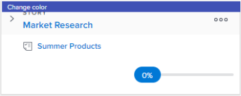

# Categorize as histórias por cor no [!UICONTROL Scrum] quadro

## Alterar a associação de cores padrão das histórias

A associação de cores padrão de histórias difere dependendo se o quadro de histórias está localizado em uma iteração ou em um projeto:

* **[!UICONTROL Iteração]**: Em uma iteração, os blocos do quadro de histórias são codificados por cores de acordo com o projeto ao qual a história está associada. (Cada projeto recebe uma cor arbitrariamente no quadro de histórias.) Você pode alterar esse comportamento padrão para cada equipe ágil. As cores de histórias ágeis em uma iteração podem ser vinculadas ao projeto (padrão), à prioridade da história, ao proprietário ou à forma livre. Para obter mais informações, consulte [Configure como os indicadores de cores são usados para histórias no quadro de histórias ágeis](../../../agile/get-started-with-agile-in-workfront/configure-scrum.md#configur4) no artigo [Configurar Sombra](../../../agile/get-started-with-agile-in-workfront/configure-scrum.md).

* **[!UICONTROL Projeto]**: Em um projeto, qualquer subtarefa corresponde à cor da tarefa pai, de modo que as cores de todas as histórias em uma determinada faixa sejam as mesmas. As cores são atribuídas aleatoriamente a tarefas quando elas são criadas se a tarefa não tiver subtarefas ou não tiver uma tarefa pai. Você pode alterar esse comportamento padrão modificando a visualização ágil. As cores de histórias ágeis em um projeto podem ser vinculadas à história principal (padrão), prioridade da história, proprietário ou forma livre. Para obter mais informações, consulte [Crie ou personalize um [!UICONTROL Ágil] exibir](../../../reports-and-dashboards/reports/reporting-elements/views-overview.md#customizing-an-agile-view) em [Visão geral das exibições em [!DNL Adobe Workfront]](../../../reports-and-dashboards/reports/reporting-elements/views-overview.md).

## Requisitos de acesso

Você deve ter o seguinte acesso para executar as etapas neste artigo:

<table style="table-layout:auto"> 
 <col> 
 </col> 
 <col> 
 </col> 
 <tbody> 
  <tr> 
   <td role="rowheader"><strong>[!DNL Adobe Workfront] plano*</strong></td> 
   <td> 
Qualquer Um
 </td> 
  </tr> 
  <tr> 
   <td role="rowheader"><strong>[!DNL Adobe Workfront] licença*</strong></td> 
   <td> 
[!UICONTROL Trabalho] ou superior
 </td> 
  </tr> 
  <tr> 
   <td role="rowheader"><strong>Configurações de nível de acesso*</strong></td> 
   <td> 
[!UICONTROL Worker] ou superior
 
Observação: Se ainda não tiver acesso, pergunte ao seu [!DNL Workfront] administrador se eles definirem restrições adicionais em seu nível de acesso. Para obter informações sobre como uma [!DNL Workfront] administrador pode alterar seu nível de acesso, consulte <a href="../../../administration-and-setup/add-users/configure-and-grant-access/create-modify-access-levels.md" class="MCXref xref">Criar ou modificar níveis de acesso personalizados</a>.
 </td> 
  </tr> 
 </tbody> 
</table>

&#42;Para descobrir qual plano, tipo de licença ou acesso você tem, entre em contato com seu [!DNL Workfront] administrador.

## Alterar a cor das histórias ao usar o formulário gratuito

Se as configurações do grupo ágil tiverem sido definidas para [!UICONTROL Associar cor do cartão a] está definida como [!UICONTROL Forma livre], os usuários podem alterar manualmente a cor de blocos de matérias individuais. Isso pode ser útil para comunicar outros tipos de informações importantes para a equipe ou a organização:

1. Clique no botão **[!UICONTROL Menu principal]** ícone  no canto superior direito de [!DNL Adobe] Workfront, em seguida, clique em **[!UICONTROL Equipes]**.

1. (Opcional) Clique no botão **[!UICONTROL Alterar equipe]** ícone e, em seguida, selecione uma nova equipe de Soma no menu suspenso ou procure por uma equipe na barra de pesquisa.

1. No painel esquerdo, selecione **[!UICONTROL Iterações]** para escolher uma iteração específica, ou selecione **[!UICONTROL Iteração atual]**.
1. Passe o mouse sobre o banner colorido no topo do bloco de história.

   

1. Clique em **[!UICONTROL Alterar cor]**, em seguida, selecione a cor desejada.

   
