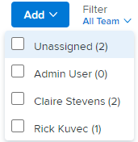

# Filtrar por usuário no quadro [!UICONTROL Scrum]

Você pode usar o filtro no quadro de scrum para ver quais itens de trabalho estão associados a outros usuários e quais não estão atribuídos.

## Requisitos de acesso

+++ Expanda para visualizar os requisitos de acesso para a funcionalidade neste artigo.

Você deve ter o seguinte acesso para executar as etapas deste artigo:

<table style="table-layout:auto"> 
 <tbody> 
  <tr> 
   <td role="rowheader">[!DNL Adobe Workfront] plano</td> 
   <td> 
Qualquer
 </td> 
  </tr> 
  <tr> 
   <td role="rowheader">[!DNL Adobe Workfront] licença</td> 
   <td> 
Novo: [!UICONTROL Padrão]
 
   ou
   
Atual: [!UICONTROL Trabalho] ou superior
 </td> 
  </tr>
 </tbody> 
</table>

Para obter mais detalhes sobre as informações nesta tabela, consulte [Requisitos de acesso na documentação do Workfront](/help/quicksilver/administration-and-setup/add-users/access-levels-and-object-permissions/access-level-requirements-in-documentation.md).

+++

## Filtrar por usuário no quadro Scrum

{{step1-to-team}}

1. (Opcional) Clique no ícone **[!UICONTROL Equipe do Switch]** , em seguida, selecione uma nova equipe do Scrum no menu suspenso ou procure uma equipe na barra de pesquisa.

1. Navegue até uma iteração ativa.
1. Clique no menu suspenso [!UICONTROL Filtro] no lado direito do quadro [!UICONTROL scrum].
1. Selecione o nome do usuário ou **[!UICONTROL Não atribuído]**.

>[!NOTE]
>
>Os totais da coluna não são alterados com base nos resultados filtrados. Os totais da coluna exibem os totais de todos os itens de trabalho no quadro.

