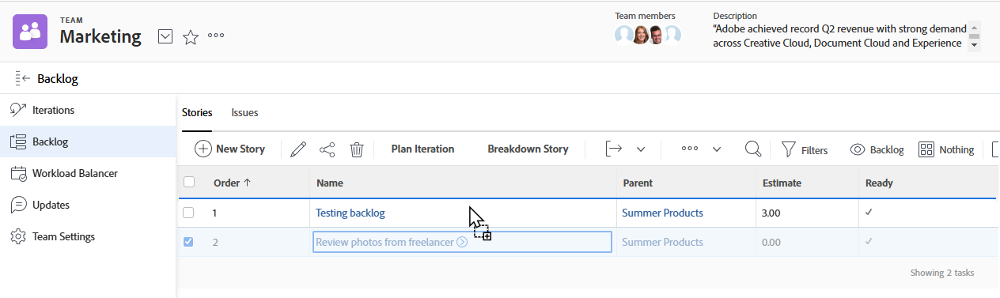
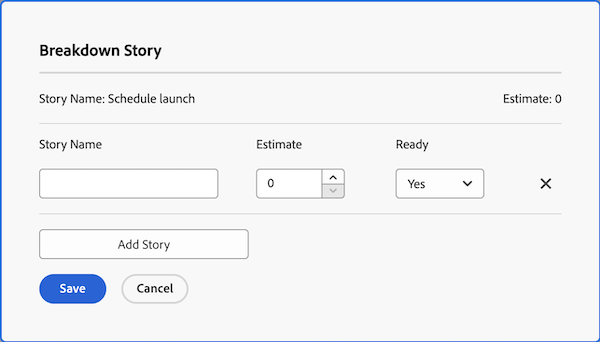
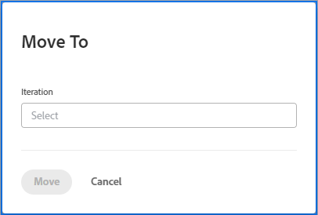

# Gerencie a lista de pendências ágil

Os itens de trabalho a seguir podem ser atribuídos a uma equipe do Agile e adicionados ao backlog dessa equipe como histórias, dependendo da metodologia do Agile que a equipe está usando:

* **[!UICONTROL Equipes Agile de Scrum]:** tarefas e problemas podem ser atribuídos à equipe Agile e adicionados à lista de pendências.
* **[!UICONTROL Equipes Agile do Kanban]:** as tarefas podem ser atribuídas à equipe Agile e adicionadas à lista de pendências. Os usuários podem exibir a lista de pendências diretamente do storyboard Agile, conforme descrito em [[!UICONTROL Adicionar a lista de pendências] ao quadro Kanban](../../agile/use-kanban-in-an-agile-team/view-the-backlog-on-the-kanban-board.md). A equipe usa essa lista de pendências para priorizar e gerenciar sua fila de trabalho.

Tarefas ou problemas podem ser atribuídos à equipe (e subsequentemente adicionados à lista de pendências da equipe) de qualquer lugar no [!DNL Adobe Workfront]. Por exemplo, uma única equipe pode receber atribuições de trabalho de vários projetos.

>[!NOTE]
>
>Se você adicionar várias equipes a um item de backlog, a tarefa ou problema será exibido somente no backlog da equipe principal. A equipe principal é a equipe atribuída pela primeira vez.

## Requisitos de acesso

+++ Expanda para visualizar os requisitos de acesso da funcionalidade neste artigo.

<table style="table-layout:auto"> 
 <col> 
 </col> 
 <col> 
 </col> 
 <tbody> 
  <tr> 
   <td role="rowheader">Pacote do Adobe Workfront</td> 
   <td> 
Qualquer
 </td> 
  </tr> 
  <tr> 
   <td role="rowheader">Licença do Adobe Workfront</td> 
   <td> 
Padrão
 
   
Trabalho ou maior
 </td> 
  </tr>
  <tr> 
   <td role="rowheader">Permissões de objeto</td> 
   <td>Gerenciar acesso ao projeto em que a história se encontra </td> 
  </tr> 
 </tbody> 
</table>

Para obter mais detalhes sobre as informações contidas nesta tabela, consulte [Requisitos de acesso na documentação do Workfront](/help/quicksilver/administration-and-setup/add-users/access-levels-and-object-permissions/access-level-requirements-in-documentation.md).

+++

## Criar e gerenciar histórias no backlog

* [Reordenar matérias](#reorder-stories)
* [[!UICONTROL Detalhar] histórias](#break-down-stories)
* [Editar matérias](#edit-stories)

### Reordenar matérias {#reorder-stories}

You can reorder stories in the backlog list by using the drag-and-drop method.

1. Go to the Agile backlog where you want to reorder stories.
1. No menu suspenso **[!UICONTROL Exibição]**, selecione a exibição **[!UICONTROL Lista de pendências]** ou uma exibição personalizada que contenha a coluna **[!UICONTROL Ordem]**.

   >[!NOTE]
   >
   >Se uma tarefa ou ocorrência tiver uma equipe ágil atribuída e o projeto não estiver em um status que seja igual a Atual, eles não serão exibidos no backlog. Entretanto, eles ainda afetam a contagem de backlog na coluna Ordem.

1. Selecione uma ou mais matérias e arraste-as para a ordem em que deseja que apareçam no registro posterior.
   

### Divida as histórias {#break-down-stories}

Because stories in a backlog vary in size, users can break them down into workable sizes for an iteration. Detalhar uma matéria cria subtarefas na tarefa que a matéria representa e substitui a tarefa original no backlog. Você pode ter uma tarefa pai ou suas subtarefas atribuídas a uma equipe Ágil, mas não pode ter ambos atribuídos a uma equipe simultaneamente.

>[!NOTE]
>
>Considere as seguintes limitações ao detalhar histórias:
>
>* Somente as histórias que representam tarefas podem ser analisadas. Você não pode analisar histórias que representam problemas.
>* Histórias podem ser detalhadas somente se estiverem associadas a um projeto.

To break down a story:

1. Go to the backlog that contains the story you want to break down.
1. Select the story you want to break down, then click **[!UICONTROL Breakdown Story]**.
The [!UICONTROL Breakdown Story] dialog box is displayed.
   

1. Specify a name and estimate for the story, and select whether the story is ready.
1. Clique em **[!UICONTROL Adicionar história]** para criar outra história a partir da história original.
1. Clique em **[!UICONTROL Salvar]**.

### Editar histórias {#edit-stories}

Você pode editar histórias diretamente nas guias [!UICONTROL Histórias] ou [!UICONTROL Problemas] do Backlog, da mesma forma que edita qualquer tarefa ou problema de um projeto em massa, conforme descrito em [Editar tarefas em massa](../../manage-work/tasks/manage-tasks/edit-tasks.md#edit-tasks-in-bulk) em [Editar tarefas](../../manage-work/tasks/manage-tasks/edit-tasks.md) e [Editar problemas](../../manage-work/issues/manage-issues/edit-issues.md).

## Criar novas histórias no backlog {#create-new-stories-on-the-backlog}

Você pode criar novas histórias no backlog, criando a história diretamente do backlog, ou atribuindo uma tarefa ou problema existente a uma equipe Agile.

* [Criar uma história no backlog](#create-a-story-from-the-backlog)
* [Atribuir uma tarefa ou problema a uma equipe Agile](#assign-a-task-or-issue-to-an-agile-team)

### Criar uma história no backlog {#create-a-story-from-the-backlog}

Ao criar uma história no backlog, ela é criada como uma tarefa ou um problema em um projeto.

Para criar uma história no backlog:

1. Click the **[!UICONTROL Main Menu]** icon  in the upper-right corner of Adobe Workfront, or (if available), click the **[!UICONTROL Main Menu]** icon  in the upper-left corner, then click **[!UICONTROL Teams]**.

1. (Optional) Click the **[!UICONTROL Switch team]** icon , then either select a new Scrum team from the drop-down menu, or search for a team in the search bar and select it when it appears.

1. Select **[!UICONTROL Backlog]** from the left panel.
1. Do either of the following, depending on whether you want to create a task or an issue:

   * **To create a task:** Click **[!UICONTROL Stories]**.

   * **Para criar um problema:** Clique em **[!UICONTROL Problemas]**.

1. Clique em **[!UICONTROL Nova História]** ou **[!UICONTROL Novo Problema]**.

1. Especifique as seguintes informações:

   <table style="table-layout:auto">
    <col>
    <col>
    <tbody>
     <tr>
      <td role="rowheader"><strong>[!UICONTROL Nome da História]</strong></td>
      <td> Digite um nome para a história.</td>
     </tr>
     <tr>
      <td role="rowheader"><strong>[!UICONTROL Description]</strong></td>
      <td>(Opcional) Digite uma descrição para a matéria.</td>
     </tr>
     <tr>
      <td role="rowheader"><strong>[!UICONTROL Ready]</strong></td>
      <td> Selecione se a matéria está pronta para ser adicionada a uma iteração. Esta configuração é apenas informativa. As histórias podem ser adicionadas a uma iteração independentemente do status dessa configuração.</td>
     </tr>
     <tr>
      <td role="rowheader"><strong>[!UICONTROL Estimativa]</strong></td>
      <td>Especifique uma estimativa de ponto ou hora para a história. As estimativas afetam o gráfico de burndown. O gráfico de burndown para uma iteração é preciso somente se cada história contiver uma estimativa precisa. (Se você fornecer uma estimativa de ponto, já deve ter designado nas configurações do grupo quantas horas cada ponto representa.)</td>
     </tr>
     <tr>
      <td role="rowheader"><strong>[!UICONTROL Projeto Pai]</strong></td>
      <td>Comece digitando o nome do projeto em que esta matéria será criada e clique no nome quando ele aparecer na lista suspensa. O status do projeto deve ser definido como [!UICONTROL Atual]. Se o status do projeto for algo diferente de [!UICONTROL Atual], ele não será exibido no menu suspenso.</td>
     </tr>
     <tr>
      <td role="rowheader"><strong>[!UICONTROL Parent Task]</strong></td>
      <td>(Opcional) Comece digitando o nome da tarefa pai à qual essa matéria está subordinada e clique no nome quando ele aparecer na lista suspensa.</td>
     </tr>
     <tr>
      <td role="rowheader"><strong>[!UICONTROL Custom Forms]</strong></td>
      <td> (Opcional) Selecione os formulários personalizados que deseja adicionar a esta matéria.</td>
     </tr>
    </tbody>
   </table>

1. Clique em **[!UICONTROL Salvar história]**.

### Atribuir uma tarefa ou problema a uma equipe Agile {#assign-a-task-or-issue-to-an-agile-team}

Você pode atribuir uma tarefa ou ocorrência a uma equipe Ágil. Depois de atribuída, a tarefa ou ocorrência aparece como uma nova história no backlog da equipe.

To assign a task or issue to an Agile team:

1. Go to the project that contains the task that you want to assign.
1. Select the task or issue in the list.
1. Clique em **[!UICONTROL Edit]**.
1. Clique em **[!UICONTROL Atribuições]**.
1. (Opcional) Exclua todos os destinatários existentes.
1. Clique em **[!UICONTROL Adicionar responsável]**.
1. Comece a digitar o nome da equipe ágil que você deseja que seja atribuída à tarefa ou ocorrência e clique no nome da equipe quando ele aparecer na lista suspensa.
1. Clique em **[!UICONTROL Salvar alterações]**.
A tarefa ou o problema agora está disponível na lista de pendências da equipe.

## Move stories into or out of the backlog

* [Mover histórias do backlog para uma iteração ou quadro](#move-stories-from-the-backlog-to-an-iteration-or--board)
* [Mover as histórias existentes para o backlog](#move-existing-stories-to-the-backlog)
* [Exportar histórias do backlog](#export-stories-from-the-backlog)

### Mover histórias do backlog para uma iteração ou quadro

1. Go to the backlog of the Agile team.
1. Selecione as histórias que você deseja mover para uma iteração ou quadro kanban e clique em **[!UICONTROL Mais]** > **[!UICONTROL Mover para]**.
Se você mover a matéria para um quadro do [!UICONTROL Kanban], será exibida a matéria [!UICONTROL Mover para o Quadro do Kanban].
If moving the story to an iteration, the [!UICONTROL Move Story to an Iteration] dialog box is displayed.
   

1. Do either of the following:

   * **For Scrum teams:** In the **[!UICONTROL Select Iteration]** field, select the iteration where you want to move the stories.

   * **Para equipes kanban:** no campo **[!UICONTROL Selecionar quadro kanban]**, selecione o quadro de equipe [!UICONTROL kanban]. (As equipes kanban podem ter somente um quadro [!UICONTROL kanban].)

1. Clique em **[!UICONTROL Mover matéria]**.

### Mover as histórias existentes para a lista de pendências {#move-existing-stories-to-the-backlog}

Se você decidir que sua equipe ainda não está pronta para trabalhar em uma história, poderá mover a história para a lista de pendências.

Para obter mais informações, consulte [Mover uma história ágil](../../agile/work-in-an-agile-environment/move-an-agile-story.md).

### Export stories from the backlog {#export-stories-from-the-backlog}

É possível exportar uma ou mais histórias (incluindo tarefas e problemas) diretamente do backlog.

Você exporta histórias do backlog da mesma forma que exporta outros dados no [!DNL Workfront], conforme descrito em [Exportar dados](../../reports-and-dashboards/reports/creating-and-managing-reports/export-data.md).
