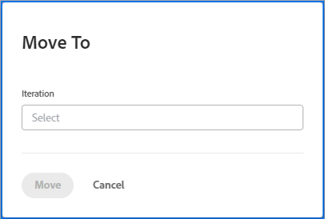

# Gerenciar o backlog ágil

Os itens de trabalho a seguir podem ser atribuídos a uma equipe ágil e adicionados ao backlog dessa equipe como histórias, dependendo da metodologia ágil que a equipe está usando:

* **[!UICONTROL Equipes ágeis de Scrum]:** Tarefas e problemas podem ser atribuídos à equipe ágil e adicionados ao backlog.
* **[!UICONTROL Equipes ágeis do Kanban]:** As tarefas podem ser atribuídas à equipe ágil e adicionadas ao backlog. Os usuários podem visualizar o backlog diretamente no storyboard do Agile, conforme descrito em [[!UICONTROL Adicionar o backlog] ao quadro Kanban](../../agile/use-kanban-in-an-agile-team/view-the-backlog-on-the-kanban-board.md). A equipe usa essa lista de pendências para priorizar e gerenciar sua fila de trabalho.

Tarefas ou problemas podem ser atribuídos à equipe (e posteriormente adicionados ao backlog da equipe) de qualquer lugar no [!DNL Adobe Workfront]. Por exemplo, uma única equipe pode receber atribuições de trabalho de vários projetos.

>[!NOTE]
>
>Se você adicionar várias equipes a um item de backlog, a tarefa ou problema será exibido somente no backlog da equipe principal. A equipe principal é a equipe atribuída pela primeira vez.

## Requisitos de acesso

+++ Expanda para visualizar os requisitos de acesso para a funcionalidade neste artigo.

Você deve ter o seguinte acesso para executar as etapas deste artigo:

<table style="table-layout:auto"> 
 <col> 
 </col> 
 <col> 
 </col> 
 <tbody> 
  <tr> 
   <td role="rowheader"><strong>[!DNL Adobe Workfront] plano</strong></td> 
   <td> 
Qualquer
 </td> 
  </tr> 
  <tr> 
   <td role="rowheader"><strong>[!DNL Adobe Workfront] licença</strong></td> 
   <td> 
Novo: [!UICONTROL Padrão]

Ou

Atual: [!UICONTROL Trabalho] ou superior
 </td> 
  </tr> 
  <tr> 
   <td role="rowheader"><strong>Configurações de nível de acesso</strong></td> 
   <td> 
Novo: [!UICONTROL Padrão]

Ou

Atual: [!UICONTROL Worker] ou superior
 </td> 
  </tr> 
  <tr> 
   <td role="rowheader"><strong>Permissões de objeto</strong></td> 
   <td> 
Acesso [!UICONTROL Gerenciar] ao projeto em que a história está
  </td> 
  </tr> 
 </tbody> 
</table>

Para obter mais detalhes sobre as informações nesta tabela, consulte [Requisitos de acesso na documentação do Workfront](/help/quicksilver/administration-and-setup/add-users/access-levels-and-object-permissions/access-level-requirements-in-documentation.md).

+++

## Criar e gerenciar histórias no backlog

* [Reordenar histórias](#reorder-stories)
* [[!UICONTROL Detalhamento] stories](#break-down-stories)
* [Editar histórias](#edit-stories)

### Reordenar histórias {#reorder-stories}

Você pode reordenar matérias na lista de backlog usando o método arrastar e soltar.

1. Acesse o backlog ágil, onde deseja reordenar as histórias.
1. No **[!UICONTROL Exibir]** selecione a variável **[!UICONTROL Backlog]** ou uma exibição personalizada que contenha a variável **[!UICONTROL Pedido]** coluna.

   >[!NOTE]
   >
   >Se uma tarefa ou problema tiver uma equipe ágil atribuída e o projeto não estiver em um status que corresponda a Atual, ele não será exibido no backlog. No entanto, elas ainda afetam a contagem de backlog na coluna Ordem.

1. Selecione uma ou mais matérias e arraste-as para a ordem em que deseja que elas apareçam no backlog.\
   

### Analisar histórias {#break-down-stories}

Como as histórias em um backlog variam de tamanho, os usuários podem dividi-las em tamanhos executáveis para uma iteração. Detalhar uma matéria cria subtarefas na tarefa que a matéria representa e substitui a tarefa original no backlog. Você pode ter uma tarefa pai ou suas subtarefas atribuídas a uma Equipe Ágil, mas não pode ter ambos atribuídos a uma equipe simultaneamente.

>[!NOTE]
>
>Considere as seguintes limitações ao detalhar histórias:
>
>* Somente as histórias que representam tarefas podem ser analisadas. Você não pode analisar histórias que representam problemas.
>* Histórias podem ser detalhadas somente se estiverem associadas a um projeto.

Para detalhar uma história:

1. Vá para o backlog que contém a história que você deseja detalhar.
1. Selecione a matéria que deseja detalhar e clique em **[!UICONTROL Analisar história]**.\
   A variável [!UICONTROL Analisar história] é exibida.\
   

1. Especifique um nome e uma estimativa para a matéria e selecione se a matéria está pronta.
1. Clique em **[!UICONTROL Adicionar história]** para criar outra história da história original.
1. Clique em **[!UICONTROL Salvar]**.

### Editar histórias {#edit-stories}

É possível editar histórias diretamente no [!UICONTROL Histórias] ou [!UICONTROL Problemas] no Backlog da mesma maneira que você edita tarefas ou problemas em um projeto em massa, conforme descrito em [Editar tarefas em massa](../../manage-work/tasks/manage-tasks/edit-tasks.md#edit-tasks-in-bulk) in [Editar tarefas](../../manage-work/tasks/manage-tasks/edit-tasks.md), e [Editar problemas](../../manage-work/issues/manage-issues/edit-issues.md).

## Criar novas histórias no backlog {#create-new-stories-on-the-backlog}

Você pode criar novas histórias no backlog, criando a história diretamente do backlog, ou atribuindo uma tarefa ou problema existente a uma equipe ágil.

* [Criar uma história no backlog](#create-a-story-from-the-backlog)
* [Atribuir uma tarefa ou problema a uma equipe ágil](#assign-a-task-or-issue-to-an-agile-team)

### Criar uma história no backlog {#create-a-story-from-the-backlog}

Ao criar uma história no backlog, ela é criada como uma tarefa ou um problema em um projeto. Não é possível criar uma história no backlog como um problema.

Para criar uma história no backlog:

1. Clique em **[!UICONTROL Menu principal]** ícone  no canto superior direito do Adobe Workfront ou (se disponível), clique no link **[!UICONTROL Menu principal]** ícone  no canto superior esquerdo e clique em **[!UICONTROL Equipes]**.

1. (Opcional) Clique no link **[!UICONTROL Trocar equipe]** ícone , selecione uma nova equipe do Scrum no menu suspenso ou procure uma equipe na barra de pesquisa e selecione-a quando ela aparecer.

1. Selecionar **[!UICONTROL Backlog]** no painel esquerdo.
1. Desempenhe uma das ações a seguir, dependendo se você deseja criar uma tarefa ou um problema:

   * **Para criar uma tarefa:** Clique em **[!UICONTROL Histórias]**.

   * **Para criar uma ocorrência:** Clique em **[!UICONTROL Problemas]**.

1. Clique em **[!UICONTROL Nova história]** ou **[!UICONTROL Nova Problema]**.

1. Especifique as seguintes informações:

   <table style="table-layout:auto">
    <col>
    <col>
    <tbody>
     <tr>
      <td role="rowheader"><strong>[!UICONTROL Nome da História]</strong></td>
      <td> Digite um nome para a história.</td>
     </tr>
     <tr>
      <td role="rowheader"><strong>[!UICONTROL Descrição]</strong></td>
      <td>(Opcional) Digite uma descrição para a matéria.</td>
     </tr>
     <tr>
      <td role="rowheader"><strong>[!UICONTROL Pronto]</strong></td>
      <td> Selecione se a matéria está pronta para ser adicionada a uma iteração. Esta configuração é apenas informativa. As histórias podem ser adicionadas a uma iteração independentemente do status dessa configuração.</td>
     </tr>
     <tr>
      <td role="rowheader"><strong>[!UICONTROL Estimativa]</strong></td>
      <td>Especifique uma estimativa de ponto ou hora para a história. As estimativas afetam o gráfico de burndown. O gráfico de burndown para uma iteração é preciso somente se cada história contiver uma estimativa precisa. (Se você fornecer uma estimativa de ponto, já deve ter designado nas configurações do grupo quantas horas cada ponto representa.)</td>
     </tr>
     <tr>
      <td role="rowheader"><strong>[!UICONTROL Projeto Pai]</strong></td>
      <td>Comece digitando o nome do projeto em que esta matéria será criada e clique no nome quando ele aparecer na lista suspensa. O status do projeto deve ser definido como [!UICONTROL Atual]. Se o status do projeto for algo diferente de [!UICONTROL Atual], ele não será exibido no menu suspenso.</td>
     </tr>
     <tr>
      <td role="rowheader"><strong>[!UICONTROL Tarefa Pai]</strong></td>
      <td>(Opcional) Comece digitando o nome da tarefa pai à qual essa matéria está subordinada e clique no nome quando ele aparecer na lista suspensa.</td>
     </tr>
     <tr>
      <td role="rowheader"><strong>[!UICONTROL Forms Personalizado]</strong></td>
      <td> (Opcional) Selecione os formulários personalizados que deseja adicionar a esta matéria.</td>
     </tr>
    </tbody>
   </table>

1. Clique em **[!UICONTROL Salvar história]**.

### Atribuir uma tarefa ou problema a uma equipe ágil {#assign-a-task-or-issue-to-an-agile-team}

É possível atribuir uma tarefa ou um problema a uma Equipe Ágil. Depois de atribuída, a tarefa ou problema aparece como uma nova história no backlog da equipe.

Para atribuir uma tarefa ou um problema a uma Equipe Ágil:

1. Vá para o Projeto que contém a tarefa que você deseja atribuir.
1. Selecione a tarefa ou problema na lista.
1. Clique em **[!UICONTROL Editar]**.
1. Clique em **[!UICONTROL Atribuições]**.
1. (Opcional) Exclua todos os atribuídos existentes.
1. Clique em **[!UICONTROL Adicionar atribuidor]**.
1. Comece digitando o nome da equipe ágil que você deseja que seja atribuído à tarefa ou problema, em seguida, clique no nome da equipe quando ele aparecer na lista suspensa.
1. Clique em **[!UICONTROL Salvar alterações]**.\
   A tarefa ou problema agora está disponível no backlog da equipe.

## Mover histórias para dentro ou para fora do backlog

{#move-stories-from-the-backlog-to-an-iteration-or-kanban-board}

* [Mover histórias do backlog para uma iteração ou quadro +](#move-stories-from-the-backlog-to-an-iteration-or--board)
* [Mover as histórias existentes para o backlog](#move-existing-stories-to-the-backlog)
* [Exportar histórias do backlog](#export-stories-from-the-backlog)

### Mover histórias do backlog para uma iteração ou quadro +

1. Ir para o backlog da Equipe Ágil.
1. Selecione as matérias que deseja mover para uma iteração ou quadro Kanban e clique em **[!UICONTROL Mais]** > **[!UICONTROL Mover para]**.\
   Se mover a história para uma [!UICONTROL Kanban] painel, o [!UICONTROL Mover a história para o Kanban] Quadro é exibido.\
   Se mover a matéria para uma iteração, a variável [!UICONTROL Mover a história para uma iteração] é exibida.\
   

1. Siga um destes procedimentos:

   * **Para equipes do Scrum:** No **[!UICONTROL Selecionar iteração]** selecione a iteração para onde deseja mover as matérias.

   * **Para equipes Kanban:** No **[!UICONTROL Selecionar Quadro Kanban]** selecione sua equipe [!UICONTROL Kanban] placa. (As equipes Kanban podem ter apenas um [!UICONTROL Kanban] painel.)

1. Clique em **[!UICONTROL Mover história]**.

### Mover as histórias existentes para o backlog {#move-existing-stories-to-the-backlog}

Se você decidir que sua equipe ainda não está pronta para trabalhar em uma história, poderá mover a história para o backlog.

Para obter mais informações, consulte [Mover uma história ágil](../../agile/work-in-an-agile-environment/move-an-agile-story.md).

### Exportar histórias do backlog {#export-stories-from-the-backlog}

É possível exportar uma ou mais histórias (incluindo tarefas e problemas) diretamente do backlog.

Você exporta matérias do backlog da mesma forma que exporta outros dados no [!DNL Workfront], conforme descrito em [Exportar dados](../../reports-and-dashboards/reports/creating-and-managing-reports/export-data.md).
