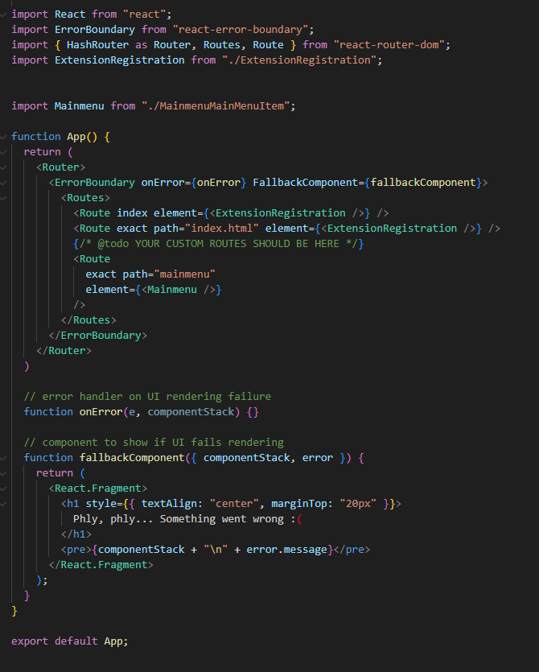

# Criar aplicativos personalizados para o Workfront com o Adobe App Builder

As extensões de interface do usuário do Workfront, viabilizadas pelo Adobe App Builder, permitem que clientes e parceiros criem experiências de usuário personalizadas. Essas ferramentas aumentam a eficiência, fornecem experiências integradas e conectadas, melhoram significativamente a satisfação do usuário e ajudam as empresas a concretizar sua visão exclusiva.

Por exemplo, sem as extensões da interface do usuário do Workfront, um gerente de projeto pode precisar alternar entre o Workfront e um sistema de rastreamento de tempo separado para registrar horas. Com as extensões de interface do usuário, o rastreamento de tempo pode ser integrado diretamente à experiência do Workfront, simplificando o fluxo de trabalho e economizando tempo. Além disso, você pode adicionar componentes personalizados para melhorar a usabilidade, automatizar tarefas repetitivas e aprimorar o gerenciamento de conteúdo com recursos como marcação de metadados e visualizações de conteúdo. O Adobe App Builder também oferece escalabilidade e gerenciamento de identidade (IMS) robusto, garantindo personalização segura e eficiente em qualquer escala.

As extensões da interface do usuário do Workfront oferecem vários benefícios principais:

* Personalização precisa: as interfaces de software padrão geralmente não atendem a todos os requisitos de negócios. As extensões de interface do usuário permitem que os desenvolvedores modifiquem e estendam a interface do usuário padrão para atender a necessidades comerciais específicas.
* Integração do sistema: as extensões da interface do usuário facilitam a integração de outros sistemas, garantindo fluxos de trabalho ininterruptos e consistência de dados.
* Escalabilidade: à medida que as empresas crescem, as extensões da interface do usuário podem ser desenvolvidas para adicionar novas funcionalidades sem a necessidade de uma revisão completa do sistema.
* Tempo de desenvolvimento reduzido: ferramentas e pontos de extensão pré-criados reduzem significativamente o tempo e o esforço necessários para implementar recursos personalizados.
* Melhor adoção pelo usuário: uma experiência otimizada do usuário pode impulsionar significativamente a adoção do software. Os elementos personalizados da interface do usuário projetados para corresponder às preferências do usuário podem melhorar as taxas de adoção e a satisfação geral.
* Aproveitando as extensões da interface do usuário do Workfront, as empresas podem criar experiências de usuário personalizadas que impulsionam a eficiência, a integração e a satisfação do usuário.

Depois que um aplicativo é criado no App Builder do Adobe, um administrador do Workfront pode adicioná-lo ao Menu principal do Workfront e ao painel de navegação esquerdo usando modelos de layout. Um usuário com o modelo de layout que clicar no aplicativo verá o aplicativo incorporado no Workfront, em vez de precisar abri-lo separadamente.

Este artigo descreve como acessar o App Builder e usar um template para criar um aplicativo.

Para obter informações sobre como adicionar um aplicativo personalizado a modelos de layout, consulte [Personalizar o menu principal usando um modelo de layout](/help/quicksilver/administration-and-setup/customize-workfront/use-layout-templates/customize-main-menu.md) e [Personalizar o painel esquerdo usando um modelo de layout](/help/quicksilver/administration-and-setup/customize-workfront/use-layout-templates/customize-left-panel.md).

## Pré-requisitos

Você deve ter o seguinte:

* Uma conta do Workfront habilitada para IMS
* Uma máquina dev com nó v18 e npm
* Licença do App Builder

## Acessar o Adobe App Builder

Para criar extensões de interface do usuário, você deve ter acesso ao Adobe App Builder na Adobe Developer Console.

Instruções adicionais estão disponíveis no [site do Adobe Developer](https://developer.adobe.com/uix/docs/guides/get-access/).

### Adicionar desenvolvedores à Adobe Admin Console

>[!IMPORTANT]
>
>Verifique se você selecionou a organização IMS correta para todas as etapas a seguir. Se você pertencer a várias organizações, é possível selecionar a errada. Verifique se você está agindo na organização correta, que geralmente está listada no canto superior direito.

1. Navegue até Produção: https://adminconsole.adobe.com/

1. Na seção **Usuários**, clique em **Desenvolvedores** > **Adicionar desenvolvedores**.

   

   >[!NOTE]
   >
   >Se você não vir uma opção para gerenciar desenvolvedores, não terá um produto que permita o acesso do desenvolvedor.

1. Adicione o email do usuário. Ele deve pesquisar usuários existentes que já foram adicionados no Admin Console.

1. Adicione os produtos necessários ao perfil do desenvolvedor e clique em **Salvar**.\
   

### Obter acesso ao App Builder

As organizações devem trabalhar com os gerentes de conta para comprar o App Builder.

Se o AppBuilder estiver configurado corretamente, você deverá ver Criar projeto a partir do modelo como parte da criação de um novo projeto.

## Criar um novo projeto na Adobe Developer Console

Você deve usar o Adobe Developer Console para criar sua extensão de interface do usuário.

Instruções adicionais estão disponíveis no [site do Adobe Developer](https://developer.adobe.com/uix/docs/guides/creating-project-in-dev-console/).

1. Faça logon na Adobe Developer Console com sua Adobe ID.

1. Escolha sua conta e seu perfil ou organização.

1. Clique em **Criar projeto a partir do modelo** na área Início rápido ou clique em **Criar novo projeto > Projeto a partir do modelo**.

   >[!IMPORTANT]
   >
   >Se você não vir a opção de criar um projeto a partir de um modelo, você está configurado incorretamente no Admin Console e não tem acesso ao catálogo do App Builder. Essa opção é exibida somente quando você tem acesso ao AppBuilder.

   

1. Selecione **App Builder**.

1. Insira um **Título do projeto** e **Nome do aplicativo**. Ambos têm padrões, mas será mais fácil identificar o projeto desejado posteriormente se você personalizar o valor.

1. Deixe **Incluir tempo de execução** selecionado.

1. Clique em **Salvar**.

## Usar a CLI do Adobe IO (aio)

O Adobe fornece uma CLI de código aberto que você pode usar para criar o aplicativo do App Builder.

Instruções adicionais estão disponíveis no GitHub e no site do Adobe Developer:

* https://github.com/adobe/aio-cli
* https://developer.adobe.com/app-builder/docs/getting_started/first_app/

1. Para instalar a ferramenta (verifique se você está no nó v18 primeiro), execute: `npm install -g @adobe/aio-cli`.
1. Inicie seu terminal e faça logon na AIO com o comando: `aio login`. Se você tiver problemas ao fazer logon na Organização IMS correta, tente `aio login -f` para forçar um prompt de logon. Use `aio where` para ver qual organização você está conectado à organização IMS correta. para obter mais detalhes, use `aio config`.
1. Comece a configurar seu aplicativo executando: `aio app init example-app` certifique-se de substituir &quot;exemplo-aplicativo&quot; pelo nome do seu aplicativo. Se não tiver certeza dos nomes de aplicativos, você poderá ver uma lista de nomes de aplicativos com o comando `aio console project list`.
1. Selecione sua organização e projeto nas opções fornecidas.
   
   

1. Procure todos os modelos disponíveis e escolha o **@adobe/workfront-ui-ext-tpl** para seu projeto.
   
1. Selecione e insira o nome do projeto criado na Adobe Developer Console.
   

1. Responda às solicitações do aplicativo:

   * Nomeie a extensão.
   * Forneça um resumo descritivo da funcionalidade da extensão.
   * Selecione um número de versão inicial para começar.
   * O modelo criará o código de um botão de navegação principal se você selecionar &quot;Adicionar um botão personalizado ao item de menu principal&quot; quando solicitado a informar &quot;O que deseja fazer a seguir?&quot;.

   

1. Confirme a conclusão selecionando Concluído. A geração de código a partir do modelo está em andamento.
   
1. Aguarde até ver uma mensagem informando que a inicialização do aplicativo foi concluída. Em seguida, abra o projeto em um IDE (recomenda-se o Visual Studio Code) e acesse a pasta src.

   Para obter mais informações sobre as pastas e os arquivos do seu projeto, consulte o [site do desenvolvedor do Adobe](https://developer.adobe.com/app-builder/docs/get_started/app_builder_get_started/first-app#anatomy-of-an-app-builder-application).

## Criar as extensões no VSCode

A configuração do arquivo App.js é necessária para habilitar a navegação pelo menu principal do Workfront ou pela navegação secundária (painel esquerdo).

A configuração do arquivo ExtensionRegistration.js é necessária para exibir as extensões nos modelos de layout do Workfront.

Os exemplos a seguir mostram como adicionar aplicativos personalizados ao Menu principal do Workfront e ao painel esquerdo de um objeto, usando as extensões da interface do usuário.

### Configurar ExtensionRegistration.js

Para permitir aplicativos personalizados no menu principal do Workfront:

1. Vá para ExtensionRegistration.js.

Na função ExtensionRegistration, você deve ver o código a seguir. Esse código foi criado para você pelo modelo. Este código pode ser adicionado para criar itens de menu adicionais. Substitua IDs e URLs.

    &quot;
    mainMenu: &lbrace;
    
    getItems() &lbrace;
    
    return &lbrack;
    
    &lbrace;
    
    id: &#39;main-menu-label&#39;,
    
    url: &#39;/index.html#/main-menu-label&#39;,
    
    label: &#39;Rótulo do menu principal&#39;,
    
    icon: icon1,
    
    &rbrace;,
    
    &rbrack;;
    
    &rbrace;,
    
    &rbrace;
    &quot;

1. Adicione o seguinte trecho de código:
   
Este exemplo mostra um item Menu Principal. Você deve atualizar a ID, o rótulo, o ícone e o URL para os nomes corretos do aplicativo. Ao adicionar vários itens, verifique se a ID é exclusiva.

1. Salve o trabalho.

### Permitir aplicativos personalizados na navegação do painel esquerdo do Workfront

Para permitir aplicativos personalizados na navegação do painel esquerdo do Workfront:

1. Vá para ExtensionRegistration.js.
1. Na função ExtensionRegistration, adicione o seguinte trecho de código:

   ```
   secondaryNav: {  
   
   TASK: {  
   
       getItems() {       return [         {           id: "TASK", 
   
   label: "My TASK",           icon: metricsIcon,           url: "/myTask",  
   
           },  
   
       ];  
   
       },  
   
   },  
   
   },  
   ```

   

   * Este exemplo mostra um item de navegação do painel esquerdo chamado Minha Tarefa. Você deve atualizar a ID, o rótulo, o ícone e o URL para os nomes corretos do aplicativo.

   * Este exemplo mostra um item de navegação do painel esquerdo para o tipo de objeto Projeto. Você deve criar esses itens separadamente para cada objeto em que eles são compatíveis com o Workfront. Os seguintes objetos estão disponíveis: projeto, tarefa, problema, portfólio e programa.

1. Salve o trabalho.

### Configurar App.js

1. Acesse App.js.

1. O modelo encaminhará uma rota para uma opção de menu principal. Uma rota define o mapeamento entre caminhos de URL e os componentes renderizados para esses caminhos. Para adicionar uma rota, use o seguinte trecho de código. Substitua o caminho e o elemento exatos pelo seu.

   ```
       <Route 
   
               exact path="custom-application" 
   
               element={<Customapplication />} 
   
           /> 
   ```

   
1. Salve o trabalho.

Para obter mais informações sobre como desenvolver e executar o aplicativo, consulte o [site do desenvolvedor do Adobe](https://developer.adobe.com/app-builder/docs/get_started/app_builder_get_started/first-app#develop-the-application).

## Contexto compartilhado

O contexto compartilhado é usado para compartilhar dados do Workfront com uma extensão de interface do usuário. Os dados disponíveis por meio do contexto compartilhado incluem os dados do usuário e o contexto do aplicativo.


### Usuário

As extensões de interface do usuário do Workfront compartilham dados do usuário. O objeto do usuário disponível por meio do contexto compartilhado inclui uma ID de usuário do Workfront e o endereço de email do usuário.

`user = (conn?.sharedContext?.get("user")); // {ID: '1', email: 'test@aaa.com'} userID = user.ID userEmail = user.email `

### Contexto do aplicativo

Ao adicionar um aplicativo personalizado usando um ponto de extensão de Navegação secundário, é comum que o aplicativo personalizado use dados de contexto como uma ID de projeto ou ID de documento. Para esses dados, o contexto compartilhado inclui um código de objeto e uma ID de objeto.

Este é um exemplo para obter o contexto do aplicativo para documentos:

`context = conn?.sharedContext; // Using the connection created above, grab the document details from the host tunnel. // conn?.host?.document?.getDocumentDetails().then(setDocDetails); `

## Testar o aplicativo no Workfront

Ao desenvolver seu aplicativo do App Builder para o Workfront, talvez seja necessário testar seu aplicativo no Workfront sem publicá-lo.

No aplicativo App Builder, você pode iniciar o `aio app run` para desenvolvimento local. Isso fornecerá uma URL, normalmente algo como `https://localhost:9080`. Como alternativa, você pode executar `aio app deploy` para obter um domínio estático do Adobe. Anote esses URLs para uso futuro.

Em seguida, navegue até a página específica em que deseja desenvolver no navegador. Abra as ferramentas do desenvolvedor e acesse o Armazenamento local workfront.com ou workfront.adobe.com. Aqui, você deve adicionar uma entrada. Use `extensionOverride` como chave e a URL do construtor de aplicativos anotada anteriormente como o valor.

Se a configuração foi concluída corretamente, ao recarregar a página de modelo de layout no Workfront, você verá os botões do aplicativo App Builder. Adicione os botões do aplicativo ao Menu principal e ao painel esquerdo para um objeto e verifique se eles são exibidos corretamente nessas áreas.

Instruções adicionais estão disponíveis no site do desenvolvedor do Adobe, com um exemplo do AEM: https://developer.adobe.com/uix/docs/guides/preview-extension-locally/

## Publicar aplicativos e aprovar o envio

Para publicar o aplicativo e aprová-lo, siga as instruções no [site do desenvolvedor do Adobe](https://developer.adobe.com/uix/docs/guides/publication/).
