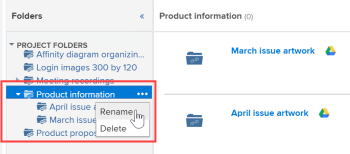

# Vincular documentos de aplicativos externos

<!-- Audited: 01/2024 -->

Você pode vincular documentos e pastas ao Adobe Workfront a partir das seguintes fontes:

<table style="table-layout:auto"> 
 <col> 
 <col> 
 <tbody> 
  <tr> 
   <td role="rowheader">Provedores de documentos em nuvem de terceiros existentes</td> 
   <td>Isso inclui o seguinte: 
    <ul> 
     <li>Box</li> 
     <li>Dropbox</li> 
     <li>Dropbox Business</li> 
     <li>WebDAM</li> 
     <li>Microsoft OneDrive</li> 
     <li>Microsoft SharePoint</li> 
     <li>Google Drive</li> 
    </ul></td> 
  </tr> 
  <tr> 
   <td role="rowheader">Prova do Workfront </td> 
   <td>Você pode disponibilizar no Workfront provas que foram criadas originalmente no Workfront Proof. Para as licenças atuais, é necessário um Plano Pro Workfront ou superior para usar esse recurso. Para as novas licenças, todos os planos incluem esse recurso. Para obter mais informações sobre os vários planos disponíveis, consulte <a href="https://www.workfront.com/plans">Planos do Workfront</a>.</td> 
  </tr> 
  <tr data-mc-conditions="QuicksilverOrClassic.Quicksilver"> 
   <td role="rowheader">Experience Manager Assets Essentials </td> 
   <td>Você pode vincular documentos do Experience Manager Assets Essentials à Workfront. Para obter mais informações, consulte <a href="../../documents/adobe-workfront-for-experience-manager-assets-essentials/workfront-for-aem-asset-essentials.md" class="MCXref xref"> Adobe Workfront para o Experience Manager Assets Essentials</a>.</td> 
  </tr> 
  <tr> 
   <td role="rowheader">Workfront DAM </td> 
   <td>Isso requer uma compra adicional. </td> 
  </tr> 
  <tr> 
   <td role="rowheader">Outros provedores de documentos (por meio de integrações de documentos personalizadas)</td> 
   <td> 
Para as licenças atuais, é necessário um Plano Pro Workfront ou superior para usar esse recurso. Para as novas licenças, todos os planos incluem esse recurso. Para obter mais informações sobre os vários planos disponíveis, consulte <a href="https://www.workfront.com/plans">Planos do Workfront</a>.
 </td>
  </tr> 
 </tbody> 
</table>

Antes de vincular documentos ou pastas, o administrador do Workfront deve habilitar essa funcionalidade para cada provedor de documentos ou para uma integração de documentos personalizada, conforme descrito em [Configurar integrações de documentos](../../administration-and-setup/configure-integrations/configure-document-integrations.md).

Você pode revisar e aprovar documentos vinculados a um provedor de nuvem externo da mesma maneira que faz com documentos carregados diretamente no Workfront.

## Requisitos de acesso

Você deve ter o seguinte acesso para executar as etapas deste artigo:

<table style="table-layout:auto"> 
 <col> 
 <col> 
 <tbody> 
  <tr> 
   <td role="rowheader">plano do Adobe Workfront</td>
   <td> 
 Qualquer
 </td>
  </tr> 
  <tr> 
   <td role="rowheader">Licença do Adobe Workfront</td>
   <td>
Novo: Colaborador ou superior

    
ou

    
Atual: solicitação ou superior
 </td>
  </tr> 
  <tr> 
   <td role="rowheader">Configurações de nível de acesso</td> 
   <td> 
Editar acesso a documentos
 </td> 
  </tr> 
 </tbody> 
</table>

Para obter mais detalhes sobre as informações nesta tabela, consulte [Requisitos de acesso na documentação do Workfront](/help/quicksilver/administration-and-setup/add-users/access-levels-and-object-permissions/access-level-requirements-in-documentation.md).

## Armazenamento de documentos

Os documentos vinculados ao Workfront a partir de um aplicativo externo são armazenados com o provedor de nuvem externo, não no Workfront.

As seguintes exceções se aplicam:

* Quando fornecido pelo serviço de documento, as miniaturas e as imagens de visualização podem ser armazenadas nos servidores do Workfront.
* Quando você usa provas no Workfront, o documento é copiado e adicionado aos servidores de provas.

## Vincular um documento de um aplicativo externo ao Workfront

Você pode vincular documentos existentes a um provedor de nuvem externo. Isso inclui todos os documentos compartilhados.

### Pré-requisitos {#prerequisites}

Antes de vincular documentos ou pastas, o administrador do Workfront deve habilitar essa funcionalidade para cada provedor de documentos ou para uma integração de documentos personalizada, conforme descrito em [Configurar integrações de documentos](../../administration-and-setup/configure-integrations/configure-document-integrations.md).

### Vincular um documento externo ao Workfront {#link-an-external-document-to-workfront}

Você pode vincular documentos ao Workfront a partir de um aplicativo externo, como o Google e o Microsoft OneDrive.

>[!IMPORTANT]
>
>O Dropbox armazena documentos com base no caminho do arquivo. Por causa disso, se um arquivo vinculado do Dropbox for movido, renomeado ou excluído, ele se tornará inacessível no Workfront.

1. Vá para a **Documentos** na Workfront onde você deseja o documento.
1. Clique em **Adicionar novo**, em seguida, clique no provedor de documentos externos no qual deseja vincular documentos ao Workfront.

   Por exemplo, para vincular documentos do Dropbox, clique em **Do Dropbox**.

   Os provedores externos que você já autorizou aparecem no topo da lista.

1. (Condicional) Se for solicitado a efetuar login no serviço externo, digite suas credenciais de login para o serviço na caixa exibida e, em seguida, clique em **Fazer logon**.
1. (Condicional) Se você for solicitado a autorizar o aplicativo externo, clique na guia **Autorizar** botão.

   Você precisa fazer isso apenas uma vez.

1. Na caixa de pesquisa do **Vincular pastas e arquivos externos** que for exibida, digite o nome do item que deseja pesquisar e pressione **Enter** para ver todos os resultados do aplicativo externo, independentemente da pasta em que estão armazenados.

   Ou

   Procure e selecione os documentos que deseja vincular.

   Embora seja possível selecionar vários documentos, somente os documentos selecionados na exibição atual serão vinculados. Por exemplo, se você selecionar um documento e, em seguida, entrar em uma pasta, o documento selecionado originalmente não será vinculado.

1. (Condicional) Se você for um cliente do Workfront DAM, clique no link **Miniatura** ícone para exibir arquivos como imagens em miniatura.

   >[!NOTE]
   >
   >Os clientes do Workfront DAM podem visualizar miniaturas ao vincular documentos do Workfront DAM. As miniaturas também podem ser exibidas para clientes do Workfront DAM para outros serviços, como Dropbox e Box. No entanto, visualizar miniaturas de serviços diferentes do Workfront DAM no Workfront não é suportado e as miniaturas nunca são exibidas ao vincular documentos do SharePoint ou do Google Drive.

1. Clique em **Link**.

   No Workfront, o ícone do provedor de nuvem é exibido ao lado dos documentos.

   >[!NOTE]
   >
   >Para documentos vinculados a Box, o link para o documento em Box não é exibido até que você atualize a página.

### Adicionar uma nova versão de um documento vinculado {#add-a-new-version-of-a-linked-document}

É possível adicionar uma nova versão de um documento vinculado ao Workfront a partir de um aplicativo externo.

1. Vá para a **Documentos** onde o documento está vinculado, selecione o documento vinculado.

   >[!IMPORTANT]
   >
   >O documento deve estar fora de uma pasta vinculada para criar uma nova versão.

1. Clique em **Adicionar novo** > **Versão** e, em seguida, clique no provedor de documentos externos.

   Por exemplo, para vincular uma nova versão de um documento do Dropbox, clique em **Do Dropbox**.

   Os provedores externos que você já autorizou aparecem no topo da lista.

1. (Condicional) Se for solicitado a efetuar login no serviço externo, digite suas credenciais de login para o serviço na caixa exibida e, em seguida, clique em **Fazer logon**.
1. (Condicional) Se você for solicitado a autorizar o aplicativo externo, clique em **Autorizar**.

   Você precisa fazer isso apenas uma vez.

1. Na caixa de pesquisa do **Vincular pastas e arquivos externos** que for exibida, digite o nome do item que deseja pesquisar e pressione **Enter** para ver todos os resultados do aplicativo externo, independentemente da pasta em que estão armazenados.

   Ou

   Procure e selecione os documentos que deseja vincular.

   É possível selecionar vários documentos; no entanto, somente os documentos selecionados na exibição atual são vinculados. Por exemplo, se você selecionar um documento e, em seguida, entrar em uma pasta, o documento selecionado originalmente não será vinculado.

1. (Condicional) Se você for um cliente do Workfront DAM, clique no link **Miniatura** ícone para exibir arquivos como imagens em miniatura.

   >[!NOTE]
   >
   >Os clientes do Workfront DAM podem visualizar miniaturas ao vincular documentos do Workfront DAM. As miniaturas também podem ser exibidas para clientes do Workfront DAM para outros serviços, como Dropbox e Box. No entanto, visualizar miniaturas de serviços diferentes do Workfront DAM no Workfront não é suportado e as miniaturas nunca são exibidas ao vincular documentos do SharePoint ou do Google Drive.

1. Clique em **Link**.

   No Workfront, o ícone do provedor de nuvem aparece ao lado dos documentos, indicando que eles estão vinculados ao provedor de nuvem externo.

   >[!NOTE]
   >
   >Para documentos vinculados a Box, o link para o documento em Box não é exibido até que você atualize a página.

Para obter informações sobre como adicionar uma nova versão de um documento que você carregou no Workfront a partir do seu sistema de arquivos, consulte [Adicionar documentos ao Adobe Workfront](../../documents/adding-documents-to-workfront/add-documents-from-file-system.md#add-documents-to-workfront) in [Adicionar documentos ao Adobe Workfront a partir do sistema de arquivos](../../documents/adding-documents-to-workfront/add-documents-from-file-system.md).

### Vincular documentos de prova do Workfront {#link-workfront-proof-documents}

Você pode vincular provas ao Workfront que existiam originalmente no Workfront Proof. Quando você vincula uma prova do Workfront Proof, todos os comentários e outros metadados associados à prova ficam disponíveis no Workfront.

Você pode vincular somente as provas para as quais tem acesso de Visualização no Workfront Proof.

1. Vá para a **Documentos** na Workfront onde você deseja o documento.
1. Clique em **Adicionar novo** e, em seguida, clique em **Da prova do Workfront**.

   >[!NOTE]
   >
   >As opções nesse menu podem variar dependendo de quais provedores de terceiros estão configurados em seu ambiente.

1. No **Vincular provas da prova do Workfront** que for exibida, comece digitando o nome da prova que deseja disponibilizar no Workfront.

   A lista é filtrada à medida que você digita.

1. Selecione até 10 provas para vincular.

   Qualquer nome de prova esmaecido não está disponível para link, pois a prova já está associada a um documento no Workfront.

1. Clique em **Link**.

   A versão mais recente da prova está vinculada ao Workfront. Ao abrir a prova, todas as versões ficam disponíveis no visualizador de provas.

### Criar um documento do Google no Workfront {#create-a-google-document-from-within-workfront}

Você pode criar um novo documento do Google no Workfront. Não é possível criar novos documentos no Workfront para outros provedores de nuvem.

1. Vá para a **Documentos** na Workfront onde você deseja o documento.
1. Clique em **Adicionar novo** > **Arquivo Google**, em seguida, selecione o tipo de documento do Google que deseja criar.
1. Se a variável **Adicionar conta do Google Drive** for exibida, clique em **Autorizar unidade Google**.

   Um documento do Google é adicionado à **Documentos** guia.

   >[!NOTE]
   >
   > My Drive e Shared with Me exibem dois resultados diferentes. Se não conseguir localizar um arquivo em Meu Drive, faça check-in na pasta Compartilhado comigo.

## Fazer upload e vincular um documento do Workfront a um provedor de nuvem externo

Você pode fazer upload e vincular um documento do Workfront a um provedor de nuvem externo. Isso move o armazenamento do documento do Workfront para o provedor de nuvem externo. Quando o documento é alterado no aplicativo externo, ele é atualizado automaticamente no Workfront.

>[!NOTE]
>
>Enviar um ativo para um provedor de documentos externo cria uma nova versão do ativo.

Os usuários sem acesso ao Workfront podem ver o documento no aplicativo externo se tiverem acesso ao aplicativo.

1. Selecione um documento que seja carregado no Workfront.
1. Clique em **Mais** >**Enviar para**, em seguida, selecione o provedor de nuvem no qual deseja armazenar o documento vinculado.

   Você também pode usar o menu Mais  na página Detalhes do documento.

1. Selecione a pasta no aplicativo do provedor em que você deseja armazenar o documento.

   Pode ser qualquer pasta no aplicativo do provedor, incluindo uma pasta compartilhada.

1. Clique em **Salvar**.

   O logotipo do provedor externo aparece ao lado do nome do documento para indicar que o documento agora está vinculado ao Workfront e armazenado pelo provedor de nuvem externo.

   

## Vincular pastas

Ao vincular uma pasta entre o Workfront e um provedor de nuvem externo, a pasta e todo o seu conteúdo são vinculados. Se os usuários sem acesso ao Workfront adicionarem, removerem e modificarem arquivos do aplicativo de documentos externos, suas alterações serão sincronizadas com o Workfront.

### Direitos de acesso à pasta {#folder-access-rights}

Ao sincronizar o conteúdo da pasta de um aplicativo de documento externo, o Workfront usa as credenciais do usuário que originalmente vinculou a pasta. Isso resulta na seguinte experiência do usuário:

* Se os usuários não tiverem acesso para exibir arquivos e pastas no aplicativo externo, mas tiverem acesso para exibir a pasta vinculada por meio do Workfront, poderão exibir somente os nomes dos arquivos e pastas no Workfront, não seu conteúdo.
* Quando alguém acessa o conteúdo dentro de uma pasta vinculada no Workfront (como uma subpasta em uma pasta vinculada) que foi vinculada ao Workfront por outro usuário, o conteúdo é sincronizado com o Workfront usando as credenciais de logon do Workfront do usuário que originalmente vinculou a pasta, não as credenciais do usuário que acessou o conteúdo.

>[!IMPORTANT]
>
>* Se o usuário que vinculou originalmente a pasta for removido do sistema do Workfront, os usuários não poderão mais acessar o conteúdo na pasta vinculada por meio do Workfront. Nesse caso, a pasta deve ser vinculada novamente por um usuário ativo do Workfront que tenha direitos à pasta no aplicativo externo.
>* Se o usuário que vinculou uma pasta não tiver mais acesso ao aplicativo externo, o Workfront não poderá mais acessar o conteúdo da pasta. Isso pode acontecer, por exemplo, se o usuário que originalmente vinculou a pasta sair da empresa. Para garantir acesso contínuo, um usuário com acesso à pasta deve vincular novamente a pasta.

### Vincular uma ou mais pastas externas {#link-one-or-more-external-folders}

1. Vá para a área no Workfront em que deseja colocar a pasta e clique em  **Documentos**  no painel esquerdo .

1. Clique em **Adicionar novo**, em seguida, clique no provedor de documentos externos a partir do qual deseja vincular uma pasta ao Workfront.
1. (Condicional) Se você ainda não autorizou o serviço externo, especifique suas credenciais de logon para o provedor externo e clique em **Fazer logon**.

   Os provedores externos que você já autorizou aparecem no topo da lista.

1. No **Vincular pastas e arquivos externos** for exibida, navegue até as pastas que deseja vincular e selecione-as.

   Ou

   Digite o nome da pasta que deseja pesquisar e pressione **Enter**.

   É possível selecionar várias pastas; no entanto, somente as pastas selecionadas na exibição atual são vinculadas. Por exemplo, se você selecionar uma pasta e, em seguida, entrar em uma pasta, a pasta selecionada originalmente não será vinculada.

   >[!NOTE]
   >
   >Ao vincular pastas do Google Drive, você só pode vincular pastas que estão dentro de sua unidade pessoal (Minha Unidade) e do Team Drive. Não é possível vincular pastas da área Compartilhado comigo.

1. Clique em **Link**.

   No Workfront, o logotipo do provedor de nuvem é exibido ao lado da pasta, indicando que está vinculado ao provedor de nuvem externo.

1. (Opcional) Para renomear a pasta de forma que o nome dela no Workfront seja diferente do nome da pasta no aplicativo de documento externo, selecione a pasta na **Pastas** clique no menu Mais   que é exibido ao lado do nome da pasta, depois clique em **Renomear**.

   

Isso não renomeia a pasta no aplicativo externo.

### Adicionar subpastas a uma pasta vinculada  {#add-subfolders-to-a-linked-folder}

Você pode criar uma nova pasta dentro de uma pasta vinculada existente. Você também pode arrastar outra pasta para uma pasta vinculada existente.

1. Para criar uma nova pasta em uma pasta vinculada existente, vá para a pasta existente e crie a nova pasta conforme descrito em [Criar pastas de documentos](../../documents/organizing-documents/create-documents-folder.md).

   Ou

   Para arrastar uma pasta existente para uma pasta vinculada existente, vá para a área Documentos onde deseja a subpasta e arraste-a para a pasta vinculada.

   

   >[!NOTE]
   >
   >As seguintes limitações se aplicam ao arrastar uma pasta existente do Workfront para uma pasta vinculada:
   >
   >* A pasta que você está arrastando ainda não pode ser vinculada e não pode conter nenhum conteúdo que já esteja vinculado.
   >* A pasta (incluindo seu conteúdo) que você está arrastando não pode exceder 50 MB.

## Adicionar um documento a uma pasta vinculada

Ao adicionar um documento a uma pasta vinculada por meio do Workfront, ele é automaticamente adicionado como um documento vinculado.

1. Selecione a pasta vinculada na qual deseja o documento e clique em **Adicionar novo > Documento**, navegue até o documento e adicione-o à pasta.

   Ou

   No **Documentos** área onde deseja o documento, arraste o documento para uma pasta vinculada.

   Uma nova versão do documento é criada automaticamente no aplicativo externo e vinculada ao Workfront.

>[!NOTE]
>
> * As opções de documento não estarão disponíveis enquanto o documento estiver em processo de movimentação.
>
> * Depois que um documento é movido para o Experience Manager Assets, o não fica mais visível na lista de documentos do Workfront.
>
> * Qualquer ação ou edição feita em um documento enquanto ele está sendo movido não aparecerá no documento no Experience Manager Assets e, portanto, será perdida.

## Excluir um documento ou uma pasta vinculada

Ao excluir um documento ou pasta vinculada do aplicativo externo, o documento ou a pasta permanece no sistema Workfront até que você também o exclua do Workfront.

1. Selecione o documento ou a pasta vinculada e clique em **Excluir**.
1. Na caixa de confirmação exibida, clique em **Sim, desvincule-o**.

   O documento está desvinculado do site do Workfront. Ela não é afetada no aplicativo externo.

## Sobre a renomeação de documentos e pastas vinculados

Ao renomear um documento ou pasta vinculada, a alteração fica visível somente no aplicativo em que foi feita. Por exemplo, se você renomear um documento vinculado no Workfront, o novo nome ficará visível somente no Workfront.

Se desejar que o nome corresponda no Workfront e no aplicativo externo, renomeie-o em ambos os lugares.

>[!IMPORTANT]
>
>Não renomeie um documento no Workfront que esteja vinculado ao Dropbox; isso torna o arquivo no Workfront inacessível. Em vez disso, renomeie o arquivo no Dropbox e sincronize-o novamente.
