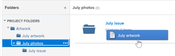

# Vincular documentos de aplicativos externos

<!-- Audited: 01/2024 -->

You can link documents and folders to Adobe Workfront from the following sources:

<table style="table-layout:auto"> 
 <col> 
 <col> 
 <tbody> 
  <tr> 
   <td role="rowheader">Existing third party cloud document providers</td> 
   <td>These include the following: 
    <ul> 
     <li>Box</li> 
     <li>Dropbox</li> 
     <li>Dropbox Business</li> 
     <li>WebDAM</li> 
     <li>Microsoft OneDrive</li> 
     <li>Microsoft SharePoint</li> 
     <li>Google Drive</li> 
     <li>Quip</li>
    </ul></td> 
  </tr> 
  <tr> 
   <td role="rowheader">Prova do Workfront </td> 
   <td>You can make proofs that were originally created within Workfront Proof available within Workfront.</td> 
  </tr> 
  <tr data-mc-conditions="QuicksilverOrClassic.Quicksilver"> 
   <td role="rowheader">Experience Manager Assets Essentials </td> 
   <td>You can link documents to Workfront from Experience Manager Assets Essentials. For more information, see <a href="../../documents/adobe-workfront-for-experience-manager-assets-essentials/workfront-for-aem-asset-essentials.md" class="MCXref xref"> Adobe Workfront for Experience Manager Assets Essentials</a>.</td> 
  </tr>

<tr> 
   <td role="rowheader">Other document providers (through custom document integrations)</td> 
   <td> 
These integrations can be configured in the Setup area.
 </td>
  </tr> 
 </tbody> 
</table>

Before you link documents or folders, your Workfront administrator must enable this functionality for each document provider, or for a custom document integration, as described in [Configure document integrations](../../administration-and-setup/configure-integrations/configure-document-integrations.md).

You can proof and approve documents linked to an external cloud provider the same way you do so with documents uploaded directly to Workfront.

>[!NOTE]
>
>Essa funcionalidade não está disponível na área de novos documentos. 
>Se sua organização usar armazenamento corporativo, você verá a nova área de documentos ao acessar documentos no Workfront. Para obter mais informações sobre o armazenamento corporativo, consulte [visão geral sobre o armazenamento corporativo da Adobe](/help/quicksilver/review-and-approve-work/esm-overview.md).

## Requisitos de acesso

+++ Expanda para visualizar os requisitos de acesso da funcionalidade neste artigo.

<table style="table-layout:auto"> 
 <col> 
 <col> 
 <tbody> 
  <tr> 
   <td role="rowheader">Pacote do Adobe Workfront</td>
   <td> 
Qualquer
 </td>
  </tr> 
  <tr> 
   <td role="rowheader">Licença do Adobe Workfront</td>
   <td>
Colaborador ou posterior

    
Solicitação ou posterior
 </td>
  </tr> 
  <tr> 
   <td role="rowheader">Configurações de nível de acesso</td> 
   <td> 
Editar acesso a documentos
 </td> 
  </tr> 
 </tbody> 
</table>

Para obter informações, consulte [Requisitos de acesso na documentação do Workfront](/help/quicksilver/administration-and-setup/add-users/access-levels-and-object-permissions/access-level-requirements-in-documentation.md).

+++

## Document storage

Documents that are linked to Workfront from an external application are stored with the external cloud provider, not within Workfront.

The following exceptions apply:

* When provided by the document service, thumbnails and preview images might be stored on Workfront servers.
* When you use proofing in Workfront, the document is copied and added to the proofing servers.

## Limites de tamanho de arquivo

Third-party cloud providers:

* Single file: 5 GB or less
* Multiple file: 1 GB or less (total of all files)

## Link a document from an external application to Workfront

You can link existing documents with an external cloud provider. This includes any shared documents.

### Pré-requisitos {#prerequisites}

Antes de vincular documentos ou pastas, o administrador do Workfront deve habilitar essa funcionalidade para cada provedor de documentos ou para uma integração de documentos personalizada, conforme descrito em [Configurar integrações de documentos](../../administration-and-setup/configure-integrations/configure-document-integrations.md).

### Link an external document to Workfront {#link-an-external-document-to-workfront}

Você pode vincular documentos ao Workfront a partir de um aplicativo externo, como o Google e o Microsoft OneDrive.

>[!IMPORTANT]
>
>O Dropbox armazena documentos com base no caminho do arquivo. Por causa disso, se um arquivo vinculado do Dropbox for movido, renomeado ou excluído, ele se tornará inacessível no Workfront.

1. Vá para a área **Documentos** no Workfront onde deseja o documento.
1. Click **Add New**, then click the external document provider where you want to link documents to Workfront.

   Por exemplo, para vincular documentos do Dropbox, clique em **Do Dropbox**.

   Os provedores externos que você já autorizou aparecem no topo da lista.

1. (Condicional) Se você for solicitado a fazer login no serviço externo, digite suas credenciais de login para o serviço na caixa exibida e clique em **Entrar**.
1. (Conditional) If you are prompted to authorize the external application, click the **Authorize** button.

   Você precisa fazer isso apenas uma vez.

1. Na caixa de pesquisa da caixa **Vincular Pastas e Arquivos Externos** que é exibida, digite o nome do item que você deseja pesquisar e pressione **Enter** para ver todos os resultados do aplicativo externo, independentemente da pasta em que eles estão armazenados.

   Ou

   Procure e selecione os documentos que deseja vincular.

   Embora seja possível selecionar vários documentos, somente os documentos selecionados na exibição atual serão vinculados. Por exemplo, se você selecionar um documento e, em seguida, entrar em uma pasta, o documento selecionado originalmente não será vinculado.

1. (Condicional) Se você for um cliente do Workfront DAM, clique no ícone **Miniatura** para exibir arquivos como imagens em miniatura.

   >[!NOTE]
   >
   >Os clientes do Workfront DAM podem visualizar miniaturas ao vincular documentos do Workfront DAM. Miniaturas também podem ser exibidas para clientes do Workfront DAM para outros serviços, como Dropbox e Box. No entanto, visualizar miniaturas de serviços diferentes do Workfront DAM no Workfront não é suportado e as miniaturas nunca são exibidas ao vincular documentos do SharePoint ou do Google Drive.

1. Clique em **Link**.

   No Workfront, o ícone do provedor de nuvem é exibido ao lado dos documentos.

   >[!NOTE]
   >
   >* Se o URL de download que é usado para vincular o documento exceder 2048 caracteres, o arquivo não poderá vincular.
   >* Para documentos vinculados a Box, o link para o documento em Box não é exibido até que você atualize a página.

### Adicionar uma nova versão de um documento vinculado {#add-a-new-version-of-a-linked-document}

É possível adicionar uma nova versão de um documento vinculado ao Workfront a partir de um aplicativo externo.

1. Vá para a área **Documentos** onde o documento está vinculado e selecione o documento vinculado.

   >[!IMPORTANT]
   >
   >O documento deve estar fora de uma pasta vinculada para criar uma nova versão.

1. Clique em **Adicionar novo** > **Versão** e clique no provedor de documento externo.

   Por exemplo, para vincular uma nova versão de um documento do Dropbox, clique em **No Dropbox**.

   Os provedores externos que você já autorizou aparecem no topo da lista.

1. (Condicional) Se você for solicitado a fazer login no serviço externo, digite suas credenciais de login para o serviço na caixa exibida e clique em **Entrar**.
1. (Condicional) Se você for solicitado a autorizar o aplicativo externo, clique em **Autorizar**.

   Você precisa fazer isso apenas uma vez.

1. Na caixa de pesquisa da caixa **Vincular Pastas e Arquivos Externos** que é exibida, digite o nome do item que você deseja pesquisar e pressione **Enter** para ver todos os resultados do aplicativo externo, independentemente da pasta em que eles estão armazenados.

   Ou

   Procure e selecione os documentos que deseja vincular.

   É possível selecionar vários documentos; no entanto, somente os documentos selecionados na exibição atual são vinculados. Por exemplo, se você selecionar um documento e, em seguida, entrar em uma pasta, o documento selecionado originalmente não será vinculado.

1. (Condicional) Se você for um cliente do Workfront DAM, clique no ícone **Miniatura** para exibir arquivos como imagens em miniatura.

   >[!NOTE]
   >
   >Os clientes do Workfront DAM podem visualizar miniaturas ao vincular documentos do Workfront DAM. Miniaturas também podem ser exibidas para clientes do Workfront DAM para outros serviços, como Dropbox e Box. No entanto, visualizar miniaturas de serviços diferentes do Workfront DAM no Workfront não é suportado e as miniaturas nunca são exibidas ao vincular documentos do SharePoint ou do Google Drive.

1. Clique em **Link**.

   No Workfront, o ícone do provedor de nuvem aparece ao lado dos documentos, indicando que eles estão vinculados ao provedor de nuvem externo.

   >[!NOTE]
   >
   >Para documentos vinculados a Box, o link para o documento em Box não é exibido até que você atualize a página.

Para obter informações sobre como adicionar uma nova versão de um documento que você carregou para o Workfront a partir do sistema de arquivos, consulte [Adicionar documentos ao Adobe Workfront](../../documents/adding-documents-to-workfront/add-documents-from-file-system.md#add-documents-to-workfront) em [Adicionar documentos ao Adobe Workfront a partir do sistema de arquivos](../../documents/adding-documents-to-workfront/add-documents-from-file-system.md).

### Vincular documentos do Workfront Proof {#link-workfront-proof-documents}

Você pode vincular provas ao Workfront que existiam originalmente no Workfront Proof. Quando você vincula uma prova do Workfront Proof, todos os comentários e outros metadados associados à prova ficam disponíveis no Workfront.

You can link only those proofs for which you have View access in Workfront Proof.

1. Go to the **Documents** area in Workfront where you want the document.
1. Click **Add New**, then click **From Workfront Proof**.

   >[!NOTE]
   >
   >The options in this menu may vary depending on what third party providers are configured in your environment.

1. In the **Link proofs from Workfront Proof** box that appears, begin typing the name of the proof you want to make available in Workfront.

   The list is filtered as you type.

1. Select up to 10 proofs to link.

   Any proof name that is dimmed is not available to link, because the proof is already associated with a document in Workfront.

1. Clique em **Link**.

   The most current version of the proof is linked to Workfront. When you open the proof, all versions are available in the proofing viewer.

### Create a Google document from within Workfront {#create-a-google-document-from-within-workfront}

You can create a new Google document from within Workfront. You cannot create new documents from within Workfront for other cloud providers.

1. Go to the **Documents** area in Workfront where you want the document.
1. Click **Add New** > **Google File**, then select the type of Google document you want to create.
1. If the **Add Google Drive Account** box appears, click **Authorize Google Drive**.

   A Google document is added to the **Documents** tab.

   >[!NOTE]
   >
   > My Drive and Shared with Me display two different results. If you are unable to locate a file in My Drive, check in the Shared with Me folder.

## Upload and link a document from Workfront to an external cloud provider

You can upload and link a document from Workfront to an external cloud provider. This moves storage of the document from Workfront to the external cloud provider. When the document is changed in the external application, it updates automatically in Workfront.

>[!NOTE]
>
>Sending an asset to an external document provider creates a new version of the asset.

Users without Workfront access can see the document in the external application if they have access to the application.

1. Select a document that is uploaded in Workfront.
1. Click **More** >**Send to**, then select the cloud provider that you want to store the linked document.

   You can also use the More menu  on the Document Details page to do this.

1. Select the folder in the provider&#39;s application where you want to store the document.

   This can be any folder in the provider&#39;s application, including a shared folder.

1. Clique em **Salvar**.

   The external provider&#39;s logo appears next to the document name to indicate that the document is now linked to Workfront and stored by the external cloud provider.

   

## Link folders

When you link a folder between Workfront and an external cloud provider, the folder and all of its contents are linked. If users without Workfront access add, remove, and modify files from the external document application, their changes are synchronized to Workfront.

### Folder access rights {#folder-access-rights}

When synchronizing folder content from an external document application, Workfront uses the credentials of the user who originally linked the folder. This results in the following user experience:

* If users do not have access to view files and folders in the external application, but do have access to view the linked folder via Workfront, they can view only the names of the files and folders in Workfront, not their contents.
* When someone accesses content inside a linked folder in Workfront (such as a subfolder in a linked folder) that was linked to Workfront by another user, the content synchronizes to Workfront using the Workfront login credentials of the user who originally linked the folder, not the credentials of the user accessing the content.

>[!IMPORTANT]
>
>* If the user who originally linked the folder is removed from the Workfront system, users are no longer able to access content on the linked folder via Workfront. In this case, the folder must be relinked by an active Workfront user who has rights to the folder in the external application.
>* If the user who linked a folder no longer has access to the external application, Workfront can no longer access the contents of the folder. This may happen, for example, if the user who originally linked the folder leaves the company. To ensure continued access, a user with access to the folder must re-link the folder.

### Link one or more external folders {#link-one-or-more-external-folders}

1. Go to the area in Workfront where you want the folder, then click  **Documents**  in the left panel .

1. Click **Add New**, then click the external document provider from which you want to link a folder to Workfront.
1. (Conditional) If you have not yet authorized the external service, specify your login credentials for the external provider, then click **Sign in**.

   Os provedores externos que você já autorizou aparecem no topo da lista.

1. Na caixa **Vincular pastas e arquivos externos** que for exibida, procure e selecione as pastas que deseja vincular.

   Ou

   Digite o nome da pasta que você deseja pesquisar e pressione **Enter**.

   É possível selecionar várias pastas; no entanto, somente as pastas selecionadas na exibição atual são vinculadas. Por exemplo, se você selecionar uma pasta e, em seguida, entrar em uma pasta, a pasta selecionada originalmente não será vinculada.

   >[!NOTE]
   >
   >Ao vincular pastas do Google Drive, você só pode vincular pastas que estão dentro de sua unidade pessoal (Minha Unidade) e do Team Drive. Não é possível vincular pastas da área Compartilhado comigo.

1. Clique em **Link**.

   No Workfront, o logotipo do provedor de nuvem é exibido ao lado da pasta, indicando que está vinculado ao provedor de nuvem externo.

1. (Opcional) Para renomear a pasta de forma que o nome da pasta no Workfront seja diferente do nome da pasta no aplicativo de documento externo, selecione a pasta na seção **Pastas**, clique no menu Mais  que é exibido ao lado do nome da pasta e clique em **Renomear**.

   

Isso não renomeia a pasta no aplicativo externo.

### Adicionar subpastas a uma pasta vinculada  {#add-subfolders-to-a-linked-folder}

Você pode criar uma nova pasta dentro de uma pasta vinculada existente. Você também pode arrastar outra pasta para uma pasta vinculada existente.

1. Para criar uma nova pasta dentro de uma pasta vinculada existente, vá para a pasta existente e crie a nova pasta conforme descrito em [Criar pastas de documentos](../../documents/organizing-documents/create-documents-folder.md).

   Ou

   Para arrastar uma pasta existente para uma pasta vinculada existente, vá para a área Documentos onde deseja a subpasta e arraste-a para a pasta vinculada.

   

   >[!NOTE]
   >
   >As seguintes limitações se aplicam ao arrastar uma pasta existente do Workfront para uma pasta vinculada:
   >
   >* A pasta que você está arrastando ainda não pode ser vinculada e não pode conter nenhum conteúdo que já esteja vinculado.
   >* A pasta (incluindo seu conteúdo) que você está arrastando não pode exceder 50 MB.

## Adicionar um documento a uma pasta vinculada

Ao adicionar um documento a uma pasta vinculada por meio do Workfront, ele é automaticamente adicionado como um documento vinculado.

1. Selecione a pasta vinculada na qual deseja o documento, clique em **Adicionar novo > Documento**, navegue até o documento e adicione-o à pasta.

   Ou

   Na área **Documentos** onde deseja o documento, arraste-o para uma pasta vinculada.

   Uma nova versão do documento é criada automaticamente no aplicativo externo e vinculada ao Workfront.

>[!NOTE]
>
> * As opções de documento não estarão disponíveis enquanto o documento estiver em processo de movimentação.
>
> * Depois que um documento é movido para o Experience Manager Assets, o não fica mais visível na lista de documentos do Workfront.
>
> * Qualquer ação ou edição feita em um documento enquanto ele está sendo movido não aparecerá no documento no Experience Manager Assets e, portanto, será perdida.

## Excluir um documento ou uma pasta vinculada

Ao excluir um documento ou pasta vinculada do aplicativo externo, o documento ou a pasta permanece no sistema Workfront até que você também o exclua do Workfront.

1. Selecione o documento ou pasta vinculado e clique em **Excluir**.
1. Na caixa de confirmação exibida, clique em **Sim, Desvincule-a**.

   O documento está desvinculado do site do Workfront. Ela não é afetada no aplicativo externo.

## Sobre a renomeação de documentos e pastas vinculados

Ao renomear um documento ou pasta vinculada, a alteração fica visível somente no aplicativo em que foi feita. Por exemplo, se você renomear um documento vinculado no Workfront, o novo nome ficará visível somente no Workfront.

Se desejar que o nome corresponda no Workfront e no aplicativo externo, renomeie-o em ambos os lugares.

>[!IMPORTANT]
>
>Não renomeie um documento no Workfront que esteja vinculado ao Dropbox; isso torna o arquivo no Workfront inacessível. Em vez disso, renomeie o arquivo no Dropbox e sincronize-o novamente.
