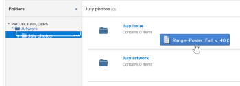

# Vincular documentos de aplicativos externos

Você pode vincular documentos e pastas ao Adobe Workfront a partir das seguintes fontes:

<table style="table-layout:auto"> 
 <col> 
 <col> 
 <tbody> 
  <tr> 
   <td role="rowheader">Fornecedores existentes de documentos em nuvem de terceiros</td> 
   <td>Isso inclui: 
    <ul> 
     <li>Box</li> 
     <li>Dropbox</li> 
     <li>Dropbox Business</li> 
     <li>WebDAM</li> 
     <li>Microsoft OneDrive</li> 
     <li>Microsoft SharePoint</li> 
     <li>Google Drive</li> 
    </ul></td> 
  </tr> 
  <tr> 
   <td role="rowheader">Prova do Workfront </td> 
   <td>Você pode disponibilizar provas que foram originalmente criadas no Workfront Proof no Workfront. É necessário um Pro Workfront Plan ou superior para usar esse recurso. Para obter mais informações sobre os vários planos disponíveis, consulte <a href="https://www.workfront.com/plans">Planos da Workfront</a>.</td> 
  </tr> 
  <tr data-mc-conditions="QuicksilverOrClassic.Quicksilver"> 
   <td role="rowheader">Experience Manager Assets Essentials </td> 
   <td>Você pode vincular documentos ao Workfront a partir do Experience Manager Assets Essentials. Para obter mais informações, consulte <a href="../../documents/adobe-workfront-for-experience-manager-assets-essentials/workfront-for-aem-asset-essentials.md" class="MCXref xref"> Adobe Workfront para Experience Manager Assets Essentials</a>.</td> 
  </tr> 
  <tr> 
   <td role="rowheader">Workfront DAM </td> 
   <td>Isso requer uma compra adicional. </td> 
  </tr> 
  <tr> 
   <td role="rowheader">Outros provedores de documento (por meio de integrações de documento personalizadas)</td> 
   <td> 
É necessário um Pro Workfront Plan ou superior para usar esse recurso. Para obter mais informações sobre os vários planos disponíveis, consulte <a href="https://www.workfront.com/plans">Planos da Workfront</a>.
 </td> 
  </tr> 
 </tbody> 
</table>

Antes de vincular documentos ou pastas, o administrador do Workfront deve habilitar essa funcionalidade para cada provedor de documentos ou para uma integração de documento personalizada, conforme descrito em [Configurar integrações de documentos](../../administration-and-setup/configure-integrations/configure-document-integrations.md).

Você pode provar e aprovar documentos vinculados a um provedor de nuvem externo da mesma forma que faz isso com documentos carregados diretamente no Workfront. 

## Requisitos de acesso

Você deve ter o seguinte:

<table style="table-layout:auto"> 
 <col> 
 <col> 
 <tbody> 
  <tr> 
   <td role="rowheader">Plano Adobe Workfront*</td> 
   <td> 
 Qualquer Um
 </td> 
  </tr> 
  <tr> 
   <td role="rowheader">Licenças Adobe Workfront*</td> 
   <td> 
Solicitação ou superior
 </td> 
  </tr> 
  <tr> 
   <td role="rowheader">Configurações de nível de acesso*</td> 
   <td> 
Editar acesso a documentos
 
Observação: Caso ainda não tenha acesso, pergunte ao administrador do Workfront se ele definiu restrições adicionais em seu nível de acesso. Para obter informações sobre como um administrador do Workfront pode modificar seu nível de acesso, consulte <a href="../../administration-and-setup/add-users/configure-and-grant-access/create-modify-access-levels.md" class="MCXref xref">Criar ou modificar níveis de acesso personalizados</a>.
 </td> 
  </tr> 
 </tbody> 
</table>

&#42;Para descobrir qual plano, tipo de licença ou acesso você tem, entre em contato com o administrador da Workfront.

## Armazenamento de documentos

Os documentos vinculados ao Workfront de um aplicativo externo são armazenados com o provedor de nuvem externo, não no Workfront.

As seguintes exceções se aplicam:

* Quando fornecido pelo serviço de documento, miniaturas e imagens de visualização podem ser armazenadas nos servidores da Workfront.
* Ao usar a prova no Workfront, o documento é copiado e adicionado aos servidores de prova. 

## Vincular um documento de um aplicativo externo ao Workfront

Você pode vincular documentos existentes a um provedor de nuvem externo. Isso inclui quaisquer documentos compartilhados.

* [Pré-requisitos](#prerequisites)
* [Vincular um documento externo ao Workfront](#link-an-external-document-to-workfront)
* [Adicionar uma nova versão de um documento vinculado](#add-a-new-version-of-a-linked-document)
* [Vincular documentos de prova do Workfront](#link-workfront-proof-documents)
* [Criar um documento do Google a partir do Workfront](#create-a-google-document-from-within-workfront)

### Pré-requisitos {#prerequisites}

Antes de vincular documentos ou pastas, o administrador do Workfront deve habilitar essa funcionalidade para cada provedor de documentos ou para uma integração de documento personalizada, conforme descrito em [Configurar integrações de documentos](../../administration-and-setup/configure-integrations/configure-document-integrations.md).

### Vincular um documento externo ao Workfront {#link-an-external-document-to-workfront}

Você pode vincular documentos ao Workfront a partir de um aplicativo externo, como o Google e o Microsoft OneDrive.

>[!IMPORTANT]
>
>O Dropbox armazena documentos com base no caminho do arquivo. Por causa disso, se um arquivo vinculado ao Dropbox for movido, renomeado ou excluído, ele se tornará inacessível no Workfront.

1. Vá para o **Documentos** no Workfront, onde deseja obter o documento.
1. Clique em **Adicionar novo**, em seguida, clique no provedor de documentos externos, onde deseja vincular documentos ao Workfront.

   Por exemplo, para vincular documentos do Dropbox, clique em **De Dropbox**.

   Os provedores externos já autorizados são exibidos no topo da lista.

1. (Condicional) Se você for solicitado a fazer logon no serviço externo, digite suas credenciais de logon para o serviço na caixa exibida, em seguida, clique em **Fazer logon**.
1. (Condicional) Se você for solicitado a autorizar o aplicativo externo, clique no botão **Autorizar** botão.

   Você precisa fazer isso apenas uma vez.

1. Na caixa de pesquisa do **Vincular arquivos e pastas externos** for exibida, digite o nome do item que deseja procurar e pressione **Enter** para ver todos os resultados do aplicativo externo, independentemente da pasta em que eles estão armazenados.

   Ou

   Procure e selecione os documentos que deseja vincular.

   Embora seja possível selecionar vários documentos, somente os documentos selecionados na exibição atual serão vinculados. Por exemplo, se você selecionar um documento e, em seguida, entrar em uma pasta, o documento selecionado originalmente não será vinculado.

1. (Condicional) Se você for um cliente do Workfront DAM, clique no botão **Miniatura** ícone para exibir arquivos como imagens em miniatura.

   >[!NOTE]
   Os clientes do Workfront DAM podem visualizar miniaturas ao vincular documentos do Workfront DAM. As miniaturas também podem ser exibidas para clientes do Workfront DAM para outros serviços, como Dropbox e Box. No entanto, a visualização de miniaturas para serviços diferentes do Workfront DAM no Workfront não é suportada e as miniaturas nunca são exibidas ao vincular documentos do SharePoint ou do Google Drive.

1. Clique em **Link**.

   No Workfront, o ícone do provedor de nuvem é exibido ao lado dos documentos.

   >[!NOTE]
   Para documentos vinculados à Caixa, o link para o documento na Caixa não é exibido até que você atualize a página.

### Adicionar uma nova versão de um documento vinculado {#add-a-new-version-of-a-linked-document}

Você pode adicionar uma nova versão de um documento vinculado ao Workfront a partir de um aplicativo externo.

1. Vá para o **Documentos** área em que o documento está vinculado e, em seguida, selecione o documento vinculado.

   >[!IMPORTANT]
   O documento deve estar fora de uma pasta vinculada para criar uma nova versão.

1. Clique em **Adicionar novo** > **Versão**, em seguida, clique no provedor de documento externo.

   Por exemplo, para vincular uma nova versão de um documento a partir do Dropbox, clique em **De Dropbox**.

   Os provedores externos já autorizados são exibidos no topo da lista.

1. (Condicional) Se você for solicitado a fazer logon no serviço externo, digite suas credenciais de logon para o serviço na caixa exibida, em seguida, clique em **Fazer logon**.
1. (Condicional) Se você for solicitado a autorizar o aplicativo externo, clique em **Autorizar**.

   Você precisa fazer isso apenas uma vez.

1. Na caixa de pesquisa do **Vincular arquivos e pastas externos** for exibida, digite o nome do item que deseja procurar e pressione **Enter** para ver todos os resultados do aplicativo externo, independentemente da pasta em que eles estão armazenados.

   Ou

   Procure e selecione os documentos que deseja vincular.

   Você pode selecionar vários documentos; no entanto, somente os documentos selecionados na exibição atual são vinculados. Por exemplo, se você selecionar um documento e, em seguida, entrar em uma pasta, o documento selecionado originalmente não será vinculado.

1. (Condicional) Se você for um cliente do Workfront DAM, clique no botão **Miniatura** ícone para exibir arquivos como imagens em miniatura.

   >[!NOTE]
   Os clientes do Workfront DAM podem visualizar miniaturas ao vincular documentos do Workfront DAM. As miniaturas também podem ser exibidas para clientes do Workfront DAM para outros serviços, como Dropbox e Box. No entanto, a visualização de miniaturas para serviços diferentes do Workfront DAM no Workfront não é suportada e as miniaturas nunca são exibidas ao vincular documentos do SharePoint ou do Google Drive.

1. Clique em **Link**.

   No Workfront, o ícone do provedor de nuvem é exibido ao lado dos documentos, indicando que ele está vinculado ao provedor de nuvem externo.

   >[!NOTE]
   Para documentos vinculados à Caixa, o link para o documento na Caixa não é exibido até que você atualize a página.

Para obter informações sobre como adicionar a nova versão de um documento que você carregou no Workfront de seu sistema de arquivos, consulte [Adicionar documentos ao Adobe Workfront a partir do seu sistema de arquivos](../../documents/adding-documents-to-workfront/add-documents-from-file-system.md#adding-new-versions-of-documents) em [Adicionar documentos ao Adobe Workfront a partir do seu sistema de arquivos](../../documents/adding-documents-to-workfront/add-documents-from-file-system.md).

### Vincular documentos de prova do Workfront {#link-workfront-proof-documents}

Você pode vincular provas ao Workfront que existiam originalmente na Workfront Proof. Quando você vincula uma prova do Workfront Proof, todos os comentários e outros metadados associados à prova ficam disponíveis no Workfront. 

Você pode vincular somente as provas para as quais tem acesso de Exibição na Workfront Proof.

1. Vá para o **Documentos** no Workfront, onde deseja obter o documento.
1. Clique em **Adicionar novo**, depois clique em **Da Workfront Proof**.

   >[!NOTE]
   As opções nesse menu podem variar dependendo de quais provedores de terceiros estão configurados em seu ambiente.

1. No **Link** provas **from** A caixa Prova do Workfront que aparece começa a digitar o nome da prova que deseja disponibilizar no Workfront.

   A lista é filtrada à medida que você digita.

1. Selecione até 10 provas para vincular.

   Qualquer nome de prova esmaecido não está disponível para vincular, porque a prova já está associada a um documento no Workfront.

1. Clique em **Link**.

   A versão mais recente da prova está vinculada ao Workfront. Ao abrir a prova, todas as versões estão disponíveis no visualizador de prova.

### Criar um documento do Google a partir do Workfront {#create-a-google-document-from-within-workfront}

Você pode criar um novo documento do Google no Workfront. Não é possível criar novos documentos no Workfront para outros provedores de nuvem.

1. Vá para o **Documentos** no Workfront, onde deseja obter o documento.
1. Clique em **Adicionar novo** > **Arquivo Google** e selecione o tipo de documento do Google que deseja criar.

1. Selecione o tipo de Google Doc que deseja criar.
1. Se a variável **Adicionar conta da unidade Google** for exibida, clique em **Autorizar unidade do Google**.

   Um Documento Google é adicionado ao **Documentos** guia .

   >[!NOTE]
    Minha unidade e compartilhada comigo exibem dois resultados diferentes. Se não conseguir localizar um arquivo em Minha unidade, verifique a pasta Compartilhado comigo.

## Atualizar e vincular um documento do Workfront a um provedor de nuvem externo

Você pode fazer upload e vincular um documento do Workfront a um provedor de nuvem externo. Isso move o armazenamento do documento do Workfront para o provedor de nuvem externo. Quando o documento é alterado no aplicativo externo, ele é atualizado automaticamente no Workfront.

Os usuários sem acesso ao Workfront podem ver o documento no aplicativo externo se tiverem acesso ao aplicativo.

1. Selecione um documento que seja carregado no Workfront.
1. Clique em **Mais** >**Enviar para**, em seguida, selecione o provedor de nuvem que deseja armazenar o documento vinculado.

   Também pode utilizar o menu Mais  na página Detalhes do documento para fazer isso.

1. Selecione a pasta no aplicativo do provedor onde deseja armazenar o documento.

   Pode ser qualquer pasta no aplicativo do provedor, incluindo uma pasta compartilhada.

1. Clique em **Salvar**.

   O logotipo do provedor externo é exibido ao lado do nome do documento para indicar que o documento agora está vinculado ao Workfront e armazenado pelo provedor de nuvem externo.

   

## Pastas de links

Ao vincular uma pasta entre o Workfront e um provedor de nuvem externo, a pasta e todo o seu conteúdo são vinculados. Se usuários sem acesso ao Workfront adicionarem, removerem e modificarem arquivos do aplicativo de documento externo, suas alterações serão sincronizadas com o Workfront. As seções a seguir descrevem como vincular pastas e subpastas:

* [Direitos de acesso à pasta](#folder-access-rights)
* [Vincular uma ou mais pastas externas](#link-one-or-more-external-folders)
* [Adicionar subpastas a uma pasta vinculada](#add-subfolders-to-a-linked-folder)

### Direitos de acesso à pasta {#folder-access-rights}

Ao sincronizar o conteúdo da pasta de um aplicativo de documento externo, o Workfront usa as credenciais do usuário que vinculou originalmente a pasta. Isso resulta na seguinte experiência do usuário:

* Se os usuários não tiverem acesso para exibir arquivos e pastas no aplicativo externo, mas tiverem acesso para exibir a pasta vinculada via Workfront, eles poderão exibir apenas os nomes dos arquivos e pastas no Workfront, não seu conteúdo.
* Quando alguém acessa o conteúdo dentro de uma pasta vinculada no Workfront (como uma subpasta em uma pasta vinculada) que foi vinculada ao Workfront por outro usuário, o conteúdo é sincronizado com o Workfront usando as credenciais de logon do Workfront do usuário que vinculou originalmente a pasta, não as credenciais do usuário que está acessando o conteúdo.

>[!IMPORTANT]
* Se o usuário que vinculou originalmente a pasta for removido do sistema Workfront, os usuários não poderão mais acessar o conteúdo na pasta vinculada por meio do Workfront. Nesse caso, a pasta deve ser vinculada novamente por um usuário ativo do Workfront com direitos à pasta no aplicativo externo.
* Se o usuário que vinculou uma pasta não tiver mais acesso ao aplicativo externo, o Workfront não poderá mais acessar o conteúdo da pasta. Isso pode acontecer, por exemplo, se o usuário que vinculou originalmente a pasta sair da empresa. Para garantir o acesso contínuo, um usuário com acesso à pasta deve vincular novamente a pasta.

### Vincular uma ou mais pastas externas {#link-one-or-more-external-folders}

1. Vá para a área no Workfront onde deseja inserir a pasta e clique em  **Documentos**  no painel esquerdo .

1. Clique em **Adicionar novo**, em seguida, clique no provedor de documento externo do qual deseja vincular uma pasta ao Workfront.
1. (Condicional) Se você ainda não tiver autorizado o serviço externo, especifique suas credenciais de logon para o provedor externo e clique em **Fazer logon**.

   Os provedores externos já autorizados são exibidos no topo da lista.

1. No **Vincular arquivos e pastas externos** for exibida, procure e selecione as pastas que deseja vincular.

   Ou

   Digite o nome da pasta que deseja pesquisar e pressione **Enter**.

   É possível selecionar várias pastas; no entanto, somente as pastas que estão selecionadas na exibição atual são vinculadas. Por exemplo, se você selecionar uma pasta e, em seguida, entrar em uma pasta, a pasta selecionada originalmente não será vinculada.

   >[!NOTE]
   Ao vincular pastas a partir do Google Drive, você só pode vincular pastas que estão na unidade pessoal (Minha unidade) e na Unidade de equipe. Não é possível vincular pastas da área Compartilhado comigo .

1. Clique em **Link**.

   No Workfront, o logotipo do provedor de nuvem é exibido ao lado da pasta, indicando que ele está vinculado ao provedor de nuvem externo.

1. (Opcional) Para renomear a pasta de forma que o nome da pasta no Workfront seja diferente do nome da pasta no aplicativo do documento externo, selecione a pasta no **Pastas** clique no menu Mais   que é exibido ao lado do nome da pasta e, em seguida, clique em **Renomear**.

   

Isso não renomeia a pasta no aplicativo externo.

### Adicionar subpastas a uma pasta vinculada  {#add-subfolders-to-a-linked-folder}

Você pode criar uma nova pasta dentro de uma pasta vinculada existente. Também é possível arrastar outra pasta para uma pasta vinculada existente.

1. Para criar uma nova pasta em uma pasta vinculada existente, vá para a pasta existente e crie a nova pasta conforme descrito em [Criar pastas de documento](../../documents/organizing-documents/create-documents-folder.md).

   Ou

   Para arrastar uma pasta existente para uma pasta vinculada existente, vá para a área Documents onde deseja a subpasta e arraste-a para a pasta vinculada.

   

   >[!NOTE]
   As seguintes limitações se aplicam ao arrastar uma pasta Workfront existente para uma pasta vinculada:
   * A pasta que você está arrastando ainda não pode ser vinculada e não pode conter nenhum conteúdo que já esteja vinculado.
   * A pasta (incluindo seu conteúdo) que você está arrastando não pode exceder 50 MB.

## Adicionar um documento a uma pasta vinculada

Ao adicionar um documento a uma pasta vinculada pelo Workfront, ele é adicionado automaticamente como um documento vinculado.

1. No **Documentos** arraste o documento para uma pasta vinculada.

   <!--
   
 Selection box is wonky on the left 

   -->

   Ou

   Selecione a pasta vinculada à qual deseja inserir o documento, clique em **Adicionar novo > Documento**, em seguida, navegue até o documento e adicione-o à pasta.

   Uma nova versão do documento é criada automaticamente no aplicativo externo e vinculada ao Workfront.

## Excluir um documento ou pasta vinculado

Ao excluir um documento ou pasta vinculado do aplicativo externo, o documento ou a pasta permanecerá no sistema Workfront até que você também o exclua do Workfront.

1. Selecione o documento ou a pasta vinculada e clique em **Excluir**.
1. Na caixa de confirmação exibida, clique em **Sim, desvincule-o**.

   O documento está desvinculado do site do Workfront. Ela não é afetada no aplicativo externo.

## Sobre a renomeação de documentos e pastas vinculados

Ao renomear um documento ou pasta vinculado, a alteração é visível somente no aplicativo em que é feita. Por exemplo, se você renomear um documento vinculado no Workfront, o novo nome ficará visível somente no Workfront.

Se desejar que o nome corresponda no Workfront e no aplicativo externo, é necessário renomeá-lo em ambos os lugares.

>[!IMPORTANT]
Não renomeie um documento no Workfront que esteja vinculado ao Dropbox; ao fazer isso, o arquivo no Workfront fica inacessível. Em vez disso, renomeie o arquivo no Dropbox e sincronize-o novamente, conforme descrito em [Vincular documentos de aplicativos externos](#synchronizing-changes-made-on-a-linked-document).
