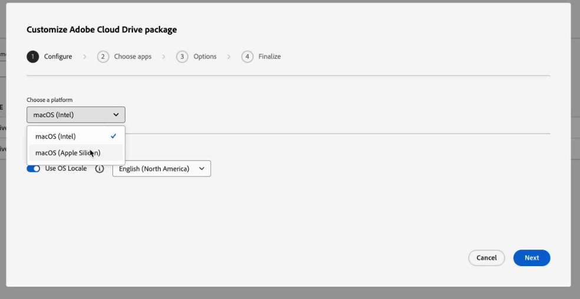
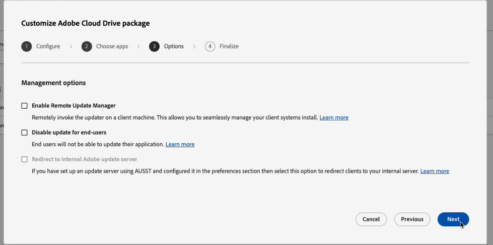
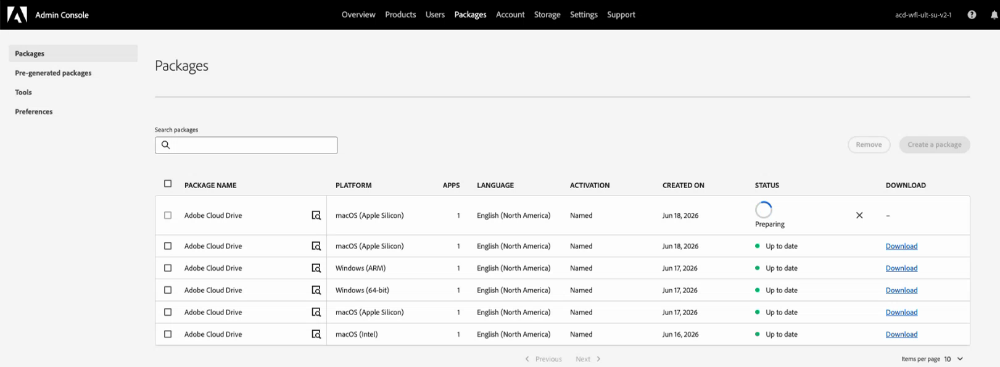

# Configurar e gerenciar o Adobe Cloud Drive para sua organização

Como administrador, você pode configurar o Adobe Cloud Drive para conceder aos usuários acesso direto à área de trabalho para seus arquivos de projeto no Adobe Cloud Storage, por meio do Finder no macOS e do Explorador de Arquivos no Windows. Este artigo aborda como habilitar o acesso no Adobe Admin Console, implantar o aplicativo nos dispositivos do usuário e gerenciar o acesso de forma contínua.

O Adobe Cloud Drive é um aplicativo de desktop corporativo que monta documentos do Workfront no armazenamento em nuvem da Adobe como um drive virtual nos computadores Mac e Windows dos usuários. Após a instalação, os usuários visualizam suas pastas de projeto do Workfront no Localizador ou no Explorador de arquivos e podem abrir, editar e salvar arquivos de projeto usando qualquer aplicativo de desktop, sem baixar arquivos manualmente ou trabalhando por meio de um navegador.

Para usar o Adobe Cloud Drive, sua organização deve estar no pacote Workflow Ultimate, com o armazenamento em nuvem do Adobe habilitado.

Para obter mais informações sobre o Adobe Cloud Drive, consulte os seguintes artigos:

* [Visão geral do Adobe Cloud Drive](/help/quicksilver/documents/adobe-cloud-drive/adobe-cloud-drive-overview.md)
* [Instalar o Adobe Cloud Drive](/help/quicksilver/documents/adobe-cloud-drive/install-adobe-cloud-drive.md)
* [Usar o Adobe Cloud Drive](/help/quicksilver/documents/adobe-cloud-drive/use-adobe-cloud-drive.md)

## Requisitos de acesso

+++ Expanda para visualizar os requisitos de acesso da funcionalidade neste artigo.

<table style="table-layout:auto"> 
 <col> 
 <col> 
 <tbody> 
  <tr> 
   <td role="rowheader">Versão do Adobe Workfront</td> 
   <td>Ultimate de fluxo de trabalho, com o Adobe Cloud Storage ativado</td> 
  </tr> 
  <tr> 
   <td role="rowheader">Direitos de admin da Adobe</td> 
   <td>Você deve ser um Administrador do sistema para o Workfront na Adobe Admin Console</td> 
  </tr> 
 </tbody> 
</table>

Para obter informações, consulte [Requisitos de acesso na documentação do Workfront](/help/quicksilver/administration-and-setup/add-users/access-levels-and-object-permissions/access-level-requirements-in-documentation.md).

+++

## Atribuir acesso ao Adobe Cloud Drive na Adobe Admin Console

O Adobe Cloud Drive é incluído no pacote Workflow Ultimate quando o armazenamento em nuvem do Adobe está ativado. Ele não aparece como um produto independente na seção **Produtos** do Admin Console. Em vez disso, ele é gerenciado por meio da seção **Funções** em **Usuários**.

Ao ir para **Usuários** > **Funções**, você verá duas funções associadas ao produto Workfront:

| Função | Atribuído automaticamente a | Relevância para o Adobe Cloud Drive |
| --- | --- | --- |
| **Membro** | Todos os usuários na organização | Contém a opção de recurso do Adobe Cloud Drive no nível da organização. Ativado por padrão. |
| **Usuário da ACD** | Ninguém, por padrão | Concede acesso individual quando a opção de nível da organização está desativada. |

### Controles de acesso

**Controle 1: controle de recursos no nível da organização (na função Membro)**

A função **Membro** é automaticamente atribuída a cada usuário em sua organização. Nesta função, há uma opção de recurso **Adobe Cloud Drive**. Quando essa opção está ativada, todos os usuários com uma licença do Workflow Ultimate podem acessar o Adobe Cloud Drive. Quando está desativado, nenhum usuário pode acessar o Adobe Cloud Drive, independentemente da sua licença.

A opção fica ativada por padrão quando o Adobe ativa o Adobe Cloud Drive para sua organização.

**Controle 2: função de usuário da ACD**

A função de **usuário da ACD** só é relevante quando a opção de nível de organização está desativada. Se você desativar a opção no nível da organização para executar um piloto controlado, ainda poderá conceder acesso a usuários específicos adicionando-os à função de **usuário da ACD**. Os usuários com essa função podem acessar o Adobe Cloud Drive mesmo quando a chave no nível da organização está desativada. Se a opção no nível da organização estiver ativada, a função de **usuário da ACD** não terá efeito.

**Requisito subjacente: licença de fluxo de trabalho do Ultimate**

O Adobe Cloud Drive só está disponível no pacote Workflow Ultimate. As opções de função não estão disponíveis em nenhum outro pacote.

A licença no pacote Workflow Ultimate pode ser qualquer tipo de licença: Standard, Light ou Contributor. Para obter informações sobre licenças, consulte [Visão geral sobre licenças](/help/quicksilver/administration-and-setup/add-users/how-access-levels-work/licenses-overview.md).

A tabela a seguir mostra como esses controles interagem:

| Alternância no nível da organização | Usuário na função de usuário da ACD | Licença do Workflow Ultimate | Acessar resultado |
| --- | --- | --- | --- |
| Ligado | Não obrigatório | Sim | Concedido |
| Desativado | Sim | Sim | Concedido |
| Desativado | Não | Sim | Negado |
| Ou | Ou | Não | Negado |

<!-- Sarah said to delete the second line. Commenting it out within the table messed up the display for the rest of the table, so keeping the line here until I can delete it. | On | Not required | No | Denied | -->

## Pré-requisitos

Verifique o seguinte antes de iniciar:

* Os usuários que você planeja provisionar têm licenças do Workfront Workflow atribuídas.
* Você analisou os [requisitos de rede](#network-requirements) com sua equipe de TI.
* Você redigiu a comunicação para enviar aos usuários explicando o que o Adobe Cloud Drive mostra (somente ativos de projeto do Workfront) e como instalá-la.

  >[!NOTE]
  >
  >Um usuário que tenha o acesso ativado, mas não tenha acesso a nenhum projeto do Workfront vê uma unidade montada vazia após o logon. Isso é esperado. O acesso ao projeto do Workfront é gerenciado separadamente no Workfront. Para obter informações, consulte [Compartilhar um projeto](/help/quicksilver/workfront-basics/grant-and-request-access-to-objects/share-a-project.md).
  >
  >Além disso, o direito ao Creative Cloud deve estar na mesma organização IMS que a Workfront para que os projetos apareçam no drive.

## Configuração do acesso no Adobe Admin Console

O acesso ao Adobe Cloud Drive é configurado no Adobe Admin Console. Escolha a opção que corresponde à sua estratégia de implantação.

### Opção A: ativar o acesso para toda a organização

Quando a Adobe ativa o Adobe Cloud Drive para sua organização, a opção de recurso no nível da organização é ativada por padrão e todos os usuários têm acesso imediatamente. Use este procedimento para confirmar se o switch está ligado antes de implantar a aplicação.

1. Entre em [adminconsole.adobe.com](https://adminconsole.adobe.com/).
1. Clique em **Usuários** na barra de navegação superior.
1. Clique em **Funções** no painel esquerdo.
1. Clique em **Membro** na lista de funções.
1. No painel **Membro**, que é aberto à direita, confirme se a **Adobe Cloud Drive** aparece em **Permissões** e se a opção está ativada.

   

   >[!NOTE]
   >
   >Se o Adobe Cloud Drive não aparecer nas **Permissões** da função **Membro**, o Adobe Cloud Drive pode ainda não estar ativado para a sua organização. Entre em contato com o Suporte da Adobe para confirmar.

1. Clique em **Salvar** se tiver feito alguma alteração.

### Opção B: Ativar o acesso para um grupo específico de usuários

Use essa opção quando quiser limitar o acesso a um conjunto definido de usuários, por exemplo, durante um teste piloto antes de uma implantação mais ampla. Isso envolve desativar a opção no nível da organização e, em seguida, adicionar seus usuários piloto à função de **usuário da ACD**.

>[!IMPORTANT]
>
>Desativar a opção no nível da organização remove imediatamente o acesso ao Adobe Cloud Drive para todos os usuários em sua organização, incluindo os usuários que estão conectados no momento. Você deve desativar o recurso no nível da organização e adicionar os usuários pilotos na mesma sessão.

Para desativar o recurso no nível da organização:

1. Entre em [adminconsole.adobe.com](https://adminconsole.adobe.com/).
1. Clique em **Usuários** na barra de navegação superior e em **Funções** no painel esquerdo.
1. Clique em **Membro** na lista de funções.
1. No painel **Membro**, localize a **Unidade da Adobe Cloud** em **Permissões** e desative-a.
1. Clique em **Salvar**.

Para adicionar usuários piloto à função de usuário da ACD:

1. No painel esquerdo, clique em **Funções** para retornar à lista de funções.
1. Clique em **usuário da DAC** na lista de funções.

   

1. Clique em **Adicionar usuários**.
1. Insira o endereço de email de cada usuário piloto.
1. Clique em **Salvar**.

   Os usuários adicionados à função de **usuário da ACD** obtêm acesso imediatamente. Os usuários que não estão nessa função permanecem sem acesso até que você os adicione à função ou ative novamente a alternância no nível da organização.

   >[!TIP]
   >
   >Para expandir o acesso ao longo do tempo, retorne à função de **usuário da ACD** e adicione usuários conforme necessário. Quando estiver pronto para uma implantação completa, ative novamente a alternância no nível da organização na função **Membro**. Quando a opção de nível da organização estiver ativada, a função de **usuário da ACD** não terá efeito e não precisará ser mantida.

## Implantar o aplicativo do Adobe Cloud Drive

A configuração do acesso no Adobe Admin Console estabelece o direito de. A implantação do aplicativo o instala no dispositivo do usuário. Estas são duas etapas obrigatórias separadas.

O Adobe Cloud Drive é um aplicativo independente. Ele não é distribuído pelo aplicativo de desktop do Creative Cloud e não aparece no gerenciador de pacotes do Creative Cloud. No entanto, o perfil de usuário do Adobe Cloud Drive está vinculado ao direito do aplicativo Creative Cloud. Isso significa que, para que um usuário acesse projetos do Workfront na unidade, os aplicativos do Creative Cloud devem ter direito na mesma organização IMS que o Workfront.

Escolha o método de implantação que corresponde às práticas de gerenciamento de dispositivos de sua organização.

### Método A: implantação gerenciada por TI através de pacotes Admin Console

Use este método quando sua organização usar ferramentas de implantação centralizadas, como Microsoft Intune, SCCM, Jamf Pro ou Apple Remote Desktop. Esse é o fluxo de trabalho padrão de implantação corporativa do Adobe e segue o mesmo processo de criação de pacotes usado para outros aplicativos da Adobe.

Para criar o pacote na Adobe Admin Console:

1. Entre em [adminconsole.adobe.com](https://adminconsole.adobe.com/).
1. Clique em **Pacotes** na barra de navegação superior.
1. Clique em **Pacotes pré-gerados** no painel esquerdo.
1. Clique na guia **Modelos**.

   O Adobe Cloud Drive é exibido duas vezes na lista de modelos: uma para macOS e outra para Windows.

   

1. Localize a linha **Adobe Cloud Drive** que corresponde à plataforma de destino e clique no ícone de detalhes nessa linha.

   Um painel lateral exibe os metadados do pacote.

   

1. Clique em **Personalizar**.

   O assistente de personalização de pacotes é aberto com quatro etapas: **Configurar**, **Escolher aplicativos**, **Opções** e **Finalizar**.

1. Na etapa **Configurar**, selecione a arquitetura dos computadores de destino, confirme a configuração de idioma e clique em **Avançar**.

   * **macOS:** Escolha **macOS (Intel)** ou **macOS (Apple Silicon)**.
   * **Windows:** Escolha **Windows (64 bits)** ou **Windows (ARM)**.

   

1. Na etapa **Escolher aplicativos**, confirme se o Adobe Cloud Drive está selecionado com a versão desejada.

   O Adobe Cloud Drive é pré-selecionado com a versão mais recente disponível. Para usar uma versão anterior, clique em **Outras versões** e selecione **Versões anteriores**.

   

1. Clique em **Próximo**.
1. Na etapa **Opções**, clique em **Avançar** sem selecionar nenhuma opção.

   Essas configurações se aplicam aos aplicativos de desktop do Creative Cloud e não se aplicam ao Adobe Cloud Drive.

   

1. Na etapa **Finalizar**, digite um nome para o pacote e selecione **Pacote simples**.
1. Revise o resumo e clique em **Criar pacote**.

   

   O assistente é fechado. O novo pacote aparece na parte superior da lista de pacotes com um status **Preparando** enquanto está sendo compilado. Quando estiver pronto, o status será alterado para **Atualizado** e um link de download será exibido.

   

1. Clique em **Baixar** e salve o arquivo de pacote no local escolhido.

### Método B: download direto por autoatendimento da Distribuição de software

Use esse método para organizações menores, para dispositivos autogerenciados ou ao direcionar usuários individuais para instalar o aplicativo.

Antes de começar, confirme o seguinte:

* O acesso é ativado para os usuários na Adobe Admin Console.
* Os usuários foram notificados com o URL de Distribuição de software e instruções de logon.
* A conectividade de rede para os pontos de extremidade necessários foi verificada. Para obter mais informações, consulte [Requisitos de rede](#network-requirements) neste artigo.

Para autoinstalar o Adobe Cloud Drive:

1. Confirme se o acesso está ativado para o usuário na Adobe Admin Console.
1. Direcione o usuário para [experience.adobe.com/#/downloads](https://experience.adobe.com/#/downloads).

   >[!NOTE]
   >
   >Os usuários devem ter o acesso ao Adobe Cloud Drive habilitado no Adobe Admin Console para ver o instalador do Adobe Cloud Drive. Os usuários sem acesso não verão o instalador listado.

1. O usuário faz logon com sua Enterprise ID ou Federated ID. O instalador do Adobe Cloud Drive é exibido na guia **Workfront** da Distribuição de software.
1. O usuário baixa o instalador para sua plataforma e segue as etapas de instalação em [Instalar o Adobe Cloud Drive](/help/quicksilver/documents/adobe-cloud-drive/install-adobe-cloud-drive.md).

   

Após a implantação, conclua esta verificação em um dispositivo de teste:

1. Inicie o Adobe Cloud Drive na pasta **Aplicativos** (macOS) ou no menu **Iniciar** (Windows).
1. Faça logon com uma conta de usuário que tenha o acesso ao Adobe Cloud Drive habilitado na Adobe Admin Console.
1. Confirme se as pastas do projeto do Workfront aparecem no drive montado no Finder ou no Explorador de Arquivos.

   >[!NOTE]
   >
   >Um usuário que faz logon com êxito, mas não vê pastas, não tem acesso a projetos da Workfront. Adicione o usuário a um projeto no Workfront para preencher a unidade.

1. Navegue até uma pasta de projeto e crie um pequeno arquivo de teste.
1. Abra o Workfront em um navegador e confirme se o arquivo de teste aparece no projeto correspondente.
1. Exclua o arquivo de teste após a verificação.

## Gerenciar o acesso contínuo do usuário ao Adobe Cloud Drive

Assim que sua organização estiver usando o Adobe Cloud Drive, siga estas etapas para adicionar novos usuários ou remover usuários que não precisam mais de acesso.

### Adicionar um novo usuário

Se a opção de nível da organização estiver ativada, nenhuma ação do Adobe Admin Console será necessária. Peça ao usuário para baixar e instalar o Adobe Cloud Drive. Se um usuário licenciado ainda não conseguir acessar o Adobe Cloud Drive, entre em contato com o Suporte da Adobe para confirmar se sua conta foi migrada corretamente.

Se a chave do nível da organização estiver desativada:

1. Entre em [adminconsole.adobe.com](https://adminconsole.adobe.com/).
1. Clique em **Usuários** na barra de navegação superior e em **Funções** no painel esquerdo.
1. Clique em **usuário da DAC** na lista de funções.
1. Clique em **Adicionar usuários**, digite o endereço de email do usuário e clique em **Salvar**.

### Remover um usuário

Se a opção no nível da organização estiver ativada, qualquer usuário licenciado terá acesso ao Adobe Cloud Drive. Para remover o acesso de um usuário específico sem remover a licença do Workfront, desligue a chave de nível de organização e adicione todos os outros usuários à função de **usuário da ACD**, excluindo o usuário que deseja bloquear.

Se a chave no nível da organização estiver desligada e o usuário estiver na função de **usuário da ACD**:

1. Entre em [adminconsole.adobe.com](https://adminconsole.adobe.com/).
1. Clique em **Usuários** na barra de navegação superior e em **Funções** no painel esquerdo.
1. Clique em **usuário da DAC** na lista de funções.
1. Selecione o usuário e clique em **Remover**.

O usuário perde o acesso à unidade montada imediatamente. Os arquivos armazenados no Workfront não são excluídos. O cache local do usuário permanece no dispositivo até que ele desinstale o aplicativo.

>[!IMPORTANT]
>
>Remover um usuário da função de **usuário da ACD** não o remove da Workfront ou de qualquer projeto da Workfront. Gerencie o acesso ao projeto do Workfront separadamente.

## Gerenciar o acesso ao projeto do Workfront

O Adobe Cloud Drive mostra aos usuários os projetos do Workfront aos quais eles têm acesso. O acesso ao projeto é gerenciado no Workfront, não no Adobe Admin Console. Um usuário que tem acesso ao Adobe Cloud Drive, mas não pertence a nenhum projeto do Workfront, vê uma unidade montada vazia após o logon. Esse é o comportamento esperado.

Para obter informações sobre como gerenciar o acesso ao projeto, consulte [Gerenciar projetos](/help/quicksilver/manage-work/projects/manage-projects/manage-projects-overview.md) e [Compartilhar um projeto](/help/quicksilver/workfront-basics/grant-and-request-access-to-objects/share-a-project.md).

## Requisitos de rede

O Adobe Cloud Drive exige acesso HTTPS de saída (porta 443) a um conjunto de endpoints do Adobe. Nenhuma regra de firewall de entrada é necessária. Para obter a lista de pontos de extremidade, consulte [pontos de extremidade de rede do Adobe](https://helpx.adobe.com/in/enterprise/kb/network-endpoints.html).

O Adobe Cloud Drive lê a configuração de proxy no nível do sistema no macOS e no Windows. Proxies autenticados são suportados.

## Considerações de segurança

### Autenticação

O Adobe Cloud Drive autentica usuários por meio do Adobe IMS (Identity Management System). Os usuários fazem logon com a Enterprise ID ou a Federated ID. Se sua organização usar o SSO configurado na Adobe Admin Console, os usuários se autenticarão por meio do provedor de identidade e não precisarão de credenciais separadas da Adobe.

>[!NOTE]
>
>O Adobe Cloud Drive não oferece suporte a Adobe IDs pessoais (contas criadas individualmente ou não) em implantações corporativas. Os usuários devem fazer logon com uma Enterprise ID ou Federated ID no diretório de sua organização.

### Dados em trânsito e em repouso

* Toda a comunicação entre o Adobe Cloud Drive e os serviços da Adobe usa TLS 1.2 ou superior.
* Os arquivos armazenados no armazenamento em nuvem do Adobe são criptografados em repouso.
* Os arquivos armazenados em cache localmente usam criptografia de disco no nível do SO quando o FileVault (macOS) ou o BitLocker (Windows) está habilitado no dispositivo.

### Controle de acesso a arquivos

O acesso a arquivos segue as permissões de projetos do Workfront. Os usuários veem e interagem somente com projetos para os quais têm permissões, conforme permitido pelo nível de acesso do Workfront.

A pasta raiz de cada projeto do Workfront é somente leitura na visualização da área de trabalho. Os usuários não podem renomear, mover ou excluir uma pasta raiz do projeto do Localizador ou do Explorador de Arquivos. Eles podem criar pastas, subpastas e arquivos a qualquer profundidade dentro de uma pasta do projeto, sujeito às suas permissões do Workfront.

## Solução de problemas comuns

Para obter as etapas de solução de problemas do usuário final, consulte [Solução de problemas da Adobe Cloud Drive](/help/quicksilver/documents/adobe-cloud-drive/troubleshoot-adobe-cloud-drive.md). Os problemas listados abaixo são específicos para administradores.

### O usuário não consegue encontrar o instalador do Adobe Cloud Drive na Distribuição do software

**Causa:** o acesso à Adobe Cloud Drive não está habilitado para o usuário na Adobe Admin Console.

**Resolução:**

1. Entre em [adminconsole.adobe.com](https://adminconsole.adobe.com/) e clique em **Usuários**.
1. Procure o usuário e clique no nome dele.
1. Clique na guia **Funções** e verifique se a Adobe Cloud Drive está habilitada.

**Causa:** Todos os Aplicativos do Creative Cloud estão provisionados em uma organização IMS diferente da Workfront.

**Resolução:** nenhuma resolução disponível no momento.

### O usuário instalou o aplicativo e entrou, mas não vê pastas na unidade

**Causa:** o usuário não tem permissões para nenhum projeto do Workfront.

**Resolução:**

1. No Workfront, confirme se o usuário tem permissões para pelo menos um projeto.
1. Caso contrário, compartilhe um projeto com o usuário.
1. Peça ao usuário que aguarde até cinco minutos para que a pasta do projeto seja exibida.
1. Se a pasta ainda não aparecer após cinco minutos, peça para o usuário sair do Adobe Cloud Drive e reiniciá-lo.

### O usuário não pode entrar no Adobe Cloud Drive

**Causa:** a conta Adobe Admin Console do usuário está inativa ou sua identidade não está configurada corretamente.

**Resolução:**

1. Na Adobe Admin Console, clique em **Usuários** e procure o usuário.
1. Confirme se o status da conta do usuário é **Ativo**.
1. Confirme se o domínio de email do usuário é um domínio reivindicado no diretório do Admin Console.
1. Se sua organização usar SSO, confirme se a conta do usuário está ativa no provedor de identidade.
1. Peça ao usuário para tentar entrar novamente.

### Os arquivos não estão sendo sincronizados depois que o usuário salva

**Causa:** o arquivo não foi salvo explicitamente ou há um problema de conectividade de rede.

**Resolução:**

1. Confirme com o usuário que ele salvou o arquivo usando **Arquivo** > **Salvar** no aplicativo. Fechar um aplicativo ou depender do salvamento automático não aciona a sincronização.
1. Confirme se o usuário tem acesso à Internet e pode acessar `*.adobe.com` e `*.workfront.com`.
1. Solicite ao usuário que verifique um indicador de erro no ícone do Adobe Cloud Drive na barra de menus (macOS) ou na bandeja do sistema (Windows).
1. Se houver um erro, peça ao usuário para sair do Adobe Cloud Drive, reiniciá-lo e salvar o arquivo novamente.
1. Se o problema persistir, colete o log do aplicativo:

   * **macOS:** `~/Library/Logs/Adobe/AdobeCloudDrive/`
   * **Janelas:** `C:\Users\<username>\AppData\Local\Temp\Adobe\AdobeCloudDrive\`

### Uma cópia conflitante de um arquivo apareceu na pasta do projeto

**Causa:** dois usuários salvaram alterações no mesmo arquivo antes de qualquer versão ser sincronizada com a nuvem. O Adobe Cloud Drive preservou ambas as versões automaticamente.

A cópia conflitante usa este formato de nomenclatura: `filename (Conflicted copy from device_name on date_time).extension`
Por exemplo: `project_brief (Conflicted copy from jsmith's MacBook Pro on 2026-06-15-10-45-19).docx`

**Resolução:**

1. Pergunte a ambos os usuários qual versão é autoritativa.
1. Copie qualquer conteúdo necessário da cópia conflitante para o arquivo principal.
1. Exclua a cópia conflitante após reconciliar as duas versões.

   >[!NOTE]
   >
   >O Adobe Cloud Drive não usa o bloqueio de arquivos. Para evitar conflitos quando vários usuários editam o mesmo arquivo, coordene a edição por meio de atribuições de tarefas do Workfront ou workflows de aprovação antes que vários usuários acessem o mesmo arquivo do desktop.

### O usuário não pode criar uma pasta ou um arquivo no projeto

**Causa A:** O usuário está tentando criar uma pasta ou um arquivo no nível raiz do projeto. Atualmente, as pastas raiz do projeto são somente leitura no Adobe Cloud Drive. As pastas de nível raiz representam projetos Workfront, que são criados e gerenciados no Workfront.

**Resolução:**

1. Peça ao usuário para navegar em qualquer subpasta existente no projeto e criar o arquivo ou pasta lá.
1. Se o usuário precisar de uma nova pasta de nível superior dentro do projeto, peça-lhe para criá-la no Workfront primeiro. Em seguida, ele é exibido no Adobe Cloud Drive.

**Causa B:** O usuário não tem permissões de edição no projeto do Workfront.

**Resolução:**

1. No Workfront, verifique as permissões do usuário no projeto (**Exibir**, **Contribute** ou **Gerenciar**).
1. Atualize as permissões do usuário para **Contribute** ou **Gerenciar** se ele precisar criar ou editar arquivos.
