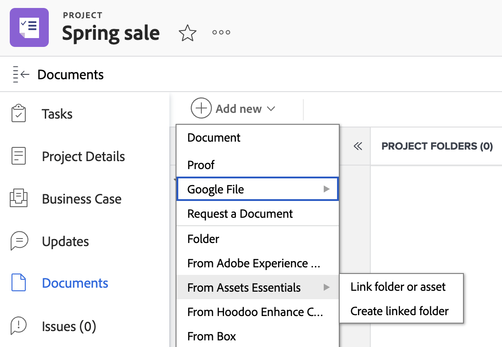

# Criar uma pasta vinculada ao Experience Manager Assets ou Assets Essentials

É possível criar uma pasta vinculada ao Experience Manager Assets ou ao Assets Essentials no Workfront. Como a pasta está vinculada, qualquer ativo adicionado à pasta será exibido automaticamente no Workfront e no Experience Manager. Não é necessário enviar manualmente o ativo se ele estiver em uma pasta vinculada.

Se um ativo for excluído ou movido de uma pasta vinculada dentro do Experience Manager Assets ou do Assets Essentials, a Workfront manterá uma cópia do ativo na área Projeto > Documentos.

>[!NOTE]
>
>Essa funcionalidade não está disponível na nova área Documentos. 
>Se sua organização usar o armazenamento em nuvem do Adobe, você verá a nova área Documentos ao acessar documentos no Workfront. A partir daí, você pode adicionar ativos do Experience Manager Assets ou do Assets Essentials, mas não poderá criar uma pasta vinculada.

## Requisitos de acesso

+++ Expanda para visualizar os requisitos de acesso da funcionalidade neste artigo.

<table>
  <tr>
   <td><strong>Pacote do Adobe Workfront</strong>
   </td>
   <td>Qualquer
   </td>
  </tr>
  <tr>
   <td><strong>licenças do Adobe Workfront</strong>
   </td>
   <td>
   
Padrão

   
Plano

   </td>
  </tr>
  <tr>
   <td><strong>Produtos adicionais</strong>
   </td>
   <td>Você deve ter o Experience Manager Assets as a Cloud Service ou o Assets Essentials e deve ser adicionado ao produto como usuário.
   </td>
  </tr>
  <tr>
   <td><strong>Permissões do Experience Manager</strong>
   </td>
   <td>Você deve ter acesso de gravação à pasta de destino na integração do Experience Manager.
   </td>
  </tr>
  <tr>
   <td><strong>Configurações de nível de acesso</strong>
   </td>
   <td>Você deve ser um administrador do Workfront para configurar uma integração com o Experience Manager. Após a configuração, os usuários com uma licença Padrão ou Plano podem configurar pastas vinculadas em projetos individuais.
   </td>
  </tr>
</table>

Para obter mais detalhes sobre as informações contidas nesta tabela, consulte [Requisitos de acesso na documentação do Workfront](/help/quicksilver/administration-and-setup/add-users/access-levels-and-object-permissions/access-level-requirements-in-documentation.md).

+++

## Pré-requisitos

Antes de começar,

* O administrador do Workfront deve configurar uma integração do Experience Manager. Para obter mais informações, consulte [Configurar a integração do Experience Manager Assets as a Cloud Service](/help/quicksilver/administration-and-setup/configure-integrations/configure-aacs-integration.md) ou [Configurar a integração do Experience Manager Assets Essentials](/help/quicksilver/documents/adobe-workfront-for-experience-manager-assets-essentials/setup-asset-essentials.md).

## Criar uma pasta vinculada

A pasta vinculada é criada no local especificado pelo administrador do Workfront quando ele configura a integração. Cada integração pode ter apenas um local de pasta para pastas vinculadas.

O nome da pasta vinculada é criado automaticamente com base no Portfolio, Programa, Projeto associado a ele e não pode ser alterado. Se o projeto não estiver associado a um Portfolio ou Programa, a pasta vinculada exibirá o nome do projeto e a data de criação.

>[!NOTE]
>
>Não é possível criar um novo documento ou versão de prova dentro de uma pasta vinculada.

Para criar uma pasta vinculada:

1. Vá para o Projeto onde deseja colocar a pasta.
1. Selecione **Adicionar novo** e vá para a integração do Experience Manager configurada pelo administrador.

   >[!NOTE]
   >
   >O administrador do Workfront pode escolher qualquer nome para essa integração, portanto, pode não mencionar especificamente o Experience Manager Assets ou o Assets Essentials.

1. Selecione **Criar pasta vinculada**. O sistema cria automaticamente uma pasta no Experience Manager com base no local especificado quando a integração foi configurada.
   
