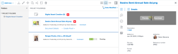

# Visualizar ou baixar um ativo vinculado do Experience Manager Assets ou Assets Essentials

Você pode visualizar ou baixar no Adobe Workfront um ativo vinculado do Experience Manager Assets ou do Assets Essentials.

## Requisitos de acesso

+++ Expanda para visualizar os requisitos de acesso da funcionalidade neste artigo.

<table style="table-layout:auto"> 
 <col> 
 <col> 
 <tbody> 
  <tr> 
   <td role="rowheader">Pacote do Adobe Workfront</td> 
   <td> 
 Qualquer
 </td> 
  </tr> 
  <tr> 
   <td role="rowheader">Licenças do Adobe Workfront</td> 
   <td>
   
Colaborador ou posterior

   
Solicitação ou posterior
 </td> 
  </tr> 
  <tr> 
   <td role="rowheader">Produtos adicionais</td> 
   <td>Você deve ter o Experience Manager as a Cloud Service ou o Assets Essentials e deve ser adicionado ao produto como usuário na Admin Console.</td> 
  </tr> 
  <tr> 
   <td role="rowheader">Configurações de nível de acesso</td> 
   <td> 
Editar acesso a documentos
  </td> 
  </tr> 
  <tr> 
   <td role="rowheader">Permissões de objeto</td> 
   <td> 
Exibir acesso ou superior
 </td> 
  </tr> 
 </tbody> 
</table>

Para obter mais detalhes sobre as informações contidas nesta tabela, consulte [Requisitos de acesso na documentação do Workfront](/help/quicksilver/administration-and-setup/add-users/access-levels-and-object-permissions/access-level-requirements-in-documentation.md).

+++

## Pré-requisitos

Antes de começar,

* O administrador do Workfront deve configurar uma integração do Experience Manager. Para obter mais informações, consulte [Configurar a integração do Experience Manager Assets as a Cloud Service](/help/quicksilver/administration-and-setup/configure-integrations/configure-aacs-integration.md) ou [Configurar a integração do Experience Manager Assets Essentials](/help/quicksilver/documents/adobe-workfront-for-experience-manager-assets-essentials/setup-asset-essentials.md).

## Exibir ou baixar um ativo vinculado

1. Localize o documento que deseja exibir ou baixar.
1. Na lista de documentos, selecione o documento.
1. No Resumo do documento à direita, passe o mouse sobre a miniatura na parte superior e escolha **Visualizar** ou **Baixar**.

   
