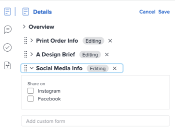

# Adicionar ou editar um formulário personalizado a um documento

É possível adicionar um formulário personalizado a um documento ou a uma versão do documento para capturar informações adicionais ou metadados específicos de seus ativos.

## Requisitos de acesso

Você deve ter o seguinte:

<table style="table-layout:auto"> 
 <col> 
 <col> 
 <tbody> 
  <tr> 
   <td role="rowheader">plano do Adobe Workfront*</td> 
   <td> 
 Qualquer
 </td> 
  </tr> 
  <tr> 
   <td role="rowheader">Licenças da Adobe Workfront*</td> 
   <td> 
Solicitação ou superior
 </td> 
  </tr> 
  <tr> 
   <td role="rowheader">Configurações de nível de acesso*</td> 
   <td> 
Editar acesso a documentos
 
Observação: se você ainda não tiver acesso, pergunte ao administrador do Workfront se ele definiu restrições adicionais em seu nível de acesso. Para obter informações sobre como um administrador do Workfront pode modificar seu nível de acesso, consulte <a href="../../administration-and-setup/add-users/configure-and-grant-access/create-modify-access-levels.md" class="MCXref xref">Criar ou modificar níveis de acesso personalizados</a>.
 </td> 
  </tr> 
  <tr> 
   <td role="rowheader">Permissões de objeto</td> 
   <td> 
Gerenciar acesso ao documento
 
Para obter informações sobre como solicitar acesso adicional, consulte <a href="../../workfront-basics/grant-and-request-access-to-objects/request-access.md" class="MCXref xref">Solicitar acesso aos objetos </a>.
 </td> 
  </tr> 
 </tbody> 
</table>

&#42;Para saber qual plano, tipo de licença ou acesso você tem, contate o administrador do Workfront.

## Pré-requisitos

* O formulário personalizado deve ser compartilhado com você

## Adicionar um formulário personalizado

Para adicionar um formulário personalizado a um documento:

1. Vá para o projeto, tarefa ou problema que contém o documento e selecione **Documentos**.
1. Localize o documento necessário.

1. Clique no ícone  do **Resumo** e localize a seção **Detalhes**.
1. Na caixa **Adicionar formulário personalizado**, comece a digitar e selecione um formulário personalizado. O formulário é salvo automaticamente no documento.

   >[!NOTE]
   >
   >Somente formulários personalizados ativos são exibidos no menu suspenso. Você pode adicionar até 10 formulários personalizados por documento. Se precisar criar um formulário personalizado, consulte [Criar um formulário com o designer de formulário](/help/quicksilver/administration-and-setup/customize-workfront/create-manage-custom-forms/form-designer/design-a-form/design-a-form.md).

## Editar um formulário personalizado

1. Vá para o projeto, tarefa ou problema que contém o documento e selecione **Documentos**.
1. Localize o documento necessário.

1. Clique no ícone  do **Resumo** e localize a seção **Detalhes** próxima à parte superior.
1. Clique em **Editar** no canto superior direito e expanda o formulário desejado.
1. Faça as alterações necessárias e clique em **Salvar**.

   
