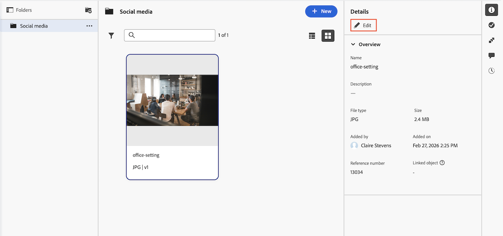

# Adicionar ou editar um formulário personalizado em um documento

É possível adicionar um formulário personalizado a um documento ou a uma versão do documento para capturar informações adicionais ou metadados específicos de seus ativos.

## Requisitos de acesso

+++ Expanda para visualizar os requisitos de acesso da funcionalidade neste artigo.

<table style="table-layout:auto"> 
 <col> 
 <col> 
 <tbody> 
  <tr> 
   <td role="rowheader">Pacote do Adobe Workfront</td> 
   <td> 
 Qualquer
 </td> 
  </tr> 
  <tr> 
   <td role="rowheader">Licenças do Adobe Workfront</td> 
   <td> 
   
Colaborador ou posterior

   
Solicitação ou posterior
 </td> 
  </tr> 
  <tr> 
   <td role="rowheader">Configurações de nível de acesso</td> 
   <td> 
Editar acesso a documentos
 </td> 
  </tr> 
  <tr> 
   <td role="rowheader">Permissões de objeto</td> 
   <td> 
Gerenciar o acesso ao documento
 </td> 
  </tr> 
 </tbody> 
</table>

Para obter mais detalhes sobre as informações contidas nesta tabela, consulte [Requisitos de acesso na documentação do Workfront](/help/quicksilver/administration-and-setup/add-users/access-levels-and-object-permissions/access-level-requirements-in-documentation.md).

+++

## Pré-requisitos

* O formulário personalizado deve ser compartilhado com você

## Adicionar um formulário personalizado na área de documentos herdados

Se sua organização utiliza o Workfront Storage herdado, você verá a área de documentos herdados ao acessar documentos no Workfront. Para obter mais informações sobre o Workfront Storage, consulte [Diferenças entre o Adobe Enterprise Storage e o Workfront Storage herdado](/help/quicksilver/review-and-approve-work/esm-overview.md#differences-between-adobe-enterprise-storage-and-legacy-workfront-storage).

Para adicionar um formulário personalizado a um documento:

1. Vá para o projeto, tarefa ou problema que contém o documento e selecione **Documentos**.
1. Localize o documento necessário.

1. Clique no ícone **Resumo** ícone  e localize a seção **Detalhes**.
1. Na caixa **Adicionar formulário personalizado**, comece a digitar e selecione um formulário personalizado. O formulário é salvo automaticamente no documento.

   >[!NOTE]
   >
   >Somente formulários personalizados ativos são exibidos no menu suspenso. Você pode adicionar até 10 formulários personalizados por documento. Se precisar criar um formulário personalizado, consulte [Criar um formulário personalizado](/help/quicksilver/administration-and-setup/customize-workfront/create-manage-custom-forms/form-designer/design-a-form/design-a-form.md).

## Editar um formulário personalizado na área de documentos herdados

1. Vá para o projeto, tarefa ou problema que contém o documento e selecione **Documentos**.
1. Localize o documento necessário.

1. Clique no ícone **Resumo** ícone  e localize a seção **Detalhes** próxima à parte superior.
1. Clique em **Editar** no canto superior direito e expanda o formulário desejado.
1. Faça as alterações necessárias e clique em **Salvar**.

   

## Adicionar um formulário personalizado na nova área de documento

Se sua organização usar armazenamento corporativo, você verá a nova área de documentos ao acessar documentos no Workfront. Para obter mais informações sobre o armazenamento corporativo, consulte [visão geral sobre o armazenamento corporativo da Adobe](/help/quicksilver/review-and-approve-work/esm-overview.md).

Para adicionar um formulário personalizado a um documento:

1. Vá para o projeto, tarefa ou problema que contém o documento e selecione **Documentos**.
1. Selecione o documento necessário.
1. Na seção **Detalhes** à direita, clique em **Editar**.
   
1. No campo **Forms Personalizado**, comece a digitar e selecione um formulário personalizado.
1. Clique em **Salvar**. O formulário personalizado é exibido na seção de detalhes.

## Editar um formulário personalizado na nova área de documento

1. Vá para o projeto, tarefa ou problema que contém o documento e selecione **Documentos**.
1. Selecione o documento necessário.
1. Na seção **Detalhes** à direita, clique em **Editar**.
   
1. Na seção **Forms Personalizado**, localize o formulário que deseja editar.
1. Faça as alterações necessárias e clique em **Salvar**.
