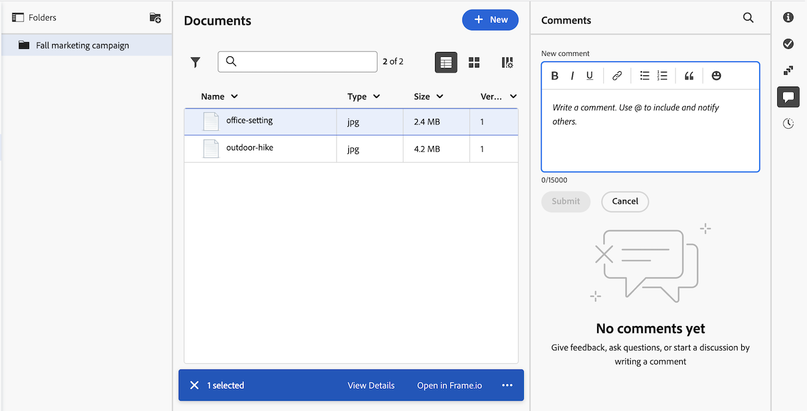

# Adicionar uma atualização a um documento

{{highlighted-preview}}

<!--Audited: April, 2024-->

Você pode adicionar ou responder a atualizações em um documento para se comunicar com colaboradores e criar uma trilha de auditoria. Para obter informações sobre como adicionar atualizações a itens de trabalho, consulte [Trabalho de atualização](../../workfront-basics/updating-work-items-and-viewing-updates/update-work.md).

## Requisitos de acesso

+++ Expanda para visualizar os requisitos de acesso da funcionalidade neste artigo.

<table style="table-layout:auto"> 
 <col> 
 <col> 
 <tbody> 
  <tr> 
   <td role="rowheader">Pacote do Adobe Workfront</td> 
   <td> 
Qualquer pacote do Workfront para gerenciar documentos usando o armazenamento herdado do Workfront

Qualquer pacote de fluxo de trabalho para gerenciar documentos usando o armazenamento em nuvem do Adobe
 </td> 
  </tr> 
  <tr> 
   <td role="rowheader">Licenças do Adobe Workfront</td> 
   <td> 
Colaborador ou posterior
 
   
Solicitação ou posterior

   </td> 
  </tr> 
  <tr> 
   <td role="rowheader">Configuração do nível de acesso</td> 
   <td> 
Visualizar acesso a documentos
 </td> 
  </tr>

<tr> 
   <td role="rowheader">Permissões de objeto</td> 
   <td> 
Visualizar acesso ao documento
 </td> 
  </tr> 
 </tbody> 
</table>

Para obter mais detalhes sobre as informações contidas nesta tabela, consulte [Requisitos de acesso na documentação do Workfront](/help/quicksilver/administration-and-setup/add-users/access-levels-and-object-permissions/access-level-requirements-in-documentation.md).

+++

## Adicionar uma atualização a um documento na área de documentos herdados

Se sua organização estiver no armazenamento herdado do Workfront, você verá a área de documentos herdados ao acessar documentos no Workfront. Para obter mais informações sobre o armazenamento Workfront herdado, consulte [Diferenças entre o armazenamento Workfront herdado e o armazenamento na nuvem do Adobe](/help/quicksilver/review-and-approve-work/esm-overview.md).

### Adicionar ou responder a uma atualização de um documento

1. Vá para o objeto que contém o documento e selecione **Documentos** no painel esquerdo.
1. Localize o documento necessário e siga um destes procedimentos:

   * Clique no documento na lista, clique no ícone **Abrir resumo**  no canto superior direito e adicione um novo comentário ou clique em **Responder** para adicionar uma resposta a um comentário existente. Para obter informações sobre o Resumo, consulte [Resumo de documentos](../../documents/managing-documents/summary-for-documents.md).
   * Passe o mouse sobre o documento, clique em **Detalhes do documento** e em **Atualizações** no painel esquerdo.
     Para obter mais informações sobre como adicionar atualizações a objetos, consulte [Trabalho de atualização](../../workfront-basics/updating-work-items-and-viewing-updates/update-work.md).

   As atualizações e respostas são adicionadas ao documento e também aos objetos com classificação mais alta. Para obter mais informações, consulte [Visão geral da seção de atualização](../../workfront-basics/updating-work-items-and-viewing-updates/updates-tab-overview.md).

### Adicionar uma resposta a um comentário de revisão de um documento

Na área Atualizações, ao responder a um comentário feito por alguém durante a revisão de um documento, o visualizador de revisão é iniciado para que você possa digitar sua resposta com o contexto necessário. Sua resposta será exibida no visualizador de revisões e na área Atualizações do documento.

1. Vá para o projeto, tarefa ou problema que contém o documento e selecione **Documentos**.
1. Localize o documento necessário.

1. Clique em **Responder na prova**, digite o comentário no visualizador de provas que é iniciado e clique em **Responder**.

   Se você precisar de informações sobre como digitar comentários e respostas no visualizador de provas, consulte [Comentário sobre uma prova](../../review-and-approve-work/proofing/reviewing-proofs-within-workfront/comment-on-a-proof/comment-on-proof-1.md).

## Adicionar uma atualização a um documento na nova área Documentos

Se sua organização usar o armazenamento em nuvem do Adobe, você verá a nova área Documentos ao acessar documentos no Workfront. Para obter mais informações sobre o Adobe Cloud Storage, consulte [Visão geral do Adobe Cloud Storage](/help/quicksilver/review-and-approve-work/esm-overview.md).

1. Vá para o objeto que contém o documento e selecione **Documentos** no painel esquerdo.
1. Localize o documento necessário e clique no ícone de comentário  para abrir o painel Comentários.
1. Digite seu comentário na caixa de texto e clique em **Enviar**.
   

### Indicador de comentário do Frame.io na Visualização

Quando um workflow de aprovação é criado para um documento, os usuários podem deixar comentários e fazer anotações no visualizador Frame.io. Esses comentários não são exibidos no painel Comentários do Workfront, mas você pode visualizá-los no visualizador Frame.io.

O painel Comentários no Workfront exibe uma mensagem que informa quando novos comentários estão disponíveis no Frame.io.

1. Clique em **Revisar comentários** para abrir o documento no visualizador Frame.io e exibir os comentários nele.

>[!NOTE]
>
>* Se você tiver uma licença Frame.io Enterprise, poderá exibir comentários no visualizador Frame.io sem um fluxo de trabalho de aprovação.

