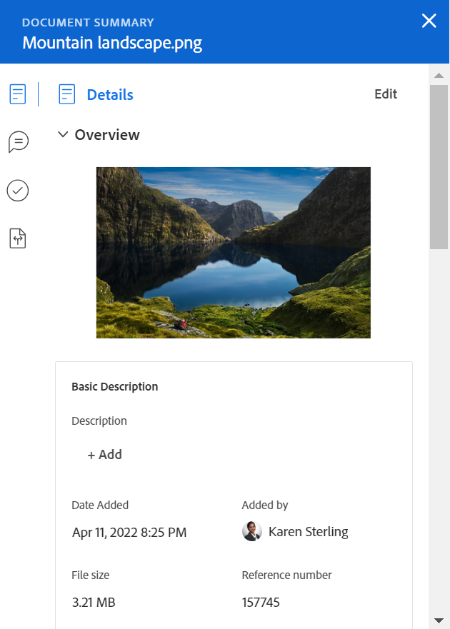
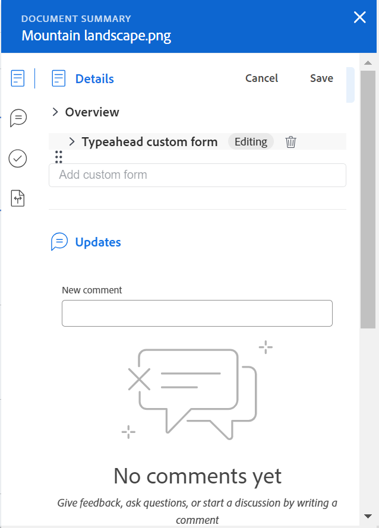

# Resumo para visão geral de documentos

<!--Audited: April, 2024-->

Você pode usar o painel Resumo para acessar e atualizar informações importantes diretamente da lista de documentos.

## Requisitos de acesso

Você deve ter o seguinte:

<table style="table-layout:auto"> 
 <col> 
 </col> 
 <col> 
 </col> 
 <tbody> 
  <tr> 
   <td role="rowheader">plano do Adobe Workfront</td> 
   <td> 
 Qualquer
 </td> 
  </tr> 
  <tr> 
   <td role="rowheader">Licenças da Adobe Workfront*</td> 
   <td> 
Novo: Colaborador ou superior
 
   
Atual: solicitação ou superior

   </td> 
  </tr> 
  <tr data-mc-conditions=""> 
   <td role="rowheader">Configurações de nível de acesso</td> 
   <td> 
Editar acesso a documentos
  </td> 
  </tr> 
  <tr data-mc-conditions=""> 
   <td role="rowheader">Permissões de objeto</td> 
   <td> 
Visualizar o acesso ao objeto associado ao documento
 </td> 
  </tr> 
 </tbody> 
</table>

*Para descobrir que plano, tipo de licença ou acesso você tem, entre em contato com o administrador do Workfront. Para obter mais informações, consulte [Requisitos de acesso na documentação do Workfront](/help/quicksilver/administration-and-setup/add-users/access-levels-and-object-permissions/access-level-requirements-in-documentation.md).

## Abrir a exibição Resumo

1. Vá para a área **Documentos** e selecione um item na lista.
1. Clique no ícone **Abrir Resumo** .

   Após abrir o Resumo, ele permanece aberto quando você clica em outros documentos e permanece aberto até que você o feche manualmente.

   

## Detalhes

Use a seção Detalhes para exibir informações de visão geral de alto nível e interagir com formulários personalizados. Clique em **Detalhes** na parte superior da seção para ir para a página Detalhes do documento completa.

* [Visão geral](#overview)
* [Formulários personalizados](#custom-forms)

### Visão geral {#overview}

Expanda a seção Visão geral para visualizar ou baixar uma miniatura de imagem, abrir uma prova, atualizar a descrição básica, verificar o documento e muito mais.

### Formulários personalizados {#custom-forms}

Use a seção Forms personalizado para adicionar, editar ou exibir quaisquer formulários personalizados associados ao documento. Comece digitando o nome do formulário personalizado para adicioná-lo ao documento. Para obter mais informações, consulte [Adicionar ou editar um formulário personalizado a um documento](../../documents/managing-documents/add-custom-form-documents.md).

## Atualizações

Use a seção Atualizações para ler e atualizar alguém feito no documento ou na prova. O resumo mostra os dois primeiros comentários feitos. Para obter mais informações sobre atualizações, consulte [Comentar em uma prova](../../review-and-approve-work/proofing/reviewing-proofs-within-workfront/comment-on-a-proof/comment-on-proof.md).

## Aprovações

Use a seção Aprovações para solicitar uma aprovação de documento. Você também pode lembrar alguém sobre uma aprovação, reenviar a aprovação e cancelar a decisão anterior ou excluir a aprovação. Os aprovadores de documentos podem usar o Resumo para tomar uma decisão.

Aprovações de provas devem ser adicionadas no Fluxo de trabalho de provas. Para obter mais informações sobre aprovações, consulte

* [Aprovando trabalho](../../review-and-approve-work/manage-approvals/approving-work.md)
* [Solicitar aprovações de documentos](../../review-and-approve-work/manage-approvals/request-document-approvals.md)

## Versões

Use a seção Versões para exibir o número de versões criadas para um documento específico. Clique no **Mais menu** para

* Abrir uma prova
* Baixar uma prova ou documento
* Visualizar um documento compatível com navegador
* Ir para Detalhes do documento
* Excluir uma prova ou documento

