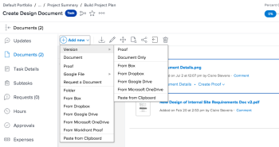

# Fazer upload de uma nova versão de um documento

É possível adicionar uma nova versão de um documento que você tenha carregado anteriormente no Adobe Workfront.

Se o nome do arquivo da nova versão for diferente do nome do arquivo da versão anterior, o Workfront exibirá o documento com o nome de arquivo mais recente.

Se o documento contiver uma prova e você quiser criar uma nova versão do documento revisado, consulte a seção [Carregar um documento e criar uma nova versão de uma prova](../../review-and-approve-work/proofing/creating-proofs-within-workfront/generate-proof-for-a-document.md#uploading-a-document-and-creating-a-new-version-of-a-proof) no artigo [Criar uma prova para um documento](../../review-and-approve-work/proofing/creating-proofs-within-workfront/generate-proof-for-a-document.md).

Para obter informações sobre como adicionar uma nova versão de um documento vinculado ao Workfront de um aplicativo externo, consulte [Adicionar uma nova versão de um documento vinculado](../../documents/adding-documents-to-workfront/link-documents-from-external-apps.md#add) em [Vincular documentos de aplicativos externos](../../documents/adding-documents-to-workfront/link-documents-from-external-apps.md).

## Requisitos de acesso

+++ Expanda para visualizar os requisitos de acesso para a funcionalidade neste artigo.

Você deve ter o seguinte:

<table style="table-layout:auto"> 
 <col> 
 </col> 
 <col> 
 </col> 
 <tbody> 
  <tr> 
   <td role="rowheader">plano do Adobe Workfront*</td> 
   <td> 
 Qualquer
 </td> 
  </tr> 
  <tr> 
   <td role="rowheader">Licenças da Adobe Workfront*</td> 
   <td> 
Solicitação ou superior
 </td> 
  </tr> 
  <tr data-mc-conditions=""> 
   <td role="rowheader">Configurações de nível de acesso*</td> 
   <td> 
Editar acesso a documentos
 
Observação: se você ainda não tiver acesso, pergunte ao administrador do Workfront se ele definiu restrições adicionais em seu nível de acesso. Para obter informações sobre como um administrador do Workfront pode modificar seu nível de acesso, consulte <a href="../../administration-and-setup/add-users/configure-and-grant-access/create-modify-access-levels.md" class="MCXref xref">Criar ou modificar níveis de acesso personalizados</a>.
 </td> 
  </tr> 
  <tr data-mc-conditions=""> 
   <td role="rowheader">Permissões de objeto</td> 
   <td> 
Editar acesso ao objeto associado ao documento
 
Para obter informações sobre como solicitar acesso adicional, consulte <a href="../../workfront-basics/grant-and-request-access-to-objects/request-access.md" class="MCXref xref">Solicitar acesso aos objetos </a>.
 </td> 
  </tr> 
 </tbody> 
</table>

&#42;Para saber qual plano, tipo de licença ou acesso você tem, contate o administrador do Workfront.

+++

## Usar o recurso arrastar e soltar para adicionar uma nova versão

>[!NOTE]
>
>Arrastar e soltar não funciona com o Internet Explorer.

1. Vá para a área Documentos onde o documento é carregado.
1. Na área de trabalho ou em uma guia separada do navegador, arraste a nova versão do documento para cima da versão existente no Workfront.

   

   Ao arrastar a nova versão, é possível passar o mouse sobre uma pasta de documentos do Workfront para abri-la. Você pode rolar para cima e para baixo arrastando os arquivos até a parte superior ou inferior da tela.

1. Solte a nova versão sobre o arquivo existente na guia **Documentos**.

   Para obter informações sobre o gerenciamento de versões de documentos, consulte [Gerenciar versões de documentos](../../documents/managing-documents/manage-document-versions.md).

## Use o menu Mais para adicionar uma nova versão

1. Selecione o documento no qual deseja adicionar uma nova versão.
1. Clique em **Adicionar novo** > **Versão**.

   

1. Selecione o tipo de documento que deseja fazer upload e siga as instruções.
