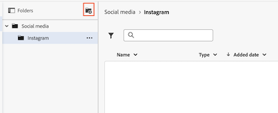

# Criar pastas de documentos

Os documentos podem ser organizados em pastas. Atualmente, o Workfront tem duas versões da área Documentos: a área documentos herdados e a nova área documentos. A versão usada por sua organização depende do armazenamento Workfront herdado ou do armazenamento corporativo. Para obter mais informações sobre esses tipos de armazenamento, consulte [visão geral do armazenamento corporativo da Adobe](/help/quicksilver/review-and-approve-work/esm-overview.md).

## Requisitos de acesso

+++ Expanda para visualizar os requisitos de acesso da funcionalidade neste artigo.

<table style="table-layout:auto"> 
 <col> 
 <col> 
 <tbody> 
  <tr> 
   <td role="rowheader">Pacote do Adobe Workfront</td> 
   <td> 
Qualquer
 </td> 
  </tr> 
  <tr> 
   <td role="rowheader">Licença do Adobe Workfront</td> 
   <td> 
   
Colaborador ou posterior

   
Revisar ou superior
 </td> 
  </tr> 
  <tr> 
   <td role="rowheader">Configurações de nível de acesso*</td> 
   <td> 
Editar acesso a documentos
 </td> 
  </tr> 
 </tbody> 
</table>

Para obter mais detalhes sobre as informações contidas nesta tabela, consulte [Requisitos de acesso na documentação do Workfront](/help/quicksilver/administration-and-setup/add-users/access-levels-and-object-permissions/access-level-requirements-in-documentation.md).

+++

## Criar pastas de documentos na área de documentos herdados

Se sua organização estiver no armazenamento herdado do Workfront, você verá a área de documentos herdados ao acessar documentos no Workfront. Para obter mais informações sobre o armazenamento Workfront herdado, consulte [Diferenças entre o armazenamento corporativo Adobe e o armazenamento Workfront herdado](/help/quicksilver/review-and-approve-work/esm-overview.md#differences-between-adobe-enterprise-storage-and-legacy-workfront-storage).

>[!NOTE]
>
>Organizar documentos simplesmente cria vínculos entre os documentos e os objetos aos quais você os associa. Ele não os realoca no sistema.

### Exibir pastas

Você pode exibir pastas em miniatura, padrão ou na exibição de lista. Para alterar a exibição, use as opções de exibição no canto superior direito.

{{step1-to-documents}}

Ou

Com um objeto do Workfront aberto, clique em **Documentos** no painel esquerdo.

1. Clique nas opções de exibição acima do painel direito para alterar a forma como os documentos são exibidos.

   

### Criar pastas e subpastas

Crie pastas para organizar melhor seus documentos. É possível criar até 2.000 pastas em um objeto e até 50 subpastas em cada pasta. A contagem de subpastas está próxima do máximo de 2.000 pastas.

{{step1-to-documents}}

Ou

Com um objeto do Workfront aberto, clique em **Documentos** no painel esquerdo.

1. Para criar uma pasta de nível superior, verifique se nada está selecionado e clique em **Adicionar novo** > **Pasta**.

   Ou

   Para criar uma subpasta, selecione a pasta na qual deseja criar a subpasta e clique em **Adicionar novo** > **Pasta**.

### Pastas de compartilhamento

Para obter informações sobre pastas de compartilhamento, consulte [Compartilhar uma pasta de documentos](../../workfront-basics/grant-and-request-access-to-objects/share-a-document-folder.md).

## Criar pastas de documentos na nova área de documentos

Se sua organização usar armazenamento corporativo, você verá a nova área de documentos ao acessar documentos no Workfront. Para obter mais informações sobre o armazenamento corporativo, consulte [visão geral sobre o armazenamento corporativo da Adobe](/help/quicksilver/review-and-approve-work/esm-overview.md).

### Pastas geradas pelo sistema

Ao fazer upload de um documento para uma tarefa ou problema, o Workfront cria automaticamente uma pasta gerada pelo sistema com o nome da tarefa ou problema. Esta pasta está vinculada à tarefa ou problema e herda suas permissões. As pastas geradas pelo sistema ficam visíveis na área de documentos do nível do projeto.

Para obter mais informações sobre permissões de pasta, consulte [Como funcionam as permissões de documento](/help/quicksilver/review-and-approve-work/esm-access-permissions.md#how-document-permissions-work).

### Criar subpastas

Você pode criar subpastas em uma pasta gerada pelo sistema para organizar ainda mais os documentos. Todas as subpastas herdam permissões da pasta principal.

1. Vá para o projeto, tarefa ou problema que contém o documento e selecione **Documentos** no painel esquerdo.
1. Clique na pasta na qual deseja criar uma subpasta e no ícone **Adicionar pasta** .
   
1. Insira um nome para a subpasta e clique em **Criar**.

### Renomear uma pasta

As pastas geradas pelo sistema herdam automaticamente o nome da tarefa ou problema. Eles podem ser renomeados clicando no nome da pasta e editando-a.

Para renomear uma pasta:

1. Vá para o projeto, tarefa ou problema que contém o documento e selecione **Documentos** no painel esquerdo.
1. Localize a pasta que você deseja renomear e clique no ícone **Mais** .
1. Clique em **Renomear** e digite um novo nome para a pasta.

   

1. Clique em **Renomear**.

### Mover uma pasta

As pastas geradas pelo sistema podem ser movidas para outro projeto, tarefa ou problema. Se uma pasta gerada pelo sistema for movida para outro local, seu objeto vinculado será atualizado para o novo objeto e as permissões serão herdadas do novo objeto pai. Você também pode mover subpastas para outro projeto, tarefa ou problema.

>[!NOTE]
>
>Somente projetos, tarefas e problemas que usam o mesmo tipo de armazenamento estão disponíveis na caixa de diálogo Mover. Por exemplo, se você estiver movendo uma pasta em um projeto de armazenamento corporativo, apenas projetos, tarefas e problemas que usam armazenamento corporativo estarão disponíveis para movimentação.

Para mover uma pasta:

1. Vá para o projeto, tarefa ou problema que contém o documento e selecione **Documentos** no painel esquerdo.
1. Localize a pasta que você deseja mover e clique no ícone **Mais** .
1. Clique em **Mover** e selecione o projeto, tarefa ou problema para o qual deseja mover a pasta.

   

<!-- STEPS PLACEHOLDER: Add steps for moving a folder in the new documents area -->

### Excluir uma pasta

Para excluir uma pasta:

1. Vá para o projeto, tarefa ou problema que contém o documento e selecione **Documentos** no painel esquerdo.
1. Localize a pasta que você deseja excluir e clique no ícone **Mais** .
1. Clique em **Excluir**.

   
