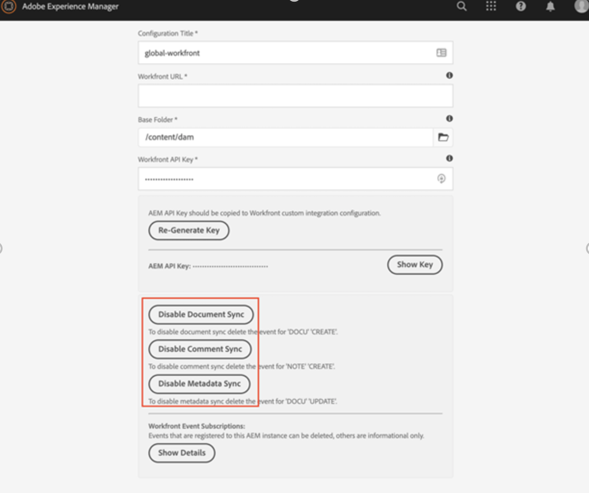
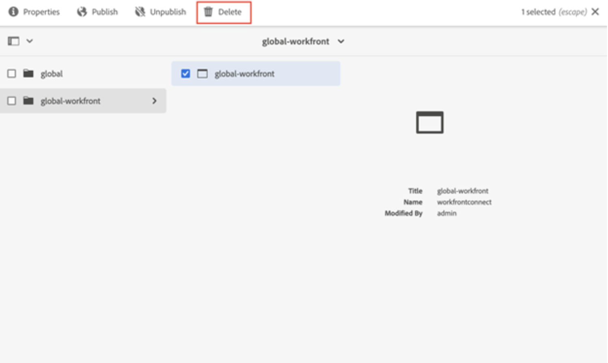

# Desinstalar o Workfront com o conector legado do Adobe Experience Manager

Você deve desinstalar o conector herdado do Workfront com Adobe Experience Manager para a integração nativa mais recente que conecta o Workfront e o Adobe Experience Manager Assets as a Cloud Service.

## Cancelar assinatura no Workfront

1. Abra o Adobe Experience Manager.
1. No Experience Manager, vá para **Ferramentas** > **Serviços de Nuvem** > **Configuração de Integração do Workfront**.
1. Selecione sua configuração (global-workfront por padrão) e clique em **Propriedades**.

   

1. Desative a sincronização de documentos, comentários e metadados. O rótulo deve ser dia Desativado.
Isso removerá as assinaturas no Workfront e permitirá que o usuário crie uma nova assinatura usando o mesmo url definido no Day CQ Link Externalizer.

## Excluir a configuração de integração do Workfront

Após remover a assinatura, agora é seguro excluir a Configuração de integração do Workfront.

1. Abra a configuração e selecione **Excluir**.

   

## Remover mapeamento

Em seguida, é necessário excluir o Mapeamento de propriedades do Workfront.

1. No Experience Manager, vá para **Ferramentas** > **Assets** > **Mapeamento de Propriedades do Workfront**.

1. Selecione todos os mapeamentos e clique em **Excluir**.

## Permissões de usuário

Todos os usuários que acessam o AEM Dam pelo Workfront receberam permissões de leitura para `/content/dam`. Se um usuário não precisar mais disso, você poderá remover as permissões concedidas a esses usuários.

O conector opera usando o serviço workfront do usuário do sistema. Isso é desinstalado ao desinstalar o conector.

>[!NOTE]
>
>Se você estiver usando a versão 2.0.3 do conector e tiver adicionado o grupo `workfront-aem-connector-group`, isso também precisará ser removido, acessando **Ferramentas** > **Segurança** > **Grupos**.

## Day CQ Link Externalizer

Se você não precisar do Day CQ Link Externalizer, poderá reverter isso para `localhost:4502` acessando `/system/console/configMgr` e procurando pelo &quot;Day CQ Link Externalizer&quot;.

>[!NOTE]
>
>Se você estiver usando o Adobe Experience Manager as a Cloud Service, altere isso verificando seu projeto e localizando o arquivo _com.day.cq.commons.impl.ExternalizerImpl.xml_ dentro de _ui.apps/src/main/content/jcr_ root/apps/mysite/config_.

## Desinstalar pacote do conector

As etapas necessárias para desinstalar o pacote do conector diferem de acordo com a versão do Adobe Experience Manager que você tem.

### Adobe Experience Manager no local

Se você estiver usando o Adobe Experience Manager no local, vá para _crx/packmgr/index.jsp_ e procure por `workfront-aem-connector.all-<version>.zip`, clique em **Mais** e depois em **Desinstalar**.

Verifique em `/conf` para ter certeza que todos os arquivos criados pela Workfront foram removidos.

### Adobe Experience Manager as a Cloud Service

Para o Adobe Experience Manager as a Cloud Service, você pode remover as dependências do conector dos arquivos pom.mbox do projeto.

## Firewall e Dispatcher

Não se esqueça de remover seus URLs do Workfront na lista de permissões se a comunicação não for mais necessária. Além disso, o conector usa a apiKey e o nome de usuário dos cabeçalhos definidos para o dispatcher. Eles também podem ser removidos.
