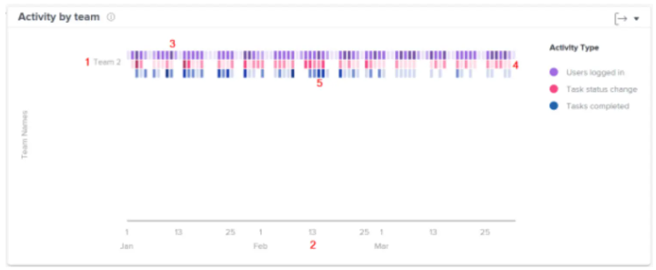

# Visualização da Atividade por equipe na Análise aprimorada

>[!IMPORTANT]
>
>O Analytics aprimorado foi removido do Workfront em 27 de maio. O Workfront Data Connect é uma solução nova e alternativa e pode ser usada para replicar qualquer visualização do Enhanced Analytics que você usa atualmente.  Consulte o [guia de descontinuação do Enhanced Analytics](/help/quicksilver/product-announcements/announcements/enhanced-analytics-deprecation.md) para obter mais informações.

<!-- Audited: 12/2023 -->

A visualização Atividade por equipe mostra atividades que acontecem durante um período específico para uma equipe da página inicial, permitindo que você entenda como as diferentes equipes da página inicial passaram seu tempo no Adobe Workfront. Dependendo de como sua equipe inicial está configurada no Workfront, essa visualização pode fornecer diferentes insights e responder a diferentes perguntas.

>[!NOTE]
>
>A visualização da Atividade de projeto é semelhante a esta visualização, mas exibe a atividade com base nas pessoas atribuídas aos projetos, em vez das pessoas atribuídas a uma equipe inicial.\
>Para obter informações sobre a visualização da atividade Project, consulte [Exibir a visualização da atividade Project na análise aprimorada](../enhanced-analytics/project-activity-overview.md).

{width="700"}

## Requisitos de acesso

+++ Expanda para visualizar os requisitos de acesso.

Você deve ter o seguinte acesso para executar as etapas deste artigo:

<table style="table-layout:auto"> 
 <col> 
 <col> 
 <tbody> 
  <tr> 
   <td role="rowheader"><a href="https://business.adobe.com/products/workfront/pricing.html" target="_blank">plano do Workfront</a></td> 
   <td> 
Business ou superior
 </td> 
  </tr> 
  <tr> 
   <td role="rowheader"><a href="../administration-and-setup/add-users/access-levels-and-object-permissions/wf-licenses.md" class="MCXref xref">Visão geral das licenças do Adobe Workfront</a></td> 
   <td>
      
Novo:
 
         <ul><li>Leve ou Superior</li></ul>
      
Atual:

         <ul><li>Revisar ou superior</li></ul>
   </td> 
  </tr> 
  <tr> 
   <td role="rowheader">Configurações de nível de acesso</td> 
   <td> 
Visualizar acesso aos projetos
 <!--
Note: If you still don't have access, ask your Workfront administrator if they set additional restrictions in your access level. For information on how a Workfront administrator can change your access level, see <a href="../administration-and-setup/add-users/configure-and-grant-access/create-modify-access-levels.md" class="MCXref xref">Create or modify custom access levels</a>.
--> </td> 
  </tr> 
  <tr> 
   <td role="rowheader">Permissões de objeto</td> 
   <td> 
Exibir
 <!--
For information on requesting additional access, see <a href="../workfront-basics/grant-and-request-access-to-objects/request-access.md" class="MCXref xref">Request access to objects </a>.
--> </td> 
  </tr> 
 </tbody> 
</table>

Para obter mais detalhes sobre as informações nesta tabela, consulte [Requisitos de acesso na documentação do Workfront](/help/quicksilver/administration-and-setup/add-users/access-levels-and-object-permissions/access-level-requirements-in-documentation.md).

+++

## Pré-requisitos

Para obter os pré-requisitos para usar o Enhanced Analytics, consulte a seção &quot;Pré-requisitos&quot; na [Visão geral do Enhanced Analytics](../enhanced-analytics/enhanced-analytics-overview.md).

## Entender a visualização Atividade por equipe

As diferentes atividades são exibidas em cores diferentes para resumir eventos específicos durante o período filtrado:

* **Usuários conectados**: as caixas roxas mostram que as pessoas da equipe doméstica conectaram nesse dia. Um tom mais escuro indica um número maior de pessoas que fizeram logon.

  

* **Alteração do status da tarefa**: as caixas de cor-de-rosa mostram que as pessoas na equipe inicial alteraram o status de uma tarefa nesse dia. Um tom mais escuro indica um número maior de alterações de status de tarefas.

  

* **Tarefas concluídas**: as caixas azuis mostram que as pessoas na equipe da página inicial concluíram uma tarefa nesse dia. Um tom mais escuro indica um maior número de tarefas concluídas.

  

Passar o mouse sobre uma caixa mostra o número exato de vezes que a ação foi concluída em um determinado dia. É possível selecionar uma equipe para ver um detalhamento dessas atividades por cada pessoa na equipe da página inicial.

Essas informações ajudam a determinar:

* Quais atividades estão ocorrendo dentro de uma equipe doméstica e em que ritmo.
* Quais equipes domésticas estão sendo sobrecarregadas ou estão usando mais o sistema.
* Se a distribuição do trabalho é adequada para a equipe interna.

Para saber como obter os melhores dados para esta visualização, consulte [Visão geral da análise aprimorada](../enhanced-analytics/enhanced-analytics-overview.md).

## Exibir a visualização Atividade por equipe

1. Clique no ícone Menu Principal  e selecione **Analytics**.
1. No painel esquerdo, selecione **Pessoas**.

   

1. (Opcional) Para usar um intervalo de datas diferente, selecione novas datas de início e término no filtro de intervalo de datas.

   

   Para obter informações sobre como usar o filtro de intervalo de datas, consulte [Aplicar filtros na análise aprimorada](../enhanced-analytics/use-enhanced-analytics-filters.md).

1. (Condicional) Se você não definiu o filtro Equipe, adicione o filtro Equipe e selecione cada equipe cujos dados você deseja ver.

   Para obter mais informações sobre como adicionar filtros na Análise aprimorada, consulte [Aplicar filtros na Análise aprimorada](../enhanced-analytics/use-enhanced-analytics-filters.md).

   Depois de adicionar filtros, os dados de até 50 projetos são exibidos e os filtros permanecem ativos mesmo depois de sair da página ou do Workfront.

1. (Opcional) Para ampliar um intervalo de datas, selecione um ponto na visualização para o início do intervalo de datas e arraste até o final do intervalo de datas.

   Todas as outras visualizações são atualizadas para o mesmo intervalo de datas e um filtro de período é criado.

   

1. Clique no nome de uma equipe

   <!--
   <MadCap:conditionalText data-mc-conditions="QuicksilverOrClassic.Draft mode">
   or role
   </MadCap:conditionalText>
   -->

   para ver mais detalhes das atividades concluídas pela equipe inicial.

   A lista é expandida para exibir as atividades de cada pessoa atribuída à equipe inicial.

   <!--
    Role not available
   -->

1. Passe o mouse sobre uma caixa colorida para ver a data em que os usuários concluíram uma ação, bem como o número de vezes que a ação foi concluída naquele dia.

   As cores mais escuras indicam maior atividade.

   

1. (Opcional) Para exportar os dados de visualização, clique no ícone Exportar  no canto superior direito da visualização e selecione o formato de exportação:

   * **Gráfico (PNG)**
   * **Tabela de Dados (XSLX)**

