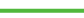

# Visualizar a visualização do Detalhamento na análise aprimorada

A visualização de Burndown mostra a interrupção de um projeto específico ao longo do tempo e ajuda você a entender a relação entre a condição do projeto, a velocidade e as horas restantes, ou dias.

## Requisitos de acesso

Você deve ter o seguinte:

<table style="table-layout:auto"> 
 <col> 
 <col> 
 <tbody> 
  <tr> 
   <td role="rowheader"><a href="https://www.workfront.com/plans" target="_blank">Plano Adobe Workfront</a>*</td> 
   <td> 
Empresa ou superior
 </td> 
  </tr> 
  <tr> 
   <td role="rowheader"><a href="../administration-and-setup/add-users/access-levels-and-object-permissions/wf-licenses.md" class="MCXref xref">Visão geral das licenças do Adobe Workfront</a>*</td> 
   <td> 
Revisar ou superior
 </td> 
  </tr> 
  <tr> 
   <td role="rowheader">Configurações de nível de acesso*</td> 
   <td> 
Visualizar o acesso a Projetos
 
Observação: Caso ainda não tenha acesso, pergunte ao administrador do Workfront se ele definiu restrições adicionais em seu nível de acesso. Para obter informações sobre como um administrador do Workfront pode modificar seu nível de acesso, consulte <a href="../administration-and-setup/add-users/configure-and-grant-access/create-modify-access-levels.md" class="MCXref xref">Criar ou modificar níveis de acesso personalizados</a>.
 </td> 
  </tr> 
  <tr> 
   <td role="rowheader">Permissões de objeto</td> 
   <td> 
Exibir
 
Para obter informações sobre como solicitar acesso adicional, consulte <a href="../workfront-basics/grant-and-request-access-to-objects/request-access.md" class="MCXref xref">Solicitar acesso a objetos </a>.
 </td> 
  </tr> 
 </tbody> 
</table>

&#42;Para descobrir qual plano, tipo de licença ou acesso você tem, entre em contato com o administrador da Workfront.

## Pré-requisitos

Para obter os pré-requisitos para usar o Enhanced Analytics, consulte a seção &quot;Pré-requisitos&quot; em [Visão geral da análise aprimorada](../enhanced-analytics/enhanced-analytics-overview.md).

## Entender a visualização de Burndown

A linha azul sólida mostra a velocidade planejada desde a data de início até à data de conclusão planejada. Essa linha se ajusta à medida que o trabalho é adicionado, removido ou atualizado e muda para uma linha vertical tracejada quando o projeto atinge a data de conclusão planejada.

A linha real mostra o número de horas (ou dias) gastas no projeto ao longo do tempo. A cor dessa linha indica a condição do projeto a cada dia:

* **Verde**: O projeto está no target.

   

* **Laranja**: O projeto está em risco.

   

* **Vermelho**: O projeto está em apuros.

   

Para obter mais informações sobre essas condições de projeto, consulte [Visão geral da condição do projeto e do tipo de condição](../manage-work/projects/manage-projects/project-condition-and-condition-type.md).

Quando a linha real se move verticalmente, o trabalho foi adicionado ao projeto. Quando a linha se move verticalmente, o trabalho foi removido ou concluído para o projeto.

Abaixo do eixo x da visualização, é possível ver mais informações sobre como as tarefas e horas — ou dias — foram alteradas em um determinado dia (a quantidade adicionada, a quantidade concluída e a diferença entre os dois).

Ver todas essas informações na visualização de Burndown ajuda a determinar:

* A saúde de cada projeto ao longo do tempo
* Como os problemas que entram (ou que não são planejados) afetam o trabalho planejado.
* Quais eventos estenderam seu projeto após a data de conclusão original.

Para saber como obter os melhores dados para essa visualização, consulte [Visão geral da análise aprimorada](../enhanced-analytics/enhanced-analytics-overview.md).

## Exibir a visualização de Burndown

1. Clique no ícone do Menu principal , em seguida selecione **Analytics**.
1. (Opcional) Para usar um intervalo de datas diferente, selecione novas datas de início e término no filtro de intervalo de datas.

   

   Para obter informações sobre como usar o filtro de intervalo de datas, consulte [Aplicar filtros no Enhanced Analytics](../enhanced-analytics/use-enhanced-analytics-filters.md).

1. (Condicional) Se precisar limitar o conjunto de dados do projeto, selecione e aplique os filtros que deseja usar.

   Para obter mais informações sobre como adicionar filtros nas Análises aprimoradas, consulte [Aplicar filtros no Enhanced Analytics](../enhanced-analytics/use-enhanced-analytics-filters.md).

   Após adicionar filtros, os dados de até 50 projetos são exibidos e os filtros permanecem ativos mesmo depois que você sai da página ou faz logoff do Workfront.

1. (Opcional) Para ampliar um intervalo de datas, selecione um ponto na visualização do início do intervalo de datas e arraste até o final do intervalo de datas.

   Todas as outras visualizações são atualizadas para o mesmo intervalo de datas, e um filtro de período é criado.

   

1. Na visualização Plano de voo ou Mapa de árvore do projeto , clique em um projeto para exibir mais informações.

   As visualizações Burndown e Tasks in flight são exibidas.

   >[!NOTE]
   >
   >Para saber mais sobre essas outras visualizações, consulte:
   >
   >   
   >   
   >   * [Exibir a visualização do Plano de voo na análise aprimorada](../enhanced-analytics/flight-plan-overview.md)
   >   * [Visualizar o mapa de árvore do projeto no Enhanced Analytics](../enhanced-analytics/project-treemap-overview.md)
   >   * [Visualizar as Tarefas em andamento na análise aprimorada](../enhanced-analytics/tasks-in-flight-overview.md)

1. (Opcional) Altere a exibição das horas planejadas para **duration**.

   As horas planejadas são selecionadas por padrão.

   >[!NOTE]
   >
   >Selecionar **duration** altera todas as informações de horas para dias.\
   >\
   >Para obter mais informações sobre a duração na área Análise aprimorada, consulte a seção &quot;Visualização da duração&quot; em [Visão geral da análise aprimorada](../enhanced-analytics/enhanced-analytics-overview.md).

1. Clique em qualquer ponto no gráfico de linhas.

   A data exata é exibida e informações adicionais sobre tarefas e horas (ou dias) para o dia selecionado são exibidas abaixo.

   

   >[!NOTE]
   >
   >Se a velocidade real for uma linha reta que roda ao longo do eixo x (em linha com 0 horas ou 0 dias) da visualização, isso significa que nenhuma hora planejada, ou dias, foi adicionada ao projeto.\
   >Se a velocidade real for uma linha reta acima do eixo x (em linha com um número de horas ou de dias) que nunca desce, isso significa que nenhuma tarefa foi concluída no período filtrado.

1. (Opcional) Para exportar os dados de visualização, clique no botão **Exportar** ícone no canto superior direito da visualização, selecione o formato de exportação:

   * **Gráfico (PNG)**
   * **Tabela de dados (XSLX)**

1. (Opcional) Para ver detalhes sobre o progresso das tarefas no projeto selecionado, verifique a visualização Tarefas em andamento , exibida abaixo da visualização Detalhamento.
