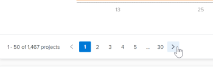
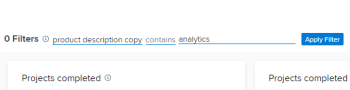

# Aplicar filtros na análise aprimorada

<!-- Audited: 12/2023 -->

Os filtros na área Análise aprimorada do Adobe Workfront ajudam você a se concentrar em projetos específicos ou tipos específicos de dados. Os tipos de filtros que você usa podem fornecer informações sobre:

* Projetos que possui
* Exibições específicas de portfólio ou programa
* Indicadores-chave de desempenho para um período específico (semana, trimestre, ano fiscal)

Você pode adicionar e remover filtros conforme necessário, e o Workfront retém os filtros que você aplica mesmo se você fizer logout.

## Requisitos de acesso

+++ Expanda para visualizar os requisitos de acesso para a funcionalidade neste artigo.

Você deve ter o seguinte acesso para executar as etapas deste artigo:

<table style="table-layout:auto"> 
 <col> 
 <col> 
 <tbody> 
  <tr> 
   <td role="rowheader">plano do Adobe Workfront</td> 
   <td>
      
Novo: Qualquer um

      
ou

      
Atual: Comercial ou superior
</td> 
  </tr>
  <tr> 
   <td role="rowheader">Licença do Adobe Workfront</td> 
   <td>
      
Novo: Claro ou superior

      
ou

      
Atual: revisão ou superior

   </td> 
  </tr>
  <tr> 
   <td>Configurações de nível de acesso</td> 
   <td> 
Visualizar acesso aos projetos
 
Você também deve ter acesso de Visualização a Tarefas, Portfolio e Usuários para ver opções específicas de filtro de campo do projeto.
 
Observação: se as restrições forem selecionadas na seção <strong>Definir restrições adicionais</strong> da caixa de diálogo Editar Nível de Acesso, talvez você não veja todas as informações nos filtros ou na página Analítica aprimorada após a aplicação do filtro.
 </td> 
  </tr> 
  <tr> 
   <td> 
Permissões de objeto 
 </td> 
   <td> 
Exibir
 </td> 
  </tr> 
 </tbody> 
</table>

Para obter mais detalhes sobre as informações nesta tabela, consulte [Requisitos de acesso na documentação do Workfront](/help/quicksilver/administration-and-setup/add-users/access-levels-and-object-permissions/access-level-requirements-in-documentation.md).

+++

## Pré-requisitos

Para obter os pré-requisitos para usar o Enhanced Analytics, consulte [Pré-requisitos](../enhanced-analytics/enhanced-analytics-overview.md#prerequisites) na [Visão geral do Enhanced Analytics](../enhanced-analytics/enhanced-analytics-overview.md).

## Alterar o filtro de intervalo de datas {#change-the-date-range-filter}

Por padrão, as visualizações na área Analítica aprimorada mostram dados dos últimos 60 dias e dos próximos 15 dias. Você pode selecionar um novo intervalo de datas e aplicá-lo a todas as visualizações na área Analítica aprimorada. Se você navegar para fora da página, o intervalo de datas padrão será aplicado na próxima vez que navegar de volta.

>[!TIP]
>
>Você também pode usar as teclas do teclado para navegar, abrir e selecionar um intervalo de datas no widget de calendário.\
>Para obter mais informações, consulte a seção [Atalhos de teclado](../enhanced-analytics/enhanced-analytics-overview.md#keyboard-shortcuts) no artigo [Visão geral da análise aprimorada](../enhanced-analytics/enhanced-analytics-overview.md).

Para selecionar um novo intervalo de datas:

{{step1-to-analytics}}

1. Na parte superior direita, clique no campo de intervalo de datas para abrir a exibição do calendário.
1. Use as setas acima do calendário para localizar o mês da data inicial e, em seguida, selecione a data inicial.

   

1. Use as setas acima do calendário para localizar o mês da data final e, em seguida, selecione a data final.
1. (Opcional) Para ampliar um intervalo de datas menor, arraste o mouse de uma data específica para outra em uma das visualizações.

   Todas as visualizações na tela são atualizadas para corresponder ao período selecionado, e um filtro de Período é exibido ao lado de qualquer filtro existente. Esse filtro não será retido se você fizer logoff ou navegar fora da área Analítica aprimorada.

   

## Adicionar um filtro

Você pode adicionar filtros com base em campos de projeto padrão, campos de formulário personalizados e equipes locais atribuídas a projetos.

>[!TIP]
>
>Você também pode usar as teclas do teclado para navegar até um novo filtro e adicioná-lo.\
>Para obter mais informações, consulte a seção [Atalhos de teclado](../enhanced-analytics/enhanced-analytics-overview.md#keyboard) no artigo [Visão geral da análise aprimorada](../enhanced-analytics/enhanced-analytics-overview.md).

* [Adicionar um filtro de campo de projeto](#add-a-project-field-filter)
* [Adicionar um filtro de formulário personalizado de projeto](#add-a-project-custom-form-filter)
* [Adicionar um filtro de Equipe](#add-a-team-filter)

### Adicionar um filtro de campo de projeto {#add-a-project-field-filter}

Os filtros de campo de projeto permitem filtrar dados de projetos e tarefas com base nos valores inseridos em campos incluídos em projetos por padrão.

Os seguintes tipos de filtro de campo de projeto estão disponíveis:

| Campo | Dados exibidos |
|---|---|
| **Projeto** | Exibe dados somente para o(s) projeto(s) selecionado(s) |
| **Programa** | Exibe dados somente para projetos nos programas selecionados |
| **Portfolio** | Exibe dados somente para projetos nos portfólios selecionados |
| **Condição** | Exibe dados somente para projetos que tiveram as condições selecionadas mais recentemente (no destino, em risco ou com problemas) |
| **Status** | Exibe dados somente para projetos que tiveram os status selecionados mais recentemente (concluído, atual, em espera, cancelado, etc.) |
| **Patrocinador** | Exibe dados somente para projetos com o(s) patrocinador(es) selecionado(s) |
| **Proprietário do projeto** | Exibe dados somente para projetos com o(s) proprietário(s) do projeto selecionado(s) |

Os filtros de formulário personalizados funcionam de forma diferente. Para obter mais informações, consulte [Adicionar um filtro de formulário personalizado de projeto](#add-a-project-custom-form-filter).

Para adicionar um filtro de campo de projeto:

{{step1-to-analytics}}

1. Na parte superior esquerda, clique em **Adicionar filtro** e selecione o tipo de filtro desejado.

   >[!NOTE]
   >
   >Tipos de filtros diferentes exibem dados diferentes. Você pode usar apenas um tipo de filtro em um filtro. Após selecioná-lo, um tipo de filtro não está disponível para uso em outro filtro de campo de projeto.

1. Localize os valores que deseja ver os dados inserindo pelo menos três caracteres de texto no campo **Pesquisa** e selecione cada valor que deseja incluir no filtro.

   Para selecionar todos os valores atuais, clique em **Selecionar tudo**.

   

1. Após selecionar todos os valores desejados, clique em **Aplicar Filtro**.

   O projeto conta nas atualizações superiores à direita para refletir os filtros aplicados.

1. Repita essas etapas para cada filtro que deseja adicionar.

   Conforme você adiciona filtros, os dados são exibidos nas visualizações abaixo para até 50 projetos.

   >[!TIP]
   >
   >Para ver dados de mais de 50 projetos exibidos por padrão, é possível:
   >
   >   * Use as setas na parte inferior esquerda para exibir os próximos 50 projetos nessa visualização.\
   >     
   >   
   >   * Use o menu suspenso **Classificar por** em uma visualização para exibir os projetos em uma ordem diferente.\
   >     

   Para ajustar o intervalo de datas, consulte [Alterar o filtro de intervalo de datas](#change-the-date-range-filter).

### Adicionar um filtro de formulário personalizado de projeto

O tipo de filtro de formulário personalizado permite filtrar dados de projetos e tarefas com base nos valores inseridos em campos de formulário personalizados em projetos. Diferentemente de outros tipos de filtros de análise aprimorada, é possível adicionar mais de um filtro de formulário personalizado. Cada filtro de formulário personalizado contém valores inseridos somente no campo selecionado em um formulário personalizado específico.

Para adicionar um filtro de formulário personalizado:

{{step1-to-analytics}}

1. No canto superior esquerdo da tela, clique em **Adicionar filtro** e selecione **Formulário personalizado**.

   

1. Localize o formulário personalizado desejado inserindo pelo menos três caracteres de texto no campo **Pesquisa** e selecione o formulário personalizado.
1. Selecione o campo desejado e conclua uma das seguintes ações com base no tipo de campo que você está adicionando ao filtro:

   >[!NOTE]
   >
   >Nem todos os tipos de campos corm personalizados podem ser adicionados a um filtro. Atualmente, a Análise aprimorada é compatível apenas com os tipos de campo listados abaixo.

   * **Caixa de seleção**, **lista suspensa** ou **botão de opção**: selecione cada valor no campo que deseja incluir no filtro ou clique na caixa de seleção **Selecionar Tudo**.\
     

   * **Data**: use as setas para navegar até um mês específico e selecione a data no campo que deseja incluir no filtro.\
     

   * **Texto**: insira o texto dentro do campo que você deseja incluir no filtro.\
     

   * **Número**: insira o número no campo que deseja incluir no filtro.\
     

1. Depois de inserir ou selecionar os valores que deseja filtrar, clique em **Aplicar Filtro**.

   O projeto conta nas atualizações superiores à direita para refletir os filtros aplicados.

1. Repita essas etapas para cada filtro que deseja adicionar.

   Conforme você adiciona filtros, os dados são exibidos nas visualizações abaixo para até 50 projetos.

   >[!TIP]
   >
   >Para ver dados de mais de 50 projetos exibidos por padrão, é possível:
   >  
   >   * Use as setas na parte inferior esquerda para exibir os próximos 50 projetos nessa visualização.\
   >     
   >   
   >   * Use o menu suspenso **Classificar por** em uma visualização para exibir os projetos em uma ordem diferente.\
   >     

   Para ajustar o intervalo de datas, consulte [Alterar o filtro de intervalo de datas](#change-the-date-range-filter).

### Adicionar um filtro de Equipe {#add-a-team-filter}

{{step1-to-analytics}}

1. No painel esquerdo, clique em **Pessoas**.

   

1. Na parte superior esquerda da tela, clique em **Adicionar filtro** e selecione o filtro **Equipe**.
1. Localize as equipes cujos dados você deseja ver inserindo pelo menos três caracteres de texto no campo **Pesquisa** e selecione cada equipe que você deseja incluir no filtro. Para selecionar todas as equipes, clique em **Selecionar tudo**.

   

   >[!NOTE]
   >
   >Todas as equipes estão incluídas como opções de filtro, independentemente do seu nível de acesso.

1. Depois de selecionar todas as equipes desejadas, clique em **Aplicar filtro**.

   À medida que você adiciona filtros, os dados são exibidos nas visualizações abaixo.

   Para ajustar o intervalo de datas, consulte [Alterar o filtro de intervalo de datas](#change-the-date-range-filter).

## Remover um filtro

É possível remover um filtro a qualquer momento. Se você remover um filtro, ele não será exibido da próxima vez que você visitar a área de Análise aprimorada.

>[!TIP]
>
>Você também pode usar as teclas do teclado para navegar até um filtro existente e removê-lo.\
>Para obter mais informações, consulte a seção [Atalhos de teclado](../enhanced-analytics/enhanced-analytics-overview.md#keyboard) no artigo [Visão geral da análise aprimorada](../enhanced-analytics/enhanced-analytics-overview.md).

Para remover um filtro:

{{step1-to-analytics}}

1. Se quiser remover um campo de projeto ou um filtro de formulário personalizado, permaneça na área **Trabalho**.

   Ou

   Para remover um filtro Equipe, selecione **Pessoas** no painel esquerdo.

1. Localize o filtro desejado e clique em **X** para removê-lo.

   

   O filtro não está mais ativo e não é exibido a menos que você o adicione novamente.
