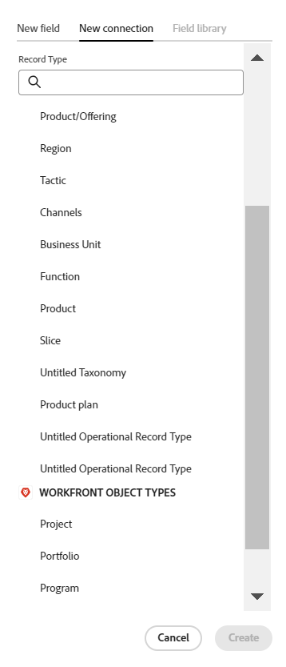

<!-----
title: Connect record types
description: A way to indicate how individual record types relate to one another is to connect them. Also, you can connect Maestro record types with object types from other applications to enhance your users' experience and keep their focus in one application.
hidefromtoc: yes
hide: yes
feature: Work management
role: User
author: Alina
--->

<!--update the metadata with real information when making this avilable in TOC and in the left nav-->
<!--************ THIS MIGHT NO LONGER BE A 'RELATIONSHIP' TYPE FIELD, BECAUSE THEY WILL SHOW IT IN THE CONNECTION TAB*****************************-->

# Conectar tipos de registro

>[!IMPORTANT]
>
>Atualmente, o Adobe Maestro faz parte de um programa beta aberto a um número limitado de clientes.
>
>Entre em contato com seu representante de conta para obter mais informações sobre como participar do programa beta para o Maestro.
>
>Para obter informações, consulte [Visão geral do Adobe Maestri](../maestro-overview.md).

Você pode usar o Adobe Maestri para projetar espaços de trabalho totalmente personalizáveis que contenham tipos de registro necessários em sua organização. Uma maneira de indicar como os tipos de registro individuais se relacionam entre si é conectá-los. Além disso, você pode conectar tipos de registro Maestri com tipos de objeto de outros aplicativos para aprimorar a experiência dos usuários e manter o foco em um aplicativo.

Você pode conectar o seguinte:

* Tipos de registro operacional principal
* Tipos de registro operacional principal para tipos de registro de taxonomia
* Domine os tipos de registros operacionais e os tipos de objetos de outras aplicações.

Ao fazer isso, você pode exibir campos do registro vinculado ou tipo de objeto em outro registro Maestro.

Este artigo descreve como você pode conectar dois tipos de registro Maestri ou um tipo de registro Maestri com um objeto de outro aplicativo.

Depois que a conexão entre tipos de registro ou objeto for estabelecida, você poderá conectar registros individuais uns aos outros.

Para obter informações sobre como conectar um registro Maestro a um objeto de outro aplicativo, consulte [Conectar registros](../records/connect-records.md).

Para obter um exemplo de conexão de tipos de registro, consulte [Exemplo de conexão de tipos de registro e registros](../architecture-and-fields/example-connect-record-types-and-records.md).

<!--ensure this last linked article is right; the title and the link should have changed-->

## Requisitos de acesso

Você deve ter o seguinte acesso para executar as etapas deste artigo:

<table style="table-layout:auto">
 <col>
 </col>
 <col>
 </col>
 <tbody>
    <tr>
<tr>
<td>
   
 produto Adobe
 </td>
   <td>
   
 Adobe Workfront
 </td>
  </tr>  
 <td role="rowheader">
contrato do Adobe Workfront
</td>
   <td>

Sua organização deve estar inscrita no programa beta fechado do Adobe Maestro. Entre em contato com seu representante de conta para obter mais informações sobre esta nova oferta. 

   </td>
  </tr>
  <tr>
   <td role="rowheader">
plano do Adobe Workfront
</td>
   <td>

Qualquer Um

   </td>
  </tr>
  <tr>
   <td role="rowheader">
Licença do Adobe Workfront
</td>
   <td>
   
Qualquer Um
 
  </td>
  </tr>

<tr>
   <td role="rowheader">Nível de acesso</td>
   <td> 
Qualquer Um
  
</td>
  </tr>

<tr>
   <td role="rowheader">Modelo de layout</td>
   <td> 
O administrador do sistema deve adicionar a área Maestro no modelo de layout. Para obter informações, consulte <a href="../access/grant-access.md">Conceder acesso ao Adobe Maestro</a>. 
  
</td>
  </tr>
 </tbody>
</table>

<!--Maybe enable this at GA - but Maestro is not supposed to have Access controls in the Workfront Access Level: 
>[!NOTE]
>
>If you don't have access, ask your Workfront administrator if they set additional restrictions in your access level. For information on how a Workfront administrator can change your access level, see [Create or modify custom access levels](../administration-and-setup/add-users/configure-and-grant-access/create-modify-access-levels.md). -->

<!-- Notes to add for the table: for the "Workfront plans" row: the above is only for closed beta; when going to GA - activate the following plans:    

Current plan: Prime and Ultimate

Legacy plan: Enterprise
-->

<!-- Notes for the table: for the "Workfront access" row: 
For more information, see <a href="../../administration-and-setup/add-users/access-levels-and-object-permissions/wf-licenses.md" class="MCXref xref">Adobe Workfront licenses overview</a>.
-->

## Considerações sobre a conexão de tipos de registro

* Você pode conectar as seguintes entidades no Maestro:

   * Dois tipos de registro operacional
   * Duas taxonomias
   * Um tipo de registro operacional e uma taxonomia
   * Tipo de registro operacional e tipo de objeto de outro aplicativo.

     >[!TIP]
     >
     >    Não é possível conectar um tipo de registro de taxonomia a um tipo de registro operacional ou a um tipo de objeto de outro aplicativo.

* Você pode conectar os seguintes objetos das seguintes aplicações com os tipos de registro Maestri:

   * Adobe Workfront:

      * Projetos
      * Portfólios
      * Programas
      * Empresas
      * Grupos

* Depois de conectar um tipo de registro com outro tipo de registro ou com um tipo de objeto de outro aplicativo, existem os seguintes cenários:

   * Quando você conecta dois tipos de registro: um campo de registro Vinculado é criado no tipo de registro ao qual você está se conectando. Um campo Registro vinculado semelhante é criado no tipo de registro ao qual você está se conectando.

     Por exemplo, se você conectar o tipo de registro &quot;Campanha&quot; ao tipo de registro &quot;Produto&quot;, um campo de registro vinculado chamado &quot;Produto vinculado&quot; será criado no tipo de registro Campanha e um tipo de registro vinculado chamado automaticamente &quot;Campanha&quot; será criado no tipo de registro Produto.

   * Ao conectar um campo do tipo de registro com uma taxonomia: um campo de registro vinculado é criado no tipo de registro ao qual você está se conectando. Nenhum campo de registro vinculado é criado na taxonomia à qual você está se conectando.

     Por exemplo, se você conectar o tipo de registro &quot;Campanha&quot; ao tipo de registro de taxonomia &quot;Público-alvo&quot;, um campo de registro vinculado chamado de &quot;Público-alvo vinculado&quot; será criado no tipo de registro Campanha. Nenhum campo de registro vinculado chamado automaticamente de &quot;Campanha&quot; é criado no tipo de registro de taxonomia de Público-alvo. <!--this might be temporary-->

   * Ao conectar um campo de tipo de registro com um tipo de objeto de outro aplicativo: um campo de registro vinculado é criado no tipo de registro do qual você está se conectando. Nenhum campo de registro vinculado é criado automaticamente no projeto do Workfront no Workfront. Um campo de registro vinculado é criado no tipo de registro de objeto do Workfront somente quando os objetos reais estão conectados aos registros do Maestro.

     Para obter mais informações, consulte [Conectar registros](../records/connect-records.md).

* Após conectar os tipos de registro, é possível conectar vários campos de um tipo de registro a outro tipo de registro. Nos referiremos a esses campos como &quot;campos vinculados&quot; ou &quot;campos de pesquisa&quot;.
* Os campos de registro vinculados são precedidos por um ícone de relacionamento .
* Depois de criar registros individuais para um tipo de registro, você pode selecionar os registros aos quais se conectar no campo Tipo de registro vinculado. Para obter informações, consulte [Conectar registros](../records/connect-records.md).
* Não é possível editar as informações dos campos vinculados a partir do tipo de registro que você está vinculando, pois eles são preenchidos automaticamente a partir do tipo de registro original ao qual pertencem, assim que você seleciona os registros vinculados.

## Conectar tipos de registro

<!--when changes here, also update the article for "Connect records"-->

1. Clique em **Menu principal** ícone  no canto superior direito do Workfront, <!---or the **Main menu** icon   in the upper-left corner, if available--> e clique em **Maestro** .

   O espaço de trabalho acessado por último deve ser aberto por padrão.

1. (Opcional) Expanda a seta apontando para baixo à direita de um nome de espaço de trabalho existente e selecione o espaço de trabalho do qual deseja conectar tipos de registro.
1. Clique no cartão de um tipo de registro para abrir a página do tipo de registro.
1. Clique em **+** no canto superior direito da exibição em tabela, em seguida, clique no **Nova conexão** guia.

   
1. No **Tipo de registro** selecione uma das seguintes opções: <!--is the field name spelled right? lowercase "t"?-->

   * Outro tipo de registro operacional
   * Uma taxonomia
   * Um projeto, Portfolio, programa, empresa ou grupo da Workfront.

   

   >[!TIP]
   >
   > Somente os tipos de registro e as taxonomias do espaço de trabalho selecionado estão disponíveis para seleção.

1. Atualize as seguintes informações:

   * **Nome**: o nome do campo conectado, como ele aparecerá na exibição de tabela ou na página Detalhes do tipo de registro original. Isso cria a coluna de registro vinculado na exibição de tabela do tipo de registro original ou no campo de registro vinculado dos registros originais. <!--ensure they updated this; and update the screen shot: it used to be "Label"-->

   >[!TIP]
   >
   >É recomendável incluir o nome do registro ao qual você está vinculando no nome do campo de registro conectado para capturar de que tipo de registro o novo campo vem. O nome do registro vinculado não está visível no novo campo de registro vinculado ou em seus campos vinculados.

   * **Descrição**: informações adicionais sobre o campo de registro conectado. A descrição de um campo é exibida quando você passa o mouse sobre a coluna do campo em uma tabela.
   * **Permitir vários registros**: selecione essa opção para indicar que você permite que os usuários possam adicionar vários registros quando o campo de tipo de registro vinculado for exibido nos registros originais. É selecionado por padrão.
   * **Selecionar campos de pesquisa**: selecione essa opção para adicionar campos do tipo de registro selecionado. É selecionado por padrão.

1. Clique em **Criar**.

1. (Condicional) Se você selecionou a configuração Selecionar campo de pesquisa na etapa anterior, a variável **Adicionar campos de pesquisa** é aberta.

   Clique em **+** ícone para adicionar campos do **Campos não selecionados** área.

   Ou

   Clique em **-** ícone para remover campos do **Campos selecionados** área

   

   >[!NOTE]
   >
   >Se você não selecionar nenhum dos campos, a variável **Nome** do registro vinculado é o único campo visível na exibição de tabela do registro original. A variável **Nome** não é possível remover o campo.

1. (Opcional e condicional) Se você optar por vincular um campo do tipo número, moeda, porcentagem ou data, selecione também um valor agregador. Os valores dos campos vinculados são exibidos separados por vírgulas ou como um valor agregado de acordo com o agregador escolhido, quando os usuários selecionam mais de um registro vinculado no campo de registro vinculado.

   

   Selecione entre as seguintes opções:

   * **Nenhum**: exibe os valores que vêm de vários registros separados por vírgulas. Esta é a seleção padrão.
   * **MAX**: exibe o valor mais alto de todos os valores que vêm de vários registros selecionados no campo de registro vinculado.
   * **MÍN**: exibe o valor mais baixo de todos os valores que vêm de vários registros selecionados no campo de registro vinculado.
   * **SOMA**: exibe o total de todos os valores que vêm de vários registros selecionados no campo de registro vinculado.
   * **AVG**: exibe a média de todos os valores que vêm de vários registros selecionados no campo de registro vinculado.

   >[!NOTE]
   >
   >Por exemplo, você pode vincular o registro Product (registro vinculado) do registro Campaign (registro original) e nomeá-lo como &quot;Campo de produto&quot;. Também é possível vincular o campo Budget do registro Product do registro Campaign e chamá-lo de &quot;Product Budget&quot;. Se você tiver permissão para selecionar vários registros no &quot;campo Produto&quot;, poderá selecionar o Produto 1 com um Orçamento de US$ 120.000 e o Produto 2 com um Orçamento de US$ 100.000. Você pode exibir as seguintes informações de Orçamento no campo vinculado do registro original, dependendo do agregador escolhido:
   >
   >* **Nenhum**: US$ 120.000, US$ 100.000
   >* **MAX**: US$ 120.000
   >* **MÍN**: US$ 100.000
   >* **SOMA**: US$ 220.000
   >* **AVG**: US$ 110.000
   >

1. (Opcional) Use o **pesquisa** ícone  para procurar um campo.

1. (Opcional) Clique em **Ignorar** se não quiser adicionar nenhum campo do tipo de registro conectado.

1. Clique em **Adicionar campos** para salvar as alterações.

   São aditados os seguintes pontos:

   * O campo de registro vinculado que exibirá os registros do tipo de registro vinculado depois que você adicioná-los manualmente. O nome do campo de registro vinculado é o nome selecionado na etapa 6. <!-- ensure this is still accurate-->

   * O(s) campo(s) vinculado(s) que exibirá(ão) informações dos campos do tipo de registro vinculado depois de adicionar manualmente os registros no campo de registro vinculado. Os campos vinculados são criados somente quando a variável **Selecionar campos de pesquisa** for selecionada ao criar a conexão. Os campos vinculados são nomeados de acordo com este padrão:

     `<Name of the original field on the linked record> (from <Name of your linked field>)`

   * Um campo de registro vinculado no tipo de registro ao qual você está vinculando. O nome do campo de registro vinculado no tipo de registro vinculado é o nome do tipo de registro que você vincula.

     Por exemplo, se você vincular o tipo de registro &quot;Produto&quot; do tipo de registro &quot;Campanha&quot; e nomear o campo conectado do &quot;Produto vinculado&quot; da Campanha, um campo vinculado &quot;Campanha&quot; será criado para o tipo de registro Produto.

     <!--is the statement in the note below still accurate?? they were working on removing this from taxonomies-->

     >[!NOTE]
     >
     >O campo de registro vinculado que exibe o tipo de registro do qual você está vinculando não é adicionado aos tipos de registro quando você conecta um tipo de registro com o seguinte: <!--is this temporary for taxonomies??-->
     >        
     >   * Uma taxonomia.
     >   * Um tipo de objeto de outro aplicativo.

1. (Opcional) No tipo de registro original ou na exibição de tabela do tipo de registro vinculado, clique na lista suspensa à direita do campo de registro vinculado e, em seguida, clique em uma das seguintes opções:

   * **Editar campo**: você só pode atualizar o **Nome** e a variável **Descrição** informações do campo.
   * **Editar campos de pesquisa**: adicione ou remova qualquer um dos campos do registro vinculado.

   

   Para adicionar ou remover campos, siga as instruções nas etapas 7 a 12 acima. <!--ensure these step numbers stay accurate-->

1. (Opcional) Clique na seta para baixo no cabeçalho do registro vinculado ou dos campos vinculados e clique em **Excluir**.

   O campo de registro e quaisquer campos de pesquisa adicionais são excluídos e os campos e suas informações não podem ser recuperados.

   >[!TIP]
   >
   >    O campo de registro vinculado no registro vinculado do registro original não é excluído. <!-- is this still accurate?! -->

