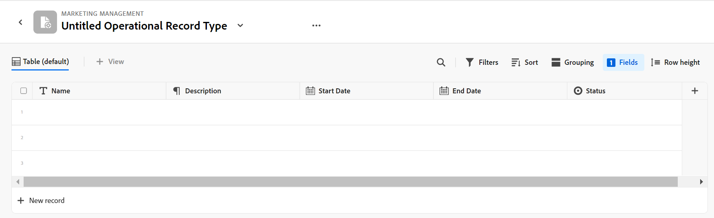

# Visão geral do Adobe Maestri

<!--udpate the metadata with real information when making this avilable in TOC and in the left nav-->

<!--see the separate article I wrote to have the PMs vet it for this: https://adobe-my.sharepoint.com/personal/alinaw_adobe_com/_layouts/15/doc.aspx?sourcedoc={79f94807-3d73-4015-afc0-5c016fc63cfc}&action=edit-->

<!--all the links are hidden for now, so I can share this with customer zero. Activate the links before making this public. -->

<!-- remove the references to closed beta from the entire article-->

>[!IMPORTANT]
>
>Atualmente, o Adobe Maestro faz parte de um programa beta fechado que está aberto a um número limitado de clientes.
>
>Entre em contato com seu representante de conta para obter mais informações sobre como participar do programa beta para o Maestro.

## Introdução ao Adobe Maestro

Adobe Maestro é uma nova oferta da Adobe Workfront. O objetivo do Maestri é desbloquear uma visibilidade abrangente dos detalhes operacionais de uma organização e responder a perguntas comerciais críticas em cada estágio do ciclo de vida do gerenciamento de trabalho.

Equipes e liderança precisam de respostas claras para perguntas como:

* Quantas campanhas estamos executando na EMEA no quarto trimestre?
* Temos sobreposições de público-alvo entre campanhas simultâneas?
* Como os programas de conscientização estão indo bem agora?
* Como os ativos se parecem para uma campanha específica? Quais deles ainda precisam ser aprovados?

Para responder a essas perguntas, a liderança precisa de uma solução que possa fornecer uma visão holística de cada estágio do trabalho, do planejamento à execução, da entrega à medição dos resultados. Atualmente, as organizações têm ferramentas que podem abranger algumas partes do processo, mas muitas não têm boas conexões com todas as fases do trabalho, nem podem fornecer resultados de forma confiável.

A seguir estão algumas das principais capacidades do Maestro:

* Resolva o problema de gerenciamento de trabalho em todos os estágios e para todas as partes interessadas que participam do processo de trabalho.
* Personalize totalmente seus workflows, desde decidir quais tipos de objeto (ou tipos de registro) sua organização usa até configurar como esses objetos se vinculam uns aos outros.
* Link para tipos de objetos de outros sistemas, criando uma estrutura coerente para todos os seus processos.

## Acesso necessário para usar o Maestro durante o programa beta fechado

>[!IMPORTANT]
>
>Atualmente, não há níveis de acesso ou permissões associados aos usuários ou às informações no Maestri. Todos os usuários podem exibir, editar e excluir todas as informações que qualquer outro usuário adicionar ao Maestro.

Para obter mais informações sobre o acesso necessário para usar o Maestro, consulte [Visão geral de acesso do Adobe Maestri](../maestro/access/access-overview.md).

<!-- hidden the table after I moved the content to the Access overview article: 

You must have the following access to use Adobe Maestro: 

<table style="table-layout:auto">
 <col>
 </col>
 <col>
 </col>
 <tbody>
    <tr>
<tr>
<td>
   
 Adobe product
 </td>
   <td>
   
 Adobe Workfront
 </td>
  </tr>  
 <td role="rowheader">
Adobe Workfront agreement
</td>
   <td>

Your organization must be enrolled in the Adobe Maestro closed beta program. Contact your account representative to inquire about this new offering. 

   </td>
  </tr>
  <tr>
   <td role="rowheader">
Adobe Workfront plan
</td>
   <td>

Any

   </td>
  </tr>
  <tr>
   <td role="rowheader">
Adobe Workfront license
</td>
   <td>
   
Any
 
  </td>
  </tr>
  
  <tr>
   <td role="rowheader">Access level</td>
   <td> 
Any
  
</td>
  </tr>

<tr>
   <td role="rowheader">Layout template</td>
   <td> 
Your system administrator must add the Maestro area in your layout template. For information, see <a href="../maestro/access/grant-access.md">Grant access to Adobe Maestro</a>. 
  
</td>
  </tr>
 </tbody>
</table>

************* Activate note when going to GA: 

>[!NOTE]
>
>If you still don't have access, ask your Workfront administrator if they set additional restrictions in your access level. For information on how a Workfront administrator can change your access level, see [Create or modify custom access levels](../administration-and-setup/add-users/configure-and-grant-access/create-modify-access-levels.md). 
-->

## Terminologia maestro

Embora o Maestri faça parte da Workfront, ele vem com conceitos e terminologia proprietários. Familiarize-se com os conceitos do Maestro antes de começar a configurar o Maestro para sua organização.

O quadro para o Maestro é totalmente personalizável. Você pode criar todos os tipos de registros, seus atributos e quaisquer campos associados a eles para atender às necessidades exatas de sua organização.

A seguir estão os principais objetos e conceitos do Maestro:

* **Workspace**: uma coleção de tipos de registros e taxonomias que definem o ciclo de vida operacional de uma determinada organização. Um espaço de trabalho é o quadro de trabalho de uma unidade organizacional.

  Uma instância do Workfront pode ter no máximo 1.000 espaços de trabalho.

  

  Para obter mais informações, consulte [Criar espaços de trabalho](../maestro/architecture-and-fields/create-workspaces.md).

* **Tipo de registro**: o tipo de objeto principal Maestri.

  Ao contrário do Workfront, onde os tipos de objetos são predefinidos, no Maestro, você pode criar seus próprios tipos de objetos.

  Por exemplo, no Workfront, os tipos de objeto de Programa, Portfolio, Projeto, Tarefa ou Problema já foram criados.

  No Maestro, você pode criar qualquer tipo de registro que atenda aos workflows da sua organização. Posteriormente, é possível definir como os tipos de registro se relacionam entre si ou as dependências do formulário.

  Para obter mais informações, consulte [Visão geral dos tipos de registros operacionais e taxonomias](../maestro/architecture-and-fields/overview-of-record-types-and-taxonomies.md).

  O Maestro tem os seguintes tipos de registros:

   * **Tipo de Registro Operacional**: um tipo de registro que representa planos estratégicos, iniciativas ou trabalho executado.

     

     Por exemplo, Campanha, Atividade, Programa podem ser tipos de registro operacional.

     Para obter mais informações, consulte [Criar tipos de registro](../maestro/architecture-and-fields/create-record-types.md).

   * **Taxonomia**: um tipo de registro que captura atributos sobre um tipo de registro operacional.

     

     Embora a criação de taxonomias seja idêntica à criação de tipos de registros operacionais, o Maestri distingue entre um tipo de registro operacional e um tipo de registro de taxonomia. O objetivo das taxonomias é aprimorar os tipos de registros operacionais. <!--this is no longer true, but might be later?!: A taxonomy is a record without dates, like a static list of attributes.-->

     Por exemplo, Público, Região ou Endereço podem ser tipos de registro do tipo taxonomia.

     Para obter mais informações, consulte [Criar tipos de registro de taxonomia](../maestro/architecture-and-fields/create-a-taxonomy.md).

* **Gravar**: uma instância de um tipo de registro Maestri. Um registro pode se referir a um tipo de registro operacional ou a uma taxonomia.

  
  

  Depois de adicionar um tipo de registro a um espaço de trabalho, você pode começar a adicionar registros desse tipo na página do tipo de registro.

  Por exemplo, &quot;Campanha&quot; pode ser um tipo de registro operacional e &quot;Campanha de verão para EMEA&quot; é um registro do tipo de registro Campanha

  Ou

  &quot;Região&quot; é um tipo de registro do tipo taxonomia, enquanto &quot;Américas-América Latina&quot; ou &quot;EMEA - Europa Central&quot; são registros taxonomia.

  Para obter mais informações, consulte [Criar registros](../maestro/records/create-records.md).

* **Modelo do Workspace**: é possível criar um espaço de trabalho usando modelos predefinidos. Você pode usar os tipos de registro, taxonomias e campos predefinidos incluídos em um modelo ou pode adicionar os seus próprios.

  

  O Maestri vem com um modelo de espaço de trabalho de Vendas, Marketing e Gerenciamento de Produtos.

  Para obter mais informações, consulte [Criar espaços de trabalho](../maestro/architecture-and-fields/create-workspaces.md).

* **Campos**: Campos são atributos que podem ser adicionados a tipos de registro operacionais ou de taxonomia que contêm informações sobre o tipo de registro. <!--check the shot below, "Connection" needs to be in lowercase-->

  

  Considerações sobre campos Maestri:

   * Os campos adicionados para um tipo de registro tornam-se automaticamente associados a todos os registros desse tipo e podem ser usados para capturar dados sobre esses registros.

   * Os campos são exibidos como colunas na exibição Tabela aplicada a uma página do tipo registro. Eles também são exibidos na página Detalhes do registro.

   * Os campos são exclusivos de um tipo de registro e não são transferidos de um tipo de registro para outro.

   * Os campos Maestri são totalmente personalizáveis e são acessíveis apenas no Maestro. Não é possível acessar os campos Maestro no Workfront.

  Para obter mais informações, consulte [Criar campos](../maestro/architecture-and-fields/create-fields.md)

  Por padrão, um novo tipo de registro operacional está associado aos seguintes campos predefinidos:

   * Nome
   * Descrição
   * Data de início
   * Data Final
   * Status

  Por padrão, um novo tipo de registro de taxonomia é associado a um campo Nome.

  Você pode criar campos personalizados dos seguintes tipos:

   * Texto de linha única
   * Parágrafo
   * Seleção múltipla
   * Seleção única
   * Data
   * Número
   * Percentagem
   * Moeda
   * Caixa de seleção

* **Tipos de registro vinculados**, **Registros vinculados**, e **Campos de registro vinculados**: Você pode criar uma conexão entre as seguintes entidades:

   * Dois tipos de registros Maestri
   * Um tipo de registro Maestri e um tipo de objeto de projeto, programa, portfólio, empresa ou grupo do Workfront.

  

  Depois de estabelecer uma conexão entre os tipos de registro, você pode conectar registros individuais desses tipos uns aos outros. A conexão entre os registros é exibida como um campo de registro vinculado.

* **Campos vinculados** (ou campos de pesquisa): depois de estabelecer a conexão entre dois tipos de registro e vincular registros individuais, é possível fazer referência aos campos dos registros vinculados no registro do qual você está se conectando.

  

  Para obter informações sobre como vincular tipos de registro, registros e criar campos vinculados, consulte os seguintes artigos:

   * [Conectar tipos de registro](../maestro/architecture-and-fields/connect-record-types.md)
   * [Conectar registros](../maestro/records/connect-records.md)

<!--not yet:* Fields are reusable across Record Types.  -->

* **Visualizações**: os registros são exibidos na respectiva página de tipo de registro em diferentes tipos de exibições.

  

  As exibições contêm configurações personalizadas de um tipo de exibição específico, como a lista de campos (colunas), uma lista de registros (linhas), sua ordem (classificação), um filtro e agrupamento aplicados ou aplicáveis.

  A seguir estão os tipos de exibição que podem ser aplicados à página tipo de registro:

   * **Visualização em tabela**: exibe registros e seus campos em formato de tabela. As linhas da tabela são os registros individuais e as colunas são os campos de registro. Essa é a exibição padrão.

     

   * **Exibição da linha do tempo**: exibe registros que têm pelo menos dois campos de Data em uma linha do tempo cronológica.

     

  Para obter mais informações, consulte [Gerenciar exibições de registro](../maestro/views/manage-record-views.md).

## Limitações de objeto maestro

A tabela a seguir mostra os limites para quantos objetos você pode criar no Maestro. As limitações estão sujeitas a mudanças conforme avançamos para as próximas fases do desenvolvimento do Maestro.

| Objeto maestro | Limite |
|-------------------------------------------------------------------------------|:---------------------------------------------------------------------------------------------------------------:|
| Número de espaços de trabalho para uma instância do Workfront | 1,000 |
| Número de Tipos de Registro para um espaço de trabalho | 1.000 (isso inclui taxonomias para o espaço de trabalho ou objetos que você importa de aplicativos de terceiros) |
| Número de registros de um tipo de registro | 10,000 |
| Número de campos para um tipo de registro ou taxonomia | 500 |
| Número de caracteres de um campo de texto | 1.000 caracteres |
| Tamanho do arquivo que você pode colar em uma tabela do tipo record | 1MB |
| Tamanho do arquivo que você pode importar por meio da API para uma tabela de tipo de registro | 1.5MB |
| A velocidade com a qual as solicitações de API podem ser feitas | 200 solicitações por minuto |
| Tamanho do CSV do arquivo do Excel que pode ser importado em uma tabela | 5MB |

## Habilite o Maestri para os usuários em sua instância do Workfront

Sua organização deve se inscrever no programa beta fechado do Adobe Maestro antes que você possa acessar o Maestro. Entre em contato com seu representante de conta para obter informações sobre como se inscrever no programa beta.

Para obter mais informações sobre como conceder acesso e permitir que outros usem o Maestro, consulte [Conceder acesso ao Adobe Maestro](../maestro/access/grant-access.md).

<!--hidden this after moved it to a separate article

After your organization has been enrolled in the Maestro beta program, you can add the Maestro area for other users by using a layout template. 

To share the Maestro area using a layout template: 

1. Log in to Workfront as a system administrator.  

1. Add the Maestro icon to the Main Menu using a Layout Template. For information, see [Customize the Main Menu using a layout template](../administration-and-setup/customize-workfront/use-layout-templates/customize-main-menu.md). 

1. Assign the  layout template to the users that you want to have access to Maestro.For information, see [Assign users to a layout template](../administration-and-setup/customize-workfront/use-layout-templates/assign-users-to-layout-template.md).

    All users who can access Maestro in their Main Menu can start creating workspaces, records types, records, and fields.  
  -->

## Localizar Maestro

Certifique-se de que sua organização recebeu acesso ao Maestro e que seu administrador de sistema ou grupo adicionou a área Maestri ao menu principal.

Para localizar o Maestro:

1. Faça logon no Adobe Workfront.

1. Clique em **Menu principal**  no canto superior direito ou clique no botão **Menu principal**  no canto superior esquerdo, se estiver disponível.

1. Clique em **Maestro** .

   A área Espaços de trabalho maestro é aberta.

1. (Opcional e recomendado) Continue com algumas das seguintes ações para criar sua estrutura de trabalho no Maestri:

   1. Crie um espaço de trabalho do zero ou usando um modelo.

   1. Adicione tipos de registro ao novo espaço de trabalho.

   1. Adicione taxonomias aos novos espaços de trabalho.

   1. Clique no nome de um tipo de registro para abrir a página do registro. Por padrão, a página de registro é aberta na exibição Tabela.

   1. Personalize a visualização Tabela seguindo um destes procedimentos:

      * Adicione mais campos ao tipo de registro clicando no **+** no canto superior direito. As colunas na exibição são campos associados ao tipo de registro.
      * Adicionar registros clicando no ícone **+** no canto inferior esquerdo. As linhas na exibição são registros exclusivos do tipo de registro selecionado.
      * Clique em **Filtros** para filtrar as informações exibidas na página tipo de registro.

   1. Clique no nome de um registro para exibir mais informações na página Detalhes do registro.

   1. Criar uma exibição de Linha do tempo na **Exibir** no canto superior direito da página tipo de registro.

   1. Personalize a exibição da linha do tempo atualizando Filtros, Agrupamentos ou Configurações.

## Recursos atualmente disponíveis em Maestro

A tabela a seguir ilustra os principais recursos que estarão disponíveis no Maestro, e uma linha do tempo de sua disponibilidade. A lista não inclui todos os recursos.

| Recurso | Disponível agora | Disponível em breve | Em pesquisa |
|----------------------------------------------------|:-----------------------------:|:--------------------------------:|:----------------:|
| Criar espaços de trabalho | ✓ µ |                                  |                  |
| Criar tipos de registro operacional | ✓ |                                  |                  |
| Criar taxonomias | ✓ |                                  |                  |
| Criar registros e taxonomias individuais e nomeados | ✓ |                                  |                  |
| Criar campos personalizados de registro | ✓ |                                  |                  |
| Importar tipos e campos de registro usando um arquivo Excel ou CSV | ✓ |                                  |                  |
| Vincular registros | ✓ |                                  |                  |
| Exibir registros em uma tabela | ✓ |                                  |                  |
| Exibir registros em uma linha do tempo | ✓ |                                  |                  |
| Filtrar registros | ✓ |                                  |                  |
| Agrupar registros na exibição de linha do tempo | ✓ |                                  |                  |
| Agrupar registros na exibição de tabela |                               | ✓ |                  |
| Classificar registros na exibição de tabela | ✓ |                                 |                  |
| Classificar registros na exibição de linha do tempo |                               | ✓ |                  |
| Classificar agrupamentos na exibição de tabela |                               | ✓ |                  |
| Classificar agrupamentos na exibição de linha do tempo |                               | ✓ |                  |
| Conectar espaços de trabalho |                               | ✓ |                  |
| Conectar registros e taxonomias do Maestri | ✓ |
| Conecte registros do Maestro a projetos, programas, portfólios, empresas e grupos da Workfront | ✓ |                                 |                  |
| Página de detalhes do registro | ✓ |                                  |                  |
| Atualizar o layout da página Detalhes do registro |                               | ✓ |                  |
| Níveis de acesso e permissões | | ✓ |  |
| Enviar solicitações |                               |                                  | ✓ |
| Resumo criativo |                               |                                  | ✓ |
| Personalizar a cor e o ícone de um registro | ✓ |                                  |                 |

## Atividade de lançamento do Maestri

Estamos lançando novos recursos para Maestro regularmente. Para obter uma lista atualizada dos recursos lançados, consulte [Atividade de lançamento do Adobe Maestri](../maestro/release-activity.md).

<!--moved the contents of this whole section to its own article: release-activity.md, in the same folder

This section lists the features and patches that have been released after the launch of the Maestro closed beta program, on May 22, 2023. 

The features are released weekly and are listed in the order of their release, with the most recent first. Customers who are participating in the Maestro closed beta program can access all features in their Preview and Production environments. 

### Week of September 4, 2023

#### Connect Maestro records with Workfront companies and groups

Preview and production: September 5, 2023  

You can now connect a Maestro record with Workfront companies and groups. You must first create a connection between a Maestro record type and the Workfront companies and groups object types. Then, you can connect a single Maestro record of the selected record type to individual Workfront companies and groups.  

Consider the following:  

* You must create a connection between Maestro record types and Workfront companies and groups for each Workspace.  

* You cannot connect taxonomy record types with Workfront object types. 

* You can connect multiple Maestro records to the same Workfront company or group, and multiple companies or groups to the same Maestro record.  

* You cannot edit companies or groups in Maestro. All company or group changes performed in Workfront are visible in Maestro, when reviewing the Maestro linked records.  

#### URL support for single-line text fields 

Preview and production: September 7, 2023 

For better visibility when working with links in the Table view, we have added support for URLs in single-line text fields. Using URLs to other websites or external drives when updating a single-line text field, now identifies them as links and allows you to click them from the table.  

### Week of August 28, 2023

#### Field visibility menu for the Table View toolbar

Preview and production: August 31, 2023

To display the right information on a given set of records, especially if you intend to share the view with others who need to see some but not all fields of a record type, you can now select which fields (or columns) to display and which to hide in the Table view.  

You can hide or show individual fields, from each header of the field columns, or you can manage all fields of the record type from a setting in the table view toolbar.  

### Week of August 21, 2023

#### Connect Maestro records to programs and portfolios 

Preview and production: August 24, 2023

You can now connect a Maestro record with Workfront programs and portfolios. You must first create a connection between a Maestro record type and a program or portfolio which creates a connected field. Then, you can connect any Maestro records from all other record types within the same workspace to specific programs and portfolios which will create a read-only Workfront Program or Workfront Portfolio record type in the same workspace. Consider the following:

* Workfront connector record types are unique for each workspace. 
* You can connect multiple Maestro records to the same Workfront program or portfolio, and multiple programs and portfolios to the same Maestro record. 
* You cannot edit programs and portfolios in Maestro. All program and portfolio changes performed in Workfront are visible in Maestro, when reviewing the linked records. 

#### New sorting functionality for the table view

Preview and production: August 24, 2023

You can now sort records in the table view of a record type page. 
The following capabilities are now available: 

* Sorting at the table-level, where you can sort by multiple fields at the same time. 
* Sorting at the column or field-level, where you can sort by an individual field at a time.

#### Improvements to the timeline view: new look-and-feel for groupings and the Compact/ Standard view switch

Preview and production: August 24, 2023

We have introduced the following improvements to the timeline view: 

* You can now display the timeline view in the following modes:

    * Standard: Displays records in separate lines.
    * Compact: Display the records whose dates don't intersect on the same line. 

* We have changed the look-and-feel of the grouping lines in the timeline view to display above the timeline of the records they contain. Prior to this improvement, the grouping lines displayed across the entire length of the timeline.

### Week of August 14, 2023

#### Reorder columns in the table view

You can now reorder columns in the Maestro table view. Consider the following when reordering columns: 

* The Name field is always the first field in the table view of a record type page 

* You cannot move the Name field to another position 

* The Name field is frozen and is not part of the horizontal scroll. 

#### Horizontal scroll for timeline view

You can now scroll horizontally in the timeline view of a record type. 

### Week of August 7, 2023

#### Import record types from an Excel file 

Preview and production: August 10, 2023

You can now import an Excel file to create record types in a workspace. The sheets of the file become the record types, and the columns of the file become their respective fields.  

#### Improved experience for connecting record types and projects 

Preview and production: August 10, 2023

We have improved the way you connect record types, including connecting to Workfront projects. As part of this improvement, we made the following changes when adding a field for a record type from the table view:  

* Removed the Relationship-type field from the "New field" tab.  

* Add a "New connection" tab where you can directly select the record or object type you want to connect to, eliminating the need for a Relationship-type field. 

### Week of July 10, 2023

#### Update the appearance of a record type

Preview and production: July 13, 2023

You can now select a custom icon for a record type, as well as a custom color for the record type icon.  

#### New Checkbox field type

Preview and production: July 13, 2023 

You can now add a Checkbox field type to Maestro record types. You can use the Checkbox field type to add a single checkbox option to a record. You can use this field to indicate a specific attribute or status for that particular record. For example, you can use it as a flag for tracking completion, approval, or any other binary attribute for each record.  

### Week of June 26, 2023

#### Quick activation of the contextual menu in a table

Preview and production: June 28, 2023
 
We have enabled the ability to activate the contextual menu by right-clicking anywhere in a record row, when viewing the records in the table view or a record type. You can now quickly view, delete, or copy a link to the record's Details page when you access the contextual menu from anywhere in the table view of a record type. Prior to this enhancement, the contextual menu was accessible only from the More menu in the Name column of a record.  

### Week of June 19, 2023

#### Record field names are unique

We have introduced a requirement now that the field names of a Maestro record type should have unique names. Fields that belong to different record types do not have to have unique names.  

### Week of June 5, 2023

#### Connect Maestro records with Workfront projects

Preview and production: June 5, 2023

You can now connect a Maestro record with Workfront projects. You must first create a connector Maestro record type to establish the connection between Maestro records and Workfront projects. Then, you can connect any Maestro records from all other record types to the connector record using the Relationship field. Consider the following:

* You must have a connector record type for Workfront for each Workspace. 
* You can connect multiple Maestro records to the same Workfront project, and multiple projects to the same Maestro record. 
* You cannot edit projects in Maestro. All project changes performed in Workfront are visible in Maestro, when reviewing the linked records. 

### Week of May 29, 2023

#### Two-date requirement for creating a Timeline view

Preview and production: May 31, 2023  

You must have at least two date fields associated with a record type in order to create a Timeline view. 
-->

