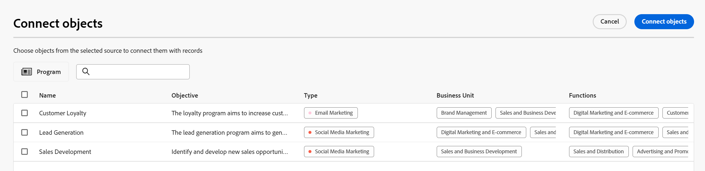

<!--when you make this live, update the metadata above to this: 
---
title: Connect records and objects
description: In addition to connecting Maestro records to one another, you can also connect Maestro records to objects from other applications.  
topic: Architecture
role: User
hidefromtoc: yes
hide: yes
---
-->
<!--update the metadata with real information when making this available in TOC and in the left nav-->

<!--if you change steps here, also update steps in the "Connect records" article-->

# Conectar registros

{{planning-important-intro}}

É possível conectar registros do Adobe Workfront Planning uns aos outros ou a objetos de outros aplicativos.

Primeiro, você deve conectar dois tipos de registro um ao outro ou um tipo de registro a um tipo de objeto de outro aplicativo. Isso cria campos de registro vinculados. Em seguida, é possível conectar registros uns aos outros ou registros a outros objetos de outros aplicativos usando os campos de registro vinculados.

A conexão de registros é semelhante à conexão de registros a objetos de outro aplicativo.

Para obter informações sobre como conectar tipos de registro entre si ou a tipos de objeto de outros aplicativos, consulte [Conectar tipos de registro](../architecture/connect-record-types.md).

Para obter um exemplo de conexão de tipos de registro, consulte [Exemplo de conexão de tipos de registro e registros](../architecture/example-connect-record-types-and-records.md).

Você pode conectar o seguinte:

* Registros do Adobe Workfront Planning
* O Adobe Workfront Planning registra com objetos de outros aplicativos.

  É possível conectar registros a objetos dos tipos listados abaixo a partir dos seguintes aplicativos:

   * Adobe Workfront

      * Projetos
      * Portfólios
      * Programas
      * Empresa
      * Grupo

   * Adobe Experience Manager Assets

      * Arquivos de imagem
      * Pastas

  <!--when you add more objects, fix the Access Requirements below which right now refer only to projects-->

## Requisitos de acesso

Você deve ter o seguinte acesso para executar as etapas deste artigo:

<table style="table-layout:auto">
 <col>
 </col>
 <col>
 </col>
 <tbody>
    <tr>
<tr>
<td>Produto
 </td>
   <td>
   
 Adobe Workfront
 
   
Para conectar os registros do Adobe Workfront Planning ao Experience Manager Assets, você deve ter uma licença do Adobe Experience Manager Assets e a instância da Workfront de sua organização deve ser integrada à Experiência unificada do Adobe. Para obter informações, consulte <a href="/help/quicksilver/workfront-basics/navigate-workfront/workfront-navigation/adobe-unified-experience.md">Experiência unificada do Adobe para Workfront</a>.

   </td>
  </tr>  
 <td role="rowheader">
contrato do Adobe Workfront
</td>
   <td>

Sua organização deve estar inscrita no programa beta fechado do Adobe Workfront Planning. Entre em contato com seu representante de conta para obter mais informações sobre esta nova oferta. 

   </td>
  </tr>
  <tr>
   <td role="rowheader">
plano do Adobe Workfront
</td>
   <td>

Qualquer

   </td>
  </tr>
  <tr>
   <td role="rowheader">
Licença do Adobe Workfront
</td>
   <td>
   
Qualquer
 
  </td>
  </tr>

<tr>
   <td role="rowheader">
Configuração do nível de acesso
</td>
   <td> 
Não há controles de nível de acesso para o Workfront Planning
  
</td>
  </tr>
<tr>
   <td role="rowheader">
Permissões
</td>
   <td> 
Gerenciar permissões em um espaço de trabalho para conectar registros 
  
   
Permissões de exibição ou mais altas em um espaço de trabalho para exibir todas as conexões com objetos e campos de outros aplicativos, independentemente do acesso em outro aplicativo. 

   
Os administradores do sistema têm permissões para todos os espaços de trabalho, incluindo aqueles que não criaram.

</td>
  </tr>

<tr>
   <td role="rowheader">
Modelo de layout
</td>
   <td> 
O administrador do Workfront ou do grupo deve adicionar a área do Planning ao modelo de layout. Para obter informações, consulte <a href="../access/access-overview.md">Visão geral do Access</a>. 
  
</td>
  </tr>

</tbody>
</table>

<!--Maybe enable this at GA - but Maestro is not supposed to have Access controls in the Workfront Access Level: 
>[!NOTE]
>
>If you don't have access, ask your Workfront administrator if they set additional restrictions in your access level. For information on how a Workfront administrator can change your access level, see [Create or modify custom access levels](../administration-and-setup/add-users/configure-and-grant-access/create-modify-access-levels.md). -->

## Considerações sobre a conexão de registros

* Depois de conectar os tipos de registro, os tipos de registro conectados são exibidos como campos de registro vinculados na tabela dos tipos de registro a partir dos quais estão vinculados e nas páginas dos registros.
* Você pode procurar e adicionar registros e objetos do registro vinculado e tipos de objeto a partir dos campos de registro vinculados.
* É possível adicionar campos dos tipos de registro vinculados à tabela do tipo de registro a partir do qual você está vinculando.
* Não é possível atualizar manualmente os valores de campos vinculados nos registros a partir dos quais você está vinculando.

  Os valores dos campos vinculados dos registros vinculados preenchem automaticamente o registro do Workfront Planning a partir do qual você está vinculando a partir do registro ou objeto original.

* Todos os usuários com acesso ao Workfront Planning and View ou com permissões mais altas para o espaço de trabalho podem ver as conexões que você faz entre registros ou entre registros e objetos de outros aplicativos. Eles podem exibir registros e objetos conectados independentemente de suas permissões nos aplicativos aos quais você está se conectando.
* Você poderá exibir e editar as conexões de todos os outros usuários se tiver permissões de Gerenciamento para o espaço de trabalho em que os registros conectados estão.
* É possível conectar um registro a um ou vários objetos de outro aplicativo.
* Para vincular registros a outros registros ou objetos, você deve ter o seguinte:

   * Pelo menos um espaço de trabalho, tipo de registro e registro.

     Para obter mais informações, consulte os seguintes artigos:

      * [Criar espaços de trabalho](../architecture/create-workspaces.md)
      * [Criar tipos de registro](../architecture/create-record-types.md)
      * [Criar registros](../records/create-records.md)

   * Conexões entre tipos de registro ou entre tipos de registro e objetos de outros aplicativos. Para obter informações, consulte [Conectar tipos de registro](../architecture/connect-record-types.md)
* Você pode conectar objetos do Workfront aos registros do Workfront Planning nas seguintes áreas:
   * De um registro do Planning no Workfront Planning.
   * Na seção Planejamento de um objeto do Workfront.

## Conectar registros do Workfront Planning

### Conectar registros do Adobe Workfront Planning

{{step1-to-maestro}}

O espaço de trabalho acessado por último deve ser aberto por padrão.

1. (Opcional) Expanda a seta apontando para baixo à direita de um nome de espaço de trabalho existente e selecione o espaço de trabalho do qual deseja conectar registros.
1. Clique no cartão de um tipo de registro para abrir a página do tipo de registro.
1. Selecione um **Tabela** exibir do **Exibir** no canto superior direito da página tipo de registro.
1. (Opcional) Adicione registros ao tipo de registro selecionado adicionando uma nova linha à tabela. Para obter informações, consulte [Criar registros](../../maestro/records/create-records.md).
1. (Condicional) Depois de conectar o tipo de registro selecionado a outro tipo de registro, vá para a coluna de registro vinculada e clique duas vezes na célula correspondente ao registro que deseja vincular a outros registros.

   

1. Siga um destes procedimentos:

   * Clique no nome de um registro conectado na lista para adicioná-lo ao registro selecionado. O registro é adicionado automaticamente.
   * Comece a digitar o nome de um registro e clique nele quando ele for exibido na lista. O registro é adicionado automaticamente.
   * Clique em **Ver tudo** para exibir todos os registros.

1. (Condicional) Se você clicou em **Selecionar tudo** na etapa anterior, a variável **Conectar objetos** é exibida.

   

1. Comece a digitar o nome de um registro na caixa de pesquisa e selecione-o quando ele for exibido na lista

   Ou

   Selecione o nome de um ou vários registros na caixa e clique em **Conectar objetos** no canto superior direito da caixa Conectar objetos.

   >[!TIP]
   >
   >    É possível abrir a página de um registro, localizar o campo de registro vinculado e clicar em **Conectar registros** no campo para adicionar registros do registro conectado ou do tipo de objeto.
   >
   >

   São aditados os seguintes pontos:

   * Os registros vinculados são exibidos no campo do registro vinculado selecionado na etapa 6. <!--accurate?-->
   * Os campos vinculados são preenchidos com as informações dos registros vinculados, se você tiver adicionado campos de pesquisa vinculados ao conectar os tipos de registro.

   A atualização dos registros vinculados atualiza os campos vinculados para os registros dos quais você está vinculando automaticamente. Não é possível editar manualmente campos vinculados.

   >[!TIP]
   >
   >* Usamos &quot;campos vinculados&quot; e &quot;campos de pesquisa&quot; alternadamente.
   >
   >* Se você ativou o **Permitir vários registros** definindo quando você conectou os tipos de registro, os valores dos campos para os vários objetos selecionados serão exibidos separados por vírgulas ou agregados de acordo com o agregador escolhido.

1. (Opcional) Feche a página de tipo de registro e vá para o espaço de trabalho selecionado.
1. Clique no cartão do tipo de registro ao qual você está vinculado.

   Por exemplo, se você conectou o **Campaign** com o registro Produto, clique no botão **Produto** cartão.

   O cartão de tipo de registro deve ser aberto na exibição Tabela. Caso contrário, selecione uma exibição de tabela.

   Observe que **Campaign** o campo linked record exibe os nomes das campanhas vinculadas aos produtos na página Product record type. Atualizar as informações de Campanha atualiza automaticamente o campo de registro vinculado Campanha para o tipo de registro Produto.

### Conectar registros do Adobe Workfront Planning a objetos do Workfront

<!--when we will have more applications to link to from Maestro, change the title to something like: Connect Maestro records to objects from other applications-->

Depois de criar uma conexão entre um tipo de registro e um tipo de objeto do Workfront, você pode conectar registros individuais a objetos no Workfront. Os campos do Workfront conectados são automaticamente preenchidos nos registros dos quais você está vinculando os objetos.

>[!NOTE]
>
>Não é possível conectar tipos de objeto do Workfront com tipos de registro do Workfront Planning no Workfront.

{{step1-to-maestro}}

O espaço de trabalho acessado por último deve ser aberto por padrão.

1. (Opcional) Expanda a seta apontando para baixo à direita de um nome de espaço de trabalho existente e selecione o espaço de trabalho do qual deseja conectar registros.
1. Clique no cartão de um tipo de registro para abrir a página do tipo de registro.
1. Selecione um **Tabela** exibir do **Exibir** menu suspenso.

1. Clique em **Novo registro**  para adicionar registros individuais ao tipo de registro selecionado. Para obter informações, consulte [Criar registros](../../maestro/records/create-records.md).
1. (Condicional) Depois de conectar o tipo de registro selecionado a um tipo de objeto do Workfront, vá para a coluna de objeto vinculado e clique duas vezes na célula correspondente ao registro que deseja vincular a objetos do Workfront.

   

1. Siga um destes procedimentos:

   * Clique em um objeto da lista para adicioná-lo ao registro selecionado. Os objetos são listados em ordem alfabética. O objeto é adicionado automaticamente.
   * Comece a digitar o nome de um objeto e clique nele quando ele for exibido na lista. O objeto é adicionado automaticamente.
   * Clique em **Ver tudo** para exibir todos os objetos aos quais você tem pelo menos permissões.

1. (Condicional) Se você clicou em **Ver tudo** na etapa anterior, a variável **Conectar objetos** é exibida.

   

1. Comece digitando o nome de um objeto Workfront na caixa de pesquisa e selecione-o quando ele for exibido na lista

   Ou

   Selecione o nome de um ou vários objetos na caixa e clique em **Conectar objetos** no canto superior direito da caixa Conectar objetos.

   >[!IMPORTANT]
   >
   >* Você só pode adicionar objetos Workfront para os quais tem acesso.
   >
   >* Depois de adicionar objetos do Workfront, todos os que têm permissões de Exibição ou superiores no espaço de trabalho poderão exibir os objetos do Workfront e suas informações de campo, independentemente de suas permissões ou acesso no Workfront.

   São aditados os seguintes pontos:

   * Os objetos Workfront selecionados são adicionados ao campo de registro vinculado.
   * Se você os tiver adicionado ao conectar o tipo de registro ao Workfront, os campos vinculados (ou os campos de pesquisa) dos objetos do Workfront serão automaticamente preenchidos com informações do Workfront.

   >[!TIP]
   >
   >É possível abrir a página de um registro, localizar o campo de registro vinculado e clicar no **+** ícone no campo para adicionar objetos do tipo de objeto conectado.

   Para obter mais informações sobre como conectar tipos de registro a objetos de outro aplicativo, consulte [Conectar tipos de registro](../architecture/connect-record-types.md).

1. (Opcional) Clique no nome de um objeto do Workfront conectado a um registro do Workfront Planning no campo vinculado de uma exibição de tabela ou no campo vinculado na página de registro.

   Isso abre a página somente leitura de registro do Workfront Planning para o objeto vinculado do Workfront. Os campos selecionados como campos de pesquisa quando você conectou o tipo de registro ao objeto do Workfront são exibidos na página de registro do Workfront Planning.

   >[!TIP]
   >
   >* Quando você ativa a configuração Permitir vários registros, os valores dos campos de pesquisa são exibidos separados por vírgulas ou agregados de acordo com o agregador escolhido.
   >
   >* Um campo de registro vinculado não é criado para os objetos vinculados do Workfront no Workfront.

1. (Opcional) Para abrir o objeto vinculado do Workfront no Workfront, clique em **Ir para origem** no canto superior direito da página registro do objeto do Workfront.

   

   Isso abrirá a página do objeto do Workfront, se você tiver pelo menos permissões de Exibição para exibir o objeto. Você pode editar informações sobre o objeto do Workfront, se tiver permissões para isso.

1. (Opcional) Na exibição de tabela do tipo de registro, passe o mouse sobre o cabeçalho da coluna do objeto vinculado do Workfront, clique no menu suspenso e, em seguida, clique em **Editar campos de pesquisa**.

1. Adicionar campos de objeto do Workfront a partir do **Campos não selecionados** área

   Ou

   Remover campos de objeto do Workfront da **Campos selecionados** área.

   Isso adiciona ou remove campos vinculados dos registros do Workfront Planning. As informações associadas aos campos removidos permanecem no Workfront.

### Conectar registros do Workfront Planning a objetos do Adobe Experience Manager

<!--when we will have more applications to link to from Maestro, change the title to something like: Connect Maestro records to objects from other applications-->

>[!IMPORTANT]
>
>Você deve ter uma licença do Adobe Experience Manager Assets e a instância da Workfront de sua organização deve estar integrada à Plataforma de negócios Adobe ou à Adobe Admin Console para poder conectar os registros do Workfront Planning à Adobe Experience Manager Assets.
>
>Em caso de dúvidas sobre a integração com a Adobe Admin Console, consulte [Perguntas frequentes sobre a experiência unificada do Adobe](/help/quicksilver/workfront-basics/navigate-workfront/workfront-navigation/unified-experience-faq.md).

Depois de criar uma conexão entre um tipo de registro e o Adobe Experience Manager Assets, você pode conectar registros individuais a ativos Experience Manager. Os campos de ativos que você conectou pelo Experience Manager Assets ao criar a conexão são preenchidos automaticamente no tipo de registro que você vinculou.

{{step1-to-maestro}}

O espaço de trabalho acessado por último deve ser aberto por padrão.

1. (Opcional) Expanda a seta apontando para baixo à direita de um nome de espaço de trabalho existente e selecione o espaço de trabalho do qual deseja conectar registros.
1. Clique no cartão de um tipo de registro para abrir a página do tipo de registro.
1. Selecione um **Tabela** exibir do **Exibir** no canto superior direito da página tipo de registro.

1. (Opcional) Clique em **Novo registro** para adicionar novos registros ao tipo de registro selecionado. Para obter informações, consulte [Criar registros](../../maestro/records/create-records.md).
1. (Condicional) Depois de conectar o tipo de registro selecionado ao Experience Manager Assets, vá para a coluna de objetos vinculados e passe o mouse sobre a célula correspondente ao registro que deseja vincular com outros objetos do Experience Manager e clique no botão **+** ícone.

   >[!TIP]
   >
   >  Você pode adicionar, clique no link **+** ícone no campo objeto vinculado na página registro para conectar ativos ao registro.

   A variável **Selecionar ativos** é exibida. <!--we might change this to Connect assets-->

   

1. Clique em para selecionar alguns dos seguintes tipos de ativos:

   * Imagens
   * Pastas

   É possível selecionar vários ativos.

   >[!IMPORTANT]
   >
   > Você pode conectar somente ativos que você tenha acesso para visualizar no Experience Manager. Depois de conectados, todos os usuários do Workfront Planning podem exibir os ativos no Workfront Planning, independentemente do acesso deles ao Experience Manager Assets.

1. Clique em **Selecionar**. <!-- we might change this to Connect-->

   São aditados os seguintes pontos:

   * Os ativos de Experience Manager selecionados são adicionados ao campo de registro vinculado.
   * Os campos vinculados (ou campos de pesquisa) são preenchidos com informações dos ativos conectados ao Experience Manager.

     Todas as informações existentes nos campos dos ativos de Experience Manager são exibidas nos campos vinculados ou de pesquisa automaticamente.

     >[!TIP]
     >
     >* Se você ativou a configuração Permitir vários registros, os valores dos vários objetos serão exibidos separados por vírgulas ou agregados de acordo com o agregador escolhido.
     >
     >* Um campo de registro vinculado aos registros vinculados do Workfront Planning não é criado para os ativos de Experience Manager vinculados no aplicativo Experience Manager Assets.

1. (Opcional) Vá para o tipo de registro vinculado ao Experience Manager Assets a partir de e clique no nome de um ativo no campo de registro vinculado. Os detalhes do Experience Manager do ativo são exibidos em uma janela pop-up. <!--update screen shot with hi-rez picture-->

   

   Os seguintes campos são exibidos para um arquivo de imagem:

   * Uma miniatura da imagem
   * O nome do arquivo de imagem
   * Dimensões
   * Tamanho
   * Descrição
   * O caminho do arquivo no Experience Manager
   * O tipo de ativo
   * Data de criação
   * Data de modificação

1. (Opcional) Para abrir a página de registro de ativos Experience Manager no Experience Manager, vá para a página de tipo de registro do registro que está sendo vinculado, clique no nome de um ativo no campo de registro vinculado para abrir a janela pop-up e, em seguida, clique na guia **Abertura** ícone  para abrir o ativo.

   Isso abre o ativo Experience Manager no Adobe Experience Manager Assets.

1. (Opcional) Na exibição de tabela do tipo de registro, passe o mouse sobre o cabeçalho da coluna do ativo de Experience Manager vinculado, clique no menu suspenso e, em seguida, clique em **Editar campos de pesquisa**.

1. Adicionar campos de objeto do Experience Manager Assets a partir do **Campos não selecionados** área

   Ou

   Remover campos de objeto do Workfront da **Campos selecionados** área.

   Isso adiciona ou remove campos vinculados dos registros. As informações associadas aos campos removidos permanecem no Adobe Experience Assets.

## Conectar registros de objetos do Workfront

Você deve ter as seguintes opções para conectar os registros do Workfront Planning a partir de objetos do Workfront:

* Conexões entre tipos de registro e tipos de objeto do Workfront.
* Pelo menos uma conexão entre um registro e um objeto Workfront.
* O administrador do Workfront ou do grupo deve adicionar a seção Planning aos tipos de objeto do Workfront que podem se conectar aos tipos de registro do Planning.

Para obter mais informações, consulte [Gerenciar registros na seção Planning de objetos do Adobe Workfront](/help/quicksilver/maestro/records/manage-records-in-planning-section.md).
