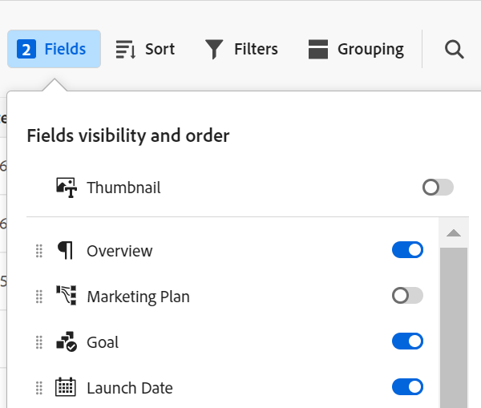

# Gerenciar a exibição de tabela

<!--
title: Manage the table view
description: You can display records in a table view when using Adobe Maestro. 
hidefromtoc: yes
author: Alina
feature: Work Management
role: User
hide: yes
-->

<!--update the metadata with real information when making this available in TOC and in the left nav-->

>[!IMPORTANT]
>
>As informações neste artigo referem-se ao Adobe Maestro, que é uma nova oferta da Adobe Workfront.
>
>Atualmente, o Adobe Maestro faz parte de um programa beta aberto a um número limitado de clientes. Você deve ser um cliente do Workfront para usar os recursos do Maestro.
>
>Entre em contato com seu representante de conta para obter mais informações sobre como participar do programa beta para o Maestro.
>
>Para obter informações, consulte [Visão geral do Adobe Maestri](../maestro-overview.md).

Você pode exibir registros e seus campos em uma exibição de tabela, ao acessar a página de tipo de registro no Adobe Maestro.

Para obter informações sobre as visualizações do Maestro e como gerenciá-las, consulte [Gerenciar exibições de registro](../views/manage-record-views.md).

## Requisitos de acesso

Você deve ter o seguinte acesso para executar as etapas deste artigo:

<table style="table-layout:auto">
 <col>
 <tbody>
<td>
   
 produto Adobe
 </td>
   <td>
   
 Adobe Workfront
 </td>
  </tr>  
 <td role="rowheader">
contrato do Adobe Workfront
</td>
   <td>

Sua organização deve estar inscrita no programa beta fechado do Adobe Maestro. Entre em contato com seu representante de conta para obter mais informações sobre esta nova oferta. 

   </td>
  </tr>
  <tr>
   <td role="rowheader">
plano do Adobe Workfront
</td>
   <td>

Qualquer

   </td>
  </tr>
  <tr>
   <td role="rowheader">
Licença do Adobe Workfront
</td>
   <td>
   
Qualquer
 
  </td>
  </tr>

<tr>
   <td role="rowheader">Nível de acesso</td>
   <td> 
Qualquer
  
</td>
  </tr>
<tr>
   <td role="rowheader">Modelo de layout</td>
   <td> 
O administrador do sistema deve adicionar a área Maestro no modelo de layout. Para obter informações, consulte <a href="../access/grant-access.md">Conceder acesso ao Adobe Maestro</a>. 
  
</td>
  </tr>
 </tbody>
</table>

<!--Maybe enable this at GA - but Maestro is not supposed to have Access controls in the Workfront Access Level: 
>[!NOTE]
>
>If you don't have access, ask your Workfront administrator if they set additional restrictions in your access level. For information on how a Workfront administrator can change your access level, see [Create or modify custom access levels](../administration-and-setup/add-users/configure-and-grant-access/create-modify-access-levels.md). -->

<!-- Notes to add for the table: for the "Workfront plans" row: the above is only for closed beta; when going to GA - activate the following plans:    

Current plan: Prime and Ultimate

Legacy plan: Enterprise
-->

<!-- Notes for the table: for the "Workfront access" row: 
For more information, see <a href="../../administration-and-setup/add-users/access-levels-and-object-permissions/wf-licenses.md" class="MCXref xref">Adobe Workfront licenses overview</a>.
-->

## Gerenciar uma exibição de tabela {#manage-a-table-view}

<!--insert screen shot of table view-->

Ao criar uma exibição de tabela, todos os registros do tipo selecionado são exibidos em uma tabela. Cada linha é um registro exclusivo e cada coluna é um campo de registro. Todos os campos e registros são exibidos por padrão.

Para gerenciar uma exibição de tabela:

1. Crie uma exibição de tabela, conforme descrito no artigo [Gerenciar exibições de registro](../views/manage-record-views.md).

   

1. Atualize os seguintes elementos de exibição conforme descrito nas subseções abaixo:
   * [Colunas (ou campos)](#add-columns-or-fields)
   * [Linhas (ou registros)](#add-rows-or-records)
   * [Filtros](#add-filters)
   * [Agrupamento](#add-groupings)
   * [Ordenar](#sort-information)

### Adicionar colunas (ou campos) {#add-columns}

Os cabeçalhos de coluna de uma exibição de tabela Maestri exibem campos associados aos registros na exibição. Os mesmos campos exibidos na visualização de tabela também são exibidos na seção Detalhes de um registro Maestro. Para obter mais informações, consulte [Editar registros](../records/edit-records.md).

<!--this is not available yet:You can display record fields (or columns) in both a table and a timeline view. However, the number of columns displayed in the table of the timeline view is limited and you cannot add columns in addition to those selected by default.-->

Adicionar colunas a uma exibição é idêntico a adicionar campos a um tipo de registro.

É possível adicionar até 500 campos (ou colunas) em uma exibição de tabela.

1. Vá para uma página de tipo de registro e selecione um **Tabela** exibir no menu suspenso exibir.
1. Comece a adicionar campos (ou colunas), conforme descrito no artigo [Criar campos](../fields/create-fields.md).

   As colunas adicionadas ficam visíveis para todos os usuários que acessam o tipo de registro e são adicionadas como novos campos na página Detalhes dos registros do tipo de registro selecionado.

1. Siga um destes procedimentos para reordenar colunas na tabela:

   * Segure o cabeçalho da coluna e arraste e solte-o na posição desejada. A coluna movida brevemente será exibida com um plano de fundo azul até que você faça outros ajustes na tabela.

   * Clique em **Campos** na barra de ferramentas da tabela, arraste e solte os campos na ordem desejada e clique fora da **Visibilidade e ordem dos campos** para fechá-la.

     

     >[!TIP]
     >
     >* Por padrão, o campo Nome é sempre o primeiro campo na exibição de tabela. Este é considerado um campo primário.
     >
     >* Não é possível mover o campo Nome para outra posição, a menos que você designe outro campo como o principal. Para obter mais informações, continue com a Etapa 4. <!--accurate?-->
     >
     >* Não é possível ocultar ou excluir um campo principal.
     >
     >* O campo principal está congelado e não faz parte da rolagem horizontal.

   * Substitua o campo na primeira coluna por outro campo alterando o campo primário. Para obter mais informações, continue para a etapa 4. <!--accurate?-->

1. (Opcional) Passe o mouse sobre um nome de campo no cabeçalho da coluna de qualquer campo que não seja exibido na primeira coluna da tabela, clique na seta para baixo à direita do nome do campo e clique em **Definir como campo principal**.

   

1. Clique em **Definir campo** para confirmar.

   O campo se torna um campo primário, o que significa que ele é exibido como a primeira coluna da exibição de tabela. O campo principal anterior é movido para a segunda coluna.

   >[!NOTE]
   >
   >   * Somente os campos dos seguintes tipos podem ser campos primários:
   >
   >       * Texto de linha única
   >       * Número
   >       * Fórmula
   >
   >         Os campos de fórmula serão liberados posteriormente.
   >
   >   * O campo principal é sempre congelado e não pode ser movido. Você pode selecionar outro campo para substituir um campo principal, se precisar movê-lo para outra posição.
   >
   >   * Alterar o campo principal na exibição de tabela afeta a exibição de todos os outros usuários que a escolhem.
   >
   >   * Alterar o campo principal em uma exibição de tabela afeta todas as exibições de tabela.
   >
   >   * Não é possível excluir ou ocultar um campo principal.

1. Clique e arraste as linhas de separação da coluna e solte-as no ponto desejado para aumentar a largura das colunas.

   >[!TIP]
   >
   >As alterações feitas na largura e na ordem da coluna são permanentes e visíveis a todos os usuários que acessam o tipo de registro.

1. Passe o mouse sobre o cabeçalho da coluna, clique na seta para baixo e clique em **Ocultar campo**

   Ou

   Clique em **Campos** na barra de ferramentas da tabela e desative a alternância associada aos campos (ou colunas) que deseja ocultar. A variável **Visibilidade e ordem dos campos** é exibida.

   >[!TIP]
   >
   >O número de campos ocultos é exibido à esquerda do ícone Campos na barra de ferramentas.

1. Clique em **Campos** e habilite a alternância associada aos campos que deseja exibir nas colunas da tabela. Todos os campos são exibidos por padrão.

1. Faça o seguinte para localizar rapidamente registros que correspondam a uma palavra-chave:

   1. Clique em **pesquisa** ícone  e comece a digitar uma palavra-chave associada a qualquer campo de um registro exibido na tela. O número de correspondências corretas é exibido ao lado do item de pesquisa e o campo com a correspondência correta é realçado.

      Você pode usar qualquer palavra ou caractere especial visível na tela.

      Não é possível usar palavras-chave associadas a campos ocultos na exibição de tabela.

      Pressionar Enter no teclado leva você ao próximo campo encontrado.

      

   1. (Opcional) Se houver mais de uma correspondência, clique nas setas para cima e para baixo à direita da palavra-chave de pesquisa para localizar todas as correspondências na tabela.

   1. Clique em **X** ícone na caixa de pesquisa para limpar a palavra-chave de pesquisa.

### Adicionar linhas (ou registros) {#add-rows}

As linhas de uma visualização de tabela Maestri exibem registros individuais do tipo de registro selecionado.

Você pode ter até 10.000 registros (ou linhas) para um tipo de registro no Maestro.

1. Vá para uma página de tipo de registro e selecione um **Tabela** exibir no menu suspenso exibir.
1. Comece a adicionar registros (ou linhas), conforme descrito no artigo [Criar registros](../records/create-records.md).

   Os registros adicionados na visualização de tabela são salvos imediatamente e ficam visíveis para todos os usuários que acessam o Maestro. <!--this will change with permissions-->

1. (Opcional) Selecione um ou vários registros em uma linha e arraste e solte a **identificador** ícone  à esquerda do nome do registro para reordenar as linhas.

   >[!NOTE]
   >
   >Não é possível reordenar linhas se você aplicar pelo menos uma classificação à exibição de tabela.

   <!-- this is not possible right now:

    1. To reorder the rows, click the row header, drag and drop it in the desired location. 

        The changes you make to the row order are permanent and visible to all users who access the record type
    -->

### Adicionar filtros {#add-filters}

<!-- this section links from the timeline view; consider splitting them if they become different-->

Os filtros ajudam a reduzir a quantidade de informações exibidas na tela.

Considere o seguinte ao trabalhar com filtros na exibição de tabela:
<!-- this list is almost identical to the one for the table view - update both-->

* Os filtros criados para a exibição de tabela funcionam independentemente dos filtros na exibição de linha do tempo quando aplicados ao mesmo tipo de registro.

* Os filtros são exclusivos para a exibição selecionada. Duas exibições de tabela do mesmo tipo de registro podem ter filtros diferentes aplicados a elas. Dois usuários que visualizam a mesma visualização de tabela veem o mesmo filtro aplicado no momento.

* Não é possível nomear os filtros criados e aplicar a uma exibição de tabela.

* A remoção de filtros os remove de qualquer pessoa que acesse o mesmo tipo de registro que você e use a mesma visualização que você usa.

* Adicionar filtros à exibição de tabela é idêntico a adicionar filtros à exibição de linha do tempo.

Para adicionar um filtro a uma exibição de tabela:

1. Crie uma exibição de tabela para uma página de tipo de registro, conforme descrito no artigo [Gerenciar exibições de registro](../views/manage-record-views.md).
1. Selecione uma exibição de tabela e clique em **Filtros** no canto superior direito da tabela.
1. Clique em **Adicionar condição** e adicione as seguintes informações:

   * Selecione um campo pelo qual deseja filtrar <!-- the tip below might change-->

   * Selecione uma opção (ou um modificador de filtro) para definir que tipo de condição o campo deve atender

     A tabela abaixo exibe os modificadores disponíveis para cada tipo de campo.

     >[!TIP]
     >
     > Não é possível selecionar campos vinculados. Para obter informações, consulte [Criar campos](../fields/create-fields.md).

     <table>
        <thead>
        <tr>
            <th><b>Tipo de campo</b></th>
            <th><b>Modificadores</b></th>
        </tr>
        </thead>
        <tbody>
        <tr>
            <td>Linha única, parágrafo </td>
            <td>
Contém

            
Não contém

            
É

            
Não é

            
Está vazio

            
Não está vazio
</td>
        </tr>
        <tr><td>Seleção única</td>
            <td>
É

            
Não é

            
É algum dos

            
Não é nenhum dos

            
Está vazio

            
Não está vazio
</td>
        </tr>
        <tr>
            <td>Seleção múltipla</td>
            <td>
Tem qualquer um dos

            
Possui todos os

            
É exatamente

            
Não tem nenhum dos

            
Está vazio

            
Não está vazio
</td>
        </tr>
        <tr>
            <td>Numérico, porcentagem, moeda</td>
            <td>
=

            
≠

            
 &lt; 

            
&gt;

            
≤

            
≥

            
Está vazio

            
Não está vazio
</td>
        </tr>
        <tr>
            <td>Data</td>
            <td>
É

            
Não é

            
É depois

            
Está antes

            
Fica entre

Não fica entre

            
Está vazio

Não está vazio
</td>
        </tr>

     <tr>
            <td>Caixa de seleção</td>
            <td>
É

        </tr>
        </tbody>
        </table>

   * Selecione um valor para o campo selecionado.

   

   Não há limite para quantas condições de filtragem você pode adicionar.

1. (Opcional) Clique em **Adicionar condição** para adicionar outra opção de filtragem e repita as etapas acima. O número de filtros aplicados é exibido à esquerda do ícone Filtros.
1. Clique nos seguintes operadores para indicar como as condições de filtro são unidas e devem ser aplicadas:

   * **E**: Todas as condições especificadas devem ser atendidas.
   * **Ou**: Qualquer uma das condições especificadas deve ser atendida. Esta é a opção padrão.

   A lista de registros é filtrada automaticamente.  <!--at this time, you can't name and save the filter - but will this change?!-->
   <!-- asked on the task for the simple filters whether there is a limitation for how many statements a filter can have?!-->

1. (Opcional) Clique em **Filtros** e, em seguida, clique na guia **x** ícone para remover um filtro. <!--right now you cannot "clear all" for filters, but this might come later-->

### Adicionar agrupamentos {#add-groupings}

<!--this section exists in the timeline view too, but the display is slightly different, so I kept both steps; consider updating both sections if any updates to groupings are introduced-->

Você pode agrupar registros por informações semelhantes ao aplicar um agrupamento a uma exibição.

Adicionar agrupamentos na exibição de tabela é semelhante a adicionar agrupamentos à exibição de linha do tempo.

Considere o seguinte:

* Você pode aplicar agrupamentos nas visualizações de tabela e linha do tempo. Os agrupamentos da exibição de tabela são independentes daqueles na exibição de linha do tempo do mesmo tipo de registro.
* Você pode aplicar três níveis de agrupamento em uma visualização Maestri. Os registros são agrupados na ordem de agrupamentos selecionada.
&lt;!—* É possível aplicar até 4 níveis de agrupamento ao usar a API. —verificando este por enquanto—>
* Os agrupamentos são exclusivos para a exibição selecionada. Duas exibições de tabela do mesmo tipo de registro podem ter agrupamentos diferentes aplicados a elas. Dois usuários observando a mesma visualização de tabela veem o mesmo agrupamento aplicado no momento.
* Não é possível nomear os agrupamentos criados para uma exibição de tabela.
* A remoção de agrupamentos os remove de qualquer pessoa que acesse o mesmo tipo de registro que você e que exiba a mesma visualização que você.
* É possível editar registros listados em um agrupamento.
<!--checking into this: * You can apply up to 4 levels of grouping when using the API. -->
<!-- checking also into this: * You cannot group by a Paragraph-type field.-->

Para adicionar um agrupamento:

1. Crie uma exibição de linha do tempo para um tipo de registro, conforme descrito no artigo [Gerenciar exibições de registro](../views/manage-record-views.md).
1. Clique em **Agrupamento** no canto superior direito da exibição da linha do tempo.

   

1. Clique em um dos campos sugeridos ou clique em **Escolha um campo diferente**, procure um campo diferente e clique nele quando ele for exibido na lista.

   >[!TIP]
   >
   >Não é possível selecionar campos vinculados.

   O agrupamento é aplicado automaticamente à tabela e os registros são exibidos sob a linha de separação de agrupamento

1. (Opcional) Repita as etapas acima para adicionar até três agrupamentos.

   O número de campos selecionados para o agrupamento é exibido ao lado do ícone Grouping.

   

1. (Opcional) Dentro do **Agrupar registros por** , clique no link **x** ícone à direita de um campo selecionado para o agrupamento para remover o agrupamento

   Ou

   Clique em **Limpar tudo** para remover todos os campos.

1. Clique fora da **Agrupar registros por** para fechá-la.
1. (Opcional) Clique em **+ Novo &lt; Nome do tipo de registro >** no final de qualquer agrupamento para adicionar novos registros, atualize a página para adicionar o novo registro ao agrupamento apropriado. <!--this might need to be changed when they add the Refresh button on the toolbar of the table view-->

### Adicionar uma classificação {#sort-information}

Ao aplicar uma classificação, você pode organizar as informações em uma determinada ordem.

Você pode classificar as seguintes informações:

* Todos os registros em uma exibição de tabela. <!--or timeline view. ***********verify this is the case for the timeline view*********************-->
  <!--* All groupings. - this is not available yet-->

Considere o seguinte ao classificar registros na exibição de tabela:

<!-- if this is available for the timeline view, update both when you update one-->

* A classificação é exclusiva da exibição selecionada. Duas exibições de tabela do mesmo tipo de registro podem ter critérios de classificação diferentes aplicados a elas. Dois usuários que observam a mesma exibição de tabela veem a mesma classificação aplicada atualmente.

* Não é possível nomear as classificações criadas e aplicar a uma exibição de tabela.

* A classificação criada é preservada ao sair.

* É possível classificar por quantos campos forem exibidos na exibição de tabela de um tipo de registro.

* A remoção dos critérios de classificação os remove de qualquer pessoa que acesse o mesmo tipo de registro que você e use a mesma exibição usada.

Para classificar <!--ungrouped (add this when sorting for groupings will be available--> registros, faça o seguinte:

1. Crie uma exibição de tabela, conforme descrito no artigo [Gerenciar exibições de registro](../views/manage-record-views.md).
1. Clique em **Ordenar** ícone  no canto superior direito da tabela

   Ou

   Passe o mouse sobre o nome de uma coluna na exibição de tabela, clique na seta para baixo à direita do nome do cabeçalho da coluna e clique em **Classificar por este campo**. O campo é adicionado como uma seleção de classificação no ícone Classificar no canto superior direito da exibição de tabela.
1. No **Classificar registros por** clique em um dos campos sugeridos ou clique em **Escolha um campo diferente** e procure um campo diferente, em seguida, clique nele quando ele for exibido na lista.

   A classificação é aplicada automaticamente à exibição de tabela e os registros são classificados pelos critérios selecionados.

   <!-- add a step that you can rearrange the sorting fields here, when this will be possible-->

1. (Opcional) Repita as etapas acima para classificar por campos adicionais.

   O número de campos que você está classificando é exibido à esquerda do ícone Classificar no canto superior direito da barra de ferramentas. Você pode escolher somente campos que sejam exibidos nas colunas da exibição de tabela.

   >[!TIP]
   >
   > Não é possível selecionar campos vinculados. Para obter informações, consulte [Criar campos](../fields/create-fields.md).

1. (Opcional) Na **Classificar registros por** , clique no link **x** ícone à direita de um campo de classificação para remover a classificação

   Ou

   Clique em **Limpar tudo** para remover todos os campos da classificação.

1. Clique fora da **Classificar registros por** para fechá-la.

   

   As informações exibidas na tabela são classificadas de acordo com os critérios selecionados.

   Os campos selecionados para a classificação exibem um ícone de classificação seguido de um número que indica a ordem em que a classificação é aplicada.

<!-- this is not available yet: 

To sort grouped records: 

1. Create a view, as described in [Create or edit record views](#create-or-edit-record-views). 
1. ************************* add steps here for sorting grouped records****************

-->
