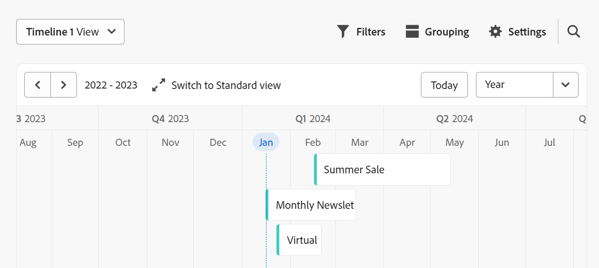

# Gerenciar a exibição de linha do tempo

<!--
title: Manage the timeline view in Adobe Maestro
description: You can display records in a timeline view, when accessing the record type page in Adobe Maestro. 
hidefromtoc: yes
hide: yes
author: Alina
feature: Work Management
role: User
-->

<!--update the metadata with real information when making this available in TOC and in the left nav-->

>[!IMPORTANT]
>
>As informações neste artigo referem-se ao Adobe Maestro, que é uma nova oferta do Adobe.
>
>Atualmente, o Adobe Maestro faz parte de um programa beta aberto a um número limitado de clientes.
>
>Entre em contato com seu representante de conta para obter mais informações sobre como participar do programa beta para o Maestro.
>
>Para obter informações, consulte [Visão geral do Adobe Maestri](../maestro-overview.md).

Você pode exibir registros em uma visualização de linha do tempo, ao acessar a página de tipo de registro no Adobe Maestro.

Para obter informações sobre visualizações do Maestro, consulte [Gerenciar visualizações de registro no Adobe Maestro](../views/manage-record-views.md).

## Requisitos de acesso

Você deve ter o seguinte acesso para executar as etapas deste artigo:

<table style="table-layout:auto">
 <col>
 <tbody>
<td>
   
 produto Adobe
 </td>
   <td>
   
 Adobe Workfront
 </td>
  </tr>  
 <td role="rowheader">
contrato do Adobe Workfront
</td>
   <td>

Sua organização deve estar inscrita no programa beta fechado do Adobe Maestro. Entre em contato com seu representante de conta para obter mais informações sobre esta nova oferta. 

   </td>
  </tr>
  <tr>
   <td role="rowheader">
plano do Adobe Workfront
</td>
   <td>

Qualquer Um

   </td>
  </tr>
  <tr>
   <td role="rowheader">
Licença do Adobe Workfront
</td>
   <td>
   
Qualquer Um
 
  </td>
  </tr>

<tr>
   <td role="rowheader">Nível de acesso</td>
   <td> 
Qualquer Um
  
</td>
  </tr>
<tr>
   <td role="rowheader">Modelo de layout</td>
   <td> 
O administrador do sistema deve adicionar a área Maestro no modelo de layout. Para obter informações, consulte <a href="../access/grant-access.md">Conceder acesso ao Adobe Maestro</a>. 
  
</td>
  </tr>
 </tbody>
</table>

<!--Maybe enable this at GA - but Maestro is not supposed to have Access controls in the Workfront Access Level: 
>[!NOTE]
>
>If you don't have access, ask your Workfront administrator if they set additional restrictions in your access level. For information on how a Workfront administrator can change your access level, see [Create or modify custom access levels](../administration-and-setup/add-users/configure-and-grant-access/create-modify-access-levels.md). -->

<!-- Notes to add for the table: for the "Workfront plans" row: the above is only for closed beta; when going to GA - activate the following plans:    

Current plan: Prime and Ultimate

Legacy plan: Enterprise
-->

<!-- Notes for the table: for the "Workfront access" row: 
For more information, see <a href="../../administration-and-setup/add-users/access-levels-and-object-permissions/wf-licenses.md" class="MCXref xref">Adobe Workfront licenses overview</a>.
-->

## Gerenciar uma exibição de linha do tempo {#manage-a-timeline-view}

<!--insert screen shot of timeline view-->

Ao criar uma exibição de linha do tempo, todos os registros do tipo de registro selecionado são exibidos em uma linha do tempo cronológica.

Considere o seguinte:

* Você pode criar um modo de exibição de Linha do tempo somente quando tem pelo menos dois campos de data associados a um tipo de registro. Quando você tem um ou nenhum campo de data associado a um tipo de registro, a opção de exibição Linha do tempo fica esmaecida.
* Dependendo das datas associadas aos registros, alguns registros podem não ser exibidos na exibição de linha do tempo nos seguintes cenários:

   * Quando as datas de início e término não têm valores
   * Quando as datas de Início ou Término não têm valor
   * Quando a data inicial for posterior à data final

<!--these are NOT available now because there won't be a table for the timeline view for the near future, per Andy: 
* The records displayed in the timeline view also display in a view-only table to the left of the timeline. 
* Each row in the table and each bar on the timeline represent the same record. 
* Each column in the table is a record field. The columns of this table are preconfigured and cannot be customized. 
* Only a limited number of fields (or columns) display in the timeline view table. 
* You cannot do the following in a timeline view:
     * Add rows or records
     * Add columns or fields
     * Edit record information
-->

Para gerenciar uma exibição de linha do tempo:

1. Vá para a página do tipo de registro para a qual deseja exibir a linha do tempo.
1. Crie uma exibição de linha do tempo, conforme descrito no artigo [Gerenciar exibições de registro](../views/manage-record-views.md).

   

   Os registros associados ao tipo de registro selecionado são exibidos como barras em uma linha do tempo e são classificados em ordem cronológica, por padrão.

1. Siga um destes procedimentos para navegar pela linha do tempo:

   * Clique nos ícones esquerdo e direito ou use a rolagem horizontal para mover-se para trás e para frente na linha do tempo.
   * Clique em **Hoje** para centralizar a linha do tempo na data de hoje.
   * Selecione uma das seguintes opções no menu suspenso de intervalo de tempo para atualizar os incrementos de tempo:

      * Ano
      * Trimestre
      * Mês
1. Clique em **Mudar para o padrão** exibir para exibir registros em linhas separadas <!--check to see if they updated the name of the setting here-->

   Ou

   Clique em **Alternar para exibição compacta** para exibir os registros cujas datas não se cruzam na mesma linha. <!--check to see if they updated the name of the setting here-->

   Os registros são exibidos na exibição Compacta por padrão.

1. Atualize os seguintes elementos de exibição conforme descrito nas subseções abaixo:
   * [Filtros](#add-filters)
   * [Agrupamento](#add-grouping)
     <!--* [Sort](#add-sort) not sure if this is present in timeline views?!; also check the anchor and make sure it's correct-->
   * [Configurações](#edit-the-timeline-view-settings)

### Adicionar filtros

Você pode reduzir a quantidade de informações exibidas na tela usando filtros.

Considere o seguinte ao trabalhar com filtros na exibição de linha do tempo:

<!-- this list is almost identical to the one for the table view - update both-->

* Os filtros criados para a exibição da linha do tempo funcionam independentemente dos filtros na exibição de tabela quando aplicados ao mesmo tipo de registro.

* Os filtros são exclusivos para a exibição selecionada. Duas exibições de linha do tempo do mesmo tipo de registro podem ter filtros diferentes aplicados a elas. Dois usuários que visualizam a mesma linha do tempo veem o mesmo filtro aplicado no momento.

* Não é possível nomear os filtros criados para uma exibição de linha do tempo.

* A remoção de filtros os remove de qualquer pessoa que acesse o mesmo tipo de registro que você e que exiba a mesma visualização que você.

* A adição de filtros na exibição de linha do tempo é idêntica à adição de filtros na exibição de tabela.

  Para obter mais informações, consulte a seção &quot;Adicionar filtros&quot; no artigo [Gerenciar a exibição de tabela](../views/manage-the-table-view.md).

### Adicionar agrupamento

<!-- groupings are almost identical between this view and table  but they display a little differently, so I kept the steps for both; update in both places if they make changes to groupings-->

Você pode agrupar registros por informações semelhantes ao aplicar um agrupamento a uma exibição.

Adicionar agrupamentos na exibição de linha do tempo é semelhante a adicionar agrupamentos à exibição de tabela.

Considere o seguinte ao trabalhar com agrupamentos na exibição de linha do tempo:

* Você pode aplicar agrupamentos nas visualizações de tabela e linha do tempo. Os agrupamentos da exibição de tabela são independentes daqueles na exibição de linha do tempo do mesmo tipo de registro.
* Você pode aplicar três níveis de agrupamento em uma visualização Maestri. Os registros são agrupados na ordem de agrupamentos selecionada.
* É possível aplicar até 4 níveis de agrupamento ao usar a API.
* Os agrupamentos são exclusivos para a exibição selecionada. Duas exibições de linha do tempo do mesmo tipo de registro podem ter agrupamentos diferentes aplicados a elas. Dois usuários que visualizam a mesma linha do tempo veem o mesmo agrupamento aplicado no momento.
* Não é possível nomear os agrupamentos criados para uma exibição de linha do tempo.
* A remoção de agrupamentos os remove de qualquer pessoa que acesse o mesmo tipo de registro que você e que exiba a mesma visualização que você.

Para adicionar um agrupamento na exibição de linha do tempo:

1. Crie uma exibição de linha do tempo para um tipo de registro, conforme descrito no artigo [Gerenciar exibições de registro](../views/manage-record-views.md).
1. Clique em **Agrupamento** no canto superior direito da exibição da linha do tempo.

   

1. Clique em um dos campos sugeridos ou clique em **Escolha um campo diferente**, procure um campo diferente e clique nele quando ele for exibido na lista.

   >[!TIP]
   >
   >Não é possível selecionar campos vinculados.

   O agrupamento é aplicado automaticamente à linha do tempo e os registros são exibidos dentro da caixa de agrupamento.

   <!-- add a step that you can rearrange the groupings here, when this will be possible-->

1. (Opcional) Repita as etapas acima para adicionar até três agrupamentos.

   O número de campos selecionados para o agrupamento é exibido ao lado do ícone Grouping.

   

1. (Opcional) Dentro do **Agrupar registros por** , clique no link **x** ícone à direita de um campo selecionado para o agrupamento para remover o agrupamento

   Ou

   Clique em **Limpar tudo** para remover todos os campos.

1. Clique fora da **Agrupar registros por** para fechá-la.
1. (Opcional) Clique em **Configurações**, depois **Cor** para agrupamentos de código de cor. Para obter mais informações, consulte [Editar as configurações de exibição da linha do tempo](#edit-the-timeline-view-settings) neste artigo.

<!-- 

### Add sort

this is not possible right now; if this is the same functionality as the table view, document it there and link from here. 

-->

### Editar as configurações de exibição da linha do tempo {#edit-the-timeline-view-settings}

Atualize as configurações de exibição da linha do tempo para indicar quais informações e como elas são exibidas na seção de linha do tempo da exibição.

1. Crie uma exibição de linha do tempo para um tipo de registro, conforme descrito no artigo [Gerenciar exibições de registro](../views/manage-record-views.md).
1. Clique em **Configurações**.
1. Clique em **Data e hora** no painel esquerdo, selecione uma **Data inicial** e uma **Data final** para exibir na linha do tempo. Você pode escolher as datas padrão de Início e Término ou escolher qualquer campo de data disponível. As barras que representam os registros começam na data que você indica para a Data inicial e terminam na data correspondente à Data final.

   >[!NOTE]
   >
   >Os registros que não têm valores para as datas de Início ou Término ou que têm uma data de Início posterior à data de Término não são exibidos na exibição de linha do tempo.

1. Clique em **Estilo da barra** no painel esquerdo, para indicar quais campos você deseja exibir nas barras de registro.

   O campo Nome é selecionado por padrão. <!--adjust this when the primary field is released??-->

1. Clique em **Adicionar campo** para adicionar até 4 campos às barras de registro.
1. Clique dentro do **Pesquisar campos** e clique no campo que deseja adicionar.

   >[!TIP]
   >
   >   * Você deve criar os campos antes de adicioná-los às barras de registro.
   > 
   >   * Você deve ter pelo menos um campo selecionado. **Nome** é selecionada por padrão.

   Uma visualização da aparência das barras na linha do tempo é exibida à direita.

   

1. Clique em **Cor** no painel esquerdo, para personalizar as cores dos registros e agrupamentos na linha do tempo.

   

1. (Condicional e opcional) Se você adicionou um agrupamento à exibição de linha do tempo, selecione uma das seguintes opções para definir uma cor para o agrupamento na **Definir cor de agrupamento** seção:

   * **Padrão (cinza)**: a cor dos agrupamentos é definida como cinza. Este é o padrão.
   * **Valores do campo**: a cor dos agrupamentos corresponde à cor do campo pelo qual você faz o agrupamento.
É possível corresponder a cor dos agrupamentos somente a campos com opções codificadas por cores.

   Por exemplo, campos de seleção múltipla ou seleção única podem ter opções codificadas por cores.

   Se você agrupar por campos sem opções codificadas por cores, a cor de agrupamento permanecerá cinza.

   >[!TIP]
   >
   >Se você não tiver adicionado agrupamentos à exibição de linha do tempo, esta seção não será exibida.

1. No **Definir cor do registro** selecione entre as seguintes opções para definir uma cor para os registros:

   * **Tipo de registro**: a cor dos registros corresponde à cor do tipo de registro selecionado. Esta é a opção padrão.
   * **Valores do campo**: a cor dos registros corresponde à cor de um campo especificado. Continue na etapa 10. <!--ensure this stays accurate-->
   * **Agrupamento**: a cor dos registros corresponde à cor indicada para os agrupamentos. Essa opção fica esmaecida quando não há agrupamentos aplicados à exibição de linha do tempo.
   * **Nenhum**: Os registros são exibidos em uma barra branca.

1. (Condicional) Se você selecionou **Valores do campo** para as cores do registro, selecione um campo na **Corresponder a cor do registro a** menu suspenso.

   

   Somente campos com opções codificadas por cores são exibidos no menu suspenso.

   Por exemplo, campos de seleção múltipla ou seleção única podem ter opções codificadas por cores.

   Se você não tiver um campo com opções codificadas por cores para o tipo de registro selecionado, essa opção ficará esmaecida.

1. Clique em **Salvar**.

   Os registros são exibidos na exibição de linha do tempo com as especificações selecionadas.
