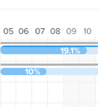

# Configure como as informações são exibidas no [!UICONTROL Gráfico de Gantt]

<!-- Audited: 5/2025 -->

Você pode configurar quais informações serão exibidas no Gráfico de Gantt da Lista de Tarefas e no Gráfico de Gantt da Lista de Projetos.

## Requisitos de acesso

+++ Expanda para visualizar os requisitos de acesso para a funcionalidade neste artigo.

<table style="table-layout:auto"> 
 <col> 
 <col> 
 <tbody> 
  <tr> 
   <td role="rowheader">[!DNL Adobe Workfront] pacote</td> 
   <td> 
Qualquer
 </td> 
  </tr> 
  <tr> 
   <td role="rowheader">[!DNL Adobe Workfront] licença</td> 
   <td> 
   
[!UICONTROL Light] ou superior

   
[!UICONTROL Review] ou superior

   </td> 
  </tr> 
  <tr> 
   <td role="rowheader">Configurações de nível de acesso</td> 
   <td> 
[!UICONTROL Exibir] ou superior acesso a Projetos e Tarefas
</td> 
  </tr> 
  <tr> 
   <td role="rowheader">Permissões de objeto</td> 
   <td> 
[!UICONTROL Exibir] ou superior acesso ao projeto e às tarefas
 </td> 
  </tr> 
 </tbody> 
</table>

Para obter mais detalhes sobre as informações nesta tabela, consulte [Requisitos de acesso na documentação do Workfront](/help/quicksilver/administration-and-setup/add-users/access-levels-and-object-permissions/access-level-requirements-in-documentation.md).

+++

<!--Old:
<table style="table-layout:auto"> 
 <col> 
 <col> 
 <tbody> 
  <tr> 
   <td role="rowheader"> Adobe Workfront plan</td> 
   <td> 
Any 
 </td> 
  </tr> 
  <tr> 
   <td role="rowheader">Adobe Workfront license</td> 
   <td> 
   
New: Light

   
Or

   
Current: Review

   </td> 
  </tr> 
  <tr> 
   <td role="rowheader">Access level configurations</td> 
   <td> 
[!UICONTROL View] or higher access to Projects and Tasks
 
Note: If you still don't have access, ask your [!DNL Workfront] administrator if they set additional restrictions in your access level. For information on how a [!DNL Workfront] administrator can modify your access level, see <a href="../../../administration-and-setup/add-users/configure-and-grant-access/create-modify-access-levels.md" class="MCXref xref">Create or modify custom access levels</a>.
 </td> 
  </tr> 
  <tr> 
   <td role="rowheader">Object permissions</td> 
   <td> 
[!UICONTROL View] or higher access to the project
 
For information on requesting additional access, see <a href="../../../workfront-basics/grant-and-request-access-to-objects/request-access.md" class="MCXref xref">Request access to objects </a>.
 </td> 
  </tr> 
 </tbody> 
</table>-->

## Entender as opções de exibição

A tabela a seguir detalha as opções de exibição do [!UICONTROL Gráfico de Gantt]:

<table style="table-layout:auto"> 
 <col> 
 <col> 
 <col> 
 <tbody> 
  <tr> 
   <td role="rowheader">Datas Efetivas</td> 
   <td>  </td> 
   <td> 
A [!UICONTROL Data de Início Efetivo] e a [!UICONTROL Data de Término Efetivo] são exibidas com um ícone de triângulo. Se a [!UICONTROL Data de Término Efetivo] for nula, somente a [!UICONTROL Data de Início Efetivo] será exibida.
 
Para obter mais informações, consulte <a href="../../../manage-work/projects/planning-a-project/project-actual-completion-date.md" class="MCXref xref">Visão geral da [!UICONTROL Data de Término Efetivo] </a> e <a href="../../../manage-work/projects/planning-a-project/project-actual-start-date.md" class="MCXref xref">Visão geral do projeto [!UICONTROL Data de Início Efetivo] </a>.
 </td> 
  </tr> 
  <tr> 
   <td role="rowheader">[!UICONTROL Atribuições]</td> 
   <td>  </td> 
   <td> 
Mostra os atribuídos da tarefa. Passe o mouse sobre o link Detalhes ao lado do nome do destinatário para ver informações mais detalhadas sobre ele, incluindo a porcentagem de sua alocação para a tarefa.
 
Os atribuídos não são exibidos no [!UICONTROL Gráfico de Gantt] quando o [!UICONTROL Gráfico de Gantt] é exportado para o PDF. Quando o [!UICONTROL Gráfico de Gantt] é exportado para o PDF, os atribuídos somente são exibidos na lista de tarefas.
 </td> 
  </tr> 
  <tr> 
   <td role="rowheader">[!UICONTROL Linha de Base]</td> 
   <td>  </td> 
   <td> 
Um instantâneo de projeto que representa dados importantes sobre o projeto incluído no plano de projeto inicial. As linhas de base podem ser usadas em toda a linha do tempo do projeto. Quando você habilita a exibição de linhas de base no [!UICONTROL Gráfico de Gantt], selecione qual linha de base deseja exibir. Você pode exibir somente uma linha de base no [!UICONTROL Gráfico de Gantt] por vez e ela será exibida na forma de uma barra cinza.
 
Para obter mais informações sobre linhas de base, consulte <a href="../../../manage-work/projects/create-projects/create-baselines.md" class="MCXref xref">Criar linhas de base do projeto</a>.
 </td> 
  </tr> 
  <tr> 
   <td role="rowheader">[!UICONTROL Data de Confirmação]</td> 
   <td>  </td> 
   <td> 
A data fornecida por um destinatário como compromisso de quando a tarefa será concluída é exibida com um marcador no [!UICONTROL Gráfico de Gantt]. 
 
Para obter mais informações sobre datas de confirmação, consulte a visão geral <a href="../../../manage-work/projects/updating-work-in-a-project/overview-of-commit-dates.md" class="MCXref xref">[!UICONTROL Data de Confirmação]</a>.
 </td> 
  </tr> 
  <tr> 
   <td role="rowheader">[!UICONTROL % Concluído]</td> 
   <td>  </td> 
   <td>  A porcentagem da tarefa que está concluída é exibida na linha da tarefa.  </td> 
  </tr> 
  <tr> 
   <td role="rowheader">[!UICONTROL Caminho Crítico]</td> 
   <td>  </td> 
   <td>As tarefas que podem afetar a linha do tempo do projeto são consideradas parte do Caminho crítico e estão claramente marcadas em vermelho. </td> 
  </tr> 
  <tr> 
   <td role="rowheader">[!UICONTROL Marco] Diamantes</td> 
   <td>  </td> 
   <td> 
Um ícone de diamante é exibido depois da tarefa associada a uma etapa. Passe o mouse sobre uma etapa para ver o nome e a data da etapa. O administrador [!DNL Workfront] determina a cor de cada diamante de etapas.
 
Para obter mais informações sobre etapas, consulte <a href="../../../administration-and-setup/customize-workfront/configure-approval-milestone-processes/create-milestone-path.md" class="MCXref xref">Criar um caminho de etapas</a>.
 </td> 
  </tr> 
  <tr> 
   <td role="rowheader">Linhas de [!UICONTROL Milestone]</td> 
   <td>  </td> 
   <td> 
Uma linha é exibida após a tarefa associada a uma etapa. Passe o mouse sobre uma etapa para ver o nome e a data da etapa. O administrador [!DNL Workfront] determina a cor de cada linha de marco.
 
 Para obter mais informações sobre marcos, consulte  <a href="../../../administration-and-setup/customize-workfront/configure-approval-milestone-processes/create-milestone-path.md" class="MCXref xref">Criar um caminho de etapas</a>
 </td> 
  </tr> 
  <tr> 
   <td role="rowheader">[!UICONTROL Predecessoras]</td> 
   <td>  </td> 
   <td> 
Uma linha de uma tarefa para outra que mostra a relação da predecessora entre as duas tarefas. Para realçar uma linha predecessora individual, passe o mouse sobre ela. Clique para mantê-lo destacado. É possível destacar apenas uma linha predecessora por vez.
 
Um ícone [!UICONTROL Predecessor] é exibido ao lado de qualquer tarefa que tenha um relacionamento de predecessor que abranja várias páginas no gráfico de Gantt ou em qualquer tarefa que tenha um predecessor de vários projetos.
 
Clique no ícone [!UICONTROL Predecessor] para exibir todas as tarefas predecessoras e sucessoras e seus detalhes, como nome da tarefa, tipo de relacionamento predecessor e datas chave.
 
Observação: o [!UICONTROL Gráfico de Gantt] em uma lista de projetos exibe informações sobre predecessores entre projetos. Para obter mais informações sobre como criar relações de predecessoras entre projetos diferentes, consulte <a href="../../../manage-work/tasks/use-prdcssrs/cross-project-predecessors.md" class="MCXref xref">Criar predecessoras entre projetos</a>
 
Para obter mais informações sobre predecessores, consulte <a href="../../../manage-work/tasks/use-prdcssrs/enforced-predecessors.md" class="MCXref xref">Impor predecessores</a>.
 </td> 
  </tr> 
  <tr> 
   <td role="rowheader">[!UICONTROL Status de Progresso]</td> 
   <td> 
[!UICONTROL No Prazo] 
 
[!UICONTROL Atrás]    
 
[!UICONTROL Em Risco]    
 
Atrasado        
 </td> 
   <td> 
 
 
O status do progresso atual em uma determinada tarefa. 
 
Para obter mais informações, consulte a visão geral <a href="../../../manage-work/tasks/task-information/task-progress-status.md" class="MCXref xref">Tarefa [!UICONTROL Progress Status]</a>.
 </td> 
  </tr> 
  <tr> 
   <td role="rowheader">Datas Projetadas</td> 
   <td>  </td> 
   <td> 
A linha do tempo projetada esperada que marca as datas de Início e Término Projetadas com base no trabalho atual concluído, mais o trabalho restante. 
 
Para obter mais informações sobre as datas de conclusão projetadas, consulte <a href="../../../manage-work/projects/planning-a-project/project-projected-completion-date.md" class="MCXref xref">Visão geral da data de conclusão projetada para projetos, tarefas e problemas</a>.
 </td> 
  </tr> 
 </tbody> 
</table>

## Configurar opções de exibição

1. Vá para o **Gráfico de Gantt da Lista de Tarefas** ou o **Gráfico de Gantt da Lista de Projetos**.\
   Para obter mais informações sobre a localização dos gráficos de Gantt, consulte [Introdução ao [!UICONTROL Gráfico de Gantt]](../../../manage-work/gantt-chart/use-the-gantt-chart/get-started-with-gantt.md).

1. (Opcional) Selecione a configuração **Alternar para datas projetadas** para exibir as tarefas por suas datas projetadas. Por padrão, as tarefas são exibidas por suas Datas planejadas.
1. Clique no ícone **Opções**. A caixa de diálogo **Opções** é aberta.\
   

1. Selecione as opções de configuração que você deseja exibir no [!UICONTROL Gráfico de Gantt].

   >[!NOTE]
   >
   > Nem todas as opções de configuração estão disponíveis na Lista de Projetos [!UICONTROL Gráfico de Gantt].

1. Clique em qualquer lugar no Gráfico de Gantt para fechar a caixa de diálogo **Opções**.
