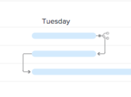

# Configure como as informações são exibidas no [!UICONTROL Gráfico de Gantt]

Você pode configurar quais informações serão exibidas em ambas as listas de tarefas [!UICONTROL Gráfico de Gantt] e a lista de projetos [!UICONTROL Gráfico de Gantt].

## Requisitos de acesso

Você deve ter o seguinte para seguir as etapas neste artigo:

<table style="table-layout:auto"> 
 <col> 
 <col> 
 <tbody> 
  <tr> 
   <td role="rowheader">[!DNL Adobe Workfront] plano*</td> 
   <td> 
Qualquer Um 
 </td> 
  </tr> 
  <tr> 
   <td role="rowheader">[!DNL Adobe Workfront] licença*</td> 
   <td> 
[!UICONTROL Review] ou superior
 </td> 
  </tr> 
  <tr> 
   <td role="rowheader">Configurações de nível de acesso*</td> 
   <td> 
[!UICONTROL View] ou acesso superior a Projetos e tarefas
 
Observação: Se ainda não tiver acesso, pergunte ao seu [!DNL Workfront] administrador se eles definirem restrições adicionais em seu nível de acesso. Para obter informações sobre como uma [!DNL Workfront] administrador pode modificar seu nível de acesso, consulte <a href="../../../administration-and-setup/add-users/configure-and-grant-access/create-modify-access-levels.md" class="MCXref xref">Criar ou modificar níveis de acesso personalizados</a>.
 </td> 
  </tr> 
  <tr> 
   <td role="rowheader">Permissões de objeto</td> 
   <td> 
[!UICONTROL View] ou acesso superior ao projeto
 
Para obter informações sobre como solicitar acesso adicional, consulte <a href="../../../workfront-basics/grant-and-request-access-to-objects/request-access.md" class="MCXref xref">Solicitar acesso a objetos </a>.
 </td> 
  </tr> 
 </tbody> 
</table>

&#42;Para descobrir qual plano, tipo de licença ou acesso você tem, entre em contato com seu [!DNL Workfront] administrador.

## Entender as opções de exibição

A tabela a seguir detalha as opções de exibição da variável [!UICONTROL Gráfico de Gantt]:

<table style="table-layout:auto"> 
 <col> 
 <col> 
 <col> 
 <tbody> 
  <tr> 
   <td role="rowheader">[!UICONTROL Datas reais]</td> 
   <td>  </td> 
   <td> 
[!UICONTROL Data de início real] e [!UICONTROL Data de conclusão real] são exibidas com um ícone de triângulo. Se a [!UICONTROL Data de conclusão real] for nula, somente a [!UICONTROL Data de início real] será exibida.
 
Para obter mais informações sobre datas de início e conclusão, consulte <a href="../../../manage-work/projects/planning-a-project/project-actual-completion-date.md" class="MCXref xref">Visão geral do projeto [!UICONTROL Data de conclusão real] </a> e <a href="../../../manage-work/projects/planning-a-project/project-actual-start-date.md" class="MCXref xref">Visão geral do projeto [!UICONTROL Data de início real] </a>.
 </td> 
  </tr> 
  <tr> 
   <td role="rowheader">[!UICONTROL Atribuições]</td> 
   <td>  </td> 
   <td> 
Mostra os destinatários da tarefa. Passe o mouse sobre o <strong>[!UICONTROL Detalhes]</strong> link ao lado do nome de um destinatário para ver informações mais detalhadas sobre ele, incluindo a porcentagem de sua alocação para a tarefa.
 
Os destinatários não são exibidos no [!UICONTROL Gantt chart] quando o [!UICONTROL Gantt chart] é exportado para o PDF. Quando o [!UICONTROL Gantt chart] é exportado para o PDF, os destinatários são exibidos somente na lista de tarefas.
 </td> 
  </tr> 
  <tr> 
   <td role="rowheader">[!UICONTROL Linha de base]</td> 
   <td>  </td> 
   <td> 
Um instantâneo de projeto que representa os principais dados sobre o projeto incluídos no plano de projeto inicial. As linhas de base podem ser utilizadas durante toda a vida do projeto. Ao ativar a exibição de linhas de base no [!UICONTROL Gantt chart], selecione qual linha de base deseja exibir. É possível exibir apenas uma linha de base no [!UICONTROL Gantt chart] de cada vez, ela será mostrada na forma de uma barra cinza.
 
Para obter mais informações sobre linhas de base, consulte <a href="../../../manage-work/projects/create-projects/create-baselines.md" class="MCXref xref">Criar linhas de base do projeto</a>.
 </td> 
  </tr> 
  <tr> 
   <td role="rowheader">[!UICONTROL Data da confirmação]</td> 
   <td>  </td> 
   <td> 
A data que um destinatário assume como compromisso de quando a tarefa será concluída é exibida com um marcador no [!UICONTROL Gantt chart]. 
 
Para obter mais informações sobre datas de confirmação, consulte <a href="../../../manage-work/projects/updating-work-in-a-project/overview-of-commit-dates.md" class="MCXref xref">Visão geral da [!UICONTROL Data da confirmação]</a>.
 </td> 
  </tr> 
  <tr> 
   <td role="rowheader">[!UICONTROL % concluído]</td> 
   <td>  </td> 
   <td>  A porcentagem da tarefa concluída é exibida na linha de tarefa.  </td> 
  </tr> 
  <tr> 
   <td role="rowheader">[!UICONTROL Caminho crítico]</td> 
   <td>  </td> 
   <td>As tarefas que podem afetar a linha do tempo do projeto são consideradas parte do Caminho Crítico e claramente marcadas em vermelho. </td> 
  </tr> 
  <tr> 
   <td role="rowheader">[!UICONTROL Marco] Ouros</td> 
   <td>  </td> 
   <td> 
Um ícone de diamante é exibido depois da tarefa associada a um marco. Passe o mouse sobre um marco para visualizar o nome e a data do marco. O [!DNL Workfront] O administrador determina a cor de cada diamante de marco.
 
Para obter mais informações sobre marcos, consulte <a href="../../../administration-and-setup/customize-workfront/configure-approval-milestone-processes/create-milestone-path.md" class="MCXref xref">Criar um caminho de marco</a>.
 </td> 
  </tr> 
  <tr> 
   <td role="rowheader">Linhas de [!UICONTROL Milestone]</td> 
   <td>  </td> 
   <td> 
Uma linha é exibida após a tarefa associada a um marco. Passe o mouse sobre um marco para visualizar o nome e a data do marco. O [!DNL Workfront] o administrador determina a cor de cada linha de marco.
 
 Para obter mais informações sobre marcos, consulte  <a href="../../../administration-and-setup/customize-workfront/configure-approval-milestone-processes/create-milestone-path.md" class="MCXref xref">Criar um caminho de marco</a>
 </td> 
  </tr> 
  <tr> 
   <td role="rowheader">[!UICONTROL Predecessores]</td> 
   <td>  </td> 
   <td> 
Uma linha de uma tarefa a outra que mostra a relação do antecessor entre as duas tarefas. Para destacar uma linha predecessora individual, passe o mouse sobre ela. Clique para mantê-lo destacado. Você só pode realçar uma linha antecessora por vez.
 
A <strong>[!UICONTROL Predecessor]</strong> é exibido ao lado de qualquer tarefa que tenha uma relação antecessora que abrange várias páginas no gráfico de Gantt ou em qualquer tarefa que tenha um antecessor entre projetos.
 
Clique no botão <strong>[!UICONTROL Predecessor]</strong> ícone para exibir todos os antecessores e tarefas sucessoras, bem como detalhes sobre cada tarefa, como nome da tarefa, tipo de relacionamento antecessor e datas-chave.
 
Observação: O [!UICONTROL Gantt Chart] em uma lista de projetos exibe informações sobre predecessores entre projetos. Para obter mais informações sobre como criar relacionamentos predecessores entre diferentes projetos, consulte <a href="../../../manage-work/tasks/use-prdcssrs/cross-project-predecessors.md" class="MCXref xref">Criar antecessores entre projetos</a>
 
Para obter mais informações sobre predecessores, consulte <a href="../../../manage-work/tasks/use-prdcssrs/enforced-predecessors.md" class="MCXref xref">Impor predecessores</a>.
 </td> 
  </tr> 
  <tr> 
   <td role="rowheader">[!UICONTROL Status de progresso]</td> 
   <td> 
[!UICONTROL No Horário] 
 
[!UICONTROL atrás]    
 
[!UICONTROL Em Risco]    
 
Atrasado        
 </td> 
   <td> 
 
 
O status do progresso atual em uma determinada tarefa. 
 
Para obter informações mais detalhadas sobre cada tipo de [!UICONTROL Progress Status], consulte <a href="../../../manage-work/tasks/task-information/task-progress-status.md" class="MCXref xref">Visão geral do status de progresso da tarefa [!UICONTROL]</a>.
 </td> 
  </tr> 
  <tr> 
   <td role="rowheader">[!UICONTROL Datas projetadas]</td> 
   <td>  </td> 
   <td> 
A linha do tempo projetada esperada que marca o [!UICONTROL Início projetado] e as [!UICONTROL datas de conclusão] com base no trabalho atual concluído, além do trabalho restante. 
 
Para obter mais informações sobre datas de conclusão projetadas, consulte <a href="../../../manage-work/projects/planning-a-project/project-projected-completion-date.md" class="MCXref xref">Visão geral da [!UICONTROL Data de conclusão projetada] para projetos, tarefas e problemas</a>.
 </td> 
  </tr> 
 </tbody> 
</table>

## Configurar opções de exibição

1. Ir para a Lista de Tarefas [!UICONTROL Gráfico de Gantt] ou na lista de projetos [!UICONTROL Gráfico de Gantt].\
   Para obter mais informações sobre onde a variável [!UICONTROL Gráfico de Gantt] estiver localizado, consulte [Introdução ao [!UICONTROL Gráfico de Gantt]](../../../manage-work/gantt-chart/use-the-gantt-chart/get-started-with-gantt.md).

1. (Opcional) Selecione o **[!UICONTROL Alterar para datas projetadas]** configuração para exibir as tarefas por seus [!UICONTROL Datas Projetadas]. Por padrão, as tarefas são exibidas por seus [!UICONTROL Datas Planejadas] no [!UICONTROL Gráfico de Gantt].
1. Clique no ícone de opções para exibir o **[!UICONTROL Opções]** caixa de diálogo.\
   

1. Selecione as opções de configuração que deseja exibir no [!UICONTROL Gráfico de Gantt].

   >[!NOTE]
   > Nem todas as opções de configuração estão disponíveis na Lista de projetos [!UICONTROL Gráfico de Gantt].

1. Clique em qualquer lugar na [!UICONTROL Gráfico de Gantt] para fechar o **[!UICONTROL Opções]** caixa de diálogo.
