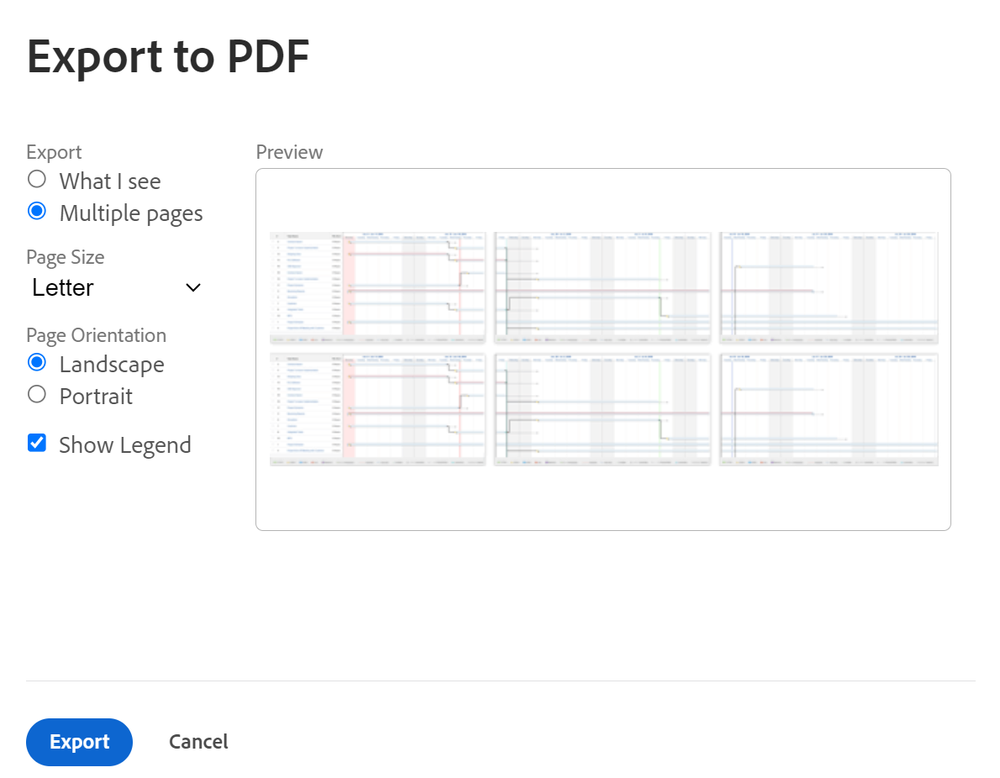

# Exportar o [!UICONTROL Gráfico de Gantt] para PDF

<!--Audited: 09/2024-->

Você pode exportar o [!UICONTROL Gráfico de Gantt] para um PDF.

Após exportar o [!UICONTROL Gráfico de Gantt] para o PDF, você pode imprimi-lo ou anexá-lo a um email para compartilhá-lo com outros usuários.

## Requisitos de acesso

+++ Expanda para visualizar os requisitos de acesso para a funcionalidade neste artigo.

Você deve ter o seguinte para seguir as etapas deste artigo:

<table style="table-layout:auto"> 
 <col> 
 <col> 
 <tbody> 
  <tr> 
   <td role="rowheader">Plano [!UICONTROL Adobe Workfront]*</td> 
   <td> 
Qualquer 
 </td> 
  </tr> 
  <tr> 
   <td role="rowheader">Licença da [!UICONTROL Adobe Workfront]*</td> 
   <td> 
Novo:[!UICONTROL Light] ou superior

   
Atual:[!UICONTROL Review] ou superior
 </td> 
  </tr> 
  <tr> 
   <td role="rowheader">Configurações de nível de acesso*</td> 
   <td> 
[!UICONTROL Exibir] ou superior acesso a Projetos e Tarefas
 </td> 
  </tr> 
  <tr> 
   <td role="rowheader">Permissões de objeto</td> 
   <td> 
[!UICONTROL Exibir] ou superior acesso ao projeto
 </td> 
  </tr> 
 </tbody> 
</table>

*Para obter informações, consulte [Requisitos de acesso na documentação do Workfront](/help/quicksilver/administration-and-setup/add-users/access-levels-and-object-permissions/access-level-requirements-in-documentation.md).

+++

## Exportar o [!UICONTROL Gráfico de Gantt]

1. Acesse o [!UICONTROL Gráfico de Gantt] que você deseja exportar para o PDF, conforme descrito em [Introdução ao [!UICONTROL Gráfico de Gantt]](../../../manage-work/gantt-chart/use-the-gantt-chart/get-started-with-gantt.md).
1. Verifique se você configurou o [!UICONTROL Gráfico de Gantt] para exibir as informações apropriadas antes de exportá-lo.

   >[!NOTE]
   >
   >Se você exportar o [!UICONTROL Gráfico de Gantt] de uma lista de projetos, o arquivo de PDF conterá apenas os projetos da lista, não as tarefas de cada projeto. Se você deseja exportar uma lista de tarefas, é possível fazer isso a partir do projeto ao qual estão associadas, criando um relatório de tarefas e exibindo os resultados do relatório na [!UICONTROL Exibição de Gantt].

   Configure qualquer uma das seguintes informações:

   * Clique nos ícones **Filtros**, **Exibir** e **Agrupamento** acima do [!UICONTROL Gráfico de Gantt] e adicione ou edite o filtro, a exibição ou o agrupamento existente aplicado à lista de itens no [!UICONTROL Gráfico de Gantt].

     Quaisquer filtros e agrupamentos selecionados na exibição de lista são mantidos durante a exibição do [!UICONTROL Gráfico de Gantt]. As exibições são refletidas no [!UICONTROL Gráfico de Gantt] exportado somente na lista exibida ao lado do [!UICONTROL Gráfico de Gantt] na primeira página. Os modos de exibição não são exibidos no próprio [!UICONTROL Gráfico de Gantt].

     >[!TIP]
     >
     >Para permitir mais espaço para o próprio [!UICONTROL Gráfico de Gantt], aplique um modo de exibição que contenha o menor número possível de colunas.

   * Selecione a opção **Alternar para Datas Projetadas** para exibir Datas Projetadas em vez de Planejadas. Por padrão, Datas planejadas são exibidas.

   * Clique no ícone  de **Configurações** no canto superior direito do gráfico de Gantt e selecione as informações que deseja exibir no gráfico de Gantt. Uma vez selecionadas, essas informações serão incluídas no arquivo de PDF de Gantt exportado.

     Selecione entre as seguintes opções:

      * Datas Efetivas
      * Atribuições
      * Linha de base
      * Data de confirmação
      * % concluído
      * Caminho Crítico
      * Etapas como diamantes
      * Linhas de etapas
      * Predecessoras
      * Status do Progresso
      * Datas Planejadas

     Para obter mais informações, consulte   [Configure como as informações são exibidas no [!UICONTROL Gráfico de Gantt]](../../../manage-work/gantt-chart/use-the-gantt-chart/configure-info-on-gantt-chart.md).

     >[!NOTE]
     >
     > As atribuições não são exibidas no [!UICONTROL Gráfico de Gantt] quando o [!UICONTROL Gráfico de Gantt] é exportado para PDF. Quando o [!UICONTROL Gráfico de Gantt] é exportado para o PDF, as atribuições são exibidas somente na exibição de lista.

   * O período exibido no [!UICONTROL Gráfico de Gantt].

     Para obter mais informações, consulte [Exibindo Informações no [!UICONTROL Gráfico de Gantt]](../../../manage-work/gantt-chart/use-the-gantt-chart/view-info-in-gantt.md).

     A forma como o período de tempo é exibido no arquivo de exportação depende de você selecionar **[!UICONTROL O que vejo]** ou **[!UICONTROL Várias páginas]** em uma etapa posterior.

1. (Opcional) Para incluir apenas determinadas tarefas no PDF exportado, selecione as tarefas que deseja incluir.

   Se você não selecionar nenhuma tarefa, todas as tarefas serão incluídas no PDF exportado.

   Por exemplo, se você estiver exibindo o [!UICONTROL Gráfico de Gantt] de um projeto que contém 50 tarefas, mas quiser exibir apenas 10 tarefas no [!UICONTROL Gráfico de Gantt] exportado, selecione as 10 tarefas que deseja exibir.

1. Clique no ícone da impressora  no canto superior direito do Gráfico de Gantt.
A caixa de diálogo **[!UICONTROL Exportar para PDF]** é exibida.

   

1. Na seção **Exportar**, selecione uma das opções a seguir para indicar se deseja exportar apenas o que você vê ou todo o [!UICONTROL Gráfico de Gantt]:

   * **[!UICONTROL O que vejo]:** exporta todas as tarefas (incluindo todas as subtarefas) exibidas na tela antes de exportar até 500 itens. (Não é o que é exibido na seção **[!UICONTROL Visualização]**; a seção [!UICONTROL Visualização] contém apenas dados de exemplo.)

     As subtarefas são incluídas no PDF exportado mesmo se a tarefa pai estiver recolhida e as subtarefas não estiverem visíveis. Para incluir somente tarefas pai, selecione as tarefas pai que deseja incluir e deixe qualquer subtarefa desmarcada.

     >[!TIP]
     >
     >Você pode usar o menu suspenso **[!UICONTROL Aplicar Zoom a]** ou a ferramenta deslizante para exibir apenas uma parte do [!UICONTROL Gráfico de Gantt], conforme descrito em [Exibindo Informações no [!UICONTROL Gráfico de Gantt]](../../../manage-work/gantt-chart/use-the-gantt-chart/view-info-in-gantt.md).

   * **[!UICONTROL Várias páginas]:** exporta o [!UICONTROL Gráfico de Gantt] inteiro, mesmo aquele que não está visível na tela atual, com até 500 itens.

     >[!NOTE]
     >
     >* Você pode usar o menu suspenso **[!UICONTROL Aplicar Zoom a]** ou a ferramenta de controle deslizante para determinar quanta informação é exibida em cada página, conforme descrito em [Configurar como as informações são exibidas no [!UICONTROL Gráfico de Gantt]](../../../manage-work/gantt-chart/use-the-gantt-chart/configure-info-on-gantt-chart.md). Selecione uma opção mais granular para exibir mais páginas para exportar ou selecione uma opção menos granular para exibir menos páginas para exportar.
     >
     >* Se você precisar exportar um [!UICONTROL Gráfico de Gantt] que contenha mais de 500 itens, aplique um Filtro à lista antes de exibir o [!UICONTROL Gráfico de Gantt] para que menos de 500 itens ou 250 páginas sejam exibidos. Para obter informações sobre como aplicar um filtro, consulte [Visão geral dos filtros](../../../reports-and-dashboards/reports/reporting-elements/filters-overview.md).
     >
     >
     >* Não é possível exportar todo o Diagrama de Gantt nas seguintes circunstâncias:
     >   
     >   * Quando abrange mais de 250 páginas
     >   * Quando contiver mais de 500 itens

1. Se o PDF for impresso depois de exportado para PDF, no menu suspenso **[!UICONTROL Tamanho da página]**, selecione o tamanho do papel no qual deseja imprimir.
Você pode selecionar entre as seguintes opções:

   * **[!UICONTROL Carta]**
   * **[!UICONTROL Assuntos legais]**
   * **[!UICONTROL Razão]**
   * **[!UICONTROL A1]**
   * **[!UICONTROL A2]**
   * **[!UICONTROL A3]** (disponível somente para alguns idiomas)
   * **[!UICONTROL A4]**
1. Na seção **[!UICONTROL Orientação da página]**, selecione se deseja que o PDF seja exportado na orientação paisagem ou retrato.
1. Selecione **[!UICONTROL Mostrar legenda]** se desejar incluir a legenda no PDF exportado.
1. Clique em **[!UICONTROL Exportar]**.

   O pdf do [!UICONTROL Gráfico de Gantt] foi criado e baixado no computador.

   Observe a legenda na parte inferior do arquivo exportado. Ele explica apenas as opções que você habilitou no seu [!UICONTROL Gráfico de Gantt] e que estão disponíveis na sua lista de tarefas.

   Por exemplo, marcos são exibidos na legenda somente se você tiver pelo menos uma tarefa associada a um marco.

   
