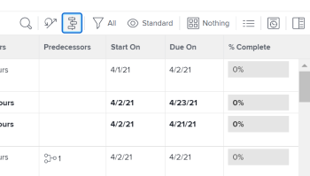

# Introdução ao [!UICONTROL Gráfico de Gantt]

Entrada [!DNL Adobe Workfront], há dois [!UICONTROL Gráficos de Gantt] com funcionalidade semelhante:

* A lista de tarefas [!UICONTROL Gráfico de Gantt]: exibe informações sobre tarefas no nível do projeto e é editável.
* A lista de projetos [!UICONTROL Gráfico de Gantt]: exibe informações sobre projetos e não é editável.

Embora pareçam semelhantes, a funcionalidade de cada um é diferente.

## Acesse o [!UICONTROL Gráfico de Gantt]

A variável [!UICONTROL Gantt] gráficos em [!DNL Workfront]  fornecer uma representação visual de uma lista de tarefas ou projetos. Você pode exibir a lista de tarefas [!UICONTROL Gráfico de Gantt] diretamente da lista de tarefas em um projeto ou de um relatório de tarefas. Você pode visualizar a lista de projetos [!UICONTROL Gráfico de Gantt] em uma lista de projetos ou em um relatório de projeto.

* [Lista de tarefas [!UICONTROL Gráfico de Gantt]](#task-list-gantt-chart)
* [Lista de projetos [!UICONTROL Gráfico de Gantt]](#project-list-gantt-chart)

### Lista de tarefas [!UICONTROL Gráfico de Gantt] {#task-list-gantt-chart}

A lista de tarefas [!UICONTROL Gráfico de Gantt] O é acessível nas seguintes áreas:

* Em um projeto

   * [!UICONTROL Tarefas] área
   * [!UICONTROL Subtarefas] área

* Em um modelo

Para acessar a lista de tarefas [!UICONTROL Gráfico de Gantt], navegue até qualquer uma das áreas mencionadas acima e clique no botão [!UICONTROL Gráfico de Gantt] ícone.

### Lista de projetos [!UICONTROL Gráfico de Gantt] {#project-list-gantt-chart}

A lista de projetos [!UICONTROL Gráfico de Gantt] O é acessível nas seguintes áreas:

* No prazo de [!UICONTROL Projetos] área
* Dentro de um Portfolio

   * [!UICONTROL Projetos] área

* Em um relatório de projeto

   * Qualquer relatório de projeto ou tarefa

* Em um programa

   * No [!UICONTROL Projetos] área

Para acessar o [!UICONTROL Gráfico de Gantt da lista de projetos], navegue até qualquer uma das áreas mencionadas acima e clique no botão [!UICONTROL Gráfico de Gantt] ícone.

## Configure como as informações são exibidas na [!UICONTROL Gráfico de Gantt]

Você pode configurar quais informações serão exibidas na lista de tarefas [!UICONTROL Gráfico de Gantt] e a lista de projetos [!UICONTROL Gráfico de Gantt].\
Não é possível configurar as cores ou as fontes nas quais o [!UICONTROL Gráfico de Gantt] informações são exibidas.

* [Lista de tarefas [!UICONTROL Gráfico de Gantt]](#task-list-gantt-chart)
* [Lista de projetos [!UICONTROL Gráfico de Gantt]](#project-list-gantt-chart)

### Lista de tarefas [!UICONTROL Gráfico de Gantt] {#task-list-gantt-chart-1}

As seguintes opções de exibição estão disponíveis na lista de tarefas [!UICONTROL Gráfico de Gantt]:

* [!UICONTROL Datas Efetivas]
* [!UICONTROL Atribuições]
* [!UICONTROL Linha de base]
* [!UICONTROL Data de confirmação]
* [!UICONTROL % Completo]
* [!UICONTROL Caminho Crítico]
* [!UICONTROL Etapas como diamantes]
* [!UICONTROL Linhas de etapas]
* [!UICONTROL Predecessoras]
* [!UICONTROL Status do Progresso]
* [!UICONTROL Datas projetadas]

Para obter informações detalhadas sobre as opções de exibição listadas acima, consulte [Configure como as informações são exibidas na [!UICONTROL Gráfico de Gantt]](../../../manage-work/gantt-chart/use-the-gantt-chart/configure-info-on-gantt-chart.md).

### Lista de projetos [!UICONTROL Gráfico de Gantt] {#project-list-gantt-chart-1}

As seguintes opções de exibição estão disponíveis na lista de projetos [!UICONTROL Gráfico de Gantt]:

* [!UICONTROL Datas Efetivas]
* [!UICONTROL % Completo]
* [!UICONTROL Etapas como diamantes]
* [!UICONTROL Linhas de etapas]
* [!UICONTROL Predecessoras]
* [!UICONTROL Status do Progresso]
* [!UICONTROL Datas Projetadas]

Para obter informações sobre as opções de exibição listadas acima, consulte [Configure como as informações são exibidas na [!UICONTROL Gráfico de Gantt]](../../../manage-work/gantt-chart/use-the-gantt-chart/configure-info-on-gantt-chart.md).

## Atualize o [!UICONTROL Gráfico de Gantt]

Quando as informações são atualizadas na lista de tarefas, elas são automaticamente refletidas na lista de tarefas [!UICONTROL Gráfico de Gantt] e a lista de projetos [!UICONTROL Gráfico de Gantt].

* [Lista de tarefas [!UICONTROL Gráfico de Gantt]](#task-list-gantt-chart)
* [Lista de projetos [!UICONTROL Gráfico de Gantt]](#project-list-gantt-chart)

### Lista de tarefas [!UICONTROL Gráfico de Gantt] {#task-list-gantt-chart-2}

Em um projeto, você pode atualizar a lista de tarefas [!UICONTROL Gráfico de Gantt] diretamente do [!UICONTROL Gráfico de Gantt] ou na lista de tarefas. Para obter mais informações, consulte [Atualizar informações na lista de tarefas [!UICONTROL Gráfico de Gantt]](../../../manage-work/gantt-chart/use-the-gantt-chart/update-info-task-list-gantt.md).

Em um modelo, a lista de tarefas [!UICONTROL Gráfico de Gantt] O reflete as atualizações feitas na lista de tarefas do modelo. Este [!UICONTROL Gráfico de Gantt] não é editável.

### Lista de projetos [!UICONTROL Gráfico de Gantt] {#project-list-gantt-chart-2}

A variável [!UICONTROL Gráfico de Gantt da lista de projetos] O reflete as atualizações feitas na lista de tarefas de cada projeto. Este [!UICONTROL Gráfico de Gantt] não é editável.

## Exibir informações sobre o [!UICONTROL Gráfico de Gantt]

A lista de tarefas [!UICONTROL Gráfico de Gantt] e lista de projetos [!UICONTROL Gráfico de Gantt] exibir informações sobre tarefas e projetos. Para obter mais informações, consulte [Exibir informações no [!UICONTROL Gráfico de Gantt]](../../../manage-work/gantt-chart/use-the-gantt-chart/view-info-in-gantt.md).
