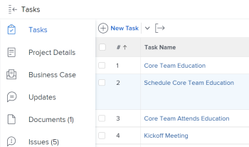

# Atualizar informações na lista de tarefas [!UICONTROL Gráfico de Gantt]

A lista de tarefas [!UICONTROL Gráfico de Gantt] mostra detalhes sobre tarefas que estão em um projeto ou modelo.

Em um modelo, a lista de tarefas [!UICONTROL Gráfico de Gantt] reflete as atualizações feitas na lista de tarefas do modelo no nível da tarefa. Não é possível editar o [!UICONTROL Gráfico de Gantt] associado a um modelo.

Em um projeto, você pode atualizar as informações da tarefa diretamente na lista de tarefas [!UICONTROL Gráfico de Gantt].

Este artigo descreve as seguintes ações que você pode executar diretamente no [!UICONTROL Gráfico de Gantt] da Lista de Tarefas:

* Modificar duração da tarefa
* Criar ou remover relações de predecessoras
* Alterar Datas Inicial e Final da Tarefa
* Atualizar Porcentagem Concluída
* Nivelar Recursos do Projeto

## Requisitos de acesso

Você deve ter o seguinte para seguir as etapas deste artigo:

<table style="table-layout:auto"> 
 <col> 
 <col> 
 <tbody> 
  <tr> 
   <td role="rowheader">[!DNL Adobe Workfront] plano*</td> 
   <td> 
Qualquer 
 </td> 
  </tr> 
  <tr> 
   <td role="rowheader">[!DNL Adobe Workfront] licença*</td> 
   <td> 
[!UICONTROL Plano] 
 </td> 
  </tr> 
  <tr> 
   <td role="rowheader">Configurações de nível de acesso*</td> 
   <td> 
[!UICONTROL Editar] acesso a Projetos e Tarefas
 
Observação: se você ainda não tiver acesso, pergunte ao administrador do [!DNL Workfront] se ele definiu restrições adicionais no seu nível de acesso. Para obter informações sobre como um administrador do [!DNL Workfront] pode modificar seu nível de acesso, consulte <a href="../../../administration-and-setup/add-users/configure-and-grant-access/create-modify-access-levels.md" class="MCXref xref">Criar ou modificar níveis de acesso personalizados</a>.
 </td> 
  </tr> 
  <tr> 
   <td role="rowheader">Permissões de objeto</td> 
   <td> 
[!UICONTROL Gerenciar] acesso ao projeto e às tarefas 
 
Para obter informações sobre como solicitar acesso adicional, consulte <a href="../../../workfront-basics/grant-and-request-access-to-objects/request-access.md" class="MCXref xref">Solicitar acesso aos objetos </a>.
 </td> 
  </tr> 
 </tbody> 
</table>

&#42;Para saber qual plano, tipo de licença ou acesso você tem, contate o administrador do [!DNL Workfront].

## Modificar duração da tarefa

1. Vá para o projeto que deseja modificar.
1. Clique em **[!UICONTROL Tarefas]** no painel esquerdo.

   

1. Clique no ícone do **[!UICONTROL Gráfico de Gantt]**.

   

   Todas as alterações são salvas automaticamente quando a opção **[!UICONTROL Salvar automaticamente]** está habilitada. Ela é ativada por padrão.

1. (Opcional) Clique no ícone **[!UICONTROL Modo de plano]** e selecione **[!UICONTROL Salvar manualmente padrão]** ou **[!UICONTROL Planejamento de linha do tempo]** para salvar as alterações manualmente.

   

1. Passe o mouse sobre a linha do tempo de uma tarefa e arraste o indicador da linha do tempo para uma data diferente.
1. Solte o indicador quando tiver atingido a nova Data de conclusão correta para a tarefa.
1. (Opcional e condicional) Se você optou por salvar manualmente as alterações, clique nos ícones **[!UICONTROL Desfazer]** ou&#x200B;**[!UICONTROL Refazer]** se desejar cancelar ou duplicar as alterações.

   >[!TIP]
   >
   >Você pode usar os seguintes atalhos de teclado para desfazer ou refazer alterações no gráfico de Gantt:
   >
   >   
   >   
   >   * [!DNL Mac]: Use [!UICONTROL Command + Z] para desfazer e [!UICONTROL Command + Shift + Z] para refazer.
   >   * [!DNL Windows]: Use [!UICONTROL Ctrl + Z] para desfazer e [!UICONTROL Ctrl + Y] para refazer.
   >   
   >

1. Clique em **[!UICONTROL Salvar]** no canto superior direito do [!UICONTROL Gráfico de Gantt].

## Criar ou remover relações predecessoras

1. Vá para o projeto que deseja modificar.
1. Na área **[!UICONTROL Tarefas]**, clique no ícone do **[!UICONTROL Gráfico de Gantt]**.

   A opção **[!UICONTROL Salvar automaticamente]** está selecionada por padrão. Nesse caso, todas as alterações são salvas automaticamente.

   

1. (Opcional) Clique no ícone **[!UICONTROL Modo de plano]** e selecione **[!UICONTROL Salvar manualmente padrão]** ou **[!UICONTROL Planejamento de linha do tempo]** para salvar as alterações manualmente.

   

1. Para criar uma relação de predecessora, clique no ponto inicial de uma tarefa e arraste-o para o ponto final da tarefa.
1. Para excluir uma relação de predecessora, clique em uma linha de predecessora que conecte duas tarefas para selecioná-la e pressione **[!UICONTROL Excluir]** no teclado.\
   

1. (Opcional e condicional) Se você optou por salvar as alterações manualmente, clique nos ícones **[!UICONTROL Desfazer]** ou&#x200B;**[!UICONTROL Refazer]** se desejar cancelar ou duplicar as alterações.

   >[!TIP]
   >
   >Você pode usar os seguintes atalhos de teclado para desfazer ou refazer alterações no gráfico de Gantt:
   >
   >   
   >   
   >   * [!DNL Mac]: Use [!UICONTROL Command + Z] para desfazer e [!UICONTROL Command + Shift + Z] para refazer.
   >   * [!DNL Windows]: [!UICONTROL Use Ctrl + Z] para desfazer e [!UICONTROL Ctrl + Y] para refazer.
   >   
   >

1. Clique em **[!UICONTROL Salvar]**.

## Alterar Datas Inicial e Final da Tarefa

1. Vá para o projeto que deseja modificar.
1. Na área **[!UICONTROL Tarefas]**, clique no ícone do **[!UICONTROL Gráfico de Gantt]**.

   Todas as alterações são salvas automaticamente quando a opção **[!UICONTROL Salvar automaticamente]** está habilitada. Ela é ativada por padrão.

   

1. (Opcional) Clique no ícone **[!UICONTROL Modo de plano]** e selecione **[!UICONTROL Salvar manualmente padrão]** ou **[!UICONTROL Planejamento de linha do tempo]** para salvar as alterações manualmente.

   

1. Passe o mouse sobre o centro da tarefa e localize a seta multidirecional.
1. Clique em e arraste a tarefa para a data desejada.

   

1. Se você alterar a data da tarefa de uma forma que afete a restrição da tarefa, clique em **[!UICONTROL Aceitar]** para confirmar a alteração da restrição da tarefa.

   >[!NOTE]
   >
   >Se a tarefa tiver uma das seguintes restrições, o sistema atualizará a [!UICONTROL Restrição de Tarefa] para [!UICONTROL Não Iniciar Antes] Do que se o projeto estiver agendado a partir da [!UICONTROL Data de Início] ou [!UICONTROL Não Terminar Depois De] se o projeto estiver agendado a partir da [!UICONTROL Data de Conclusão]:
   >
   >   
   >   
   >   * [!UICONTROL O Mais Breve Possível]
   >   * [!UICONTROL O Mais Tarde Possível]
   >   * [!UICONTROL Momento Mais Cedo Disponível]
   >   * [!UICONTROL Último Horário Disponível]
   >   
   >   
   >Em alguns casos, as relações de predecessoras podem impedir que as tarefas sejam iniciadas anteriormente e a movimentação da tarefa não é permitida.

1. (Opcional e condicional) Se você optou por salvar as alterações manualmente, clique nos ícones **[!UICONTROL Desfazer]** ou&#x200B;**[!UICONTROL Refazer]** se desejar cancelar ou duplicar as alterações.

   >[!TIP]
   >
   >Você pode usar os seguintes atalhos de teclado para desfazer ou refazer alterações no [!UICONTROL Gráfico de Gantt]:
   >
   >   
   >   
   >   * [!DNL Mac]: Use [!UICONTROL Command + Z] para desfazer e [!UICONTROL Command + Shift + Z] para refazer.
   >   * [!DNL Windows]: Use [!UICONTROL Ctrl + Z] para desfazer e [!UICONTROL Ctrl + Y] para refazer.
   >   
   >

1. Clique em **[!UICONTROL Salvar]**.

## Atualizar Porcentagem Concluída

1. Vá para o projeto que deseja modificar.
1. Na área **[!UICONTROL Tarefas]**, clique no ícone do **[!UICONTROL Gráfico de Gantt]**.

   

   Todas as alterações são salvas automaticamente quando a opção **[!UICONTROL Salvar automaticamente]** está habilitada. Ela é ativada por padrão.

1. (Opcional) Clique no ícone **[!UICONTROL Modo de plano]** e selecione **[!UICONTROL Salvar manualmente padrão]** ou **[!UICONTROL Planejamento de linha do tempo]** para salvar as alterações manualmente.
1. Clique duas vezes no número percentual dentro da tarefa e insira o número.

   >[!IMPORTANT]
   >
   >Você deve ter [!UICONTROL % Concluído] selecionado na caixa de diálogo [!UICONTROL Opções] para atualizar a porcentagem concluída. Para fazer isso, clique no ícone **[!UICONTROL Opções]** e selecione **[!UICONTROL % Concluído]**.
   >
   >
   >   >
   >

1. (Opcional e condicional) Se você optou por salvar as alterações manualmente, clique nos ícones **[!UICONTROL Desfazer]** ou&#x200B;**[!UICONTROL Refazer]** se desejar cancelar ou duplicar as alterações.

   >[!TIP]
   >
   >Você pode usar os seguintes atalhos de teclado para desfazer ou refazer alterações no [!UICONTROL Gráfico de Gantt]:
   >
   >   
   >   
   >   * [!DNL Mac]: Use [!UICONTROL Command + Z] para desfazer e [!UICONTROL Command + Shift + Z] para refazer.
   >   * [!DNL Windows]: Use [!UICONTROL Ctrl + Z] para desfazer e [!UICONTROL Ctrl + Y] para refazer.
   >   
   >

1. Clique em **[!UICONTROL Salvar]** no canto superior direito do [!UICONTROL Gráfico de Gantt].

## Nivelar recursos do projeto

Você pode usar o [!UICONTROL Gráfico de Gantt] da Lista de Tarefas para nivelar seus recursos.

Para obter informações sobre como nivelar recursos no [!UICONTROL Gráfico de Gantt], consulte [Nivelar Recursos no [!UICONTROL Gráfico de Gantt]](../../../manage-work/gantt-chart/use-the-gantt-chart/level-resources-in-gantt.md).

<!--

(NOTE:&nbsp;this is drafted because I moved the whole content to the article linked above)

<ol>
<li value="1">Go to the project you want to level.</li>
<li value="2"> 
 In the <strong>Tasks</strong> area, click the <strong>Gantt chart</strong> icon.
 
All changes are saved automatically when the <strong>Autosave</strong> option is enabled. It is enabled by default. 
 </li>
<li value="3">

(Optional) Click the <strong>Plan mode</strong> icon and select <strong>Manual save Standard</strong> or <strong>Timeline Planning</strong> to save your changes manually.
 <note type="tip">
You cannot level resources in the Gantt chart when the Autosave option is enabled.
</note>

  

 </li>
<li value="4"> 
Click the <strong>Level Resources</strong> drop-down menu.
 
  
 </li>
<li value="5">Select one of following options:
<ul>
<li><strong>Level Now</strong>: Applies resource leveling to the selected task.</li>
<li>
<strong>Clear Leveling</strong>: Removes all resource leveling from the selected task.
</li>
</ul><note type="note">
Your resources might be overallocated if they are assigned to multiple tasks which occur during the same time frame.
</note></li>
<li value="6"> 
(Optional and conditional) If you have disabled the Autosave option, click the <strong>Undo</strong> or<strong>Redo</strong> icons if you want to cancel or duplicate any of the changes. 
 <note type="tip">

You can use the following keyboard shortcuts to undo or redo changes on the Gantt chart:

<ul>
<li>Mac: Use Command + Z to undo and Command + Shift + Z to redo.</li>
<li>Windows: Use Ctrl + Z to undo and Ctrl + Y to redo.</li>
</ul>
</note> </li>
<li value="7">Click <strong>Save</strong> in the upper-right corner of the Gantt chart.</li>
</ol>

-->

<!--
<h2 data-mc-conditions="QuicksilverOrClassic.Draft mode"> </h2>
-->
