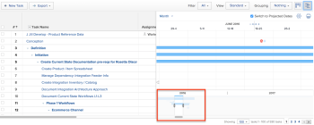

# Exibir informações no [!UICONTROL Gráfico de Gantt]

<!--Audited: 08/2025-->

A tarefa e o projeto do Adobe Workfront [!UICONTROL Gráficos de Gantt] exibem informações sobre tarefas e projetos.

## Requisitos de acesso

+++ Expanda para visualizar os requisitos de acesso para a funcionalidade neste artigo. 

<table style="table-layout:auto"> 
 <col> 
 <col> 
 <tbody> 
  <tr> 
   <td role="rowheader">[!DNL Adobe Workfront] pacote</td> 
   <td> 
Qualquer
 </td> 
  </tr> 
  <tr> 
   <td role="rowheader">[!DNL Adobe Workfront] licença</td> 
   <td>
[!UICONTROL Light] ou superior

    
[!UICONTROL Review] ou superior
 </td> 
  </tr> 
  <tr> 
   <td role="rowheader">Configurações de nível de acesso</td> 
   <td> 
[!UICONTROL Exibir] ou superior acesso a Projetos e Tarefas
</td>
</tr> 
  <tr> 
   <td role="rowheader">Permissões de objeto</td> 
   <td> 
[!UICONTROL Exibir] ou superior acesso ao projeto e às tarefas
</td> 
  </tr> 
 </tbody> 
</table>

Para obter mais detalhes sobre as informações nesta tabela, consulte [Requisitos de acesso na documentação do Workfront](/help/quicksilver/administration-and-setup/add-users/access-levels-and-object-permissions/access-level-requirements-in-documentation.md).

+++ 

<!--Old:
<table style="table-layout:auto"> 
 <col> 
 <col> 
 <tbody> 
  <tr> 
   <td role="rowheader">[!DNL Adobe Workfront] plan*</td> 
   <td> 
Any 
 </td> 
  </tr> 
  <tr> 
   <td role="rowheader">[!DNL Adobe Workfront] licenses overview*</td> 
   <td> 
[!UICONTROL Review] or higher
 </td> 
  </tr> 
  <tr> 
   <td role="rowheader">Access level configurations*</td> 
   <td> 
[!UICONTROL View] or higher access to Projects and Tasks
 
<b>NOTE</b>

If you still don't have access, ask your [!DNL Workfront] administrator if they set additional restrictions in your access level. For information on how a [!DNL Workfront] administrator can modify your access level, see <a href="../../../administration-and-setup/add-users/configure-and-grant-access/create-modify-access-levels.md" class="MCXref xref">Create or modify custom access levels</a>.
 </td>
</tr> 
  <tr> 
   <td role="rowheader">Object permissions</td> 
   <td> 
[!UICONTROL View] or higher access to the project
 
For information on requesting additional access, see <a href="../../../workfront-basics/grant-and-request-access-to-objects/request-access.md" class="MCXref xref">Request access to objects </a>.
 </td> 
  </tr> 
 </tbody> 
</table>-->

## Localize o [!UICONTROL Gráfico de Gantt]

Você pode localizar o Diagrama de Gantt da lista de tarefas e o Diagrama de Gantt da lista de projetos [!UICONTROL de várias áreas dentro do Workfront. &#x200B;] Para obter mais informações, consulte [Introdução ao [!UICONTROL Gráfico de Gantt]](../../../manage-work/gantt-chart/use-the-gantt-chart/get-started-with-gantt.md).

## Exibir tarefas no [!UICONTROL Caminho Crítico]

No [!UICONTROL Gráfico de Gantt] da Lista de Projetos, as tarefas que não estão no [!UICONTROL Caminho Crítico] são exibidas como linhas horizontais azul-claro. As tarefas que estão no [!UICONTROL Caminho Crítico] de um projeto são exibidas como linhas horizontais vermelhas.

Para obter mais informações sobre tarefas no [!UICONTROL Caminho Crítico], consulte [Visão Geral do projeto [!UICONTROL Caminho Crítico]](../../../manage-work/tasks/manage-tasks/critical-path.md).

## Exibir informações de tarefa na lista de projetos [!UICONTROL Gráfico de Gantt]

Você pode exibir as informações da tarefa de um projeto diretamente na Lista de projetos. As tarefas são listadas sob o nome de cada projeto.

>[!NOTE]
>
>Você não pode editar tarefas a partir da Lista de Projetos [!UICONTROL Gráfico de Gantt].

Você pode exibir as informações da tarefa de um projeto diretamente de uma lista de projetos nas seguintes áreas:

* Na área [!UICONTROL Projetos]
* Em uma Portfolio
* Em um programa

Para exibir tarefas em um projeto a partir de uma lista de projetos:

1. Vá para uma das áreas mencionadas acima.

   Por exemplo, no [!UICONTROL **Menu principal**]  no Workfront, clique em **[!UICONTROL Projetos]**.

   Uma lista de projetos é exibida.

1. Clique no **[!UICONTROL ícone do Gráfico de Gantt]** , no canto superior direito da tela.

1. Clique no ícone **[!UICONTROL Mostrar Lista de Tarefas]** .

1. Na lista de projetos à esquerda, clique na seta suspensa ao lado do nome do projeto para exibir todas as tarefas sob esse projeto.\
   Isto exibe as informações da tarefa no [!UICONTROL Gráfico de Gantt].\
   

1. (Opcional) Clique no ícone **[!UICONTROL Imprimir]** no canto superior direito para exportar o [!UICONTROL Gráfico de Gantt].

   >[!NOTE]
   >
   >A Lista de Projetos [!UICONTROL Gráfico de Gantt] exporta somente projetos. As informações da tarefa não estão incluídas.

## Alterar o período de tempo durante o qual as informações são exibidas no [!UICONTROL Gráfico de Gantt]

Você pode ajustar o período mostrado no [!UICONTROL Gráfico de Gantt] para exibir informações em nível granular ou navegar rapidamente para uma exibição de dia, semana, mês, trimestre ou ano:

* [Alterar o período de tempo em um nível granular](#change-the-time-period-on-a-granular-level)
* [Exibir informações por Dia, Semana, Mês, Trimestre ou Ano](#view-information-by-day-week-month-quarter-or-year)

### Alterar o período de tempo em um nível granular {#change-the-time-period-on-a-granular-level}

1. Passe o mouse sobre a linha do tempo do [!UICONTROL Gráfico de Gantt], em seguida, arraste o indicador de zoom da esquerda para a direita para expandir ou contrair a linha do tempo.\
   

### Exibir informações por Dia, Semana, Mês, Trimestre ou Ano {#view-information-by-day-week-month-quarter-or-year}

1. No [!UICONTROL Gráfico de Gantt], clique no menu suspenso intervalo de tempo.

   

1. Selecione um intervalo de tempo entre as seguintes opções disponíveis:

   * **[!UICONTROL Ajustar tudo]**: essa opção exibe a linha do tempo do projeto inteiro.
   * **[!UICONTROL Todos os Projetos]**: esta opção está disponível somente no gráfico de Gantt da Lista de Projetos.
   * **[!UICONTROL Ano]**
   * **[!UICONTROL Trimestre]**
   * **[!UICONTROL Mês]**
   * **[!UICONTROL Semana]**
   * **[!UICONTROL Dia]**

1. (Opcional) Selecione um intervalo de tempo mais granular, como [!UICONTROL Semana] ou [!UICONTROL Dia], clique e arraste a barra de rolagem horizontal na parte inferior do [!UICONTROL Gráfico de Gantt] para mover da esquerda para a direita na linha do tempo do projeto.\
   Um instantâneo da linha do tempo de [!UICONTROL Gantt] é exibido para mostrar o projeto inteiro.

   >[!TIP]
   >
   >O instantâneo da linha do tempo é exibido somente depois que você clica na barra de rolagem horizontal.

   

1. (Opcional) Clique em qualquer lugar dentro do instantâneo da linha do tempo para navegar até um ponto específico na vida útil do projeto.\
   Ou\
   Arraste as alças do visualizador de instantâneo para selecionar um intervalo de linhas de tempo específico para exibi-lo no [!UICONTROL Gantt] principal.

## Usar filtros, visualizações e agrupamentos

O [!UICONTROL Gráfico de Gantt] é uma representação visual das informações exibidas atualmente na lista de tarefas. Você pode aplicar filtros, visualizações e agrupamentos aos objetos listados no [!UICONTROL Gráfico de Gantt]s.

>[!CAUTION]
>
>Você não pode aplicar filtros, visualizações e agrupamentos ao selecionar [!UICONTROL Manual] para salvar [!UICONTROL Planejamento de Linha do Tempo] e salvar as alterações na sua lista de tarefas. Para obter informações sobre como salvar alterações em tarefas de uma lista, consulte [Editar tarefas de uma lista](../../../manage-work/tasks/manage-tasks/edit-tasks-in-a-list.md).

Os filtros e agrupamentos aplicados à lista são refletidos na Lista de Projetos e na Lista de Tarefas [!UICONTROL Gráfico de Gantt]s e também são incluídos quando os gráficos de Gantt são exportados:

* Filtros\
   Você pode aplicar um Filtro à lista para controlar as informações exibidas no [!UICONTROL Gráfico de Gantt].\
   Para obter informações sobre como aplicar um Filtro, consulte [Visão geral dos Filtros](../../../reports-and-dashboards/reports/reporting-elements/filters-overview.md).

* Agrupamento\
   Os agrupamentos aplicados à lista são refletidos no [!UICONTROL Gráfico de Gantt].\
   Para obter informações sobre como aplicar um Agrupamento, consulte [Visão geral dos Agrupamentos no Adobe Workfront](../../../reports-and-dashboards/reports/reporting-elements/groupings-overview.md).

Os modos de exibição não estão refletidos no [!UICONTROL Gráfico de Gantt]. Entretanto, quando você exporta o [!UICONTROL Gráfico de Gantt] (conforme descrito em [Exportar o [!UICONTROL Gráfico de Gantt] para o PDF](../../../manage-work/gantt-chart/use-the-gantt-chart/export-gantt-chart-to-pdf.md)), a lista de tarefas é exportada além do [!UICONTROL Gráfico de Gantt], com o Modo de Exibição atual aplicado à lista.

## Configurar opções de exibição

Você pode escolher que tipo de informação será exibida nos [!UICONTROL gráficos de Gantt]. Para obter mais informações, consulte [Configurar como as informações são exibidas no [!UICONTROL Gráfico de Gantt]](../../../manage-work/gantt-chart/use-the-gantt-chart/configure-info-on-gantt-chart.md).
