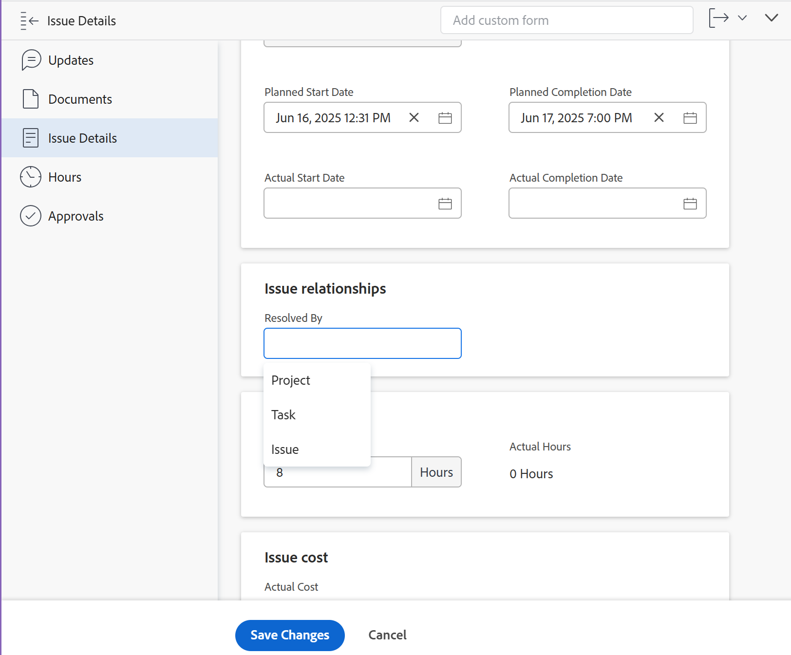

# Vincular manualmente a resolução de um problema a outros problemas, tarefas ou projetos

<!--Audited: 08/2025-->

Você pode vincular manualmente a resolução de um problema à resolução de um projeto, tarefa ou problema sem converter o problema. O problema se torna um dos Objetos Resolvíveis do projeto, tarefa ou problema selecionado. Quando você faz isso, uma alteração no status do projeto, tarefa ou problema aciona uma alteração no status do problema original.

>[!TIP]
>
>Ao vincular a resolução de uma ocorrência à resolução de outro objeto, não é mais possível editar manualmente o status da ocorrência original.

Para obter mais informações sobre resolução e objetos resolvíveis, consulte [Visão Geral de Objetos Resolvíveis e Resolvíveis](../../../manage-work/issues/convert-issues/resolving-and-resolvable-objects.md).

## Requisitos de acesso

+++ Expanda para visualizar os requisitos de acesso da funcionalidade neste artigo.

<table style="table-layout:auto"> 
 <col> 
 <col> 
 <tbody> 
  <tr> 
   <td role="rowheader">Pacote do Adobe Workfront</td> 
   <td> 
Qualquer
 </td> 
  </tr> 
  <tr> 
   <td role="rowheader">Licença do Adobe Workfront</td> 
   <td>
Colaborador ou posterior
 
   
Solicitação ou posterior
 </td> 
  </tr> 
  <tr> 
   <td role="rowheader">Configurações de nível de acesso</td> 
   <td> 
Editar acesso a problemas, tarefas e projetos
 </td> 
  </tr> 
  <tr> 
   <td role="rowheader">Permissões de objeto</td> 
   <td> 
Gerencie permissões para o problema que você vincula a outro problema, tarefa ou projeto
 
Visualize ou aumente as permissões para o problema, tarefa ou projeto que você adiciona ao problema existente
  </td> 
  </tr> 
 </tbody> 
</table>

Para obter mais detalhes sobre as informações contidas nesta tabela, consulte [Requisitos de acesso na documentação do Workfront](/help/quicksilver/administration-and-setup/add-users/access-levels-and-object-permissions/access-level-requirements-in-documentation.md).

+++

<!--
Old:

<table style="table-layout:auto"> 
 <col> 
 <col> 
 <tbody> 
  <tr> 
   <td role="rowheader">Adobe Workfront plan*</td> 
   <td> 
Any 
 </td> 
  </tr> 
  <tr> 
   <td role="rowheader">Adobe Workfront license*</td> 
   <td> 
Request or higher
 </td> 
  </tr> 
  <tr> 
   <td role="rowheader">Access level configurations*</td> 
   <td> 
Edit access to Issues, Tasks, Projects
 
Note: If you still don't have access, ask your Workfront administrator if they set additional restrictions in your access level. For information on how a Workfront administrator can modify your access level, see <a href="../../../administration-and-setup/add-users/configure-and-grant-access/create-modify-access-levels.md" class="MCXref xref">Create or modify custom access levels</a>.
 </td> 
  </tr> 
  <tr> 
   <td role="rowheader">Object permissions</td> 
   <td> 
Manage permissions to the issue you link to another issue, task, or project
 
View or higher permissions to the issue, task, or project you add to the existing issue
 
For information on requesting additional access, see <a href="../../../workfront-basics/grant-and-request-access-to-objects/request-access.md" class="MCXref xref">Request access to objects </a>.
 </td> 
  </tr> 
 </tbody> 
</table>
-->

## Pré-requisitos

Antes de começar, você deve:

* Ter um problema cuja resolução você deseja vincular à resolução de outro problema, tarefa ou projeto

* Ter um problema, tarefa ou projeto adicional

## Vincular a resolução de um problema à resolução de outro problema, tarefa ou projeto

1. Navegue até uma ocorrência cuja resolução você deseja vincular à resolução de outra ocorrência ou à resolução de uma tarefa ou projeto.
1. Clique em **Detalhes do problema** no painel esquerdo e expanda a área **Visão geral**.

   

1. Clique no campo **Resolvido por** e selecione um dos seguintes tipos de objetos de resolução:

   * **Projeto**
   * **Tarefa**
   * **Problema**

   Dependendo do objeto selecionado, os seguintes campos serão exibidos:

   * **Resolvendo Projeto**
   * **Resolvendo tarefa**
   * **Resolvendo problema**

1. Comece digitando o nome de um projeto, tarefa ou problema específico no campo **Resolvendo Projeto**, **Tarefa** ou **Problema**, e clique nele quando ele aparecer na lista.

   >[!NOTE]
   >
   >Não é possível vincular a resolução de um problema à tarefa ou ao projeto em que o problema está localizado. A tarefa ou o projeto do problema não são exibidos nos campos Resolving Task (Tarefa de resolução) ou Resolving Task (Tarefa de resolução).

1. Clique em **Salvar alterações**.

   O problema original torna-se o Objeto resolvível do projeto, tarefa ou problema selecionado nas etapas 4 e 5. Isso significa que o problema original é concluído quando o objeto de resolução (o projeto, a tarefa ou o problema ao qual você o vinculou) é concluído.

   >[!NOTE]
   >
   >Um projeto, tarefa ou problema pode ter vários problemas como Objetos resolvíveis.
