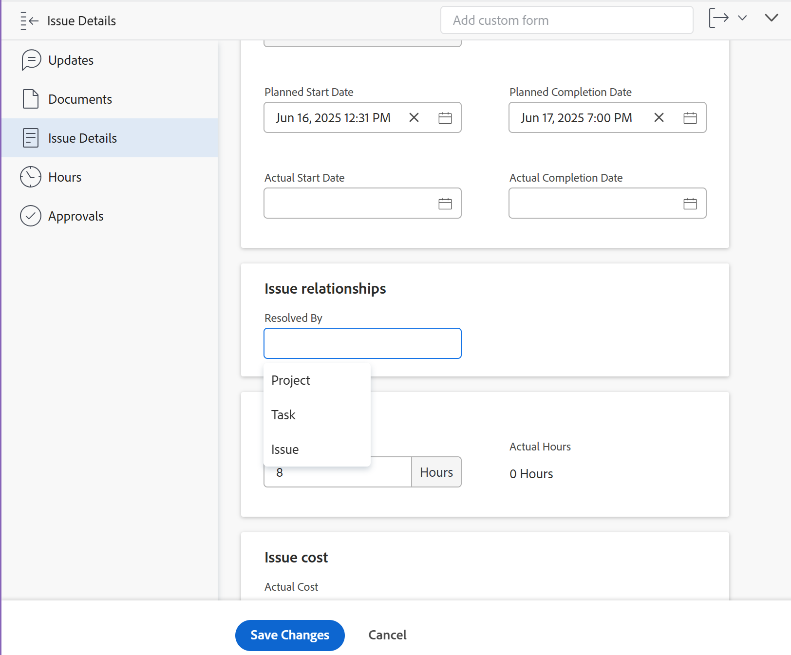

# Vincular manualmente a resolução de um problema a outros problemas, tarefas ou projetos

Você pode vincular manualmente a resolução de um problema à resolução de um projeto, tarefa ou problema sem converter o problema. O problema se torna um dos Objetos Resolvíveis do projeto, tarefa ou problema selecionado. Ao fazer isso, uma alteração no status do projeto, tarefa ou emissão aciona uma alteração no status do problema original.

>[!TIP]
>
>Quando a resolução de um problema é vinculada à resolução de outro objeto, não é mais possível editar manualmente o status do problema original.

Para obter mais informações sobre como resolver e resolver objetos, consulte [Visão Geral da Solução e Objetos Resolvíveis](../../../manage-work/issues/convert-issues/resolving-and-resolvable-objects.md).

## Requisitos de acesso

Você deve ter o seguinte:

<table style="table-layout:auto"> 
 <col> 
 <col> 
 <tbody> 
  <tr> 
   <td role="rowheader">Plano Adobe Workfront*</td> 
   <td> 
Qualquer Um 
 </td> 
  </tr> 
  <tr> 
   <td role="rowheader">Licença da Adobe Workfront*</td> 
   <td> 
Solicitação ou superior
 </td> 
  </tr> 
  <tr> 
   <td role="rowheader">Configurações de nível de acesso*</td> 
   <td> 
Editar acesso a ocorrências, tarefas, projetos
 
Observação: Caso ainda não tenha acesso, pergunte ao administrador do Workfront se ele definiu restrições adicionais em seu nível de acesso. Para obter informações sobre como um administrador do Workfront pode modificar seu nível de acesso, consulte <a href="../../../administration-and-setup/add-users/configure-and-grant-access/create-modify-access-levels.md" class="MCXref xref">Criar ou modificar níveis de acesso personalizados</a>.
 </td> 
  </tr> 
  <tr> 
   <td role="rowheader">Permissões de objeto</td> 
   <td> 
Gerencie permissões para o problema que você vincula a outro problema, tarefa ou projeto
 
Visualize ou permissões mais altas para o problema, tarefa ou projeto que você adiciona ao problema existente
 
Para obter informações sobre como solicitar acesso adicional, consulte <a href="../../../workfront-basics/grant-and-request-access-to-objects/request-access.md" class="MCXref xref">Solicitar acesso a objetos </a>.
 </td> 
  </tr> 
 </tbody> 
</table>

&#42;Para descobrir qual plano, tipo de licença ou acesso você tem, entre em contato com o administrador da Workfront.

## Pré-requisitos

Antes de começar, você deve:

* Tenha um problema cuja resolução você deseja vincular à resolução de outro problema, tarefa ou projeto

* Ter um problema, tarefa ou projeto adicional

## Vincular a resolução de um problema à resolução de outro problema, tarefa ou projeto

1. Navegue até um problema cuja resolução você deseja vincular à resolução de outro problema ou tarefa ou projeto.
1. Clique no botão **Detalhes do problema** > **Visão geral** área.

   

1. Vá para o **Visão geral** na **Detalhes do problema** seção.
1. Clique no botão **Resolvido por** e selecione um dos seguintes tipos de resolução de objetos:  

   * **Projeto**
   * **Tarefa**
   * **Problema**

1. O campo para o objeto de resolução é exibido.
1. Depois de selecionar o objeto, comece a digitar o nome de um projeto, tarefa ou problema específico no campo disponível e selecione-o quando ele for exibido na lista suspensa.
1. Clique em **Salvar** **Alterações**.\
   O problema original torna-se o Objeto Resolvível para o projeto, tarefa ou problema selecionado nas etapas 4 e 5. Isso significa que o problema original é concluído quando o objeto de resolução (o projeto, a tarefa ou o problema ao qual você o vinculou) é concluído.

   >[!NOTE]
   >
   >Um projeto, tarefa ou problema pode ter vários problemas como Objetos Resolvíveis.

 
