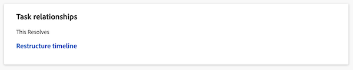
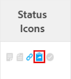

# Visão Geral de Objetos Resolventes e Resolvíveis

<!-- Audited: 5/2025 -->

Um Objeto Resolvível é um problema cuja resolução está vinculada a um Objeto Resolução. Um Objeto de Resolução é um projeto, tarefa ou outro problema.

Quando você converte um problema em uma tarefa ou um projeto, o problema se torna o Objeto resolvível da tarefa ou do projeto.

Você também pode vincular manualmente um problema a um Objeto de resolução, que pode ser uma tarefa, projeto ou problema. Para obter informações, consulte [Vincular manualmente a resolução de um problema a outros problemas, tarefas ou projetos](../../../manage-work/issues/convert-issues/manually-tie-resolution-of-issue-to-ptis.md).

Nesse cenário, o problema original torna-se o Objeto resolvível da tarefa, projeto ou problema.

## Configurar o Adobe Workfront para manipular objetos resolvíveis {#set-up-adobe-workfront-to-handle-resolvable-objects}

Como administrador do Workfront ou administrador de grupo, você pode decidir como deseja lidar com os Objetos resolvíveis no sistema ou no grupo.

Você pode optar por manter o Objeto resolvível enquanto o converte em uma tarefa ou projeto, ou excluí-lo depois que a tarefa ou o projeto for criado. É possível optar por permitir que essas configurações sejam alteradas no processo de conversão de problemas, o que permitirá que o usuário que converte os problemas selecione se deseja manter ou excluir o problema à medida que ele é convertido.

>[!NOTE]
>
>Objetos Resolvíveis são sempre problemas cuja resolução e status podem depender da resolução e do status do Objeto de Resolução ao qual estão associados. Objetos de resolução podem ser problemas, tarefas ou projetos.

Para obter informações sobre como configurar preferências para manipular Objetos Resolvíveis, consulte [Configurar preferências de tarefas e problemas em todo o sistema](../../../administration-and-setup/set-up-workfront/configure-system-defaults/set-task-issue-preferences.md).

<!--WRITER

(Note: drafted and just pointed the user to the article linked above)&nbsp;

To establish the system default for what happens to the issue as it is being converted to a task or a project:

<ol>
<li value="1">Log in to Workfront as a Workfront administrator or group administrator.</li>
<li value="2"> 
  From the main menu, click <strong>Setup</strong>. 
 
  
 </li>
<li value="3">Expand <strong>Project Preferences</strong>.</li>
<li value="4">Click <strong>Tasks & Issues</strong>.</li>
<li value="5">Go to the <strong>Issues</strong> area of the setup.  Consider editing any of the following settings:
<ul>
<li>
<strong>Automatically update Resolvable Issue status when the status of the Resolving Object changes:</strong> Select this option to tie the resolution of the original issue to the resolution of its Resolving Object. In order for this setting to have any effect, the options to <strong>Keep the original issue and tie its resolution to the task</strong> or<strong>project</strong> must be selected.

<ul>
<li>When this setting is enabled, you can create custom statuses with the same key for both issues and projects or tasks. When the project or task (as a resolvable object) turns into the custom status, the change also reflects on the status of the issue. The status key must be the same for the issue and project or task statuses.</li>
<li>
When this setting is disabled, resolving object statuses are automatically set to the default status, instead of the custom ones. For more information about the default statuses, see <a href="#synchronize-the-status-of-the-resolvable-object-with-that-of-the-resolving-object" class="MCXref xref">Synchronize the Status of the Resolvable Object with that of the Resolving Object</a>.
<note type="note">
The default status of the issue is controlled by the status of the project or task, regardless of whether this option is selected or not.
</note></li>
</ul></li>
<li><strong>When converting an issue to a TASK...:</strong> The settings in this section determine what happens during the conversion process from issue to task:
<ul>
<li><strong>Keep the original issue and tie its resolution to the task:</strong> When converting the issue, it remains visible as an issue until the task is complete. The status of the issue automatically changes to Closed when the task completes.</li>
<li><strong>Allow Primary Contact to have access to the task:</strong> Gives the primary contact (issue creator) access to the task to review the task, make updates, and stay informed of its progress.</li>
<li><strong>Allow these settings to be changed during conversion:</strong> Allows the user who is converting the issue to change these options during the conversion of an issue to a task. </li>
</ul></li>
<li><strong>When converting an issue to a PROJECT...:</strong> The settings in this section determine what happens during the conversion process from issue to project:
<ul>
<li><strong>Keep the original issue and tie its resolution to the project:</strong> When converting the issue, it remains visible as an issue until the project is complete. The status of the issue automatically changes to Closed when the project completes.</li>
<li><strong>Allow Primary Contact to have access to the project:</strong> Gives the primary contact (issue creator) access to the project to review the project, make updates, and stay informed of its progress.</li>
<li><strong>Allow these settings to be changed during conversion:</strong> Allows the user who is converting the issue to change these options during the conversion of an issue to a project. </li>
</ul></li>
</ul></li>
<li value="6">Click <strong>Save</strong>.</li>
</ol>

-->

## Manipular o objeto resolvível durante a conversão em um projeto ou tarefa

Dependendo de como o administrador do Workfront ou do grupo configurou as preferências de problemas no nível do sistema ou do grupo, você pode lidar com o objeto que pode ser resolvido durante a conversão de um problema em um projeto ou uma tarefa.

Existem os seguintes cenários:

* Se o administrador do Workfront ou do grupo tiver a opção Manter o problema original e vincular sua resolução à tarefa e a opção Manter o problema original e vincular sua resolução ao projeto selecionado e a opção Permitir que essas configurações sejam alteradas durante a conversão não selecionada, você não poderá alterar essas configurações enquanto estiver convertendo problemas em tarefas ou projetos.\
  

* Se o administrador do Workfront ou do grupo tiver a opção Manter o problema original e vincular sua resolução à tarefa e a opção Manter o problema original e vincular sua resolução ao projeto selecionado ou não selecionado e a opção Permitir que essas configurações sejam alteradas durante a conversão selecionada, você poderá alterar essas configurações conforme converte problemas em tarefas ou projetos.\
  

Para obter mais informações sobre a conversão de problemas em tarefas e projetos, consulte [Visão geral da conversão de problemas no Adobe Workfront](../../../manage-work/issues/convert-issues/convert-issues.md).

<!--WRITER

<h2>Tie the resolution of an issue to a project, task or </h2> 

(NOTE: created new article for this section; draft when the article is live and see if you need to make a link from this one to the new article) 

You can manually tie the resolution of an issue to the resolution of a project, task, or issue without converting the issue. The issue becomes one of the Resolvable Objects of the project, task, or issue you select. When you do this, a change in the status of the project, task, or issue triggers a change in the status of the original issue, so you cannot manually edit the status of the original issue.  For more information about how the status of the Resolving Object affects the Resolvable Object, see <a href="#synchronize-the-status-of-the-resolvable-object-with-that-of-the-resolving-object" class="MCXref xref">Synchronize the Status of the Resolvable Object with that of the Resolving Object</a>.

You must have Manage permissions on the original issue and View permissions on the project, task, or issue to do this. 

To tie the resolution of an issue to the resolution of a project, task, or issue:

<ol>
<li value="1">Navigate to an issue whose resolution you want to tie to a task or a project.</li>
<li value="2"> 
  Click the <strong>Issue Details</strong> > <strong>Overview</strong> area. 
  </li>
<li value="3"> 
Click the <strong>Edit</strong> icon  in the upper-right corner of the Issue Details section. 
 </li>
<li value="4">At the bottom of the form,  click in the <strong>Resolved By</strong> field,  and select from the following types of resolving objects:
<ul>
<li><strong>Project</strong></li>
<li><strong>Task</strong></li>
<li>
<strong>Issue</strong>
</li>
</ul>
The field for the resolving object displays. 
</li>
<li value="5">After selecting the object, start typing the name of a specific project, task, or issue in the available field and select it when it appears in the drop-down list. </li>
<li value="6">Click <strong>Save</strong>&nbsp;<strong>Changes</strong>. The original issue becomes the Resolvable Object for the project, task, or issue you selected in step 4 and 5. <note type="note">
One project, task, or issue may have multiple issues as Resolvable Objects.
</note></li>
</ol>

-->

## Sincronizar o Status do Objeto Resolvível com o do Objeto de Resolução {#synchronize-the-status-of-the-resolvable-object-with-that-of-the-resolving-object}

* [Sincronizar status quando o Objeto de Resolução for um problema](#synchronize-statuses-when-the-resolving-object-is-an-issue)
* [Sincronizar status quando o Objeto de Resolução for uma tarefa ou um projeto](#synchronize-statuses-when-the-resolving-object-is-a-task-or-a-project)

### Sincronizar status quando o Objeto de resolução for um problema {#synchronize-statuses-when-the-resolving-object-is-an-issue}

Quando um problema é vinculado manualmente a outro problema, o status do segundo problema (Objeto de resolução) aciona uma alteração no status do primeiro problema (Objeto de resolução). O status da primeira ocorrência corresponde ao status para o qual a segunda ocorrência foi alterada. Isso se aplica aos status de problema padrão e personalizado.

### Sincronizar status quando o Objeto de Resolução for uma tarefa ou um projeto {#synchronize-statuses-when-the-resolving-object-is-a-task-or-a-project}

Quando um problema é o Objeto resolvível de uma tarefa ou um projeto, as alterações no status das tarefas e dos projetos acionam alterações no status do problema. Nesse caso, os status padrão são acionados de forma diferente dos status Personalizados.

Quando o status personalizado de um projeto é igual a um status padrão que não aciona uma alteração no status do problema, a alteração no status do projeto não aciona uma alteração no status do problema.

* [Sincronizar o Status Padrão do Objeto de Resolução com o Status Padrão do Objeto Resolvível](#synchronize-the-default-status-of-the-resolving-object-with-the-default-status-of-the-resolvable-object)
* [Sincronizar o Status Personalizado do Objeto de Resolução com o Status Personalizado do Objeto Resolvível](#synchronize-the-custom-status-of-the-resolving-object-with-the-custom-status-of-the-resolvable-object)

#### Sincronizar o Status Padrão do Objeto de Resolução com o Status Padrão do Objeto de Resolução {#synchronize-the-default-status-of-the-resolving-object-with-the-default-status-of-the-resolvable-object}

Independentemente de a opção Atualizar automaticamente o status de um problema resolvível quando o status do Objeto de resolução for selecionado, sempre que o status padrão for alterado nos Objetos de resolução (projetos ou tarefas), o status do Objeto resolvível (problemas) será alterado de acordo. Somente os status padrão já estão mapeados para acionar essa alteração.

Os seguintes status de tarefa padrão acionam as seguintes alterações nos status de problema padrão quando o problema é definido como o objeto de resolução da tarefa:

| **STATUS DA TAREFA** | **STATUS DO PROBLEMA** |
|---|---|
| Novo(a) | Novo(a) |
| Em andamento | Em andamento |
| Completo | Fechado |

Os status de projeto padrão a seguir acionam as seguintes alterações nos status de problema padrão quando o problema é definido como um Objeto resolvível de um projeto. Alguns status de projeto não acionam alterações nos status de problemas. Os problemas permanecem no status em que estavam antes de o projeto ser transformado em um destes status:

| **STATUS DO PROJETO** | **STATUS DO PROBLEMA** |
|---|---|
| Em Planejamento | Novo(a) |
| Em Andamento | Em andamento |
| Em Espera | Em Espera |
| Solicitado | Não aciona uma alteração no status do problema |
| Aprovado | Não aciona uma alteração no status do problema |
| Rejeitado | Não aciona uma alteração no status do problema |
| Ideia | Não aciona uma alteração no status do problema |
| Parado | Fechado |
| Concluídos | Fechado |

>[!NOTE]
>
>Depois que o status do problema se tornar Fechado (como resultado do fechamento da tarefa ou do projeto), independentemente do status da tarefa ou do projeto mudar para depois de fechá-los, o problema permanece Fechado.

#### Sincronizar o Status Personalizado do Objeto de Resolução com o Status Personalizado do Objeto Resolvível {#synchronize-the-custom-status-of-the-resolving-object-with-the-custom-status-of-the-resolvable-object}

Quando você altera o status da tarefa ou do projeto para um status personalizado, o status do problema muda para um status de problema personalizado somente se as duas condições a seguir forem atendidas:

* O status Atualizável automaticamente do problema resolvível quando o status da opção Resolvendo alteração de objeto é selecionada. Para obter mais informações, consulte [Configurar o Adobe Workfront para manipular Objetos Resolvíveis](#set-up-adobe-workfront-to-handle-resolvable-objects).

* O status personalizado do projeto ou tarefa tem o mesmo código de três letras que o status personalizado do problema.

Você pode criar status personalizados com a mesma chave para problemas e projetos ou tarefas. Quando o projeto ou a tarefa (como um Objeto de resolução) é alterado para o status personalizado, a alteração também reflete no status do problema. A chave de status deve ser a mesma para os status de problema e de projeto ou tarefa.

Por exemplo, imagine criar um status personalizado de projeto chamado Iniciado com o código de três letras LCD, que equivale a Atual. Em seguida, você cria um status personalizado de problema chamado Projeto iniciado, também com o código de letra LCD, que equivale a Em andamento. Quando você marca o projeto como Iniciado, o problema muda automaticamente o status para Projeto iniciado. Se o status de Atualização automática de problema resolvível quando o status da configuração de Resolução de alterações de objeto não estiver ativado, o status do problema será alterado para Em andamento.

Para obter mais informações sobre como criar um status personalizado, consulte [Criar ou editar um status](../../../administration-and-setup/customize-workfront/creating-custom-status-and-priority-labels/create-or-edit-a-status.md).

## Sincronizar o percentual concluído de um Objeto de Resolução com o do Objeto Resolvível

Se um problema for resolvido por uma tarefa ou um projeto, o percentual concluído do problema será atualizado no problema resolvível quando qualquer uma das seguintes situações ocorrer:

* Quando alguém salva uma alteração na tarefa ou no projeto.
* Quando a linha do tempo do projeto é recalculada.

Se um problema for resolvido por outro problema, o percentual concluído será atualizado quando qualquer um dos problemas for atualizado.

## Localizar o Objeto Resolvível em uma tarefa ou um projeto

>[!NOTE]
>
>Para executar as etapas desta seção, você deve ter pelo menos o acesso de Visualização a tarefas e projetos e permissões de Visualização para a tarefa ou projeto que contém o objeto que pode ser resolvido que você deseja visualizar.

A localização do objeto de resolução é idêntica para tarefas e projetos.

1. Navegue até um projeto ou uma tarefa que você criou convertendo um problema.
1. No lado esquerdo da página, selecione a guia **Detalhes da tarefa** ou **Detalhes do projeto**.
1. Na parte inferior da seção **Visão Geral**, localize o campo **Esta Resolução**, no qual o Objeto Resolvível da tarefa ou do projeto é exibido.

   

   >[!NOTE]
   >
   >Problemas não podem ser convertidos em outros problemas, mas podem ser associados manualmente a um Problema de resolução. Um projeto, tarefa ou problema pode ter vários problemas como Objetos resolvíveis. Quando o projeto, tarefa ou problema é resolvido, o Objeto resolvível (problema) também é resolvido. O Problema resolvível permanece fechado mesmo se o projeto, tarefa ou problema que o resolveu reabrir.

## Identificação de um problema com um Objeto de resolução em uma lista

Em uma lista de problemas, você pode identificar problemas que são rotulados como objetos de resolução através de ícones de status localizando este ícone nas colunas **Ícones de Status** ou **Sinalizadores**:

## Exibir informações sobre Resolvíveis e Objeto de Resolução em um relatório

Você pode exibir informações sobre os Objetos Resolvíveis ou de Resolução na exibição ou no relatório para projetos, tarefas ou problemas.

A tabela a seguir mostra quais campos você pode exibir e em quais exibições você pode exibi-los:

<table style="table-layout:auto"> 
 <col> 
 <col> 
 <col> 
 <col> 
 <thead> 
  <tr> 
   <th><strong>Campo na Exibição</strong> </th> 
   <th><strong>Visualização de Problemas</strong> </th> 
   <th><strong>Modo de Exibição de Tarefa</strong> </th> 
   <th><strong>Exibição do projeto</strong> </th> 
  </tr> 
 </thead> 
 <tbody> 
  <tr> 
   <td><strong>Possui Contas a Resolver</strong>: exibe um valor Verdadeiro se o projeto ou a tarefa tiver Problemas Resolvíveis associados a eles, e um valor Falso se eles não tiverem.</td> 
   <td>✓</td> 
   <td>✓</td> 
   <td>✓</td> 
  </tr> 
  <tr> 
   <td><strong>Nome Original do Problema, Data de Entrada Original do Problema, Nome da Origem</strong>: Exibe o nome e a data de entrada do problema original, bem como o nome do usuário que criou o problema em uma exibição personalizada em modo de texto. Para obter mais informações, consulte <a href="../../../reports-and-dashboards/reports/custom-view-filter-grouping-samples/view-display-original-issue-info-task-project-list.md" class="MCXref xref">Exibir: exibir informações de problemas originais em listas de tarefas ou projetos</a>. </td> 
   <td> </td> 
   <td> ✓</td> 
   <td> ✓</td> 
  </tr> 
  <tr> 
   <td> 
<strong>Contas a Resolver:</strong> Exibe uma lista de todos os Objetos Resolvíveis em um modo de exibição personalizado de modo de texto para um relatório ou lista de projetos ou tarefas.
 
Para obter mais informações, consulte <a href="../../../reports-and-dashboards/reports/custom-view-filter-grouping-samples/view-resolvable-objects-task-project-report.md" class="MCXref xref">Exibir: Objetos Resolvíveis em um relatório de tarefa ou de projeto</a>
 </td> 
   <td> </td> 
   <td>✓</td> 
   <td> ✓</td> 
  </tr> 
  <tr> 
   <td><strong>Originador de Problema Convertido</strong>: Exibe informações sobre o usuário que registrou originalmente o problema que foi convertido posteriormente na tarefa. </td> 
   <td> </td> 
   <td>✓</td> 
   <td> </td> 
  </tr> 
  <tr> 
   <td><strong>Resolver Projeto</strong>: exibe informações sobre o Projeto de Resolução que foi convertido a partir do problema original ou designado manualmente como o Objeto de Resolução de um problema.</td> 
   <td>✓</td> 
   <td> </td> 
   <td> </td> 
  </tr> 
  <tr> 
   <td><strong>Resolver Tarefa</strong>: Exibe informações sobre a Tarefa de Resolução que foi convertida a partir do problema original ou designada manualmente como o Objeto de Resolução de um problema.</td> 
   <td>✓ </td> 
   <td> </td> 
   <td> </td> 
  </tr> 
  <tr> 
   <td><strong>Resolver problema</strong>: exibe informações sobre a Resolução de problema que foi designada manualmente como o Objeto de Resolução de um problema.</td> 
   <td> ✓</td> 
   <td> </td> 
   <td> </td> 
  </tr> 
 </tbody> 
</table>
