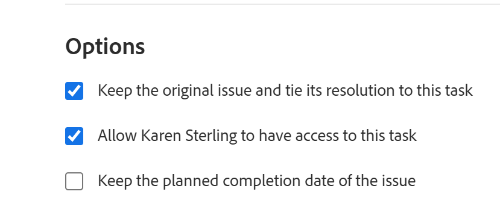

# Visão Geral da Solução e Objetos Resolvíveis

Um Objeto Resolvível é um problema cuja resolução está vinculada a um Objeto Resolvedor. Um objeto de resolução é um projeto, uma tarefa ou outro problema.

Quando você converte um problema em uma tarefa ou projeto, o problema se torna o Objeto Resolvível da tarefa ou do projeto.

Você também pode vincular manualmente um problema a um Objeto de resolução, que pode ser uma tarefa, um projeto ou um problema. Para obter mais informações, consulte [Vincular manualmente a resolução de um problema a outros problemas, tarefas ou projetos](../../../manage-work/issues/convert-issues/manually-tie-resolution-of-issue-to-ptis.md).

O problema original torna-se o Objeto Resolvível da tarefa, do projeto ou da ocorrência, neste cenário.

## Configurar Adobe Workfront para manipular objetos resolvíveis {#set-up-adobe-workfront-to-handle-resolvable-objects}

Como administrador do Workfront ou administrador de grupo, você pode decidir como deseja lidar com os Objetos Resolvíveis em seu sistema ou para seu grupo.

Você pode optar por manter o Objeto Resolvível à medida que o converte em uma tarefa ou projeto, ou excluí-lo assim que a tarefa ou projeto for criado. Você pode optar por permitir que essas configurações sejam alteradas no processo de conversão de problemas, o que permitirá que o usuário convertendo os problemas selecione se deseja manter ou excluir o problema enquanto está convertendo.

>[!NOTE]
>
>Objetos Resolvíveis são sempre problemas cuja resolução e status podem depender da resolução e do status do Objeto Resolvedor ao qual estão associados. Resolver objetos pode ser problemas, tarefas ou projetos.

Para obter informações sobre como configurar preferências para manipular Objetos Resolvíveis, consulte [Configurar preferências de emissão e tarefa em todo o sistema](../../../administration-and-setup/set-up-workfront/configure-system-defaults/set-task-issue-preferences.md).

<!--WRITER

(Note: drafted and just pointed the user to the article linked above)&nbsp;

To establish the system default for what happens to the issue as it is being converted to a task or a project:

<ol>
<li value="1">Log in to Workfront as a Workfront administrator or group administrator.</li>
<li value="2"> 
  From the main menu, click <strong>Setup</strong>. 
 
  
 </li>
<li value="3">Expand <strong>Project Preferences</strong>.</li>
<li value="4">Click <strong>Tasks & Issues</strong>.</li>
<li value="5">Go to the <strong>Issues</strong> area of the setup.  Consider editing any of the following settings:
<ul>
<li>
<strong>Automatically update Resolvable Issue status when the status of the Resolving Object changes:</strong> Select this option to tie the resolution of the original issue to the resolution of its Resolving Object. In order for this setting to have any effect, the options to <strong>Keep the original issue and tie its resolution to the task</strong> or<strong>project</strong> must be selected.

<ul>
<li>When this setting is enabled, you can create custom statuses with the same key for both issues and projects or tasks. When the project or task (as a resolvable object) turns into the custom status, the change also reflects on the status of the issue. The status key must be the same for the issue and project or task statuses.</li>
<li>
When this setting is disabled, resolving object statuses are automatically set to the default status, instead of the custom ones. For more information about the default statuses, see <a href="#synchronize-the-status-of-the-resolvable-object-with-that-of-the-resolving-object" class="MCXref xref">Synchronize the Status of the Resolvable Object with that of the Resolving Object</a>.
<note type="note">
The default status of the issue is controlled by the status of the project or task, regardless of whether this option is selected or not.
</note></li>
</ul></li>
<li><strong>When converting an issue to a TASK...:</strong> The settings in this section determine what happens during the conversion process from issue to task:
<ul>
<li><strong>Keep the original issue and tie its resolution to the task:</strong> When converting the issue, it remains visible as an issue until the task is complete. The status of the issue automatically changes to Closed when the task completes.</li>
<li><strong>Allow Primary Contact to have access to the task:</strong> Gives the primary contact (issue creator) access to the task to review the task, make updates, and stay informed of its progress.</li>
<li><strong>Allow these settings to be changed during conversion:</strong> Allows the user who is converting the issue to change these options during the conversion of an issue to a task. </li>
</ul></li>
<li><strong>When converting an issue to a PROJECT...:</strong> The settings in this section determine what happens during the conversion process from issue to project:
<ul>
<li><strong>Keep the original issue and tie its resolution to the project:</strong> When converting the issue, it remains visible as an issue until the project is complete. The status of the issue automatically changes to Closed when the project completes.</li>
<li><strong>Allow Primary Contact to have access to the project:</strong> Gives the primary contact (issue creator) access to the project to review the project, make updates, and stay informed of its progress.</li>
<li><strong>Allow these settings to be changed during conversion:</strong> Allows the user who is converting the issue to change these options during the conversion of an issue to a project. </li>
</ul></li>
</ul></li>
<li value="6">Click <strong>Save</strong>.</li>
</ol>

-->

## Lida com o Objeto Resolvível durante a conversão em um projeto ou tarefa

Dependendo da forma como o Workfront ou o administrador de grupo configurou as preferências de problema no nível do sistema ou grupo, você pode lidar com o objeto resolvível durante a conversão de um problema em um projeto ou tarefa.

Os seguintes cenários existem:

* Se o administrador da Workfront ou do grupo tiver a variável **Mantenha o problema original e vincule sua resolução à tarefa** e **Mantenha o problema original e vincule sua resolução ao projeto** selecionado e o **Permitir que essas configurações sejam alteradas durante a conversão** não selecionado, você não poderá alterar essas configurações, pois está convertendo problemas em tarefas ou projetos.\
   

* Se o administrador da Workfront ou do grupo tiver a variável **Mantenha o problema original e vincule sua resolução à tarefa** e **Mantenha o problema original e vincule sua resolução ao projeto** selecionado ou não selecionado e a variável **Permitir que essas configurações sejam alteradas durante a conversão** selecionado, você poderá alterar essas configurações à medida que estiver convertendo problemas em tarefas ou projetos.\
   

Para obter mais informações sobre conversão de problemas em tarefas e projetos, consulte [Visão geral da conversão de problemas no Adobe Workfront](../../../manage-work/issues/convert-issues/convert-issues.md).

<!--WRITER

<h2>Tie the resolution of an issue to a project, task or </h2> 

(NOTE: created new article for this section; draft when the article is live and see if you need to make a link from this one to the new article) 

You can manually tie the resolution of an issue to the resolution of a project, task, or issue without converting the issue. The issue becomes one of the Resolvable Objects of the project, task, or issue you select. When you do this, a change in the status of the project, task, or issue triggers a change in the status of the original issue, so you cannot manually edit the status of the original issue.  For more information about how the status of the Resolving Object affects the Resolvable Object, see <a href="#synchronize-the-status-of-the-resolvable-object-with-that-of-the-resolving-object" class="MCXref xref">Synchronize the Status of the Resolvable Object with that of the Resolving Object</a>.

You must have Manage permissions on the original issue and View permissions on the project, task, or issue to do this. 

To tie the resolution of an issue to the resolution of a project, task, or issue:

<ol>
<li value="1">Navigate to an issue whose resolution you want to tie to a task or a project.</li>
<li value="2"> 
  Click the <strong>Issue Details</strong> > <strong>Overview</strong> area. 
 
  
 </li>
<li value="3"> 
Click the <strong>Edit</strong> icon  in the upper-right corner of the Issue Details section. 
 </li>
<li value="4">At the bottom of the form,  click in the <strong>Resolved By</strong> field,  and select from the following types of resolving objects:
<ul>
<li><strong>Project</strong></li>
<li><strong>Task</strong></li>
<li>
<strong>Issue</strong>
</li>
</ul>
The field for the resolving object displays. 
</li>
<li value="5">After selecting the object, start typing the name of a specific project, task, or issue in the available field and select it when it appears in the drop-down list. </li>
<li value="6">Click <strong>Save</strong>&nbsp;<strong>Changes</strong>. The original issue becomes the Resolvable Object for the project, task, or issue you selected in step 4 and 5. <note type="note">
One project, task, or issue may have multiple issues as Resolvable Objects.
</note></li>
</ol>

-->

## Sincronizar o Status do Objeto Resolvível com o do Objeto Resolvedor {#synchronize-the-status-of-the-resolvable-object-with-that-of-the-resolving-object}

* [Sincronizar status quando o objeto de resolução for um problema](#synchronize-statuses-when-the-resolving-object-is-an-issue)
* [Sincronizar status quando o objeto de resolução for uma tarefa ou um projeto](#synchronize-statuses-when-the-resolving-object-is-a-task-or-a-project)

### Sincronizar status quando o objeto de resolução for um problema {#synchronize-statuses-when-the-resolving-object-is-an-issue}

Se um problema for vinculado manualmente a outro problema, o status do segundo problema (Resolvendo Objeto) acionará uma alteração no status do primeiro problema (Objeto Resolvível). O status do primeiro problema corresponde ao status para o qual o segundo problema foi alterado. Isso se aplica aos status de problemas padrão e personalizado.

### Sincronizar status quando o objeto de resolução for uma tarefa ou um projeto {#synchronize-statuses-when-the-resolving-object-is-a-task-or-a-project}

Quando um problema é o Objeto Resolvível de uma tarefa ou projeto, as alterações no status das tarefas e os projetos acionam alterações no status do problema. Os status padrão são acionados de forma diferente dos status Personalizados, neste caso.

* [Sincronizar o Status Padrão do Objeto Resolvido com o Status Padrão do Objeto Resolvível](#synchronize-the-default-status-of-the-resolving-object-with-the-default-status-of-the-resolvable-object)
* [Sincronizar o status personalizado do objeto de resolução com o status personalizado do objeto resolvível](#synchronize-the-custom-status-of-the-resolving-object-with-the-custom-status-of-the-resolvable-object)

#### Sincronizar o Status Padrão do Objeto Resolvido com o Status Padrão do Objeto Resolvível {#synchronize-the-default-status-of-the-resolving-object-with-the-default-status-of-the-resolvable-object}

Independentemente de a opção &quot;Atualizar Automaticamente o Status da Ocorrência Resolvível quando o status do Objeto Resolvível for alterado&quot; estar selecionada, sempre que o status padrão for alterado em Resolver Objetos (projetos ou tarefas), o status do Objeto Resolvível (problemas) será alterado de acordo. Somente os status padrão já estão mapeados para acionar essa alteração.

Os seguintes status padrão para tarefas acionam as seguintes alterações nos status padrão para problemas, quando o problema é definido como o objeto de resolução de uma tarefa:

| **STATUS DA TAREFA** | **STATUS DO PROBLEMA** |
|---|---|
| Novo(a) | Novo(a) |
| Em andamento | Em andamento |
| Completo | Fechado |

Os seguintes status padrão para projetos acionam as seguintes alterações nos status padrão para problemas, quando o problema é definido como um Objeto Resolvível de um projeto. Alguns status do projeto não acionam alterações no status dos problemas. Os problemas permanecem no status em que estavam antes que o projeto fosse transformado em um desses status:

| **STATUS DO PROJETO** | **STATUS DO PROBLEMA** |
|---|---|
| Em Planejamento | Novo(a) |
| Em Andamento | Em andamento |
| Em Espera | Em Espera |
| Solicitado(a) | Não aciona uma alteração no status da ocorrência |
| Aprovado | Não aciona uma alteração no status da ocorrência |
| Rejeitado | Não aciona uma alteração no status da ocorrência |
| Ideia | Não aciona uma alteração no status da ocorrência |
| Parado | Fechado |
| Concluídos | Fechado |

>[!NOTE]
>
>Depois que o status do problema for Fechado (como resultado do fechamento da tarefa ou do projeto), independentemente do status em que a tarefa ou projeto for alterado depois de fechá-los, o problema permanecerá Fechado.

#### Sincronizar o status personalizado do objeto de resolução com o status personalizado do objeto resolvível {#synchronize-the-custom-status-of-the-resolving-object-with-the-custom-status-of-the-resolvable-object}

Quando você altera o status da tarefa ou do projeto para um status personalizado, o status da emissão muda para um status de emissão personalizado somente se as duas condições a seguir forem atendidas:

* A opção &quot;Atualizar automaticamente o status do problema resolvível quando o status do objeto de resolução for alterado&quot; é selecionada. Para obter mais informações sobre como ativar essa configuração, consulte [Configurar Adobe Workfront para manipular objetos resolvíveis](#set-up-adobe-workfront-to-handle-resolvable-objects).

* O status personalizado do projeto ou da tarefa tem o mesmo código de três letras que o status personalizado da emissão.

Você pode criar status personalizados com a mesma chave para problemas e projetos ou tarefas. Quando o projeto ou a tarefa (como um Objeto de Resolução) é alterado para o status personalizado, a alteração também reflete sobre o status do problema. A chave de status deve ser a mesma para o problema e os status do projeto ou da tarefa.

Por exemplo, crie um status personalizado de projeto chamado &quot;Lançado&quot; com o código de três letras &quot;LCD&quot; que equivale a &quot;Atual&quot;. Além disso, crie um status personalizado de problema chamado &quot;Projeto iniciado&quot;, também com a letra &quot;LCD&quot; que equivale a &quot;Em andamento&quot;. Ao marcar o projeto como &quot;Iniciado&quot;, o problema alterará automaticamente o status para &quot;Projeto iniciado&quot;. Se a configuração &quot;Atualizar automaticamente o status do problema resolvível quando o status do objeto de resolução for alterado&quot; não estiver ativada, o status do problema será alterado para &quot;Em andamento&quot; (o status padrão).

Para obter mais informações sobre como criar um status personalizado, consulte [Criar ou editar um status](../../../administration-and-setup/customize-workfront/creating-custom-status-and-priority-labels/create-or-edit-a-status.md).

## Sincronizar a porcentagem completa de um objeto de resolução com a do objeto resolvível

Se um problema for resolvido por uma tarefa ou projeto, a porcentagem completa do problema será atualizada no problema resolvível quando qualquer um dos seguintes itens ocorrer: 

* Quando alguém salva uma alteração na tarefa ou projeto.
* A linha do tempo do projeto é recalculada.

Se um problema for resolvido por outro problema, a porcentagem completa é atualizada quando qualquer um dos problemas é atualizado.

## Localize o Objeto Resolvível em uma tarefa ou projeto

Localizar o objeto de resolução é idêntico para tarefas e projetos.

1. Navegue até um projeto ou uma tarefa criada convertendo um problema para o projeto ou a tarefa.
1. Clique no botão **Detalhes do projeto** ou **Detalhes da tarefa** e clique em para expandi-lo.
1. Clique em **Visão geral**.
1. Na parte inferior da guia , localize para **Isso Resolve** campo : o problema que é o Objeto Resolvível do projeto ou da tarefa está listado neste campo.

   >[!NOTE]
   >
   >Os problemas não podem ser convertidos em outros problemas, mas podem ser associados manualmente a um problema de solução. Um projeto, tarefa ou problema pode ter vários problemas como Objetos Resolvíveis. Quando o projeto, a tarefa ou o problema é resolvido, o Objeto Resolvível (problema) também é resolvido. O problema resolvível permanece fechado mesmo se o projeto, a tarefa ou o problema que o resolveu reabrir.

## Identificar um problema com um objeto de resolução em uma lista

Em uma lista de problemas, é possível identificar os problemas identificados como resolvendo objetos por meio de ícones de status, localizando esse ícone na variável **Ícones de status** ou **Sinalizadores** colunas:

## Exibir informações de objetos resolvíveis e resolvidos em um relatório

É possível exibir informações sobre os Objetos Resolvíveis ou Resolvendo na exibição ou no relatório de projetos, tarefas ou problemas.\
A tabela a seguir mostra quais campos você pode exibir e em quais exibições você pode exibi-los:

<table style="table-layout:auto"> 
 <col> 
 <col> 
 <col> 
 <col> 
 <thead> 
  <tr> 
   <th><strong>Campo na exibição</strong> </th> 
   <th><strong>Visualização de Problemas</strong> </th> 
   <th><strong>Visualização da Tarefa</strong> </th> 
   <th><strong>Visualização do Projeto</strong> </th> 
  </tr> 
 </thead> 
 <tbody> 
  <tr> 
   <td><strong>Possui Resolvíveis</strong>: Exibe um <strong>Verdadeiro</strong> se o projeto ou a tarefa tiver Problemas Resolvíveis associados a eles e um <strong>Falso</strong> , caso contrário.</td> 
   <td>✓</td> 
   <td>✓</td> 
   <td>✓</td> 
  </tr> 
  <tr> 
   <td><strong>Nome da Emissão Original, Data da Entrada da Emissão Original, Nome do Originador</strong>: Exibe o nome e a data de entrada do problema original, bem como o nome do usuário que criou o problema em uma visualização personalizada no modo de texto. Para obter mais informações sobre como criar uma exibição personalizada do modo de texto para um projeto ou relatório de tarefa ou lista para exibir informações sobre o problema original, consulte <a href="../../../reports-and-dashboards/reports/custom-view-filter-grouping-samples/view-display-original-issue-info-task-project-list.md" class="MCXref xref">Exibir: exibir informações de problema originais em listas de tarefas e projetos</a>. </td> 
   <td> </td> 
   <td> ✓</td> 
   <td> ✓</td> 
  </tr> 
  <tr> 
   <td> 
<strong>Resolvíveis:</strong> Exibe uma lista de todos os Objetos Resolvíveis em uma exibição personalizada do modo de texto para um projeto ou relatório ou lista de tarefas.
 
Para obter mais informações sobre como criar essa exibição, consulte <a href="../../../reports-and-dashboards/reports/custom-view-filter-grouping-samples/view-resolvable-objects-task-project-report.md" class="MCXref xref">Exibir: Objetos Resolvíveis em um relatório de tarefa ou projeto</a>
 </td> 
   <td> </td> 
   <td>✓</td> 
   <td> ✓</td> 
  </tr> 
  <tr> 
   <td><strong>Originador da Emissão Convertida</strong>: Exibe informações sobre o usuário que registrou originalmente o problema que foi convertido posteriormente para a tarefa. </td> 
   <td> </td> 
   <td>✓</td> 
   <td> </td> 
  </tr> 
  <tr> 
   <td><strong>Resolver projeto</strong>: Exibe informações sobre o Projeto de Resolução que foi convertido a partir do problema original ou designado manualmente como o Objeto de Resolução de um problema.</td> 
   <td>✓</td> 
   <td> </td> 
   <td> </td> 
  </tr> 
  <tr> 
   <td><strong>Resolver Tarefa</strong>: Exibe informações sobre a Tarefa de Resolução que foi convertida a partir do problema original ou designada manualmente como o Objeto de Resolução de um problema.</td> 
   <td>✓ </td> 
   <td> </td> 
   <td> </td> 
  </tr> 
  <tr> 
   <td><strong>Resolver problema</strong>: Exibe informações sobre o problema de solução que foi designado manualmente como o objeto de resolução de um problema.</td> 
   <td> ✓</td> 
   <td> </td> 
   <td> </td> 
  </tr> 
 </tbody> 
</table>
