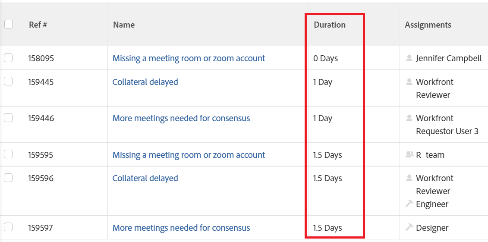

# Visão geral da duração do problema

A Duração de uma emissão é o número de dias entre a Data Inicial Planejada e a Data de Conclusão Planejada da emissão. 

A duração de um problema é calculada automaticamente pela Adobe Workfront e não pode ser modificada manualmente. 

Você pode exibir a Duração de um problema em um relatório de problema ou a visualização de uma lista de problemas. 

Para obter mais informações sobre como criar um relatório, consulte [Criar um relatório personalizado](../../../reports-and-dashboards/reports/creating-and-managing-reports/create-custom-report.md).

