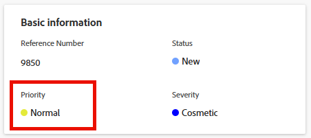

# Atualizar prioridade do problema

Você pode definir uma prioridade para uma ocorrência para indicar a importância da ocorrência.

## Requisitos de acesso

+++ Expanda para visualizar os requisitos de acesso para a funcionalidade neste artigo.

<table style="table-layout:auto"> 
 <col> 
 <col> 
 <tbody> 
  <tr> 
   <td role="rowheader">Pacote do Adobe Workfront</td> 
   <td> 
Qualquer
 </td> 
  </tr> 
  <tr> 
   <td role="rowheader">Licença do Adobe Workfront</td> 
   <td>
Colaborador ou superior
 
   
Solicitação ou superior
 </td> 
  </tr> 
  <tr> 
   <td role="rowheader">Configurações de nível de acesso</td> 
   <td> 
Editar acesso a ocorrências
 </td> 
  </tr> 
  <tr> 
   <td role="rowheader">Permissões de objeto</td> 
   <td> 
Gerenciar permissões do problema
 </td> 
  </tr> 
 </tbody> 
</table>

Para obter mais informações, consulte [Requisitos de acesso na documentação do Workfront](/help/quicksilver/administration-and-setup/add-users/access-levels-and-object-permissions/access-level-requirements-in-documentation.md).

+++

## Visão geral das prioridades do problema

Cada rótulo de prioridade tem um número associado que não pode ser modificado.

Os administradores do Adobe Workfront podem modificar os rótulos de prioridade no Workfront ou criar novas prioridades. Como resultado, as opções que você pode ter para o campo Prioridade na instância do Workfront podem ser diferentes das listadas abaixo.

Você deve se familiarizar com a sequência de numeração das prioridades usadas em sua organização.\
Por exemplo, sua organização pode usar o número 1 para se referir a tarefas urgentes, se o rótulo da prioridade tiver sido modificado.

Para obter mais informações sobre como personalizar os nomes das prioridades na sua instância, consulte [Criar e personalizar prioridades](../../../administration-and-setup/customize-workfront/creating-custom-status-and-priority-labels/create-customize-priorities.md).

Consulte a tabela a seguir para entender cada rótulo de prioridade padrão e seu número correspondente:

<table style="table-layout:auto"> 
 <col> 
 <col> 
 <thead> 
  <tr> 
   <th>Rótulo de Prioridade  (Pode ser modificado) </th> 
   <th>Número de Prioridade   (Não pode ser modificado) </th> 
  </tr> 
 </thead> 
 <tbody> 
  <tr> 
   <td> Nenhum(a) </td> 
   <td> 0 </td> 
  </tr> 
  <tr> 
   <td> Baixa </td> 
   <td> 1 </td> 
  </tr> 
  <tr> 
   <td> Normal </td> 
   <td> 2 </td> 
  </tr> 
  <tr> 
   <td> Alta </td> 
   <td> 3 </td> 
  </tr> 
  <tr> 
   <td> Urgente </td> 
   <td> 4 </td> 
  </tr> 
 </tbody> 
</table>

## Atualizar a prioridade de um problema {#update-the-priority-of-an-issue}

1. Vá para o problema cuja prioridade você deseja modificar.
1. Clique em **Detalhes do problema** no painel esquerdo.

   A seção **Visão geral** deve ser exibida por padrão.

1. Clique no campo **Prioridade** na área **Informações básicas**.

   

1. Selecione um valor para o campo **Prioridade**.

   Dependendo de como o administrador do Workfront configurou as Prioridades no sistema, as opções podem variar.

1. Clique em **Salvar alterações**.
