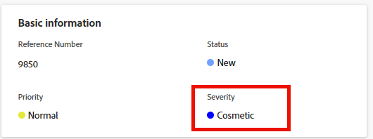

# Atualizar severidade do problema

<!--Audited: 08/2025-->

Você pode associar uma severidade a problemas no Adobe Workfront. Tarefas e projetos não têm severidade.

Problemas são eventos inesperados que podem impedir a conclusão dos projetos no prazo ou dentro do orçamento. Você pode usar severidades para indicar a gravidade de um problema.

O administrador do Workfront define as severidades disponíveis no Workfront. Depois que eles as estabelecerem, elas estarão disponíveis para você associar a uma ocorrência.\
Para obter mais informações sobre como criar severidades no Workfront, consulte [Criar ou personalizar severidades de problemas](../../../administration-and-setup/customize-workfront/creating-custom-status-and-priority-labels/create-customize-issue-severities.md).

Você deve ter permissões do Contribute em um problema para poder atualizar sua gravidade.

Você pode atualizar a gravidade dos problemas nas seguintes áreas do Workfront:

* Na caixa de diálogo **Editar Problema**
* Na área **Detalhes do problema** de um problema
* Em uma lista de problemas ou relatório

## Requisitos de acesso

+++ Expanda para visualizar os requisitos de acesso para a funcionalidade neste artigo.

<table style="table-layout:auto"> 
 <col> 
 <col> 
 <tbody> 
  <tr> 
   <td role="rowheader">Pacote do Adobe Workfront</td> 
   <td> 
Qualquer
 </td> 
  </tr> 
  <tr> 
   <td role="rowheader">Licença do Adobe Workfront</td> 
   <td>
Colaborador ou superior
 
   
Solicitação ou superior
 </td> 
  </tr> 
  <tr> 
   <td role="rowheader">Configurações de nível de acesso</td> 
   <td> 
Editar acesso a ocorrências
</td> 
  </tr> 
  <tr> 
   <td role="rowheader">Permissões de objeto</td> 
   <td> 
Gerenciar permissões do problema
</td> 
  </tr> 
 </tbody> 
</table>

Para obter mais detalhes sobre as informações nesta tabela, consulte [Requisitos de acesso na documentação do Workfront](/help/quicksilver/administration-and-setup/add-users/access-levels-and-object-permissions/access-level-requirements-in-documentation.md).

+++

## Atualizar severidade do problema

Para atualizar a gravidade de um problema na área Detalhes do problema de um problema:

1. Vá para o problema cuja severidade você deseja atualizar.
1. Clique em **Detalhes do problema** no painel esquerdo.

   A seção **Visão geral** deve ser exibida por padrão.

1. Clique no campo **Gravidade** na área **Informações básicas**.

   

1. Selecione a **Gravidade** apropriada no menu suspenso.

   Dependendo de como o administrador do Workfront configurou as severidades no sistema, as opções podem variar.

1. Clique em **Salvar alterações**.
