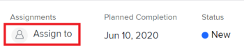

# Atribuir problemas

Você pode atribuir problemas a usuários, funções e equipes para indicar quem é responsável por concluir os problemas. Para obter informações gerais sobre atribuição de problemas, consulte [Modificar visão geral de atribuições de emissão](../../../manage-work/issues/manage-issues/modify-issue-assignments-overview.md).

>[!TIP]
>
>Você pode atribuir vários usuários, funções de trabalho ou equipes. Você pode atribuir somente usuários ativos, funções de trabalho e equipes.
>
>Se um usuário, uma função de trabalho ou uma equipe tiver sido atribuída antes de ser desativada, ela permanecerá atribuída ao item de trabalho. Nesse caso, recomendamos o seguinte:
>
>* Atribua novamente o item de trabalho aos recursos ativos.
>* Associe os usuários em uma equipe desativada a uma equipe ativa e reatribua o item de trabalho à equipe ativa.

Além deste artigo, recomendamos que você leia os seguintes artigos para obter mais informações sobre como atribuir problemas:

* [Modificar visão geral de atribuições de emissão](../../../manage-work/issues/manage-issues/modify-issue-assignments-overview.md)
* [Editar problemas](../../../manage-work/issues/manage-issues/edit-issues.md)
* [Modificar atribuições de usuários para vários problemas em uma lista](../../../manage-work/issues/manage-issues/edit-assignments-for-multiple-issues.md)
* [Criar atribuições avançadas](../../../manage-work/tasks/assign-tasks/create-advanced-assignments.md)
* [Fazer atribuições inteligentes](../../../manage-work/tasks/assign-tasks/make-smart-assignments.md)
* [Visão geral de atribuições inteligentes](../../../manage-work/tasks/assign-tasks/smart-assignments.md)
* [Visão Geral da atribuição de trabalho no Balanceador de Carga de Trabalho](../../../resource-mgmt/workload-balancer/assign-work-in-workload-balancer.md)

Você pode atribuir um problema a um ou vários recursos no nível da emissão individual, ou pode atribuir vários recursos a vários problemas de uma só vez.

Atribuir problemas e tarefas é semelhante no Adobe Workfront. Para obter informações gerais sobre atribuição de tarefas, consulte [Visão geral da modificação de atribuições de tarefa](../../../manage-work/tasks/assign-tasks/modify-task-assignments-overview.md).

## Requisitos de acesso

Você deve ter o seguinte acesso para executar as etapas neste artigo:

<table style="table-layout:auto"> 
 <col> 
 </col> 
 <col> 
 </col> 
 <tbody> 
  <tr> 
   <td role="rowheader">Plano Adobe Workfront*</td> 
   <td> 
Qualquer Um 
 </td> 
  </tr> 
  <tr> 
   <td role="rowheader">Licença da Adobe Workfront*</td> 
   <td> 
Revisar ou superior
 </td> 
  </tr> 
  <tr> 
   <td role="rowheader">Nível de acesso*</td> 
   <td> 
Editar acesso a problemas
 
Visualizar ou aumentar o acesso a Projetos e Tarefas
 
Caso ainda não tenha acesso, pergunte ao administrador do Workfront se ele definiu restrições adicionais em seu nível de acesso. Para obter informações sobre o acesso a problemas no Nível de acesso, consulte <a href="../../../administration-and-setup/add-users/configure-and-grant-access/grant-access-issues.md" class="MCXref xref">Conceder acesso a problemas</a>. Para obter informações sobre como um administrador do Workfront pode alterar seu nível de acesso, consulte <a href="../../../administration-and-setup/add-users/configure-and-grant-access/create-modify-access-levels.md" class="MCXref xref">Criar ou modificar níveis de acesso personalizados</a>. 
 </td> 
  </tr> 
  <tr> 
   <td role="rowheader">Permissões de objeto</td> 
   <td> 
Gerenciar permissões para o problema
 
Contribua com permissões para o item em que você está copiando o problema com a capacidade de adicionar problemas.
 
 Para obter informações sobre a concessão de permissões para problemas, consulte <a href="../../../workfront-basics/grant-and-request-access-to-objects/share-an-issue.md" class="MCXref xref">Compartilhar um problema </a>
 
Para obter informações sobre a solicitação de permissões adicionais, consulte <a href="../../../workfront-basics/grant-and-request-access-to-objects/request-access.md" class="MCXref xref">Solicitar acesso a objetos </a>.
 </td> 
  </tr> 
 </tbody> 
</table>

*Para descobrir qual plano, tipo de licença ou acesso você tem, entre em contato com o administrador da Workfront.

## Considerações para várias atribuições em funções, equipes e usuários

Considere o seguinte ao atribuir vários recursos a um item de trabalho:

* Os usuários podem ter mais de uma função de trabalho associada ao perfil. Para obter informações sobre como associar usuários a funções de jobs, consulte [Editar o perfil de um usuário](../../../administration-and-setup/add-users/create-and-manage-users/edit-a-users-profile.md).

* Tarefas ou problemas normalmente são atribuídas pela primeira vez a uma ou várias funções ou equipes de trabalho. Quando os projetos estiverem prontos para o início, eles também poderão precisar ser atribuídos aos usuários.

   Se uma tarefa ou um problema for atribuído a uma ou várias funções e você também atribuir um usuário, o Adobe Workfront decide qual função de trabalho associar ao usuário adicional (se houver) de acordo com as seguintes regras:

   * Se houver apenas uma função de trabalho atribuída e ela corresponder à Função Principal do usuário, a tarefa ou problema será atribuído somente ao usuário que cumpre sua Função Principal.
   * Se houver várias funções atribuídas e pelo menos uma delas corresponder às funções secundárias do usuário, a tarefa ou problema será atribuído ao usuário que cumpre uma de suas Outras funções — que o Workfront seleciona aleatoriamente se houver várias correspondências — bem como quaisquer funções adicionais atribuídas.
   * Se houver uma ou mais funções de trabalho atribuídas e não houver correspondências com as funções do usuário, a tarefa ou problema será atribuído tanto à função ou às funções como ao usuário.

* Se uma tarefa ou um problema for atribuído a uma equipe e você também atribuir um usuário, a tarefa ou o problema permanecerá atribuído à equipe e ao usuário.

<!--

<h2> </h2>
<h2>Considerations about removing assignments from issues</h2> 

(NOTE: drafted and moved to Modify issue assignments overview article)

You can remove assignments from one issue at a time, or you can remove assignments from multiple issues in bulk.

For more information about removing assignments from issues in bulk, see <a href="../../../manage-work/issues/manage-issues/edit-assignments-for-multiple-issues.md" class="MCXref xref">Modify user assignments for multiple issues in a list</a>. 

Consider the following when removing assignments from issues: 

<ul>
<li>When you unassign a user from an issue, the issue remains assigned to the job role that the user fulfilled on the issue.</li>
<li>When you unassign a job role or a team from an issue, the issue remains unassigned if it is not assigned to any other resources. </li>
</ul>

-->

## Atribuir um único problema

1. Vá para um problema que deseja atribuir.
1. Clique em **Atribuir a** no canto superior direito do cabeçalho do problema, no **Atribuições** area

   Ou

   Clique no nome das atribuições atuais, se o problema já tiver sido atribuído.

   

1. Siga um destes procedimentos:

   * Comece digitando o nome de um usuário, função ou equipe que deseja atribuir e clique nele quando ele for exibido na lista.

      

   * (Condicional) Clique em um dos nomes no **Atribuições sugeridas** lista
   * Clique em **Atribuir a mim** para atribuí-lo a você mesmo
   * Clique em **Avançado**

      Criar atribuições avançadas é semelhante para tarefas e problemas. Para obter informações sobre como fazer atribuições avançadas, consulte [Criar atribuições avançadas](../../../manage-work/tasks/assign-tasks/create-advanced-assignments.md).

      >[!TIP]
      >
      >Ao adicionar uma atribuição de usuário, observe o avatar, a Função primária do usuário ou seu endereço de email para distinguir entre usuários com nomes idênticos. Os usuários devem estar associados a pelo menos uma função de trabalho para exibi-la à medida que você os adiciona.

1. Clique em **Salvar** para concluir a atribuição do problema.
1. (Opcional) Clique no botão **Ícone X** ao lado do nome das atribuições na área Atribuições no cabeçalho da emissão para remover uma atribuição.

## Atribuir um problema a uma lista

Você pode atribuir problemas em uma lista ou em um relatório quando qualquer um dos campos de atribuições estiver visível na exibição da lista. Essa é uma maneira mais rápida de atribuir problemas.

Dependendo de qual campo estiver visível na exibição, é possível atribuir as seguintes entidades ao problema:

| Opção | Entidades atribuídas |
|---|---|
| **Atribuir a** | Atribuir um usuário |
| **Atribuído** | Atribuir um usuário |
| **Atribuições** | Atribua usuários, funções de trabalho ou equipes. |

Para atribuir problemas em uma lista:

1. Vá para uma lista de problemas que tem os campos Atribuído a, Atribuído ou Atribuições na exibição.
1. Para atribuir problemas, siga um destes procedimentos:

   * Clique dentro do **Atribuído a** ou **Atribuído** e comece a digitar o nome de um usuário ativo que deseja atribuir ao problema, em seguida, clique nele quando ele for exibido na lista.

      

   * Clique dentro do **Atribuições** e comece a digitar o nome de um usuário ativo, função de trabalho ou equipe ativa que deseja atribuir ao problema, em seguida, clique nele quando ele for exibido na lista.

      
   >[!TIP]
   >
   >Ao adicionar uma atribuição de usuário, observe o avatar, a Função primária do usuário ou seu endereço de email para distinguir entre usuários com nomes idênticos. Os usuários devem estar associados a pelo menos uma função de trabalho para exibi-la à medida que você os adiciona.

1. (Condicional) Quando visível no campo Atribuições , clique no botão **Ícone Pessoas**  no canto superior direito da caixa atribuições para abrir a caixa Atribuições avançadas e criar atribuições avançadas. Para obter mais informações, consulte [Criar atribuições avançadas](../../../manage-work/tasks/assign-tasks/create-advanced-assignments.md).

   >[!TIP]
   >
   >Não é possível fazer atribuições avançadas a partir dos campos Atribuído a ou Atribuído.

1. Depois de adicionar os destinatários ao problema, pressione Enter ou clique em qualquer lugar na página para salvar as alterações.

## Atribuir problemas em massa

1. Vá para uma lista de problemas que deseja atribuir em massa.
1. Selecione vários problemas na lista.
1. Clique no botão **Ícone Editar** .

   O **Editar problemas** será aberta.

1. No **Atribuições** selecione a **Destinatário** em seguida, comece a digitar o nome de um usuário, função de trabalho ou equipe que deseja atribuir a todos os problemas.

   >[!IMPORTANT]
   >
   >Se algum dos problemas já estiver atribuído, os recursos que você indicar aqui serão adicionados aos problemas em vez de substituir os recursos existentes nos problemas.

1. (Opcional) Selecione o botão de opção no **Proprietário da ocorrência** para indicar qual recurso é o destinatário principal ou o Proprietário da emissão, ao atribuir mais de um recurso à ocorrência. Isso não está disponível para equipes.
1. (Opcional) Selecione uma função que o usuário deve atender ao problema da função **Escolha uma função** no menu suspenso da **Função do destinatário** ao atribuir usuários a problemas. Se você não selecionar uma função, o Workfront seleciona automaticamente a Função primária do usuário.

1. (Opcional) Se você deseja remover os destinatários existentes de todos os problemas, siga um destes procedimentos:

   1. Comece digitando o nome de um usuário, função ou equipe que deseja remover do problema, depois selecione-o quando ele for exibido na lista e clique em **Remover Destinatário** para adicionar outros destinatários a serem removidos.
   1. Clique em **Remover todos os destinatários existentes** para remover todos os destinatários de todos os problemas selecionados.

1. Clique em **Salvar alterações**.
1. (Opcional e condicional) Quando os campos Atribuído a ou Atribuições forem exibidos em sua lista de problemas, clique dentro de uma dessas colunas em busca de um problema e clique no botão **Ícone X** ao lado do nome de um destinatário para removê-lo do problema.
