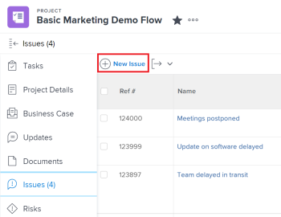
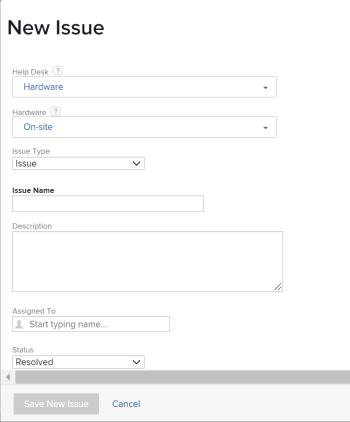

# Criar problemas

<!--The highlighted information on this page refers to functionality not yet generally available. It is available only in the Preview environment. -->

<!--remove Preview and Prod references when this comes to Prod-->

Ao trabalhar em um projeto, você pode descobrir que eventos inesperados surgem. Você pode registrar esses eventos inesperados como problemas para um projeto específico ou de uma tarefa. Os usuários com acesso apropriado podem visualizar e monitorar o status dos problemas à medida que o projeto ou a tarefa avança até a conclusão, eliminando a necessidade de longas cadeias de email ou reuniões de status. Ao contrário das tarefas, que são eventos planejados, os problemas representam itens de trabalho não planejados no Adobe Workfront.

Você também pode adicionar problemas a projetos como solicitações. Para obter informações, consulte [Criar e enviar solicitações do Adobe Workfront](../../../manage-work/requests/create-requests/create-submit-requests.md).

>[!TIP]
>
>Problemas e solicitações são usados alternadamente no Workfront. Você pode registrar problemas em projetos e tarefas para indicar trabalho imprevisto que precisa ser resolvido. Você também pode enviar solicitações que são registradas como ocorrências em um projeto designado como uma Fila de solicitações.

## Requisitos de acesso

Você deve ter o seguinte acesso para executar as etapas deste artigo:

<table style="table-layout:auto"> 
 <col> 
 <col> 
 <tbody> 
  <tr> 
   <td role="rowheader">plano do Adobe Workfront*</td> 
   <td> 
Qualquer Um
 </td> 
  </tr> 
  <tr> 
   <td role="rowheader">Licença da Adobe Workfront*</td> 
   <td> 
Revisar ou superior para adicionar problemas a um projeto ou tarefa
 
Solicitação ou mais recente para adicionar problemas como solicitações, usando uma Fila de solicitações.
 </td> 
  </tr> 
  <tr> 
   <td role="rowheader">Configurações de nível de acesso*</td> 
   <td> 
Editar acesso a ocorrências
 
Acesso de visualização ou superior a projetos e tarefas
 
Observação: se você ainda não tiver acesso, pergunte ao administrador do Workfront se ele definiu restrições adicionais em seu nível de acesso. Para obter informações sobre o acesso a problemas em seu Nível de acesso, consulte <a href="../../../administration-and-setup/add-users/configure-and-grant-access/grant-access-issues.md" class="MCXref xref">Conceder acesso a problemas</a>. Para obter informações sobre como um administrador do Workfront pode alterar seu nível de acesso, consulte <a href="../../../administration-and-setup/add-users/configure-and-grant-access/create-modify-access-levels.md" class="MCXref xref">Criar ou modificar níveis de acesso personalizados</a>. 
 </td> 
  </tr> 
  <tr> 
   <td role="rowheader">Permissões de objeto</td> 
   <td> 
Permissões do Contribute ou superior com capacidade para adicionar problemas à tarefa ou projeto em que você cria o problema
 
 Para obter informações sobre a concessão de permissões para problemas, consulte <a href="../../../workfront-basics/grant-and-request-access-to-objects/share-an-issue.md" class="MCXref xref">Compartilhar um problema </a>
 
Para obter informações sobre a solicitação de permissões adicionais, consulte <a href="../../../workfront-basics/grant-and-request-access-to-objects/request-access.md" class="MCXref xref">Solicitar acesso a objetos </a>.
 </td> 
  </tr> 
 </tbody> 
</table>

&#42;Para descobrir seu plano, tipo de licença ou acesso, entre em contato com o administrador do Workfront.

<!--
(NOTE: in NWE Requestors CAN see the Issues tab on a project but in classic they cannot! However, even when they DO see it, they cannot enter the issues - logged this issue for it but they might decide not to fix it: https://hub.workfront.com/issue/60181e28000058980cce29597185b2d6/updates?email-source=comm)

-->

## Limitações na criação de problemas

Quando você tem o acesso e as permissões corretas, é possível criar problemas em um projeto ou tarefa. No entanto, os seguintes casos ocorrem quando talvez você não consiga criar problemas:

* O administrador do Workfront ou um administrador de grupo deve ativar a adição de problemas a um projeto com status Concluído ou Inativo na área Preferências do projeto. Para obter informações sobre como configurar as preferências do projeto, consulte [Configurar preferências de projeto em todo o sistema](../../../administration-and-setup/set-up-workfront/configure-system-defaults/set-project-preferences.md).
* Não é possível adicionar problemas a um projeto que está em Aprovação pendente.

## Preparar o formulário Novo problema

Sua organização deve ter um processo bem definido para quando e como registrar um problema. Ao configurar esse processo, a primeira etapa é criar o formulário necessário para enviar um problema. Se você permitir que problemas sejam adicionados diretamente a tarefas e projetos, ou se tiver filas de solicitações em que problemas são enviados, será possível definir quais campos do Workfront, bem como quais campos personalizados estão disponíveis para os usuários quando eles enviam novos problemas e devem ser concluídos. O formulário Novo problema pode conter informações importantes que serão úteis para resolver o problema rapidamente.

Os campos para os novos problemas em um projeto são definidos na seção Detalhes da fila do projeto onde os problemas serão registrados. Para obter informações sobre a configuração da seção Detalhes da fila do projeto, consulte [Criar uma fila de solicitações](../../../manage-work/requests/create-and-manage-request-queues/create-request-queue.md).

Para obter informações sobre como criar ocorrências enviando-as para uma fila de solicitações, consulte [Criar problemas inserindo uma nova solicitação](#create-issues-by-entering-a-new-request) neste artigo.

## Criar problemas em uma tarefa ou projeto usando o botão Novo Problema

Depois de definir os campos de um novo formulário de problema em seu projeto, você pode começar a criar problemas.

<!--
Creating issues differs depending on which environment you choose to create the issue. 

### Create issues on a task or project using the New Issue button in the Production environment

-->

Para criar um problema em uma tarefa ou um projeto:

1. Vá para um projeto em que deseja criar o problema.
1. (Opcional) Se quiser registrar o problema de uma tarefa, vá para a **Tarefas** e clique no nome de uma tarefa.
1. Clique em **Problemas** seção.

   

1. Clique em **Nova Problema**.

   

1. (Condicional) Se o criador do projeto criou Tópicos de fila ou Grupos de tópicos no projeto, eles serão adicionados ao novo formulário de problema. Especifique a **Grupo de tópicos** ou o **Enfileirar tópico** do seu novo problema. Grupos de tópicos e Tópicos de fila têm nomes personalizados para o seu ambiente.\
   Para obter mais informações sobre a criação de Grupos de Tópicos, consulte [Criar Grupos de Tópicos](../../../manage-work/requests/create-and-manage-request-queues/create-topic-groups.md). Para obter mais informações sobre a criação de Tópicos de Fila, consulte [Criar Tópicos de Fila](../../../manage-work/requests/create-and-manage-request-queues/create-queue-topics.md).

   

   * Se houver apenas um Tópico da fila definido no projeto, ele será exibido automaticamente.
   * Se o Grupo de tópicos não tiver nenhum Tópico ou Grupo de tópicos na fila, nada estará disponível no menu suspenso Grupo de tópicos.

1. (Condicional) Se o criador do projeto permitiu a **Tipo de solicitação** para ser exibido no formulário Novo problema, selecione o tipo do seu problema dentre as seguintes opções:

   * Registro de Defeito
   * Pedido de alteração
   * Problema
   * Solicitar\
     Dependendo de como o administrador do Workfront configurou as Preferências do projeto, os nomes dos tipos de problemas podem ser diferentes para você.

   >[!TIP]
   >
   >Os Tipos de solicitação devem ser ativados em Detalhes da fila e ao criar o Tópico da fila para ser exibido como uma seleção no formulário Novo problema. Para obter informações, consulte os seguintes artigos:
   >* [Criar uma fila de solicitações](../../requests/create-and-manage-request-queues/create-request-queue.md)
   >  * [Criar Tópicos de Fila](../../requests/create-and-manage-request-queues/create-queue-topics.md)

1. Adicione um nome para o novo problema na **Nome do problema** campo.
1. Continue especificando os campos disponíveis no **Nova Problema** formulário. Para obter mais informações sobre os campos disponíveis à medida que você insere um novo problema, consulte [Editar problemas](../../../manage-work/issues/manage-issues/edit-issues.md).

   >[!IMPORTANT]
   >
   >Nem todos os campos relacionados ao problema estão disponíveis no formulário Novo problema. O criador do projeto ativa os campos disponíveis ao criar um problema ao definir a área Detalhes da fila do projeto. Para obter mais informações, consulte [Criar uma fila de solicitações](../../requests/create-and-manage-request-queues/create-request-queue.md).

1. (Condicional) Se os Tópicos da fila estiverem associados a um formulário personalizado, esse formulário personalizado será exibido na **Nova Problema** formulário.\
   Ou\
   Se o projeto estiver associado a um formulário personalizado de problema por meio da área Detalhes da fila, o formulário será exibido na **Nova Problema** após os campos padrão do Workfront.

   Para obter informações, consulte [Criar uma fila de solicitações](../../../manage-work/requests/create-and-manage-request-queues/create-request-queue.md).

1. Clique em **Salvar novo problema.**

Problemas podem ser atribuídos a vários usuários, funções de trabalho ou a uma equipe. Para obter mais informações sobre atribuição e gerenciamento de solicitações, consulte [Gerenciar solicitações de trabalho e de equipe](../../../people-teams-and-groups/work-with-team-requests/manage-work-and-team-requests.md).

<!--When this is coming to Production, remove the "Production" section above and replace it with the following content: 

### Create issues on a task or project using the New Issue button in the Preview environment

To create an issue on a task or a project:

1. Go to a project where you want to create the issue. 
1. (Optional) If you want to log the issue for a task, go to the **Tasks** area, then click the name of a task. 
1. Click the **Issues** section.

   

1. Click **New Issue**.
   The New issue box displays.

      

1. (Conditional) If the project creator created Queue Topics or Topic Groups on the project they are added to the new issue form. Specify the **Topic Group** or the **Queue Topic** of your new issue. Topic Groups and Queue Topics have names customized to your environment.  
   For more information about creating Topic Groups, see [Create Topic Groups](../../../manage-work/requests/create-and-manage-request-queues/create-topic-groups.md). For more information about creating Queue Topics, see [Create Queue Topics](../../../manage-work/requests/create-and-manage-request-queues/create-queue-topics.md).

   * If there is only one Queue Topic set on the project, it is displayed automatically.
   * If the Topic Group does not have any Queue Topics or Topic Groups under it, nothing is available in the Topic Group drop-down.

1. Add the issue name in the **Subject** field, then add a **Description**.

1. (Conditional) If the project creator allowed for the **Request Type** field to display on the New Issue form, select the type of your issue from the following options:

   * Bug Report
   * Change Order
   * Issue
   * Request  
     Depending on how your Workfront administrator has configured your Project Preferences, the names of the issue types might be different for you. 

   >[!TIP]
   >
   >The Request Types must be enabled in the Queue Details and as well as when creating the Queue Topic to display as a selection in the New Issue form. For information, see the following articles: 
   >* [Create a Request Queue](../../requests/create-and-manage-request-queues/create-request-queue.md)
   >  * [Create Queue Topics](../../requests/create-and-manage-request-queues/create-queue-topics.md)

1. Continue specifying the fields available in the **New issue** form. For more information about the fields available as you enter a new issue, see [Edit issues](../../../manage-work/issues/manage-issues/edit-issues.md).

   >[!IMPORTANT]
   >
   >Not all the issue-related fields are available in the New issue form. The project creator enables the fields available when creating an issue when they define the Queue Details area of the project. For more information, see [Create a Requests Queue](../../requests/create-and-manage-request-queues/create-request-queue.md). 

1. (Conditional) If the Queue Topics are associated with a custom form, that custom form will display in the **New issue** form.  
   Or  
   If the project is associated with an issue custom form through the Queue Details area, the form displays in the **New issue** form, after the default Workfront fields.

   For information, see [Create a Request Queue](../../../manage-work/requests/create-and-manage-request-queues/create-request-queue.md).

1. Click **Submit**. 

   Issues can be assigned to multiple users, job roles or to a team. For more information about assigning and managing requests, see [Manage work and team requests](../../../people-teams-and-groups/work-with-team-requests/manage-work-and-team-requests.md).

-->

## Criar problemas em uma tarefa ou projeto em linha

>[!IMPORTANT]
>
>O proprietário do projeto deve habilitar **Permitir que os usuários adicionem problemas em linha** ao definir configurações de problema para o projeto antes de poder adicionar problemas em linha ao projeto ou às tarefas. Para obter informações sobre como definir configurações de problemas em um projeto, consulte [Editar projetos](../../../manage-work/projects/manage-projects/edit-projects.md).
>

Quando quiser adicionar vários problemas rapidamente, você pode criar problemas para uma tarefa ou um projeto em linha, adicionando-os a uma lista de problemas.

>[!NOTE]
>
>Ao adicionar problemas em linha, a Workfront não aplica o formulário Novo problema aos novos problemas. Não recomendamos adicionar problemas em linha se você quiser que os usuários forneçam determinadas informações ao inserir problemas. Isso pode ter um impacto negativo no relatório de problemas e, posteriormente, na capacidade do usuário atribuído ao problema de ter todas as informações necessárias para resolvê-lo.

Para criar problemas em linha:

1. Vá para um projeto em que deseja criar o problema.
1. (Opcional) Se quiser registrar o problema de uma tarefa, vá para a **Tarefas** e clique no nome de uma tarefa.
1. Clique em **Problemas** seção.
1. Clique em **Adicionar mais problemas**.

   Uma nova linha é criada na lista de problemas na seção Problemas.

   >[!TIP]
   >
   >Essa opção estará esmaecida se a configuração Permitir que os usuários adicionem problemas em linha estiver desmarcada na caixa Editar projeto. Para obter informações, consulte [Editar projetos](../../../manage-work/projects/manage-projects/edit-projects.md).

   

1. Comece digitando o nome do problema no campo Nome e continue adicionando mais informações sobre o problema em linha.

   >[!TIP]
   >
   >Os campos disponíveis para edição em linha são disponibilizados pela visualização aplicada à lista de problemas. Talvez não seja possível editar em linha os seguintes tipos de campos:
   >   
   >* Campos que pertencem a outro objeto
   >* Campos que você não tem acesso para editar
   >* Campos que são cálculos e que são atualizados automaticamente pelo Workfront

1. Clique em Inserir para concluir a edição em linha e adicionar o problema ao projeto ou tarefa.

## Criar problemas inserindo uma nova solicitação {#create-issues-by-entering-a-new-request}

Você pode designar projetos para serem recipientes de problemas de recebimento. Esses tipos de projetos são chamados de Filas de solicitações no Workfront. Você pode acessar Filas de solicitações por meio da área Solicitações no Menu principal.

>[!TIP]
>
>Os termos &quot;problema&quot; e &quot;solicitação&quot; são intercambiáveis no Workfront.

Para obter mais informações sobre como configurar projetos como Filas de solicitações para receber problemas, consulte [Criar uma fila de solicitações](../../../manage-work/requests/create-and-manage-request-queues/create-request-queue.md). Para obter informações sobre o envio de solicitações, consulte [Criar e enviar solicitações do Adobe Workfront](../../../manage-work/requests/create-requests/create-submit-requests.md).
